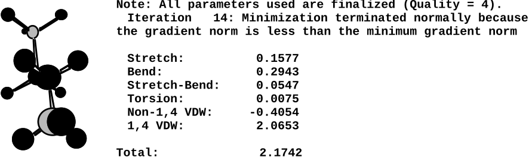
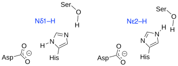
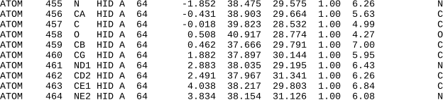

# Protein Structure and Molecular Modeling

© 2023-2026 Romas Kazlauskas. All rights reserved. Last revised: August 2026.

**Summary.** Protein structures show the fold of the protein, which amino acid residues interact with each other and the shape of cavities and tunnels. Protein structure files specify the locations (x, y, z coordinates) of the atoms in a protein as well as any bound molecules and solvent. Protein visualization programs such as PyMOL create images from these files. Different representations highlight different aspects of these intricate structures including shape, electrostatic charge and flexibility. Computer modeling programs such as AMBER or Rosetta predict protein structures using simplified mechanical models of molecules. Accurately modeling protein properties remains difficult because it is difficult to model protein states. Protein states are collections of interconverting conformations that are accessible to a particular protein form. Molecular dynamics simulations reveal how proteins move on short time scales, but finding a representative sample of all the conformations that contribute to a state is difficult. In practice, researchers use approximations to model protein states, which lowers the accuracy of the prediction of protein properties.

**Key learning goals**

- Protein structure files are text files containing the x,y,z coordinates of the protein atoms as well as other structural information.
- Protein visualization software displays the data in protein structure files. This software simplifies the complexity of protein structures by using different representations for different parts of the protein. This software can also measure distances between atoms within a protein and predict structures of variants with amino acid substitutions.
- Computer modeling of proteins uses simplified mechanical models of molecules called force fields to calculate the energy of a structure. Most predictions of protein structures from their amino acid sequence are extrapolations from known structures. These extrapolations include machine learning models and correctly predict most protein folds and are increasingly accurate in predicting side chain orientations.
- Protein move constantly and all of the accessible protein conformations contribute to the protein states. Gibbs energy differences between protein states determine protein properties.
- Protein states are difficult to model because important conformations may be difficult to find. For example, an open conformation important for catalysis may occur rarely or not at all in molecular dynamics simulations because the conformation requires simultaneous orientation of multiple bonds.
- Most predictions rely on approximations to model protein states. Their accuracy varies according to the validity of these approximations.

## Protein structure

### Determining protein structures
X-ray crystallography determines the structure of proteins by measuring the electron density distribution within protein crystals, @fig-electron_density. Fitting a model of the known amino acid sequence of the protein to this electron density data yields the structure. 

![Measuring electron density reveals a protein's structure. The mesh diagram represents the observed electron density in an x-ray crystallography experiment for four amino acids in a protein. The mesh is contoured at 1σ; that is, it encloses the regions that contain more than one standard deviation above the mean electron density. The line diagram is the best fit of the atoms in the known amino acid sequence (arginine, tyrosine, and two cysteines linked by a disulfide bond) to the observed electron density. Image from: https://en.wikipedia.org/wiki/file:example_of_electron_density_map.png; CC BY-SA 3.0 license.](figures/chapter4/electron_density.png){#fig-electron_density width=200 fig-alt="Mesh diagram of electron density from x-ray crystallography with a fitted atomic model of four amino acid residues including two cysteines linked by a disulfide bond."}

One can also determine the structures of proteins by NMR (nuclear magnetic resonance). NMR measures the distances between various nuclei in the protein. Fitting a model of the known amino acid sequence to these distances yields a set of matching structures with differing conformations. While x-ray structures typically yield a single structure, NMR structures yield a collection of similar structures that represent conformations explored by the protein.

Homology modeling is a computational approach to predict protein structures. Extrapolation from a known protein structure (the template) yields predicted structures for homologous proteins. If the two proteins share >80% identical amino acids, then the model is typically within 1-2 Å root mean square deviation of the correct structure. For more distant homologs, the reliability depends on the degree of sequence identity, the choice of the best template, and the alignment of the template and target protein sequences. Web tools such as [SwissModel](https://www.swissmodel.expasy.org)[@waterhouseSWISSMODELHomologyModelling2018] and the machine learning model [AlphaFold](https://alphafold.com/)[@jumperHighlyAccurateProtein2021] automate this extrapolation. 

### Structure data files
One way to describe the structure of a molecule is to specify the location of each atom using Cartesian coordinates (x,y,z). The example structure file for aspirin lists these coordinates as well as some additional information, @fig-Cartesian_coordinates_file_aspirin. The first line states the total number of atoms. Lines 2-22 list the information for each atom: the element, serial number, (x,y,z) coordinates, atom type number (see molecular mechanics in @sec-calc_energy). The final columns  list the other atoms bonded to the atom. For example, line 2 describes carbon atom numbered 1 located at x = –1.573, y = 0.146 and z = –0.7046. The units are Ångstroms. It is a carbon atom type 2 (sp$^2$-carbon, alkene) and it makes bonds to the atoms numbered 2, 6, and 12. Upon rotation of the molecule, these (x, y, z) coordinates change.

{#fig-Cartesian_coordinates_file_aspirin width=450 fig-alt="Text file showing Cartesian coordinates for aspirin atoms alongside a labeled line diagram of the aspirin structure."}

An alternative file format is internal coordinates or a Z-matrix (not shown). The position of the first atom is arbitrary. Subsequent atom positions are indicated relative to this first atom by specifying measurements (distance, bond angle, dihedral angle) relative to previous atoms. The advantage of this format is that the coordinates do not change when the molecule rotates.

Protein structure files contain thousands of atoms, use the protein data bank (pdb) file format, and are freely available at <https://www.rcsb.org>. These pdb format files specify the Cartesian coordinates (x, y, z) of each atom and include additional information. Protein structure files are text files, which can be opened by text editors or word processing programs, @fig-LDH_pdb_file. The files are large (5,524 atom locations, 115 pages for the example in @fig-LDH_pdb_file). The information in these files can be grouped into introduction, protein atom (and nucleic acid atom, if present) coordinates, and non-protein atom coordinates. 

![Three sections from the x-ray structure file for human heart lactate dehydrogenase from the protein data bank (pdb id = 1i0z). The first section, introduction, contains the name of the molecule, a reference to the peer-reviewed article describing this structure and experimental details about the structure determination. The second section lists the coordinates of protein atoms. The third section lists coordinates for non-protein atoms (solvent and other co-crystallized molecules). It also contains ‘CONECT’ lines to specify the connectivity of non-protein molecules such as NADH (named NAI) in this structure. The END record marks the end of the file.](figures/chapter4/LDH_pdb_file.svg){#fig-LDH_pdb_file width=450 fig-alt="Excerpts from a PDB file for lactate dehydrogenase showing the introduction, protein atom coordinates, and non-protein atom coordinate sections."}

The file partly shown in @fig-LDH_pdb_file contains 6,391 lines; 5,524 lines contain x, y, z coordinates of atoms and the remaining lines contain additional information. The introductory information describes the structure and the experimental methods. It includes the title of the structure, journal reference, remarks, amino acid sequence, list of heteroatoms in the structure, list of disulfide bonds and crystallographic information. 

The protein coordinates section lists the atoms numbered sequentially. The atom naming follows the convention described in the previous chapter and includes the amino acid name, amino acid number, and the protein chain indicated by a letter. For example, atom 1 in @fig-LDH_pdb_file is the amino nitrogen of serine, which is the first amino acid in chain A. The next numbers are the Cartesian (x, y, z) coordinates for this atom. Most x-ray crystal structure files do not include hydrogen atoms because most protein crystals do not diffract well enough to allow hydrogen atoms to be resolved. Molecular modeling programs will add hydrogen atoms by inferring their positions from the positions of other atoms. In contrast, protein structure files from NMR experiments do include hydrogen atom positions because the NMR experiments measure locations of hydrogens.

The (x, y, z) coordinates are followed by the atom occupancy, which is 1.00 in most cases, indicating that the atom is located at one position. For flexible regions, the atoms may lie in multiple positions. In these cases, the structure file lists coordinates for each position and assign each one an occupancy. If an atom occupies two positions equally, then the pbb file contains separate lines for each position and each position has an atom occupancy of 0.50.

The numbers in the column after occupancy are the temperature factors, or B-factors, for each atom. The B-factor has units of Å$^2$ and describes the displacement of the atomic positions from a mean value. Typical values are 15-30 Å$^2$ in the protein core, but more flexible or disordered regions (such as the N-terminal serine in the structure above) have higher values (57 Å$^2$). 

The last section lists the coordinates and connectivity for non-protein atoms within the structure, which are called heteroatoms (HETATM). These include water, other solvent molecules (e.g., glycerol) and any inhibitors or substrates co-crystallized with the protein. The solvent water molecules are those that remain in fixed positions within the crystal so that they diffract some of the x-rays. In reality, the protein is completely surrounded by water molecules. The records starting with CONECT specify the connectivity for the heteroatoms. In contrast, the protein coordinates section assumes standard atom connectivity for amino acid residues and nucleotides, so it does not contain CONECT records. The end of the pdb structure file contains a record for bookkeeping (MASTER) and an END record.

### Visualizing proteins
Opening a structure file with molecular visualization software instead of a text editor reveals a three-dimensional image that can be rotated and zoomed on the screen. PyMOL is popular molecular visualization software for proteins, which is available as an [open-source version](https://github.com/schrodinger/pymol-open-source), a [free educational version](https://pymol.org/edu/), and also paid versions. Tutorials are available [online](https://pymolwiki.org/) and a publication gives an overview of the different types of visualizations that are possible.[@muraIntroductionBiomolecularGraphics2010] PyMOL includes a Python interpreter so that Python commands can extend and automate PyMOL. Later chapters include PyMOL scripts that automate highlighting features like surface residues, holes in the protein core or ion pairs.

Molecules look like the blobs of electron density shown in @fig-electron_density, but molecular visualization software represents molecules in ways that simplify and emphasize different aspects of their structure. For example, the ball and stick representation of aspirin resembles mechanical molecular models used for conformational analysis, @fig-representations_aspirin. The wireframe view focuses on the connectivity of the atoms, while the space-filling representation consists of overlapping van der Waals spheres to show overall size and shape of the molecule. The model may be colored by element, as shown in @fig-representations_aspirin, but colors can also indicate the electrostatic charge, hydrophobicity, or other atomic property.

{#fig-representations_aspirin width=400 fig-alt="Line drawing of aspirin next to ball-and-stick, wireframe, and space-filling three-dimensional representations."} 

Since proteins contain so many more atoms than small organic molecules, researchers use additional simplifying representations that hide atoms. The default settings in PyMOL show the protein as a ribbon that traces the main chain of a protein without showing any individual protein atoms, @fig-1i0z_three_views. This representation, called a cartoon, uses flat arrows to indicate β-sheet secondary structures, helices to indicate α-helices, and thin tubes to indicate loops. This representation emphasizes the protein fold while ignoring the atomic details of the structure. The center structure in @fig-1i0z_three_views adds gray and white colors to the ribbon to indicate different domains as well as stick representions of the bound cofactor NADH and inhibitor. The right-most representation in @fig-1i0z_three_views shows a protein property of the same protein. The tubes are colored and scaled to indicate the degree of flexibility.

![Three images of lactate dehydrogenase (pdb id = 1i0z) as displayed in PyMOL. Left: Default settings show the dimer observed in the crystal. The green ribbon represents the protein atoms. Helical flat ribbons indicate α-helices, flat arrows indicate β-sheets, and thin lines indicate turns. The red crosses represent solvent water molecules,  and the bound NADH and inhibitor oxamate are shown in stick representation with the carbon atoms colored green. Center: A view of the active site region with the catalytic domain in white ribbons and the Rossmann fold domain in gray ribbons. The side chains of the catalytic residue (His193 and Asp166) are shown as sticks with pink carbons. Right: A ribbon representation where the colors and thickness of the tubes indicate the temperature factors of the atoms. The central part of the protein (blue, thin tubes) has well-defined locations, but the N- and C-terminii and residues 213-228 (red and white, thick tubes) have poorly defined positions suggesting flexibility. The text version of this pdb file was shown in @fig-LDH_pdb_file.](figures/chapter4/1i0z_three_views.svg){#fig-1i0z_three_views width=500 fig-alt="Three PyMOL views of lactate dehydrogenase: default ribbon representation, active site with domain coloring and catalytic residues, and B-factor colored ribbon showing flexible regions."} 

### Intuitive protein engineering
In some cases, protein engineers use only inspection of the protein structure combined with chemical reasoning to choose substitutions. Looking at the three-dimensional structures of proteins using using a visualization program such as PyMOL reveals the overall fold of the protein, the location of the active site, which residues line the active site, and many other details. Molecular visualization software can measure distances and angles in a structure and even create models of where amino acids have been replaced. For example, inspection of the structure identifies substitutions that could expand the active site to accommodate a larger substrate. 

This intuitive approach is a good first step, but one should not be disappointed if it fails. First, this approach typically examines only one structure while protein properties depend on differences between two protein states. The intuitive approach ignores one state completely and also assumes that the single structure examined is a good representation of the folded state. In the example above, substitutions to expand the active site may cause the surrounding residues to readjust such that the active site contracts instead. Finally, some protein features such as relative energies, solvation, protein movements, and p$K_a$ of catalytic groups are not evident from simple inspection of the structure and require calculations.

## Computer modeling of proteins

> _All models are wrong, but some are useful._
>
> --- George Box, statistician

The goal of computer modeling in protein engineering[@leach2001molecular] is to predict which substitutions will improve the target properties of the protein. This prediction requires models of the protein states that contribute to the target properties. The two components of modeling a protein state are first to estimate the Gibbs energy of individual protein structures in each protein state and second to collect a representative sample of conformations that contribute to that state. Estimating the Gibbs energy of protein structures is relatively reliable, but collecting a representative sample of all contributing conformation remains difficult. Some important conformations occur infrequently and are difficult to find with computational methods.

### Calculating the energy of a structure {#sec-calc_energy}
The theoretically correct approach to model molecules is quantum mechanics where the electron distributions in molecules are calculated using approximations to solve the Schrödinger equation. Quantum mechanics is a first-principles method without experimentally derived parameters, but is far too complicated and slow to model entire proteins. Quantum mechanics is required to model the bond-making and bond-breaking steps of a reaction. These steps involve electron redistribution that cannot be modeled with simpler approaches. In these cases, quantum mechanics is used to model the active-site region (<100 atoms) while simpler methods are used for the rest of the protein.

Most computer modeling of proteins uses molecular mechanics, which simplifies molecules by treating them like macroscopic mechanical objects. Molecular mechanics uses classical physics to model molecules where spherical balls represent atoms and distance-dependent attractions between them represent bonding interactions. This theoretical model of molecules is incorrect because bonds between atoms arise from delocalization of electrons and interaction of electrons with nuclei. These electron interactions do not behave according to classical physics. Nevertheless, molecular mechanics yields accurate structures of molecules. Empirical adjustment of the equations and parameters of molecular mechanics to experimental structures created predictions that match the known structures of molecules.

Different molecular mechanics software uses different force fields to calculate the energy of a molecular structure. The force field is the mechanical model used to represent molecules in molecular mechanics calculations. It consists of 1) an equation with multiple terms that yields the energy of a structure, 2) atom types to describe elements with different bonding arrangements, and 3) parameters (constants) adjusted so that the equations yield the correct energies and structures. Force fields differ in the complexity of the terms in the energy equation, the number and definition of atom types, and the number and value of the parameters. Each force field is best suited for specific types of molecules. Force fields like MM3 (Molecular Mechanics 3) are best to predict the structures of small organic molecules, while force fields like AMBER (Assisted Model Building with Energy Refinement) or Rosetta are better suited for biomolecules.

**Energy equation for physics-based force fields.** The energy equation of a force field consists of multiple terms, some of which describe interactions between bonded atoms and others describe the interactions between non-bonded atoms, @eq-general_force_field. Bonded interaction terms describe how energy varies with bond length, bond angle, and torsion angle along single bonds. Non-bonded interaction terms describe repulsive and attractive van der Waals and electrostatic interactions. The total energy, υ, varies with the structure of the molecule as defined by the distances between the atoms, $r^N$.

$$\begin{aligned}
 υ(r^N)= & \sum_{\text{bonded atoms}}{\text{bonded interactions}} \\
 & +\sum_{\text{all atom pairs}}{\text{non-bonded interactions}}
\end{aligned}$$ {#eq-general_force_field}

The force field energy equation includes at least three terms to describe bonded interactions: bond stretching, angle bending and torsion along single bonds, @fig-force_field_terms. Each term defines an ideal value and the energy cost for deviations from this ideal. The bond stretch term defines an optimum bond length, $l_0$ between two bonded atoms. When $l = l_0$, this term is zero indicating no energy penalty. Bond lengths shorter or longer than $l_0$ increase the energy of the molecule by the square of the deviation multiplied by $k_b$, which represents the stiffness of the bond. The angle bend term applies to a group of three bonded atoms and similarly has an optimum angle, $\theta_0$, and angle stiffness, $k_{\theta}$. The torsion angle term defines the orientation along a single bond for a group of four bonded atoms. There are usually several torsion angle minima. For example, the H-C-C-H torsion angle in ethane has three minima, which correspond to the three staggered conformations. The constant $V_n$ defines the amplitude of the curve, the $n$ defines its periodicity (number of minima), $\gamma$ shifts the entire curve along the torsion angle ($\omega$) axis. Multiple substituents at the ends of a single bond require several torsional angle terms to include the different interactions created as the torsion angle varies.

{#fig-force_field_terms width=300 fig-alt="Diagrams of five force field energy terms: bond stretch, angle bend, and torsion for bonded interactions; van der Waals and electrostatic for non-bonded interactions."}
 
The non-bonded interactions depend on the distance between atoms, $r$, as shown in the bottom two terms in @fig-force_field_terms. These terms were explained in the previous chapter. Pairs of atoms connected by chemical bonds are normally excluded from computation of non-bonded interactions because bonded energy terms replace non-bonded interactions. In biomolecular force fields all pairs of connected atoms separated by up to 2 bonds (1-2 and 1-3 pairs) are excluded from non-bonded interactions.

The force field calculates the sum of all the possible interactions to estimate the energy of a particular conformation of a molecule, @eq-force_field. The sum includes terms for interaction between bonded atoms (all bonds, all angles, all torsions) and terms for interactions of non-bonded atoms (all possible pairwise interactions between atoms).

$$\begin{aligned}
E_{total} = & \sum_{\text{bonds}}{k_{b,i}(l_i - l_{i,0})^2}+\sum_{\text{angles}}{k_{\theta,i}(\theta_i - \theta_{i,0})^2}+\sum_{\text{torsions}}{V_n(1-\cos(n\omega -\gamma))} \\
 & +\sum_{i=1}^{N} \sum_{j=i+1}^{N}{\left( \epsilon_{ij} \left[ \left( \frac{r_{i,j,0}}{r_{i,j}} \right)^{12} - 2 \left( \frac{r_{i,j,0}}{r_{i,j}} \right)^{6} \right] + \frac{q_i \cdot q_j}{4\pi \cdot \epsilon_0 \cdot r_{i,j}} \right)}
\end{aligned}$$ {#eq-force_field}

For example, calculating the energy of $n$-butane would contain bond stretch terms for each C-C and C-H bond in the molecule, angle bending terms for each H-C-H, H-C-C, and C-C-C bond, and torsion angle terms for each H-C-C-H, H-C-C-C, and C-C-C-C bond. Non-optimal bond lengths or angles would raise the energy of the structure. The van der Waals interaction term would calculate bumping or weak attractive interactions between all atom pairs. The calculation of the non-bonded interactions may ignore electrostatic interactions for this non-polar molecule.

The number of bonded interactions increases linearly with the number of atoms in the molecule, $N$. For example, if each atom is bonded to an average of three other atoms, then the number of bonded interactions is $3N$. In contrast, the number of non-bonded interaction increase with the square of number of atoms. Each atom interacts with every other atom so the number of non-bonded interactions is $N(N-1)/2$. Division by two eliminates double counting of the interaction between atoms 1 and 2 and the interaction between atom 2 and 1 as separate interactions.[^1] This different scaling with the number of atoms means that the number of non-bonded interactions is much larger than the number of bonded interactions for large molecules like proteins. For example, the dehydrogenase in @fig-1i0z_three_views above contains 374 amino acids per monomer. Each monomer contains approximately 2800 atoms and the software will add 2900 hydrogen atoms for a total of 5700 atoms. There are $5700 \cdot 3 = 17,100$ bonded interactions to calculate and $5700 \cdot 5699/2 = 16$ million non-bonded interactions. The number of non-bonded interaction is ~1000-fold more than the number of bonded interactions. The number of non-bonded interactions will further increase if the calculation includes water molecules. To save computation time, programs usually ignore non-bonded interactions between atoms that are more than 6 Å from one another.

[^1]: The precise number of non-bonded interaction is $2N$ less than this value because connected atoms separated by up to two bonds are excluded from the calculation, but this small correction does not change the conclusion that there are many more non-bonded than bonded interactions.

**Atom types.** Atom types are the molecular subunits in a molecular mechanics calculation and include both element type and its bonding arrangement. While elements are the authentic subunits of molecules, molecular mechanics uses atom types to distinguish different bonding arrangements of the same element. This approach compensates for the fact that molecular mechanics does not explicitly include electrons in the calculations. For example, in the aspirin example in @fig-Cartesian_coordinates_file_aspirin above, C1-C6 are all atom-type 2, which in the MM2 force field is an sp$^2$-hybridized carbon in an alkene (a non polar bond). C12 and C16 are atom-type 3, which is an sp$^2$-hybridized carbon in a carbonyl or imine (a polar bond), while C17 is atom type 1, which is an sp$^3$-hybridized carbon. Even though these atoms are all carbon atoms, molecular mechanics requires different parameters to describe their different bonding arrangements. In contrast, a quantum mechanics approach would assign all these atoms as carbon atoms and the calculated differences in the electron distribution density of each carbon would lead to different bonding arrangements.

Using atom types instead of elements as the subunits of molecules leads to some unusual atom types. For example, the MM2 force field models lone pairs of electrons as a special atom types. These pseudo atoms account for the non-spherical nature of atoms containing lone pairs, such as oxygen and nitrogen. These lone-pair pseudo atoms improve the model of van der Waals interactions, torsional potentials and hydrogen bonding for these atoms. Other force fields (e.g., MM3, MM4) do not use lone-pair pseudo atoms and instead model lone pairs with a more complex electrostatic treatment and adjusted torsional potentials. These unusual atoms types are a reminder that molecular mechanics oversimplifies chemical bonding.

Different force fields use different definitions for atoms types. For example, AMBER, a force field optimized for biopolymers, includes united atoms types which include hydrogen atoms implicitly. For example, the AMBER-assigned atom types for tyrosine include CD (sp$^2$ aromatic carbon in 6-membered ring with 1 hydrogen), C2 (sp$^3$ carbon with 2 hydrogens), and CH (sp$^3$ carbon with 1 hydrogen), @fig-AMBER_Rosetta_atom_types. The rationale for this approximation is that large structures adjust to avoid small distortions in C-H subunits, so they are all similar in biopolymers. Force fields for small organic molecules never use united atom types for a methyl group. Strained organic molecules may distort methyl groups, and these distortions contribute to the overall energy of a molecule. 

![The AMBER and Rosetta force fields assign the atoms in tyrosine differently (middle and right structure) from the actual elements of the atoms in in tyrosine (left structure). The different atom types for the same element to indicate different bonding or polarity. The AMBER hydrogen atoms include HO (hydrogen on oxygen) and H2 (amino hydrogen in NH$_2$); the oxygen atoms include OH (alcohol oxygen) and O2 (carboxyl or phosphate nonbonded oxygen); the carbon atoms include C (sp$^2$ carbonyl carbon and aromatic carbon with hydroxyl substituent in tyrosine) and CA (sp$^2$ aromatic carbon in 6-membered ring with 1 substituent). Tyrosine contains only one nitrogen, which is assigned AMBER atom type NT (sp$^3$ nitrogen with 3 substituents). In other cases, several atoms are combined into a single unit called a united atom type: CD (sp$^2$ aromatic carbon in 6-membered ring with 1 hydrogen), C2 (sp$^3$ carbon with 2 hydrogens), and CH (sp$^3$ carbon with 1 hydrogen). AMBER assigns lone pairs, which are not atoms, to the atom type LP. Rosetta hydrogen atoms include  Hapo (apolar hydrogen), Haro (hydrogen on an aromatic ring), Hpol (polar hydrogen), and HNbb (backbone amino hydrogen). Rosetta carbon atoms include aroC (carbons in an aromatic ring), CH2 (methylene carbons), CAbb (backbone C alpha), and CObb (backbone carbonyl carbon). Rosetta oxygen atoms are OH (hydroxyl oxygen) and OCbb (backbone carbonyl oxygen). The backbone amide nitrogen is assigned atom type Nbb.](figures/chapter4/AMBER_Rosetta_atom_types.svg){#fig-AMBER_Rosetta_atom_types width=450 fig-alt="Tyrosine structure shown three ways: by element, by AMBER atom types, and by Rosetta atom types, illustrating how force fields assign different labels to atoms with different bonding environments."}

A force field for protein modeling such as AMBER[@cornellSecondGenerationForce1995] differs from a force field for modeling small organic molecules such as MM3,[@allingerMolecularMechanicsParameters1994] @tbl-compare_MM3_to_AMBER. MM3 includes 153 atom types to model a wide range of elements and bonding arrangement in organic molecules. In contrast, AMBER includes only 41 atom types, which is enough to describe proteins, nucleic acids and carbohydrates. MM3 includes elaborate functions for the bond stretch, bond angle and cross terms to accurately model the structures of a wide range of organic molecules, including strained structures. In contrast, AMBER uses a simplified treatment of bond stretch, bond angle and van der Waals interactions to be fast enough to calculate large structures. Distortions of bonds, angles and torsions are uncommon in proteins since the proteins can relieve strain by moving the backbone. MM3 uses a simplified treatment of electrostatic interactions using only formal charges and bond dipoles, since most organic molecules are non-polar. MM3 adds a point charge term for charged molecules, but errors can occur in highly polar molecules. AMBER uses partial point charges for all atoms to more accurately model electrostatic interactions in biomolecules, which are highly polar.

| **Force field** | **Number of atom types** | **Application** | **Stretch** | **Bend** | **vdW** | **Electrostatic** |
|:---:|:---:|:---:|:---:|:---:|:---:|:---:|
| MM3 | 153 | general, organic molecules | $r^2,\ r^3,\ r^4$ | 6 terms | $e^r,\ r^2$ | dipole or charge |
| AMBER | 41 | biopolymers | $r^2$ | 2 terms | $r^{12},\ r^6$, $r^{12},\ r^{10}$ | charge |
| Rosetta | 59 | biopolymers | statistical potential | statistical potential | $r^{12},\ r^6$ with modifications | charge with modifications |

: Comparison of a force field for small organic molecules (MM3) with one for proteins and nucleic acids (AMBER). {#tbl-compare_MM3_to_AMBER}

**Rosetta, a statistics-based force field.** The MM3 and AMBER force fields rely on rules that describe physical interactions and are known as physics-based force fields. Another class of force fields, called statistics- or knowledge-based, replaces some of the rules with statistical data from databases. Statistics-based force fields replace rules of how to build structures with examples of structures. The best known statistics-based force field is Rosetta developed by the Baker laboratory at the University of Washington. Rosetta replaces thef physics-based equations for bonded interactions with statistically derived energies from structures in the protein data bank.[@alfordRosettaAllatomEnergy2017] For example, instead of defining optimum bond distances and bond angles, Rosetta assigns backbone conformation according to how frequently they occur for similar amino acids. Frequently-occurring structures are scored as more stable than rarely-occurring structures. Similarly, Rosetta includes the propensity of amino acids to be buried in protein structures, which approximates solvation effects, and the propensity of amino acids to occur next to each other to weight the overall energy score of a protein structure. This approach is much faster than a physics-based force field. Rosetta uses similar physics based energy terms to calculate non-bonded interactions. One disadvantage of knowledge-based force fields as compared to physics-based force fields is the loss of insight as to why some interactions are favored over others.

**Modeling bond stretching.** The best description of how energy varies with bond length is the Morse potential, @eq-Morse_potential, where $l$ is the bond length and $l_0$ is the ideal bond length.

$$υ(l)_{\text{bond}}= D \left(1-e^{-a(l-l_0)}\right)^2-D$$ {#eq-Morse_potential}

$D$ is a constant that describe the depth of the energy well (bond strength), while $a$ is a constant that describes the width of the well (bond stiffness). At large bond lengths, the expression inside the parentheses approaches one and the energy approaches zero, @fig-bond_stretch. This behavior indicates no interaction at large distances. When $l = l_0$, the expression inside the parentheses is zero and the energy is $–D$. This behavior indicates that as the two atoms approach each other the energy decreases due to the formation of the bond reaching a minimum at $l_0$, which is the optimal bond length for this atom pair. If the distance between the atoms decreases further, the energy increases sharply. The computer evaluation of the exponential term in the Morse potential equation requires expansion to a series and evaluation of multiple terms, which is computationally costly. 

![Equations to model the bond stretch in molecular mechanics. The most accurate equation is the Morse potential (solid line), which predicts no interaction at long distances, stabilization at an intermediate distances near l0 due to formation of the bond, and a sharply increasing repulsive interaction a short distances. A harmonic potential (parabola, short dashed line) matches the Morse potential near l0, but deviates at shorter and longer distances. A cubic correction to the harmonic potential (red dash line) decreases the energy at long distances and increases the energy at short distance to match the Morse potential over a wider range of bonds lengths.](figures/chapter4/bond_stretch.svg){#fig-bond_stretch width=300 fig-alt="Plot comparing Morse potential, harmonic potential, and cubic-corrected harmonic potential for modeling bond stretching energy as a function of bond length."}

To speed up calculation, force fields replace the Morse potential with polynomials, which are faster to calculate. AMBER uses a single quadratic term, eq, @eq-quadratic_potential. This parabola equation describes a harmonic oscillator or spring where the energy increases when the distance deviates from the optimal distance. This simple harmonic matches the Morse potential closely near the optimal distance, $l_0$, but deviates when the bond is distorted. The simple harmonic increases in energy symmetrically when the bond is shortened or lengthened, so it underestimates the energy when the distance is significantly shortened and overestimates the energy when the distance is significantly lengthened. AMBER tolerates these deviation because it is intended to model proteins where the bond distances are always near their optimal distances.

$$υ(l)_{\text{bond}}= k_b(l-l_0)^2$$ {#eq-quadratic_potential}

In contrast, the bonding and interatomic interactions within small organic molecules often forces bond lengths to adopt shorter or longer distances than the optimum. Accurate modeling of organic structures requires accurate modeling of a wider range of bond lengths. MM3 adds cubic and quartic polynomial terms to match the Morse potential over a wider range of interatomic distances, @eq-polynomial_potential. The cubic polynomial term increases the energy at distances shorter than $l_0$ and decreases the energy at distances longer than $l_0$ to extend the range of bond lengths that match the Morse potential. The positive quartic term offsets the large negative values of the cubic term at long bond distances. The constants $CS$ (cubic stretch) and $QS$ (quartic stretch) adjust the magnitude of these additional terms. Including these corrections allows MM3 to yield accurate bond distances for even strained organic molecules.

$$υ(l)_{\text{bond}}= k_b(l-l_0)^2-CS(l-l_0)^3+QS(l-l_0)^4$$ {#eq-polynomial_potential}

MM3 also includes cross terms that account for interactions between the terms. For example, bond angles can affect the energy of the bond stretch. As a bond angle (e.g, H–O–H) narrows, the two H atoms start to bump each other. Opening the angle relieves the strain, but lengthening the O–H bond also relieves the strain. The stretch-bend cross term accounts for this interaction between angle bending and bond stretching for more accurate energy calculations. AMBER does not use cross terms.

Rosetta does not model bond stretching at all, but uses statistical potentials to define the conformation of backbone and the side chain orientations.

**Modeling electrostatic interactions.** In contrast to the bond stretching term where MM3 adds additional terms, AMBER uses more complex calculations for electrostatic interactions. Proteins and nucleic acids are charged molecules so electrostatic interactions are an important contributions to their structure. Most small organic molecules are not charged, so electrostatic interactions are less important. 
AMBER assigns point charges to all atoms and calculates the interactions between all atom pairs using Coulomb’s law plus an additional term for hydrogen bond interactions, @eq-AMBER_electrostatics. Hydrogen bonds are partially covalent and have preferred bonds angles. If hydrogen bonds were modeled using a purely electrostatic interaction, then this partial covalent character would be lost. AMBER calculate pairwise electrostatic interactions for all atoms within 30-40 Å of each other. The diameter of a spherical 30 kDa protein is ~40 Å, so charges on the protein surface weakly interact with charges on the opposite surface. 

$$υ(r)_{\text{electrostatics}}= \frac{q_1q_2}{4\pi \epsilon _0 r} +\left(\frac{A}{r^{12}}-\frac{C}{r^{10}}\right)$$ {#eq-AMBER_electrostatics}

Most organic molecules are uncharged, so MM3 ignores electrostatic interactions between the partial atomic charges. Instead, MM3 assigns bond dipoles to polar bonds and calculates the interactions between them, @eq-MM3_electrostatics. This interaction decreases with the third power of the distance between them so pairwise interactions beyond 18 Å are ignored. In cases where an organic molecule is charged, MM3 adds a Coulombic interaction term for the charged atoms like the first term in @eq-AMBER_electrostatics above.

$$υ(r)_{\text{electrostatics}}= \frac{\mu_1 \mu_2}{\epsilon _0 r^3} \left( \cos \chi -\cos \alpha _1 \cdot \cos \alpha _2 \right) + \text{if molecule is charged}\frac{q_1q_2}{4\pi \epsilon _0 r} $$ {#eq-MM3_electrostatics}

Rosetta also uses Coulomb's law with partial charges to model pairwise electrostatic interactions, but adds modifications to improve accuracy.[@alfordRosettaAllatomEnergy2017] Rosetta modifies the dielectric constant to vary between the protein core (a low dielectric of 6) and the solvent-exposed surface (a high dielectric of 80). Rosetta also modifies the electrostatic interactions at short and long distances and when the atoms are within four bonds of each other. These empirical modifications improve its ability to match known protein structures. 

### Optimizing the geometry of a structure
The calculated energy of a structure is a score, and the geometry optimization is the strategy to get the best score, which correspond to a minimum energy structure. Predicting molecular structures using molecular mechanics involves cycles of energy calculations followed by adjustments of the structure (bond lengths, angles, etc.) and energy calculation of the new structure. This calculation finds structures that lie at the bottom of an energy well and is called a geometry optimization or an energy minimization. The convergence criterium is an energy difference between successive calculation, which determines when the cycles of calculation and structure adjustment should stop. When the energy difference drops below the convergence criterium, the calculation stops. A lower convergence criteria finds a structure closer to the center of the energy minimum and requires a longer calculation. 

For example, a geometry optimization of _n_-butane yielded the structure in @fig-butane_gauche_minimize. This calculated structure matches the experimental structure of the gauche conformation of butane. The constants in the molecular mechanics energy equation have been adjusted so that the energy minima matches the experimental structures. 

Note that gauche conformation of butane is not the most stable conformation of _n_-butane. The geometry optimization yielded the gauche conformation because the initial structure (not shown) was closest to the gauche conformation. Geometry optimization yields a minimum energy structure that lies closest to the starting structure. The algorithm only moves down the energy slope to find the closest energy minimum. This energy minimum may not be the global minimum, which is the lowest energy conformation among all possible conformations. The gauche conformation is not the global minimum because it has a C-C-C-C torsion angle of ~ –60°, which retains some bumping interaction between the two methyl groups.  

![Geometry optimization of _n_-butane using the MM2 molecular mechanics force field in the software Chem3D. The calculation, called an geometry optimization or energy minimization, involved calculating the energy of the starting _n_-butane structure, adjusting the geometry slightly to lower energy and repeating until the decrease in energy was insignificant (51 iterations). The list shows the energy components of the final structure show as a ball and stick model. This software refers to the convergence criterium as the ‘minimum gradient norm.’ The units for energy are kcal/mol.](figures/chapter4/butane_gauche_minimize.svg){#fig-butane_gauche_minimize width=400 fig-alt="Ball-and-stick model of gauche n-butane from geometry optimization with a table of energy components totaling 3.04 kcal per mol."}

The global minimum energy conformation of _n_-butane is the anti conformation, where the two methyl group lie across from each other with a torsion angle of 180°, @fig-butane_torsion. A second geometry optimization of _n_-butane starting from a structure similar to the anti conformation yielded the anti conformation, @fig-butane_anti_minimize. It has a lower energy showing that the first optimized structure was not the global minimum, but a local minimum. In both cases the geometry optimization yield the _closest_ energy minimum, not necessarily the lowest energy minimum.

![The relative energy of _n_-butane varies with the C–C–C–C torsion angle. The maxima correspond to eclipsed conformations along the central carbon-carbon bond, while the minima correspond to staggered conformations. The lowest energy minima is the anti conformation where the torsion angle between the two methyl groups is 180°. The two minima with energies of +0.9 kcal/mol relative to the anti conformation are enantiomeric gauche conformations where the torsion angle is ±60°. The two gauche conformations differ by an either clockwise or counter clockwise orientation of the methyl groups.](figures/chapter4/butane_torsion.svg){#fig-butane_torsion width=400 fig-alt="Energy diagram showing how n-butane energy varies with C-C-C-C torsion angle, with three minima at anti and two gauche conformations and three eclipsed maxima."}

{#fig-butane_anti_minimize width=400 fig-alt="Ball-and-stick model of anti n-butane from geometry optimization with energy components totaling 2.17 kcal per mol."}

The energy from a molecular mechanics calculation, called a steric energy, is the energy of the molecule relative to a hypothetical strain-less molecule where all bond lengths, angles, torsions, and non-bonded interactions are at their optimum values, @fig-energy_difference. The absolute values of steric energy have no physical significance, but differences in steric energy correspond to enthalpy differences. Thus, the steric energy value of 3.04 kcal/mol calculated for gauche butane above is not significant by itself, but the difference in steric energies between gauche and anti butane (3.04 - 2.17 = 0.87 kcal/mol) predicts the enthalpy difference between these two conformations. Differences in steric energy are only valid for different conformations or configurations of the same system. The steric energies of butane and pentane cannot be compared since they differ in molecular formula. One should not over interpret the individual energy contributions to the steric energy shown in Figures @fig-butane_gauche_minimize and @fig-butane_anti_minimize. The parameters are adjusted so the total energies and the structures match experimental values, but there are no experimental values for the individual energy contributions, so they should not be used for analysis.

![Using molecular mechanics to calculate enthalpy differences between conformations. Geometry optimization of the gauche conformation of butane yielded a strain energy of 3.04 kcal/mol. This strain energy compares the energy of this gauche conformation to a hypothetical strainless structure of butane. A similar geometry optimization yielded a lower strain energy for the anti-conformation of butane, 2.17 kcal/mol. While the absolute values of these strain energies have no physical significance, the difference between them, 0.87 kcal/mol, corresponds to the enthalpy difference between the two conformations. Rosetta uses a different approach where energy differences between conformations correspond to Gibbs energy differences.](figures/chapter4/energy_difference.svg){#fig-energy_difference width=300 fig-alt="Energy diagram showing how enthalpy differences between gauche and anti butane conformations are calculated from their individual strain energies."}

Molecular properties depend on Gibbs energy differences, but the molecular mechanics calculations in @fig-butane_torsion yield enthalpies, but not entropies, for anti and gauche butane. The torsion diagram also provides the information needed to estimate the entropy difference between the anti and gauche conformations of butane. Butane can adopt one anti conformation, but two enantiomeric gauche conformations. Entropy favors the gauche conformation because there are two possibilities. Problem 1 at the end of the chapter asks the reader to estimate the Gibbs energy difference between anti and gauche butane and compare to the experimental equilibrium constant. The Gibbs energy estimate comes from the steric energy, which corresponds to enthalpy, and from an estimate of the entropy difference.

Rosetta differs from MM3 and AMBER in yielding Gibbs energies instead of enthalpies as the result of an energy calculation. The assumption of statistics-based potentials like Rosetta is that the data in the protein structure database follows a Boltzmann distribution. The Boltzmann distribution is a probability distribution developed for gases that varies exponentially with Gibbs energy of the state. States with lower energy are more likely to be occupied. If the database contains a random distribution of structures and the interactions within them act independently, then one expects that the more stable interactions will occur more frequently than less favorable interactions. The statistical frequency of an interaction in a protein structure database reveals its Gibbs energy relative to other, similar interactions. Interactions that occur frequently in the database are assigned a low energy, while interactions that occur rarely are assigned a high energy. The probability of finding a specific conformation, $p_i$, within an equilibrium mixture of conformations decreases exponentially as the Gibbs energy of the conformation, $G_i$, increases. k is Boltzmann's constant and T is the temperature, @eq-probability_G.

$$ p_i \propto e^{-G_i/kT}$$ {#eq-probability_G}

The RosettaDesign tool is useful for protein engineering and a web interface to this software is available at <http://rosettadesign.med.unc.edu>.

### Searching for conformations
The most important reason to search for conformations (microstates) is to create a model of the protein state, which is needed to predict protein properties. Finding all conformation is impossible; the goal is to find a representative sample of conformations for that state. If one seeks to estimate protein stability, then finding all the low-energy conformations is important. If one seeks to estimate reactivity, then one needs to find the conformations that contribute to reactivity, even if they are high energy conformations. Other reasons to search for conformation is to find the global energy minimum calculation or to estimate entropy when using AMBER for modeling.[@homeyerFreeEnergyCalculations2012] Modeling with Rosetta does not require a separate estimate for entropy.

Three approaches to conformational search are systematic search, random search, and molecular dynamics. The systematic search tests all possible orientations along rotatable bonds. A systematic search identifies all of the minimum conformations, including the global minimum. For butane, a systematic adjustment of the C-C-C-C torsion angle by 30° followed by geometry optimization of each of the six structures to the closest local minimum identified the three minima including the global minimum, @fig-butane_torsion. 

The number of possible conformations in a systematic search increases exponentially as the number of rotatable bonds increases. In general, the number of possibilities is given by the number of choices at each location raised to the power of the number of locations, @eq-general_possibilities. 

$$ \text{possibilities} = \text{choices at each location}^{\text{locations}}$$ {#eq-general_possibilities}

For the number of possible conformations:

$$ \text{possible conformations} = \text{positions along each bond}^{(\text{bonds})}$$ {#eq-conformation_possiblilities}

Even with a small molecule like a five-amino-acid peptide, a systematic search for the global minimum is difficult. If an amino acid has an average of five rotatable bonds (two in the main chain, three in the side chain), then a five-amino-acid peptide has 25 rotatable bonds. If there are six conformational possibilities at each bond, then the number of possible conformations is $(6)^{25}$ or ~$10^{19}$. This large number of possible conformations limits the application of systematic searches to small molecules.

The random search approach, called Monte Carlo search to suggest gambling, generates random structures by a torsion angle rotation followed by geometry optimization to yield a local energy minimum conformation. The Monte Carlo search prioritizes low energy structures because these will be most abundant. If after a random torsion angle rotation and geometry optimization, the energy of the structure is lower than the previous structure, then the current structure and the starting point for another random torsion angle rotation. If the current structure is not lower, then the previous structure is used again as a starting point. Occasionally, higher energy structures are accepted to avoid getting stuck in a local minimum. The search stops when structures with lower energy minima can no longer be found. The Monte Carlo search is more efficient than the systematic search because it focuses on the low energy structures instead of all the structures. 

For compact structures like proteins, random search methods like Monte Carlo are inefficient. Most random changes of a torsion angle in a protein create unfavorable bumping interactions and are not realistic possibilities. To limit the search to more plausible possibilities, researchers limit the changes to side chain orientations. This approach generates plausible structures, but makes it difficult to escape local minima because alternative conformations of proteins often require cooperative adjustments in several amino acid side chains combined with main chain adjustments.

Molecular dynamics is the most common conformational search method for proteins. Molecular dynamics models molecular motions by allowing the atoms to move according to the force field. Newton’s equation of motion, $a = F/m$, describes how a force, $F$, on an object with mass, $m$, accelerates the object in certain direction and by a certain amount, $a$. The force field describes the force on each atom due to distortions of the bonding interactions from their ideal values and due to non-bonded interactions with other atoms. The step size for the calculation of atom movements must be shorter than molecular vibrations (femtoseconds) to remain realistic. Calculating one nanosecond of protein movement may take several hours of computer time. Combining these steps creates a movie of molecular motion.

A typical molecular dynamic calculation for protein is a simulation. It seeks to model the folded protein state to show the conformations that a protein explores in solution. Its goal is not find all conformations, but to find a representative sample of conformations that the protein explores. Molecular dynamics simulations do not have an end point where the simulation is finished. Instead the researchers continue the simulation for an arbitrary time. For example, the simulation of a thermostable adenylate kinase below modeled 1 nanosecond of protein movement, but required hours of computation time. This simulation modeled the folded protein state in solution to identify which of the four ion pairs on its surface contributed to its stability.[@baeIdentifyingEngineeringIon2005] Close contacts in the x-ray structure suggested that all four ion pairs contribute to stability, @tbl-MD_adenylate_kinase. The authors reasoned that these distances could be misleading. First, the packing of the protein within the crystal creates additional electrostatic interactions that are not present in solution. Second, ion pairs on the surface are often flexible due to side-chain motion leading to uncertain positions. The molecular dynamics simulation of this protein modeled how the protein moves in solution. One ion pair had the shortest average distance because close contact persisted throughout the simulation. This behavior identified it as a stabilizing interaction. Two ions pairs had longer average distances because they maintained close contact through only parts of the simulation. The authors classified these two pairs as slightly stabilizing. The last ion pair had the longest distance because the pair stayed apart throughout the simulation. The authors classified this pair as destabilizing. Transferring these ion pairs into a less stable homolog confirmed these assignments. This molecular dynamics simulation revealed how the folded protein behaved in solution, which was different from that suggested by the single structure shown by x-ray.

| **Amino acid residues** | **Close N-O contacts in x-ray structure** | **Average N-O distance in MD simulation** | **Close contact maintained during simulation** |
|-------------------------|-------------------------------------------|-------------------------------------------|------------------------------------------------|
| Lys19-Glu202            | 2.8 Å, 3.2 Å                             | 3.2 Å                                    | partly                                         |
| Arg116-Glu198           | 3.0 Å                                    | 2.7 Å (strongest)                        | yes                                            |
| Arg131-Glu156           | 3.0 Å, 3.2 Å                             | 3.8 Å                                    | partly                                         |
| Lys180-Asp114           | 4.0 Å, 4.8 Å                             | 10.9 Å (weakest)                         | no                                             |

: Molecular dynamic simulation of ion pairs on the surface of adenylate kinase identified the Arg116-Glu198 pair as the strongest. {#tbl-MD_adenylate_kinase}

Typical molecular dynamics simulations model 1-10 nanoseconds of protein movement; in unusual cases simulations extend to one microsecond. These simulation times are short as compared to the times required a protein state. A protein state consists of all the conformations (microstates) that contribute to a protein property. For example, the turnover time for an enzyme catalyzed reaction may be a millisecond, so simulations shorter than a millisecond may omit conformations that occur rarely, but nevertheless contribute to catalysis. An example of a puzzle solved by long-timescale molecular dynamics simulations is the effect of mutations on the substrate scope and catalytic activity of monoamine oxidase.[@curado-carballadaHiddenConformationsAspergillus2019] The x-ray structure showed a closed conformation which could not explain the effects of mutations. The molecular dynamics simulations identified partially open and fully open conformations that could account for the changes in catalysis.

Since Gibbs energy consists of enthalpy and entropy, there are two ways that conformations can be rare or unfavorable. The first is high enthalpies or internal energies. Conformations with distorted bond torsions, angles, or lengths or with unfavorable bumping or electrostatic interactions have high enthalpies. The second type of unfavorable conformation are those that require several things to occur simultaneously. For example, moving a buried side chain requires not only rotating along one of the single bonds in the side chain, but simultaneously rotating along single bonds in adjacent side chains to create space for buried side chain to move. The buried side chain only has an opportunity to move when the adjacent side chain has moved and therefore occurs more rarely than conformations that don't require simultaneous movements. This requirement for simultaneous movements is an entropy cost since it imposes a requirement for order - simultaneous movement instead of movement anytime.

Some computational approaches to find rare conformations during a molecular dynamics simulation are 1) to extend the simulation for a longer time, 2) to repeat short simulations from several different starting conformations, and 3) to temporarily raise the temperature unrealistically high (500 °C) to speed up slower conformational changes, then return the modeling to normal temperatures. While molecular dynamics is the best way to search for protein conformations, researchers recognize that the search may miss rarely-occurring conformations.

Molecular dynamics simulations typically include hundreds of explicit water molecules to more accurately model the solvation of the protein. The models used for the water molecule differ in their complexity. A typical model is called TIP3P (transferable intermolecular potential with 3 points) and represents water with three fixed sites corresponding to the three atoms. Each site has a charge, and the oxygen site also has van der Waals interactions. Explicit solvation models can find specific interactions between water and the protein, but adding hundreds of molecules slows down the simulation. The alternative to explicit solvation is implicit solvation, which models the solvent and counter ions as a continuous medium with a particular dielectric constant. This approach accounts for the average behavior of the solvent but does not find specific interactions with solvent molecules.

### Predicting protein properties
The observable properties of a molecule depend not only on the global minimum conformation, but on the relative abundance of all the conformations (microstates) that contribute to the state. For example, accurate prediction of the density of liquid butane, which depends on its molecular volume, must include both the anti and gauche conformations.[@thomasConformationAlkanesGas2006] The state of liquid butane is an unequal mixture of these two conformations and both contribute to the measured property of density.

The properties of a protein are determined not by a single structure, but by states, which are collections of interconverting conformations. Computer modeling must find these conformations, which is more difficult than calculation the energy of individual structures. There are too many conformations of a protein to find all of them, so modeling uses simulations of protein movements to locate a representative sample of these conformations. If this sample of conformations is not representative of the state, then the prediction will be incorrect. For example, the design of a retroaldolase failed when  protein adopted not the calculated structure, but a subtly different conformation that was not considered in the calculations.[@gigerEvolutionDesignedRetroaldolase2013] Finding all the possibilities to consider is still an unsolved and active area of research.[@creanHarnessingConformationalPlasticity2020]

Because of the difficulties in accurately modeling protein states, researchers rely on approximations to model protein properties, @tbl-modeling_approaches. For example, one often assumes that a single x-ray structure is representative of the conformations available to a folded protein. In other example, the unfolded protein's structure is unknown, so researchers assume it is an unfolded random coil, but when this assumption fails, the predictions are incorrect.[@robicRoleResidualStructure2003] These approximations reduce the accuracy of computational predictions making protein engineering challenging. Most computer modeling predictions of substitutions to improve proteins are incorrect, but the fraction of correct predictions, typically 1-10%, is vastly better than random guessing, so computer modeling is a useful tool. Computer modeling narrows the choice of substitutions from astronomical numbers to smaller numbers that can be tested experimentally. 

```{=latex}
\begin{landscape}
```

+----------------------------------------------+-------------------------------------------------+----------------------------------------------+
| **Goal**                                     | **Approach**                                    | **Comments**                                 |
+==============================================+=================================================+==============================================+
| What is the structure of a variant protein?  | homology modeling (extrapolation from known     | generally reliable single structure          |
|                                              | structures) SwissModel, AlphaFold               |                                              |
+----------------------------------------------+-------------------------------------------------+----------------------------------------------+
| Which conformations contribute to a protein  | molecular dynamics simulations                  | challenging to find rare conformations       |
| state?                                       |                                                 |                                              |
+----------------------------------------------+-------------------------------------------------+----------------------------------------------+
| What is the structure of the enzyme-substrate| docking calculations identify binding sites     | challenging to find adjustments upon binding  |
| complex or the protein-target complex?       | followed by molecular dynamics                  |                                              |
+----------------------------------------------+-------------------------------------------------+----------------------------------------------+
| What is the structure of the transition      | quantum mechanical modeling to define charges   | challenging for multi-step reactions          |
| state?                                       | and shape of an energy maximum with partially   |                                              |
|                                              | broken and formed bonds                         |                                              |
+----------------------------------------------+-------------------------------------------------+----------------------------------------------+
| Which protein variant is more stable?        | compare energies calculated by FoldX or Rosetta | low reliability, unfolded protein state is   |
|                                              |                                                 | unknown, use single structure for folded     |
|                                              |                                                 | protein                                      |
+----------------------------------------------+-------------------------------------------------+----------------------------------------------+
| How to increase the binding of my protein to | modeling to predict changes that increase       | challenging, but several successful designs  |
| its target?                                  | favorable interactions between protein and      | using Rosetta have been reported             |
|                                              | target and remove unfavorable interactions       |                                              |
+----------------------------------------------+-------------------------------------------------+----------------------------------------------+
| How to engineer a faster or more selective   | identify and compare the protein conformations  | currently impossible or difficult to predict |
| enzyme?                                      | that contribute to each property                |                                              |
+----------------------------------------------+-------------------------------------------------+----------------------------------------------+

: Computer modeling approaches to common protein engineering problems. {#tbl-modeling_approaches}

```{=latex}
\end{landscape}
```

## Conclusions
Examination of protein structures reveal many details about proteins and are the critical first step in protein engineering. However, protein structures alone are not enough to accurately predict protein properties like stability, binding, reactivity and selectivity. These properties depend on differences between two protein states, whose structure and energy may be unknown. One rarely has information about the unfolded protein state, the binding orientation of a target molecule, or the rate-limiting step of a reaction. In addition, protein states consist of numerous conformations, some of which may be critical for the protein property, but difficult to find. Researchers often assume that most features of protein states will cancel out and focus on a few differences between them. The accuracy of the predictions varies with the validity of these assumptions. 

Computer models of proteins only approximate reality and in that sense they are all incorrect. Models differ in complexity because they make different assumptions. A good computer model will capture enough of the essential features so that it predicts the behavior in question. The most common assumption is that a single structure is representative of the protein state. A good approach to computer modeling is to first test the calculation on cases where the answer is known. If the predictions from this control calculation match experiments, then the predictions for cases where the result is unknown have a better chance of matching as well.

## Glossary {-}

Atom types
: are the molecular subunits used in molecular mechanics calculations. An atom type includes both an element and a bonding arrangement such as an sp$^2$-hybridized carbon in a polar double bond. Some atom types, called united atom types, include several atoms such as a CH$_2$ group.

Deep neural network
: is a multi-layered machine learning model trained on large datasets of protein sequences, structures, and experimental data to learn complex, hierarchical patterns in protein sequence-structure-function relationships for predicting and designing protein properties. These networks excel at tasks like protein fold prediction due to their hierarchical architecture matching protein organization, but often struggle with more precise protein engineering predictions that require understanding subtle sequence-function relationships.

Force field
: is a mathematical description of how atoms interact with one another. A force field consists of a set of equations that describe how bonded and non-bonded atoms interact, a set of atom types that represent elements in different bonding arrangements and a set of parameters that scale the magnitude of the interactions to fit experimental values. Physics-based force fields, such as MM3 and AMBER, attempt to model the physical interactions between atoms, while knowledge-based force fields, such as Rosetta, include statistical potential that scores geometries that occur frequently in known protein structures as more stable.

Molecular dynamics
: is a computational method to simulate the motion of interacting atoms. The computation uses Newton’s equations of motion with a force field that describes how atoms interact. Molecular dynamics simulations generate a collection of conformations, which can be played as a movie, or, more commonly, analyzed to extract average geometry relevant to a protein property like catalysis.

Molecular mechanics
: is a computational modeling approach to predict the structure, energetics, and dynamics of molecular. Molecular mechanics treats atoms as balls that interact with other atoms via classical physics interactions like balls on a spring. Although this model of molecules is incorrect because it does not include electrons explicitly in the model, molecular mechanics yields accurate values because the equations and parameters have been adjusted to fit experimental values.

Quantum mechanics
: is a computational modeling approach that include electrons explicitly in the calculations. Quantum mechanics are needed to model bond-making and bond-breaking steps in a reaction. Quantum mechanics calculations are much more complex than molecular mechanics, so quantum mechanics is limited to 10-50 atoms in a calculation.

## References {-}

::: {#chapter-bibliography}
:::

## Problems {-}

1\. _Gibbs energy and entropy estimate_. The goal of this question to compare an experimental equilibrium constant to one calculated using molecular mechanics. First, calculate the experimental equilibrium constant between the anti and gauche conformations for the conversion of gauche to anti. At equilibrium in the gas phase experimental measurements show that _n_-butane consists of a mixture of 70\% anti and 30\% gauche conformations.[@rosenthalInvestigationConformationalEquilibrium1982] Assume this refers to 300 $^\circ$K. Next, calculate the equilibrium constant from the molecular mechanics calculations. The enthalpy comes from the molecular mechanics calculation (use data from @fig-energy_difference). To estimate the entropy difference between the anti and gauche conformations recall that there is only one anti conformation, but two enantiomeric gauche conformations. Combine the enthalpy and entropy values to calculate the Gibbs energy difference and convert this energy into an equilibrium constant. Compare the experimental and calculated values and comment on any differences.

2\. _Protein Data Bank_. The PDB is a repository for the 3D structural data of proteins and nucleic acids. The data, typically obtained by X-ray crystallography or NMR spectroscopy and submitted by biologists and biochemists from around the world, are freely accessible on the internet. 

a) _Searching for a structure file_. Go to the PDB website at <http://www.rcsb.org>. Each structure has a unique 4-digit pdb id. You can search for structures by name, by pdb id, by author, and by other criteria. The structure we are looking for is subtilisin from _Bacillus amyloliquefaciens_ or subtilisin BPN'. How many structures of subtilisin BPN' are contained in the Protein Data Bank? Searching for 'subtilisin BPN'' in the search box at the top yields >120 structures, but specifying that 'subtilisin BPN'' must be in the UniProt molecule name (in the drop-down menu or the Advanced Search panel) returns ~60 structures. For example, the first search results include 3SSI, but the second does not. Is file 1THM a structure of subtilisin BPN'? Explain your answer.

b) _Viewing the text of the structure file._ Find the entry with pdb id 1S01. Download the file (in PDB Format) to your computer. The file should be named 1s01.pdb; if it is named 1s01.cif.gz, look for a different download link where a menu pops up to allow you to chose PDB Format. Open the file with a text editor or a word processing program. How many protein atoms does the structure contain? How many water molecules (HOH)? What are the x, y, z coordinates for the C$\alpha$ atom of Ser221? Note that the structure data does not include hydrogens. 

3\. _Introduction to PyMOL_. Download and install the most recent version (3.1) of PyMOL to your computer from <http://pymol.org/ep> 

a) _Viewing the structure file with PyMOL_. Open the file 1S01.pdb with PyMOL. (Alternatively, you can directly download it from within PyMOL using the sequence: File $\rightarrow$ Get PDB... $\rightarrow$ enter 1S01 and click Download.) Use the trackpad or mouse to rotate and zoom. Try the different combinations of keyboard and mouse. Click on an atom, note that PyMOL tells you which atom it is. The protein is shown as a ribbon representation, but there are also water molecules, two isopropyl alcohol solvent molecules, and one calcium ion. Select Display $\rightarrow$ Sequence to show the amino acid sequence. Click on the calcium ion (large sphere). A small red dot indicates that it is selected. Selection also created an object called (sele); see gray rectangle in panel to the right of the structure. What is its residue number? Note that it is also highlighted in the sequence. 

b) _Viewing the active site residues and saving your work._ Type the commands below, including spaces, but not the comment lines starting with '#'. 

```
    # create a new object named 'triad' containing
    # residues numbered 32, 64 and 221
    > select triad, resi 32 + resi 64 + resi 221
    # show object triad in sticks representation
    > show sticks, triad
    # (or click on the 'S(how)' near triad (make sure
    # triad is selected and select sticks)
    # zoom in on the triad with: 
    > zoom triad
    # hide water molecules
    > hide everything, resn hoh
    # or click on the H(ide) near 1S01 and choose waters
```

4\. _Save your work two different ways._ Saving your session allows you to return to this point with all changes that you have made. Saving an image creates a static picture for use in a presentation or report. It loses all molecule information. Since it is an image file, you can adjust it (e.g., add a text label) with an image editing program.The difference between the commands is the extension chosen for the file name: pse versus png. PyMOL matches the information saved to the extension. The files are saved in your current directory. You many not know what your current directory is, so you may have to hunt for them. You can set your working directory under with File $\rightarrow$ Working Directory... $\rightarrow$. Alternatively, you can add a path to the file name like: `~/Desktop/file_name.pse`.

```
    > save file_name.pse
    # (or File -> Save Session, then type file_name.pse)
    > save file_name.png 
    # (or File -> Export Image As -> PNG... ->
    # Save PNG image as ... -> file_name.png)
```

5\. _Measuring distances and specifying histidine tautomers in PyMOL_. Open your 1s01.pse file that you saved in the previous question. It should show the protein as a cartoon, hidden water molecules, and the catalytic triad as sticks.

a) _Tautomers of histidine._ Neutral histidine can exist as one of two tautomers, sometimes called HID (hydrogen on N$\delta2$) and HIE (hydrogen on N$\epsilon1$). @fig-His_tautomer_triad shows catalytic triads showing these two tautomers. Draw potential hydrogen bonding patterns in both and explain why only one of these tautomers creates a catalytic configuration. (Review catalytic triads of serine proteases, if needed.)

b) _Identifying hydrogen bonds._ PyMOL can display hydrogen bonds. Select the triad (select triad) A(ction) $\rightarrow$ find $\rightarrow$ polar contacts $\rightarrow$ within selection. Click on the black space to deselect triad. The geometric criteria for the existence of a hydrogen bond between N and O are 1) an N-O distance or 2.9 Å and 2) a nearly linear N-H-O angle ($\geq$ 120$^\circ$). Measure the distance and, if possible, the angle (you will need to add hydrogens: A(ction) $\rightarrow$ hydrogens $\rightarrow$ add polar). To measure the angle select Wizard $\rightarrow$ Measurement. Change the default measurement from "Distances" to "Angles" by clicking on "Distances" and choosing "Angles" from the pop-up menu. Then click on the three atoms that define the angle.

c) _Structure shows the incorrect tautomer of histidine_. PyMOL does not identify a hydrogen bond between OD1 or OD2 of Asp32 and ND of His 64. Why not? Are the distances between O and N appropriate for forming a hydrogen bond? Does the 1s01 structure contain the catalytic or the non-catalytic tautomers of histidine? Do you think the structures of the two tautomers differ enough that an x-ray experiment could distinguish the two?

d) _Specifying the correct tautomer of histidine._ To correct this error, you can specify which tautomer of histidine that PyMOL draws. The choices are:
HIS = nothing specified,
HID = neutral tautomer with hydrogen on ND,
HIE = neutral tautomer with hydrogen on NE,
HIP = hydrogens on both nitrogens; positively charged.
Open pdb file 1S01.pdb and replace the names of all of the atoms in histidine 64 from 'HIS' to 'HID' as shown in Figs. @fig-1s01_His64_old and @fig-1s01_His64_new. Save the file and reopen it with PyMOL. Remeasure the hydrogen bond distances between the serine, histidine, and aspartate and show that the structure now shows a catalytically productive hydrogen bond arrangement. However, one detail is still incorrect. The angle for the hydrogen bond between His NE2 and SerOG is 83$^\circ$, which suggests a poor hydrogen bond. Suggest a reason why this conclusion is likely incorrect.

{#fig-His_tautomer_triad width=300 fig-alt="Two catalytic triad diagrams comparing histidine tautomers, showing that only the tautomer with hydrogen on N-delta-1 creates a catalytically productive arrangement."}

{#fig-1s01_His64_old width=400 fig-alt="Excerpt from PDB file showing original His64 atom coordinates labeled as HIS without tautomer specification."}

{#fig-1s01_His64_new width=400 fig-alt="Excerpt from PDB file showing His64 atom coordinates relabeled as HID to specify the neutral tautomer with hydrogen on ND1."}


6\. _Site-directed mutagenesis of subtilisin BPN'_.The Met222Ala substitution in subtilisin BPN' stabilized it to inactivation by bleach.
 
a) Select Met222 aand show it as sticks using a different color for the carbon atoms than the one used for the catalytic triad. 

b) To switch from viewing your protein to editing it, click on '3-button viewing' in the Mouse control legend on the bottom right. This click will toggle the mouse mode to '3-button editing' so that you can modify your protein. Mutate Met222 to alanine (Wizard $\rightarrow$ Mutagenesis $\rightarrow$ Protein $\rightarrow$) Then follow the prompts to select Met222 by clicking on it and choose a new amino acid by clicking on the light purple box labelled 'No Mutation'.

## Answers {-}

```{=html}
<details><summary>Click to show answers</summary>
```

```{=latex}
\begingroup\color{gray}
```

1\. experimental = 70% anti in gas phase; $K_{eq}$ = 2.3. A value greater than 1 indicates that anti if favored for the gauche $\leftrightharpoons$ anti equilibrium. 

Now we will predict the same equilibrium constant using the molecular mechanics calculation of $\Delta H$ and an estimate of $\Delta S$ from microstates

$\Delta G = \Delta H - T\Delta S$

$\Delta G = -900 \text{ cal/mol} -300 \text{ K}(1.987 \text{ cal/mol} \cdot \text{K} \cdot \ln(1/2))$

$\Delta G = -900 + 413 = -500 \text{ cal/mol}$

$\Delta G = -RT\ln K_{eq}$

$-500/1.987 \times 300 = \ln K_{eq}$

$-0.83 = \ln K_{eq}$; $K_{eq} = 2.3$!

2\. a) 1THM is not a subtilisin, but a subtilisin-type serine proteinase. A search with the keyword 'subtilisin' anywhere in the record will return this protein, but not if the search is limited to the molecule name. b) 1938 protein atoms; note that 1939 is not an atom is has no coordinates; 215 water molecules; `ATOM   1529  CA  SER A 221 x=7.506  y=40.969  z=32.045`

3\. a) The calcium ion is residue 301. b) You should have a zoomed-in view of the catalytic triad.

5\. a) Catalysis requires the histidine to act as a base and deprotonate the serine O$\gamma$ in the first step; this requires the N$\delta\ 1$ tautomer. b) $3.0$ Å between H64 NE2 and S221 OG; $134^\circ$ for the hydrogen attached to H64 NE2, which is a hydrogen bond. The hydrogen on S221 OG does not form a hydrogen bond because the angle is too acute, $83^\circ$. This H-O-C-C rotamer is likely not the orientation during catalysis. c) no, PyMOL has not added a hydrogen to N64 ND1, so no hydrogen bond is possible. The distance between H64 ND1 and D32 OD1 is $2.6$ Å, which is short enough for a hydrogen bond; similarly the distance between H64 ND1 and D32 OD2 is $3.2$ Å, which is also short enough. d) non catalytic; PyMOL has drawn the incorrect tautomer of H64; the pdb file does not specify tautomers because tautomers differ in the location of hydrogens, but the pdb file does not contain hydrogens.   
 
```{=html}
</details>
```

```{=latex}
\endgroup
```
