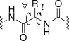
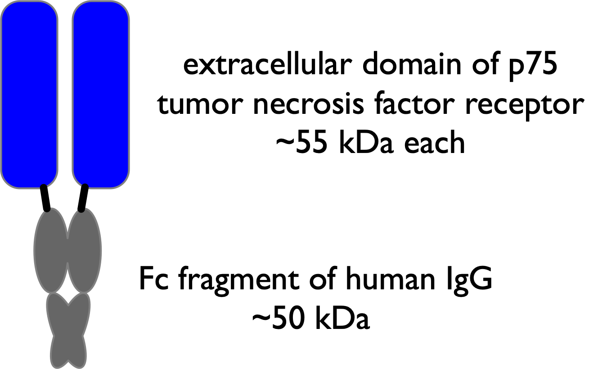

# Engineering More Stable Proteins

© 2023-2026 Romas Kazlauskas. All rights reserved. Last revised: March 2026.

**Summary.** Protein function requires the folded protein form, but this form is unstable mainly because it readily unfolds into a flexible, unstructured form. Protein folding is favored by burying of hydrophobic side chains and hydrogen bonding between the amino acids. Protein unfolding is favored by the increase in flexibility of the main chain of amino acids upon unfolding. Protein stability is usually measured by the reversible unfolding of the protein with either heat or chemical additives like urea. Protein stabilization involves making substitutions that shift the folding-unfolding balance toward the folded form. Stabilizing substitutions can either stabilize the folded conformation or destabilize the unfolded ensemble. This tutorial emphasizes web-based tools to identify substitutions that stabilize proteins. Besides unfolding, other sources of protein instability are chemical modifications like oxidations or cleavage by proteases and aggregation of partly unfolded proteins into insoluble particles.

**Key learning goals**

- Proteins are dynamic, equilibrating collections of structures. Most of the structures are folded, but a small fraction are unfolded. This protein unfolding is the primary source protein instability. Stabilization shifts the folding-unfolding balance toward folding, but does not prevent unfolding.
- To measure protein stability, one measures the ratio of folded to unfolded protein. Under normal conditions, the amount of unfolded protein is too small to detect. Adding denaturants such as urea or heating the sample increases the amount of unfolded protein to measurable amounts. Extrapolation back to normal conditions reveals the stability of the protein.
- One way to stabilize proteins is to restore amino acid residues that are conserved in homologs. The rationale for this approach is evolution conserves residues that provide some benefit; one benefit is a contribution to stability.
- Another way to stabilize proteins is to destabilize the unfolded form. The main driving force for unfolding is the increased flexibility of the unfolded form. Decreasing the flexibility of unfolded form by adding disulfide crosslinks or introducing proline residues often stabilizes proteins.
- The most direct way to stabilize proteins is to create or strengthen attractive interactions between amino acids in the folded conformation. Although proteins will remain dynamic and still unfold, the stronger interactions either slow down unfolding or speed up refolding.

## Introduction
Protein stability usually refers to resistance to unfolding. Stresses like high temperatures, organic cosolvents, high substrate or product concentrations, extremes of pH or high ionic strength can all cause unfolding. In many cases, stabilizing a protein to one stress also stabilizes it to other stresses. For example, proteins that tolerate high temperatures often also tolerate organic cosolvents.[@vazquez-figueroaThermostableVariantsConstructed2008]

One advantage of more stable proteins is the ability to use them as biocatalysts in artificial environments where naturally-occurring proteins are unstable. For example, using biocatalysis at higher than physiological temperatures yields faster reaction rates, higher substrate solubility, and lower solution viscosities. Reactions at high temperature can also avoid microbial contamination since most contaminating microbes cannot grow at high temperature. Biocatalysts that tolerates organic cosolvents and high concentrations of substrates and products simplify the scale-up of industrial processes by requiring less solvent, smaller equipment, and less complicated product isolation.

The second advantage of more stable proteins is extended lifetime or storage at ordinary temperatures. For example, manufacture of β-lactam antibiotics with penicillin G acylase recycles the immobilized enzyme many times to lower the overall cost. More stable therapeutic proteins last longer during storage and are more resistant to proteases in serum.

A third advantage of more stable proteins is higher yields of soluble protein during manufacture, especially for small, single-domain proteins. Over-expression of recombinant proteins in microbes creates high concentrations of protein. The unfolded forms can aggregate into insoluble particles called inclusion bodies. More stable single-domain proteins aggregate less and yield higher amounts of soluble protein.[@mayerCorrelationLevelsFolded2007]

A fourth advantage is that more stable proteins are also more 'evolvable' or able to acquire beneficial traits. Substitutions that change protein function may destabilize proteins. If the destabilized protein fails to fold, then the potential improvement is lost. More stable proteins can tolerate greater numbers of destabilizing mutations and are thus more evolvable than their marginally stable variants.[@bloomProteinStabilityPromotes2006] One source of stable proteins is thermophiles and other extremophiles.[@adamsFindingUsingHyperthermophilic1998] For example, the Pfu DNA polymerase used for the polymerase chain reaction (PCR) comes from the hyperthermophile Pyrococcus furiosus, Figure @fig-Pyrococcus. This polymerase catalyzes DNA synthesis at 72 °C and tolerates the high temperatures (95 °C) needed to dissociate complementary DNA strands.

{#fig-Pyrococcus width=200 fig-alt="Artistic rendering simulating a scanning electron micrograph of the archaeon Pyrococcus furiosus, showing an oval orange-pink cell body with numerous long, thin flagella extending from one end."}

One disadvantage of enzymes from thermophiles is the typically low catalytic activity of these enzymes at room temperatures.[@merzImprovingCatalyticActivity2000] Since thermophiles do not live at room temperature, there is no selective pressure for high activity at room temperature. If the application requires activity at room temperature, enzymes from thermophiles may not be suitable. Pfu DNA polymerase has negligible activity at room temperature. Other limitation of enzymes from thermophiles is the lack of other needed protein characteristics. For example, applications may require unusual substrate specificity unavailable in thermophiles or human proteins to minimize immune response.

Many human disease-causing mutations are associated with amino acid substitutions that decrease protein stability.[@wangSNPsProteinStructure2001] For example, mutations that decrease the stability of fructose bisphosphate aldolase cause hereditary fructose intolerance and mutations of the tumor suppressor protein p53 cause some cancers.[@joergerStructuralBasisUnderstanding2006] The ability to predict substitutions that alter protein stability may help identify mutations that cause genetic diseases and treat them with genetic editing technologies. For example, sickle cell disease, caused by the lower stability of the Glu6Val variant of $\beta$-globin, has been treated by expressing the unmutated fetal $\beta$-globin gene.[@parkCRISPRCas9Gene2021] 

## Native and denatured conformations equilibrate
The native protein state, N, is the folded, functional form. It is compact with the hydrophobic side chains mainly buried and the polar side chains mainly exposed to solvent. It has a specific structure (or similar set of structures), typically with α-helices, β-sheets, and turns folded in a particular arrangement, Figure @fig-chain_fold_unfold. While the structure is dynamic and moves, it has an overall stable structure. Most of the amino acids interact with each other; only amino acids on the protein surface interact with solvent water. In contrast, the denatured protein state, D, is not functional and is not a single state, but a collection or ensemble of more or less folded states. The main chain makes large, random motions and the amino acids interact mainly with solvent water, not with each other.

![Schematic of protein unfolding showing the equilibrium between a compact folded native structure (N) and an ensemble of flexible unfolded states (D). Folding creates a specific structure that mostly buries hydrophobic amino acids (filled circles) in the interior of the folded structure while mostly exposing hydrophilic amino acids (open circles). Unfolding exposes more the amino acids to solvent. For clarity, the figure shows only one example unfolded structure, but in reality it is an ensemble of rapidly interchanging unfolded structures.](figures/chapter5/chain_fold_unfold.svg){#fig-chain_fold_unfold width=400 fig-alt="Schematic bead-and-stick models comparing a compact, folded protein structure (N) in equilibrium with an extended, flexible unfolded chain (D). In the folded structure, filled circles (hydrophobic amino acids) are clustered in the interior and open circles (hydrophilic amino acids) are mostly on the surface; in the unfolded chain, both types of beads are exposed along the extended backbone."}

The native form of a typical protein is more stable than the denatured state by $\sim \! 10$ kcal/mol, Figure @fig-delG_stability. A Gibbs energy of unfolding, $\Delta G^{unfold}$, of +10 kcal/mol corresponds to an equilibrium constant $e^{-(10,000/RT)}$ or $4.6 \times 10^{-8}$ at room temperature indicating that unfolding is rare, eq. @eq-delG_Keq. Folding and unfolding are fast for single domain proteins. Native forms continuously unfold to denatured states and these continuously refold to native forms.

![The Gibbs energy difference between the folded, native state of a protein and the denatured ensemble of states determines protein stability. The barrier to unfolding for single domain proteins is low. a) The denatured state for the original protein lies $\sim \! 10$ kcal/mol above the native state. b) Stabilization of the native form stabilizes the protein because it increases the energy difference between the native and denatured forms. c) Destabilization of the denatured form also stabilizes the protein because it increases the energy difference between the native and denatured forms.](figures/chapter5/delG_stability.svg){#fig-delG_stability width=450 fig-alt="Three Gibbs energy diagrams (a, b, c), each showing a native state and a denatured state separated by a barrier. a) Baseline case: denatured state lies about 10 kcal/mol above native. b) The native state is lowered (stabilized), increasing the energy gap. c) The denatured state is raised (destabilized), similarly increasing the gap. In all three panels, a larger native-to-denatured energy difference corresponds to a more stable protein."}

$$\Delta G^{unfold} = -RTln\left( K^{unfold} \right) \text{ or } K^{unfold} = e^{-\Delta G^{unfold}/RT}$$ {#eq-delG_Keq}

Protein solutions contain unfolded protein molecules even for stably folded proteins. In the case where the native form is $\sim \! 10$ kcal/mol more stable than the unfolded form, one in twenty-two million protein molecules unfolds at any given time in solution at room temperature, eq. @eq-num_unfolded. This tiny fraction is too small to detect by spectroscopic methods, but it is nevertheless a large number of molecules. A solution containing 1 mg of a 30 kDa protein contains $4 \times 10^{16}$ molecules; of these, nearly a billion ($10^9$) are in the denatured form at any time.

$$K^{unfold} = \frac{[D]}{[N]}=4.6 \times 10^{-8} \text{ or } [N] = 22 \times 10^6 \cdot [D]$$ {#eq-num_unfolded}

The main driving force for protein folding is the hydrophobic effect, which is the tendency of non-polar solutes to cluster in water. Burying a --CH$_2$ group contributes 1.1 ± 0.5 kcal/mol to protein stability. The hydrophobic effect provides $\sim \! 60$% of the driving force to collapse the amino acid chain into a compact structure.[@paceLinearExtrapolationMethod2000] The folded form of a protein is its lowest energy conformation in dilute solutions. (In concentrated protein solutions, oligomeric or aggregated states may be lower in energy.) The chains orient to maximize the hydrophobic effect and also to make attractive interactions between amino acids: hydrogen bonds and other electrostatic interactions.

Hydrogen bonds contribute the remaining 40% of the driving forces for protein folding. The hydrogen bonds between protein atoms each contribute on average 1.1 ± 0.8 kcal/mol each to protein stability. The unfolded protein makes hydrogen bonds between protein and water, so this energy contribution is the net gain in hydrogen bond strength. Hydrogen bonds also define how the protein will fold into helices and sheets.

The dominant driving force for unfolding of the main protein chain is the increase in flexibility. The denatured ensemble is a collection of highly flexible forms. This flexibility creates many conformations or micro-states and the existence of these states is the main driving force for unfolding. The micro-states create a favorable entropy contribution, $-T\Delta S$, to the Gibbs energy. To find the Gibbs energy contribution of entropy, one multiplies the entropy change by temperature and a negative sign since an increase in entropy lowers Gibbs energy, eq. @eq-entropy_microstates, where $W_{folded}$ and $W_2$ are the different numbers of micro-states in the states being compared.

$$ \Delta G_{unfolded-folded} = -T\Delta S_{2-1} = -RTln\left( \frac{W_2}{W_1} \right)$$ {#eq-entropy_microstates}

To find the effect of a molecule's conformational flexibility on Gibbs energy, one compares the number of conformations in the flexible state to the non-flexible state. For example, one can estimate the difference in Gibbs energy between the folded and unfolded states for one amino acid in a protein at 300 °K only due to differences in backbone flexibility while ignoring any differences in side-chain flexibility. Assume that the backbone has a single conformation in the folded state, N, but can adopt three staggered conformations along each of the two rotatable bonds (ψ, φ) in the unfolded state, D, Figure @fig-amino_acid_angles.

{#fig-amino_acid_angles width=150 fig-alt="Skeletal structure of a peptide backbone segment showing the two rotatable dihedral angles per residue, φ (phi, at the N–Cα bond) and ψ (psi, at the Cα–C bond), with the side chain R on the alpha carbon; the C–N amide bond linking residues is not rotatable, reflecting its partial double-bond character."}

The approach is to estimate the difference in the number of conformations available to the folded and unfolded states and then convert this difference to Gibbs energy using eq. @eq-entropy_microstates above. The amino acid in the folded state has one available conformation while in the unfolded state, an amino acid can adopt $3\cdot3 = 9$ possible conformations. Converting this difference in possible conformations into Gibbs energy yields:

$$\Delta G_{N-D}= -RTln\left( \frac{W_2}{W_1} \right) = 1.987 \text{ cal/mol}\cdot ^{\circ}\text{K} \cdot 300 \:^{\circ}\text{K} \cdot ln\left( \frac{1}{9} \right) = +1.3 \text{ kcal/mol}$$

Thus, entropy due to differences in the backbone flexibility favors the unfolded state by 1.3 kcal/mol for each amino acid residue. More accurate estimates that account for the unequal likelihood of the nine conformations and differences in side chain flexibility yield a similar number: 1.4 kcal/mol per amino acid residue.[@baxaLossConformationalEntropy2014]
For a typical protein of 300 amino acids, this entropy effect of backbone flexibility contributes 400 kcal/mol, which is large as compared to the balance of $\sim \! 10$ kcal/mol in favor of the folded state. Hydrophobic interactions and hydrogen bonds in the native state counterbalance this flexibility advantage of the denatured state with a slightly larger Gibbs energy contribution. Protein stability is a balance between one set of large forces favoring the folded state and another set favoring the unfolded state.

## Measuring the folding-unfolding equilibrium
Measuring the equilibrium constant requires measuring the ratio of folded and unfolded protein at equilibrium. Under normal conditions, the equilibrium amount of unfolded protein is too small to measure. Instead, researchers use destabilizing conditions where easily detectable amounts of both the folded and unfolded protein exist, Figure @fig-add_denaturant. Typical destabilizing conditions are additives like urea or guanidinium chloride, changes in the solution pH, or increases in temperature. After measuring the equilibrium constant at these destabilizing conditions, researchers extrapolate back to normal conditions to get the desired equilibrium constant under normal conditions.

{#fig-add_denaturant width=300 fig-alt="Two energy-level diagrams connected by an arrow labeled “add denaturant, change temperature, or high/low pH.” Before treatment, the native state (N) energy level is far below the denatured state (D), so K_unfold is much less than 1. After treatment, the N and D levels are close together, giving a measurable equilibrium constant between 0.1 and 10."}

Most of this book treats protein folding and unfolding as a cooperative, two-state process (Figure @fig-chain_fold_unfold above). The entire protein is either folded or denatured, and the process is entirely reversible. There are no partially folded proteins or folding intermediates. The cooperative folding might start with one amino acid adopting an α-helix conformation, quickly followed by neighboring amino acids adopting the α-helix structure to create intrachain hydrogen bonds. This assumption of a simple, reversible two-state process is reasonable for single domain monomeric proteins. In these cases, adding stabilizing substitutions anywhere in the protein can contribute to stabilization since the entire protein unfolds simultaneously.

Changing the environment does not gradually change protein structure from folded to unfolded. Proteins remain fully folded or fully unfolded, but their ratio changes with the environment. Unfolding is cooperative because the interactions that stabilize the folded protein are stronger in combination than their individual contributions. The protein remains folded even when some stabilizing interactions break, but breaking too many destabilizes the others leading to complete unfolding of the protein.[@horovitzCooperativeInteractionsProtein1992]

Section @sec-mult_domains below will briefly consider multiple domain and oligomeric proteins. Multiple domain proteins usually fold and unfold stepwise via intermediates. The same stabilization strategies apply, but the substitutions must be in unfolded regions, not anywhere in the protein.

### Denaturation with urea, $\Delta G_{H_2O}$
Urea unfolds proteins because it 1) solvates exposed hydrophobic groups to reduce the hydrophobic effect and 2) forms hydrogen bonds to the backbone to disrupt secondary structures. Typical proteins unfold at 3-5 M urea; the solubility limit of urea is 18 M at room temperature.

The urea-induced denaturation experiment involves preparing solutions of protein in various concentrations of urea, waiting until the folding-unfolding reaches equilibrium, and measuring the amounts of native and denatured protein. The most common method to detect the folded and unfolded proteins is measuring the intensity of protein absorbance or fluorescence, Figure @fig-monitor_fluorescence, but any method that distinguishes between the native and denatured states is suitable. Some examples are measuring shifts in the wavelength of the fluorescence maximum, changes in the circular dichroism spectra, changes in the NMR spectra, decreases in catalytic activity, or changes in the dye fluorescence upon binding to hydrophobic regions of the unfolded protein.

![Unfolding of a protein in urea as monitored by tryptophan fluorescence. a) The indole ring of tryptophan absorbs light (absorbance maximum 280 nm; not shown), then emits light at lower energy (higher wavelengths). The emission maximum of a folded protein is typically 320 nm, which is similar to the emission maximum of indole in hexane. Upon unfolding the emission maximum shifts to 350 nm, which is similar to the emission maximum of tryptophan in water. b) Hypothetical urea unfolding data showing a decrease in fluorescence intensity at 320 nm as the protein unfolds in increasing concentrations of urea.](figures/chapter5/monitor_fluorescence.svg){#fig-monitor_fluorescence width=250 fig-alt="Two-panel figure on monitoring protein unfolding by tryptophan fluorescence. a) Emission spectra for native protein (peak near 320 nm) and denatured protein (peak shifted to about 350 nm), both excited at 280 nm. b) Scatter plot of fluorescence intensity at 320 nm versus urea concentration (0–8 M), showing high intensity at low urea (“native”), a decreasing transition region, and low, plateaued intensity at high urea (“denatured”)."}

The reasoning above predicts that the fluorescence emission wavelength increases for the denatured protein, but it is not easy to predict the relative intensity of this emission. The intensity change also depends wavelength chosen to monitor the fluorescence. For the example in Figure @fig-monitor_fluorescence$\text{a}$, the fluorescence intensity at 320 nm (near the emission maximum of the native protein) decreases as the protein unfolds, but the fluorescence intensity at 360 nm (near the emission maximum of the denatured protein) increases (not shown).

To extract the constants for unfolding equilibrium at different urea concentrations, $N \rightleftharpoons D$ from the fluorescence changes, one needs to know the fractions of native, $F_N$, and denatured protein, $F_D$. The ratio of these fractions is the equilibrium constant, eq. @eq-extract_Keq. One assigns the fluorescence in low or no denaturant, $Y_N$, to the native protein and the fluorescence at high denaturant concentrations, $Y_D$, to the denatured protein. The supporting information includes a derivation of this equation. Intermediate values of fluorescence, $Y_{obs}$, correspond to a mixture of native and denatured states. Only data in the transition region of the denaturation experiment contribute to the analysis because when the protein is nearly completely folded or completely unfolded, the data do not precisely define the ratio of the two forms.

$$K^{unfold}=\frac{F_N}{F_D}=\frac{Y_{obs}-Y_N}{Y_D-Y_{obs}}$$ {#eq-extract_Keq}

Applying the a linear extrapolation approach[@scholtzSolventDenaturationProteins2009] to these measured equilibrium constants reveals the Gibbs energy of unfolding in water. This linear extrapolation approach starts by converting these equilibrium constants to Gibbs energy values according to eq. @eq-delG_Keq above and plotting them versus urea concentration, Figure @fig-linear_extrapolation. The plot reveals a straight line with a negative slope since adding more urea favors protein unfolding. The line crosses the x-axis at $\Delta G^{unfold} = 0$. The goal of this experiment is to measure $\Delta G^{unfold}$ without any urea, that is, $[\text{urea}] = 0$. Extrapolation of the line to y-axis intercept reveals the Gibbs energy of unfolding in pure water, $\Delta G^{unfold}_{H_2O}$.

{#fig-linear_extrapolation width=200 fig-alt="Scatter plot of ΔG_unfold versus urea concentration with a linear best-fit line through five data points. The line's y-intercept, ΔG(H2O)_unfold, gives the extrapolated Gibbs energy of unfolding without urea; a triangle construction marks the slope (“m-value”). The line crosses zero partway across the plot and continues to negative values at higher urea concentrations."}

The equation for this line has a slope of -m and and a y-intercept at $\Delta G_{H_2O}^{unfold}$. The m-value is the absolute value of the slope and indicates the sensitivity of the protein to denaturant, which depends on the solvent-accessible surface area exposed upon unfolding.[@scholtzSolventDenaturationProteins2009] A protein that unfolds completely has a higher m-value than a similar protein that unfolds only partially. Similar proteins with different m-values indicate different degrees of unfolding in their denatured states. Typical m-values for proteins undergoing urea-induced unfolding are $\sim \! 1000$ cal/(mol·M).This linear extrapolation approach is a convenient way to measure protein stability and the supporting information includes an example calculation.

$$\Delta G^{unfold} = \Delta G_{H_2O}^{unfold}-m\cdot[\text{urea}]$$ {#eq-linear_extrapolation}

Positive Gibbs energies of unfolding in pure water indicate that unfolding of the protein is unfavorable. A higher Gibbs energy of unfolding indicates a more stable folded protein.
The molecular basis for the linear relationship between unfolding Gibbs energy and urea concentration may be a binding interaction between urea and protein. The binding of urea destabilizes the protein and the fraction of urea bound increases linearly with concentration.

### Heat denaturation, $\Delta G^{unfold}(T)$

Heat also unfolds proteins. Increases in temperature increase the entropy contribution to Gibbs energy of unfolding, eq. @eq-delG_unfold_contributions where $\Delta H^{unfold}$ and $\Delta S^{unfold}$ are, respectively, the changes in enthalpy and entropy upon unfolding. The entropy contribution due to the increase in flexibility of the unfolded protein increases at higher temperature and eventually leads to unfolding.

$$\Delta G^{unfold} = \Delta H^{unfold} - T\Delta S^{unfold}$$ {#eq-delG_unfold_contributions}

Here we consider reversible heat-induced unfolding. Section @sec-prot_aggregation below considers irreversible unfolding caused by aggregation of the unfolded protein. As with urea-induced denaturation, this unfolding can be monitored spectroscopically, Figure @fig-thermostability. For reversible unfolding, the equilibrium constant yields the Gibbs energy of unfolding at these high temperatures. The melting temperature, $T_m$, is the temperature where the amounts of folded and unfolded protein are equal; $\Delta G^{unfold} = 0$.

![Heat induced unfolding of proteins. a) Hypothetical melting curve for a protein measured by the decrease in fluorescence intensity at 320 nm as the protein unfolds. The melting temperature, Tm, is the temperature where the amounts of folded and unfolded protein are equal. b) The Gibbs energy of unfolding of a protein varies non-linearly with temperature according to eq. @eq-delG_unfold_contributions. The stability of a protein also decreases at lower temperatures; $T_l$ marks the low temperature unfolding temperature. This plot uses values typical for a 300 aa protein: $T_0 =$ 300 °K, $\Delta H_0 =$ 30 kcal/mol, $\Delta S_0$ = 80 cal/mol·deg, $\Delta C_p$ = 4.2 kcal/mol·deg. The dotted line is an approximation sometimes used near the melting temperature, see eq. @eq-Tm_delG.](figures/chapter5/thermostability.svg){#fig-thermostability width=400 fig-alt="Two-panel figure on heat-induced protein unfolding. a) Sigmoidal melting curve: fluorescence intensity versus temperature, transitioning from a high native plateau to a low denatured plateau, with melting temperature Tm marked at the midpoint. b) Non-linear plot of ΔG_unfold versus temperature (-25 to 70°C): the curve rises from a low-temperature zero-crossing (cold denaturation), peaks near 20°C at about 6 kcal/mol, then decreases and crosses zero again near Tm (heat denaturation); a dashed line shows a linear approximation used near Tm."}

These measured Gibbs energies of unfolding at high temperatures can be extrapolated to room temperature, but this extrapolation is more complex than extrapolating the Gibbs energy of unfolding to pure water from a urea denaturation curve.[@fershtChapter17Protein1999] One might expect a plot of ΔGunfold versus temperature to yield a straight line according to eq. 3.7 above, where ΔSunfold is the slope and ΔHunfold is the y-intercept. However, the Gibbs energy of protein unfolding varies with temperature according to a more complex equation, eq. @eq-full_delG_unfold_contributions.[@becktelProteinStabilityCurves1987] Extrapolating the melting curve data to lower temperatures also requires measuring $\Delta C_p$ which is the change in heat capacity upon unfolding, Figure @fig-thermostability.

$$\Delta G^{unfold} = \Delta H^{unfold}_0 - T\Delta S^{unfold}_0 + \Delta C_p\left[(T - T_0) - T\ln(T/T_0)\right]$$ {#eq-full_delG_unfold_contributions}

Here $T_0$ is the reference temperature and $\Delta H^{unfold}_0$ and $\Delta S^{unfold}_0$ are the enthalpy and entropy of unfolding at that temperature. For reactions involving small molecules, the heat capacity of starting materials and products are similar, and differences may be ignored. Eq. @eq-full_delG_unfold_contributions simplifies to eq. @eq-delG_unfold_contributions when $\Delta C_p = 0$.

However, the heat capacities of the folded and unfolded proteins differ significantly. Another way to state the reason for the more complex equation is that for protein unfolding $\Delta H^{unfold}$ and $\Delta S^{unfold}$ vary with temperature while eq. @eq-delG_unfold_contributions assumes they are constant. The extra terms in eq. @eq-full_delG_unfold_contributions account for the variation of $\Delta H^{unfold}$ and $\Delta S^{unfold}$ with temperature.

The unfolded protein has a higher heat capacity than the folded protein because unfolding exposes hydrophobic groups to water. Water surrounds these hydrophobic groups with an ice-like structure, which has slightly higher energy than bulk water. The fluctuation of water between bulk and ice-like structure increases the heat capacity.

The change in heat capacity for protein unfolding, $\Delta C_p$, is always positive with a typical value of 14 cal/mol·deg per residue or 4.2 kcal/mol·deg for a 300 aa protein.[@robertsonProteinStructureEnergetics1997] Differential scanning calorimetry can measure this change in heat capacity. Differential scanning calorimetry measures the heat required to increase the temperature of a sample. The baseline value before unfolding reveals the heat capacity of the folded protein, while the baseline value after unfolding reveals the heat capacity of the unfolded protein. The difference is the change in heat capacity. In the absence of experimental data, the web tool [SCooP](http://babylone.ulb.ac.be/SCooP/index.php)[@pucciSCooPAccurateFast2017] predicts the parabolic curve for temperature-dependent unfolding of a protein based on its structure. 

The parabolic curve in Figure @fig-thermostability$\text{b}$ predicts that proteins will also denature at low temperatures. For most proteins the predicted cold denaturation temperature, Tl, lies well below the freezing point of water as shown in the sketch, but for some proteins, the cold denaturation temperature lies in the liquid range of water. For example, the yeast protein frataxin denatures at both 7 °C and at 30 °C.[@pastoreUnbiasedColdDenaturation2007] At high temperatures the increase in conformational entropy (flexibility) of the protein atoms drives unfolding, while at low temperatures a decrease of the hydrophobic effect drives unfolding. At lower temperatures, the cost of ordering water molecules around a hydrophobic group decreases. As the tendency of hydrophobic groups to aggregate in water decreases, the folded form loses a stabilizing force. 

Increases in melting temperature usually correspond to increases in protein stability. Comparing the unfolding or melting temperatures of protein variants is a common, approximate measure of their stability. One assumes that the unfolding process is similar for protein variants so the parabolic curve of Gibbs energy of unfolding versus temperature (Figure @fig-thermostability$\text{b}$ above) remains similar. One heats a protein sample slowly while monitoring the protein tryptophan fluorescence (Figure @fig-thermostability$\text{a}$). The temperature corresponding to the midpoint of the change in fluorescence indicates the melting temperature. Usually one is on the right side of the parabola describing protein heat stability so an increase in melting temperature corresponds to a increase in protein stability.

A comparison of pairs of homologous proteins from thermophiles and mesophiles showed that the melting temperatures, $T_m$, were 31.5 °C higher and the Gibbs energies of unfolding 8.7 kcal/mol higher for the thermophiles.[@razviLessonsStabilityThermophilic2006] From this comparison, we can derive a rule of thumb that stabilizing a protein by 1 kcal/mol will increase the melting temperature by 3.6 °C, eq. @eq-Tm_delG, see dotted line in Figure @fig-thermostability$\text{b}$.

$$\Delta \Delta G^{unfold} (\text{kcal/mol}) \sim \Delta T_m (\text{°C})/3.6 \text{ °C/kcal/mol}$$ {#eq-Tm_delG}

In many cases, the Gibbs energy of heat-induced unfolding,$\Delta G^{unfold}(T)$, is comparable to that obtained by urea unfolding. When these values differ, it is likely because the unfolded states differ in the two experiments.

## Stabilization to cooperative unfolding {#sec-stab_coop_unfold}

Stabilizing a dynamic object like a protein differs from stabilizing a rigid object like a chair. To stabilize a chair one can add a supporting brace, which keeps the chair in the desired structure. In contrast, a protein folds and unfolds continuously; it is dynamic. Adding a stabilizing interaction to a protein does not prevent unfolding. Instead, the stabilizing interaction shifts the folding-unfolding equilibrium toward folding so the protein spends more time in the folded form. Since the equilibrium constant is the ratio of the forward and reverse rate constants, eq. @eq-unfolding_Keq, shifting the equilibrium constant also changes the rates of folding and unfolding. A stabilizing interaction may slow down unfolding, speed up folding, or both; but, unlike stabilizing a chair, stabilizing a protein does not _prevent_ unfolding.

$$ N \xrightleftharpoons[k_{fold}]{\,k_{unfold}\,} D $$ {#eq-unfolding_Keq}

Stabilizing a protein also differs from stabilizing a rigid object because one can stabilize a protein by destabilizing the unfolded form.[@eijsinkRationalEngineeringEnzyme2004] Everyday objects like chairs are not dynamic and cannot be stabilized this way. This book uses the expression 'stabilize a protein' or 'increase protein stability' to mean either stabilizing the folded form or destabilizing the unfolded form.

One reason that it is hard to predict which substitutions will stabilize a protein is that the structure of the denatured state (an ensemble of rapidly equilibrating structures) is unknown. Stabilizing substitution must affect the folded and unfolded forms differently. A substitution that equally stabilizes (or destabilizes) the folded and unfolded forms does not change stability of the protein. X-ray crystal structures reveal changes to the folded form, but changes to the denatured state are invisible because its structure is unknown. Stabilization can occur without strengthening the folded structure. For example, seven amino acid substitutions dramatically stabilized xylanase ($T_m$ increased by 25 °C), but the structures of the wild-type and stabilized proteins showed similar interactions between amino acids in both structures.[@dumonEngineeringHyperthermostabilityGH112008] In this case, the stabilizing substitutions likely destabilized the unfolded state and changed its structure, but nature of these changes is unknown because the structure of the unfolded state is unknown.

A second reason that it is hard to predict stabilizing substitutions is that the substitutions must not hinder catalytic or binding ability of the target proteins. Substitutions that increase stability often also decrease activity and vice versa.[@shoichetRelationshipProteinStability1995] One reason for this trade-off is that catalysis and binding rely on interactions of the substrate or transition state with unsatisfied hydrogen bonds, exposed hydrophobic groups and unpaired charges in the protein. Satisfying these interactions with amino acid substitutions will stabilize the protein, but also disrupt binding and catalysis. Researchers typically avoid substitutions near the active site when searching for stabilizing substitutions to prevent disrupting binding and catalysis.

Some protein stabilization strategies seek to stabilize the native protein, others destabilize the denatured conformation, and, for a few, the molecular mechanism is unknown, Table @tbl-stabilization_methods. The design strategies that seek to stabilize the native protein require a protein structure or at least a homology model to start the design. A homology model is an extrapolated 3D-structure of a protein based on the known structure of a similar protein. [Swiss Model](https://swissmodel.expasy.org) and [AlphaFold](https://colab.research.google.com/github/deepmind/alphafold/blob/main/notebooks/AlphaFold.ipynb) are web tools to generate homology models from protein sequences. Strategies that seek to destabilize the unfolded ensemble also require a protein structure to ensure that the changes do not distort the folded form. Strategies with unknown mechanism do not require a protein structure. For example, restoring residues that are conserved in homologs (consensus sequence approach, see below) requires only a protein sequence. Random mutagenesis followed by screening to find stabilized variants also does not require a protein structure. Chapters 9 and 10 discuss random mutagenesis methods.


| Strategy | Rationale | Example |
|---|---|---|
| restore residues conserved in homlogs | not specified | [Consensus Finder](https://kazlab.umn.edu) identifies conserved amino acids in homologs that are missing from target protein |
| add disulfide crosslinks | destabilize unfolded protein | [Disulfide by Design](http://cptweb.cpt.wayne.edu/DbD2/index.php) identifies suitable locations, additional analysis needed to narrow choices |
| add Pro residues | destabilize unfolded protein | Analysis of structure to identify locations suitable for proline [WHAT-IF](https://swift.cmbi.umcn.nl/servers/html/index.html) |
| substitutions in or near flexible regions | stabilize folded protein | Random mutagenesis in or near flexible regions |
| random mutagenesis and screening | not specified | Random mutagenesis anywhere followed by screening for stabilized variants |
| optimize electrostatic interactions | stabilize folded protein | [TKSA-MC](http://tksamc.df.ibilce.unesp.br) identifies destabilizing electrostatic interactions |
| optimize hydrophobic and other interactions | stabilize folded protein | Modeling with [Rosetta and FoldX](https://loschmidt.chemi.muni.cz/fireprot/) to identify stabilizing substitutions |
: Design strategies to stabilize proteins and web tools to implement these strategies. {#tbl-stabilization_methods}


To engineer a change, one needs to choose both the location of the substitution and the replacement amino acid. The 'restore residues conserved in homologs' approach predicts both, so it is easy to implement. The 'substitutions in or near flexible regions' approach defines the location, but not the replacements. Additional modeling or experiments are needed to identify the replacements. The 'add disulfide links' approach specifies that cysteine is the replacement amino acid, but additional modeling is needed to find suitable locations. Design strategies like 'improve hydrophobic and other interactions' are the least specific and require computer modeling to predict both the location and the replacement amino acid. Each of the approaches in Table @tbl-stabilization_methods will be described in more detail below. The effect of each stabilizing mutation is typically small (0.5 kcal/mol), so substantial stabilization of the protein (2-4 kcal/mol) requires multiple substitutions and often more than one design strategy.

### Restore conserved amino acids

Evolution conserves amino acids that contribute to protein function. This contribution may be to structure, catalysis, stability or other protein property. The consensus approach hypothesizes that conserved amino acids residues are more likely to contribute to protein stability than a non-conserved amino acid. To use the consensus approach to stabilize a protein, one identifies amino acid residues conserved within homologous proteins, but which are missing in the target protein. Restoring these conserved amino acids is more likely to stabilize the protein than random substitutions.

Consensus design works because natural proteins rarely follow the consensus sequence at all structurally important positions. Natural proteins only have to be stable enough to fulfill their biological function; proteins with stabilities above a certain threshold will have no further selection advantage. There are many stabilizing residues, but individual proteins do not need all of them to reach the threshold of being stable enough. Thus, replacing a residue with the corresponding consensus amino acid may improve the stability or folding efficiency of a protein of interest. The same reasoning leads to the conclusion that the stability of a protein designed by consensus can be higher than that of the proteins in the alignment.

The consensus sequences approach does not hypothesize any molecular basis for the stabilization. It relies only on amino acid sequence comparisons from bioinformatics and does not require any structural information.[@lehmannConsensusConceptThermostability2002; @maglieryProteinStabilityComputation2015] It is easy to implement, and several web-based tool to generate a consensus sequence for a protein are available: Consensus Finder[@jonesConsensusFinderWeb2020] or FireProt.[@musilFireProtWebServer2017]
Typically researchers restore one or a few conserved amino acids. Usually at least half of these predicted substitutions prove to be stabilizing. Pantoliano and coworkers first suggested that substitutions to the consensus amino acid may stabilize proteins and showed that the consensus-type mutation Met50Phe increased the unfolding temperature of subtilisin BPN\' by 1.8 °C[@pantolianoLargeIncreasesGeneral1989] and many others have used this approach. For example, a sequence alignment of 351 homologs of _Staphylococcus_ nuclease A identified the His124Glu substitutions as potentially stabilizing, Figure @fig-define_consensus_seq.

![The most frequently-occurring amino acid in a multiple sequence alignment defines a consensus sequence. The target sequence (_Staphylococcus_ nuclease A) was aligned with 351 homologs. The height of the letters in the logo plot reflects the frequency of the amino acid in the multiple sequence alignment. The sequence of the most common amino acid at each position is the consensus sequence. This consensus sequence predicts that an H124E substitution would stabilize this protein since 30% proteins in the alignment have E, but only 1% have H. Unfolding experiments showed that this substitution slightly stabilized Staphylococcus nuclease.[@schwehmChangesStabilityCharge2003] The [WebLogo](https://weblogo.threeplusone.com) tool generated the logo plot of amino acid frequencies.](figures/chapter5/define_consensus_seq.svg){#fig-define_consensus_seq width=300 fig-alt="Sequence logo plot for positions 120–130 of an alignment of 351 homologs to a target nuclease. Each column stacks amino-acid letters with height proportional to frequency; the target sequence is shown above and the consensus sequence below. Position 124 is circled: the target has histidine (1% frequency) while glutamate is the consensus (30% frequency); the predicted H124E substitution has ΔΔG_unfold = +0.2 kcal/mol."}

One can also restore all the conserved amino acids simultaneously. Lehmann and coworkers predicted the consensus sequence of fungal phytases based on the sequence alignment of thirteen sequences, Figure @fig-phytase_consensus.[@lehmannConsensusConceptThermostability2002] The consensus phytase differed by at least 80 amino acids from the parent sequences. A synthetic gene encoded the consensus phytase containing all these changes. The consensus protein was 15-26°C more thermostable than any of its parents.

![Part of the sequence alignment (amino acid positions 54--73) of fungal phytases and the derived consensus sequence.[@lehmannConsensusConceptThermostability2002] Amino acid sequences from the same species are weighted so that each species contributes equally to the consensus sequence. The \'-\' in the consensus sequence indicates that the consensus amino acid is ambiguous at this position.](figures/chapter5/phytase_consensus.svg){#fig-phytase_consensus width=300 fig-alt="Table listing partial amino acid sequences (positions 54–73) from 11 fungal phytase homologs and their assigned weights (0.20–1.0), aligned column by column, with two columns highlighted to show positions of sequence variation. The bottom row gives the derived consensus sequence, with a dash where the consensus amino acid is ambiguous."}

At some positions, counting the numbers of occurrences identifies the consensus amino acid. For example, all thirteen sequences start with QVL, and most have S in the next position (boxed), so the consensus sequence begins with QVLS, Figure @fig-phytase_consensus. At other positions, identifying the consensus amino acid requires care to ensure unbiased sampling of sequences. Identifying the most common residues requires a uniform sampling of amino acid sequences throughout the evolutionary tree, but the available amino acid sequences may not be evenly distributed. For the phytase example above, researchers reduced the bias of multiple sequences from different strains of the same species by weighting the amino acid sequences so that each _Aspergillus_ species had equal weight. For example, the list included five sequences from _Aspergillus fumigatus_ strains, Figure @fig-phytase_consensus. Each of these sequences was weighted by 0.2 in deriving the consensus to avoid bias toward this species. For example, consider the last amino acid in Figure @fig-phytase_consensus (position 73, boxed). The first two sequences (_A. terreus_) have A at this position, the next three (_A. niger_) and two others (_Emericella_ and _Talaromyces_) have S, the five _A. fumigatus_ sequences have K, and the last sequence (_Myceliophthora_) has V. Although S and K both occur five times, K occurs only in the five _A. fumigatus_ sequences and receives a total weight of 1.0, while S occurs in three different species and gets a total weight of 3.0. The consensus amino acid at this position is S. The consensus sequence is not unique, but depends on the set of comparison sequences. In later work, as more phytase sequences became available, researchers tested a revised consensus sequence, which further increased stability.

In other cases, a database search may yield thousands of similar sequences and it is impractical to assign different weights to the sequences. To minimize phylogenetic bias in these cases, one clusters similar sequences (typically >90\% identity) together and uses only one sequence from each cluster for the consensus calculation. The web-based tools to find consensus sequences mentioned above use this clustering to minimize phylogenetic bias.

One disadvantage of the consensus sequence approach is that its conservative nature predicts small numbers of substitutions, often less than a handful or even none. Although experimental screening reveals that many stabilizing substitutions exist, the consensus sequence approach, by focusing on those conserved among homologs, misses most of them. 

Ancestral proteins are extinct proteins that correspond to branch points in a phylogenetic tree. Gene synthesis and expression of these proteins in microbial hosts resurrects these proteins. In many cases, ancestral proteins are more stable than modern proteins. Some ancestral proteins may be more stable because the earth was warmer in prehistoric times. However, ancestral proteins from times when the earth\'s temperature was only slightly warmer are also more stable, so other effects may contribute.[@trudeauPotentialOriginsHigh2016] One contribution is that reconstructed ancestral proteins are often similar to the consensus sequence for that group since many descendants retain the ancestral residues. However, ancestral proteins differ from consensus proteins is two ways. First, ancestral proteins identify amino acids conserved within a related group, while consensus proteins include data from all homologous proteins, including those outside a group. Second, the consensus approach weights all sequences equally, but ancestral sequence reconstruction takes branch lengths into account, so more recent changes count less in an ancestral sequence prediction.

### Destabilize the unfolded ensemble

The main property favoring the unfolded ensemble is its flexibility. Reducing this flexibility destabilizes the unfolded ensemble, thus shifting the folding-unfolding equilibrium toward folding. Two ways to reduce this flexibility are to add disulfide cross-links and to replace amino acid residues with proline. In both cases the replacement amino acid is defined; the challenge is to find suitable locations for the replacement. The ideal site in the folded structure would fit the replacement perfectly, so the only effect of the substitution is to reduce the flexibility of the unfolded ensemble.

**Add disulfide cross links.** Replacing a nearby pair of amino acid residues with cysteines followed by spontaneous oxidation creates a disulfide cross link, Figure @fig-SS_example. Such disulfide links often stabilize proteins to unfolding. For example, the replacement of Ala43 and Ser80 in _Bacillus_ RNAse with cysteines followed by spontaneous oxidation yielded a more stable protein that unfolded in 5.77 M urea as compared to 4.58 M urea for the wild type.[@clarkeDisulfideMutantsBarnase1995] This engineering involved both amino acid replacements and the formation of a cross link, both of which could contribute to changes in stability. To measure the effect of the cross link alone, the researchers compared the stabilities of the oxidized disulfide form with the reduced dithiol form of the protein. These two forms differ only in the presence or absence of a cross link. For the example above, the Gibbs energy of unfolding of the oxidized form was 3.2 kcal/mol higher than for the reduced dithiol form demonstrating that the cross link stabilized the protein.

{#fig-SS_example width=300 fig-alt="Two-part figure on introducing a disulfide cross link. Left: chemical structures showing serine 80 and alanine 43 side chains converted to cysteine 80 and cysteine 43 side chains joined by a disulfide bond. Right: ribbon cartoon of the 3D structure of Bacillus RNase, with three engineered cross-link sites labeled by residue-number pairs (80-43, 85-102, 70-92) at the corresponding loop and strand positions."}

The reason that disulfide cross links stabilize proteins is that cross links reduce the flexibility of the unfolded protein. Upon unfolding, the cross link remains and limits the movement of the unfolded protein. Flexibility creates disorder (entropy), which is stabilizing. Reducing flexibility of the unfolded protein destabilizes it. The cross link constrains the distance between the linked cysteines. In the folded form, the cysteines are already close, so this constraint has little effect. In contrast, this constraint dramatically limits the movement and flexibility of the unfolded protein. Since increased flexibility and the associated increased entropy is the main reason that proteins unfold, reducing the flexibility of the unfolded form shifts the folding-unfolding equilibrium toward folding. This shift stabilizes the protein to unfolding.

A common misconception is that disulfide cross links prevent unfolding; they do not. Proteins remain flexible, dynamic structures even after adding disulfide cross links. They still unfold in urea solutions and upon heating. The RNAse protein in the example above still unfolded in urea solutions, although unfolding required higher urea concentrations that for wild-type. A similar misconception is that protein cross links strengthen and stabilize the folded protein state. They do not. The locations chosen for a disulfide cross link are already nearby in the folded protein. The introduction of the cysteines and the cross link may slightly change the folded protein stability, but this change is most often a destabilization, see below.

The chain entropy model predicts the amount of expected stabilization from a disulfide cross link. This model calculates the change in entropy due to reduced flexibility of the unfolded protein state caused by the disulfide cross link. This model assumes that the introduction of cysteines and formation of the disulfide cross link has no effect on the stability of the folded protein state. The amount of protein stabilization expected from disulfide cross link depends on the size of the ring created by the cross-link. Larger rings limit the flexibility of more amino acids and are therefore more stabilizing. Equation eq. @eq-chain_entropy_SS below estimates the chain entropy effect of disulfide cross link on the unfolded state.[@paceConformationalStabilityActivity1988]

$$\Delta \Delta S^{unfold} = -2.1 \text{cal/mol} \cdot \ ^{\circ}\!K - \frac{3}{2}R\ln n$$ {#eq-chain_entropy_SS}

The $\Delta \Delta S^{unfold}$ refers to change due to the crosslink for the entropy change associated with unfolding; the $n$ is the number of residues in the ring created by the crosslink and $R$ is the gas constant. A link between amino acid residues 43 and 80 creates a ring of 38 residues; one more than the difference between 80 and 43. This equation comes from from polymer theory estimates of the probability that the two ends of the chain will coincide in the same volume element. If linked, the two ends must remain in the same volume element, while if unlinked they may move apart and allow greater numbers of conformations. To estimate the Gibbs energy change of the disulfide cross link using the chain entropy model, one multiplies by $-T$ where $T$ is the temperature (in °K) yields the anticipated Gibbs energy contribution, eq. @eq-deldelG_SS.

$$\Delta \Delta G^{unfold} \text{ (cal/mol)} = -T \cdot \Delta \Delta S^{unfold} = T  \left[ 2.1+\frac{3}{2} \cdot 1.987 \cdot \ln n \right]$$ {#eq-deldelG_SS}

For example, the chain entropy model predicts that at 25 °C a cross link between amino acids 43 and 80 will stabilize a protein by 3.9 kcal/mol, which is slightly higher than the measured value of 3.2 kcal/mol in _Bacillus_ RNase, Figure @fig-SS_example. The stabilization predicted by eq. @eq-deldelG_SS increases non-linearly with the number of amino acid residues in the ring, Figure @fig-SS_stabilization_plot. The estimated stabilization for the smallest possible ring (two amino acids) is 1.2 kcal/mol. The stabilization increases to 3.0 kcal/mol at $n$ = 15, which is the average separation of disulfide links in natural proteins.[@thorntonDisulphideBridgesGlobular1981] With larger numbers of amino acid residues in the ring, the increase slows because the cross link restricts a smaller proportion of the motions in larger rings as compared to smaller rings.

![The predicted and measured effects of a cross link on protein stability. The open circles are the measured differences in stability between the oxidized protein (the two cysteines form a cross link) and the reduced protein (contains the two cysteines, but no cross link). The line is the predicted difference at 24 °C according to the chain entropy model, eq. @eq-deldelG_SS. Loop size, $n$, is the number of amino acids connected by the disulfide. In all but one case the measured effect is lower than predicted, which may be due to disruption of the folded protein by the cross link. Five data points are for T4 lysozyme,[@670adaac-140e-36c8-9851-dff3f26d861c; @matsumuraStabilizationPhageT41989] three (marked by arrows) are for _Bacillus_ RNase,[@clarkeDisulfideMutantsBarnase1995] and one each for chymotrypsin inhibitor 2[@roeslerSingleDisulfideBond2000] and ribonuclease H.[@kanayaStabilizationEscherichiaColi1991]](figures/chapter5/SS_stabilization_plot.svg){#fig-SS_stabilization_plot width=300 fig-alt="Scatter plot of measured stabilization (ΔΔG_unfold, kcal/mol) versus disulfide loop size n, with a curve showing the chain-entropy-model prediction that rises steeply at small n and levels off at large n. Most data points (for T4 lysozyme, Bacillus RNase, chymotrypsin inhibitor 2, and ribonuclease H) fall below the predicted curve; one point is well above the curve (“more stabilized than predicted”) and one is negative (“destabilized”). A tick mark shows the average natural loop size is 15."}

The measured values for stabilization often do not match that predicted by the chain entropy model, likely because the chain entropy model ignores any effect on the folded state. The x-ray structure of _Bacillus_ RNase 43-80 disulfide link mentioned above shows a small reorganization of backbone structure that may account for the slightly lower than predicted stabilization (3.2 vs. 3.9 kcal/mol).[@clarkeDisulfideMutantsBarnase1995] Most of the examples in Figure @fig-SS_stabilization_plot seem to fit in this category. Two other disulfide links introduced in _Bacillus_ RNase also are unusual cases. The disulfide at positions 85-102 stabilized the protein more than predicted by the chain entropy model, while the one at 70-92 was so much lower that it destabilizes the protein. The x-ray structures of the more-stable-than-expected protein showed no structural changes as compared to wild type, while the destabilized cross-linked protein showed substantial reorganization that apparently destabilized the folded protein.

To stabilize proteins by introducing a disulfide link, one must identify locations where the disulfide cross link fits in the folded protein without disrupting it. This step requires a structure of the target protein, although a homology model may also be used. Most prediction programs use geometry-only calculations where the distances and angles required for a disulfide crosslink are fit to the current fixed locations of possible amino acid pairs. Three geometry-only programs available as web tools are SSBOND (currently offline),[@hazesModelBuildingDisulfide1988] [Disulfide by Design](http://cptweb.cpt.wayne.edu/DbD2/index.php),[@dombkowskiDisulfideDesignTMComputational2003] and [YOSSHI](https://biokinet.belozersky.msu.ru/yosshi).[@suplatovYosshiWebserverDisulfide2019] The web interface requires only a pdb file of the protein structure for the calculation. YOSSHI also identifies disulfide cross links that occur in homologs. Since these cross links have been tested by natural selection, they may be prioritized for testing. Figure @fig-SSBOND_prediction shows part of the results of an SSBOND prediction.

![The program SSBOND predicts potential locations for a disulfide link in a protein. A possible pair of amino acids in a protein: Gly and Asp. The program first identifies amino acid pairs with Cβ-Cβ distances in the range of 2.9--4.6 Å. In the case of glycine, which does not have a Cβ atom, SSBOND predicts its possible location from the location of C, N, and Cα. An example SSBOND calculation for a haloalkane dehalogenase protein (pdb ID = 1ede) with default settings found 81 pairs that match the Cβ-Cβ distances. The first three are shown here. In the second stage, SSBOND checks for suitable Cβ-Sγ distances, Sγ-Sγ distances, and proper angles; then calculates the energy cost for deviation from ideal geometry (TOTNRG = total energy). SSBOND ignores any potential interactions of the disulfide link with rest of the protein. This second stage eliminated two pairs leaving 79 possible pairs. The third pair (Asp16-Ala201) has predicted strain energy of at least 4.6 kcal/mol, while equation 3 above estimates 5.3 kcal/mol of stabilization at 25 °C. The prediction is stabilization by 0.7 kcal/mol. An experimental test revealed an increase in the melting transition of 5.2 °C[@pikkemaatMolecularDynamicsSimulations2002] which corresponds to 1.5 kcal/mol of stabilization according to $\Delta G^{unfold} \text{(kcal/mol)} \sim \Delta T_m\text{(°C)}/3.6$.[@razviLessonsStabilityThermophilic2006]](figures/chapter5/SSBOND_prediction.svg){#fig-SSBOND_prediction width=300 fig-alt="Screenshot of SSBOND software output showing two analysis tables for candidate disulfide pairs in a protein structure. The top table lists three residue pairs with their Cβ–Cβ and Cα–Cα distances. The bottom table lists, for each pair, possible side-chain conformations with dihedral angles and calculated energy terms (strain, torsion, distance, and total energy) used to rank the geometric feasibility of forming a disulfide bond."}

Typically the programs first identify amino acid pairs with suitable Cβ-Cβ distances (2.9-4.6 Å) and second, estimate the energy cost of distorting a disulfide bond to fit. Links with high predicted strain energies should be avoided. For example, conformation 1 in Figure @fig-SSBOND_prediction between Ala4 and Asp89 is predicted to be destabilizing. The expected strain energy (total energy, TOTNRG column) is 6.2 kcal/mol, which is larger than the predicted stabilization energy for this link using eq. @eq-deldelG_SS (4.6 kcal/mol). Since disulfide cross links that create larger rings are predicted to be more stabilizing by the chain entropy model, one normal favors larger rings over smaller rings.

Since geometry-only calculations ignore interactions between amino acids, one must consider these before choosing sites for mutagenesis. First, most researchers also avoid cross links near the active site to prevent possible disruption of catalysis. Second, geometry-only calculations do not consider possible loss of favorable interactions due to removal of existing amino acids, nor do they consider potential bumping interactions between the cysteines and adjacent amino acids. Examination of the protein structure can identify these potential problems. Some researchers also include a molecular dynamics simulations to generate alternative protein conformations.[@pikkemaatMolecularDynamicsSimulations2002] These simulations could identify additional locations where a disulfide cross link can fit or identify locations that should be avoided since the cross link causes large shifts in the backbone that may destabilize the folded protein state.

Disulfide bonds usually form spontaneously upon air oxidation of the cysteines. If the application requires the protein to remain in the cytoplasm, which is a reducing environment, the disulfide bonds may not form spontaneously making this stabilization approach unsuitable. Mutant strains of _E. coli_ where the enzyme thioredoxin reductase is inactivated can form disulfide cross links within the cytoplasm.[@stewartDisulfideBondFormation1998]

While disulfides are the most common way to cross link the amino acid chain for protein stabilization, there are other possibilities.[@zhouLoopsLinkagesRings2004] For example, connecting the N- and C-termini into a ring also restricts the main chain motion of the unfolded protein and stabilizes proteins to unfolding. Formation of this ring requires special methods as well as a protein fold where the N- and C-termini are near one another.


**Introduce proline residues.** One can also reduce the backbone flexibility of the unfolded ensemble without creating crosslinks by selective amino acid substitutions. Proline is the least flexible amino acid because its ring limits its backbone conformations. Similarly, glycine is the most flexible amino acid since no side chain limits the possible backbone conformations. Replacing any amino acid with proline is expected to reduce the flexibility of the denatured ensemble and stabilize the folded protein. Replacing glycine with any other amino acid should have a similar effect. To achieve a net stabilization, these substitutions should not otherwise stabilize the denatured ensemble and must not destabilize the folded form with unfavorable interactions. As in other cases, one should avoid changes in the active site of an enzyme to prevent disrupting catalysis.

$$\text{flexibility: Gly > Ala \& 17 other aa > Pro}$$

Stabilization starts by finding a location where introducing a proline does not disrupt the native structure or interactions. Substitution of an amino acid with proline at such a location should cause no change in the Gibbs energy of the native state, Figure @fig-stabilize_Ala_to_Pro. The Gibbs energy of the denatured state for the proline variant will be higher than for the wild type due to reduced flexibility of the denatured state. 

![Hypothetical free energy changes upon stabilizing a protein with an alanine to proline substitution. Unfolding the native (N) wild-type protein to the denatured state (D) has a Gibbs energy of unfolding of $\Delta G_{unfold-wt}$. The location for the alanine to proline substitution is chosen so that the proline fits without altering the stability of the native state. The proline substitution limits the flexibility of the denatured state, thus the Gibbs energy of the denatured variant state is higher than the wild type and the Gibbs energy of unfolding the variant is higher. The increase in stability of the variant, $\Delta \Delta G_{unfold-wt→var}$, is positive indicating that it is less favorable to unfold the variant as compared to wild type.](figures/chapter5/stabilize_Ala_to_Pro.svg){#fig-stabilize_Ala_to_Pro width=200 fig-alt="Energy-level diagram showing the native state (N) at the bottom and two denatured-state levels near the top: the wild-type denatured state (D_wt) and the proline-substituted variant's denatured state (D_var), which lies slightly higher due to reduced chain flexibility. The difference between the two unfolding energies, ΔΔG_unfold, represents the stabilization gained from the substitution."}

Introducing proline is a reliable approach to stabilizing proteins. Replacing a typical amino acid with proline reduces the number of conformation in the denatured ensemble by an estimated factor of 7.5 or a $\Delta S$ of -4 cal/mol· deg,[@watanabeProteinThermostabilizationProline1998] eq. @eq-delS_Pro, which corresponds to a Gibbs energy contribution of 1.2 kcal/mol at 298 °K.

$$\Delta S = R \ln \left[\frac{\text{\# of conformations for typical aa}}{\text{\# of conformations for proline}}\right]= R \ln \left( 7.5 \right) = 4 \text{ cal/mol·deg}$$ {#eq-delS_Pro}

This approach requires identifying a suitable location for the proline. The main chain angles for proline fit well in three places: near the start of an α-helix, the i+1 position in a type I or II β-turn[@watanabeProteinThermostabilizationProline1998] or the i position of a type II β-turn.[@fuIncreasingProteinStability2009] These choices of proline location consider only main chain angles; the success of any substitution also assumes minimal changes to side chain interactions. The [WHAT-IF](https://swift.cmbi.umcn.nl/servers/html/index.html) web tool at  can identify these locations in a protein structure (Click on 'mutation prediction', then 'Suggest proline mutations'). The first example of protein stabilization by proline substitution was an Ala82Pro substitution in T4 lysozyme, which occurs near the start of an α-helix and stabilized the protein by 0.8 kcal/mol, Table @tbl-Stab_lysozyme.[@matthewsEnhancedProteinThermostability1987] The restricted backbone angles of proline fit well near the start of an α-helix and the rest of the structure also fit a proline residue. The first four residues of a helix lack a partner to which the main chain N-H can donate a hydrogen bond, so the lack of an N-H in proline is not a disadvantage at the start of a helix. The typical success rate for stabilization upon proline substitution is $\sim \! 50$\%.


| Protein | Location of <br> substitution | $T_m$, $^{\circ}$C | $\Delta \Delta G^{unfold}$ <br> (kcal/mol) |
|---|---|---|---|
| wild type | none | 64.7 | 0 |
| Ala82Pro | near start of $\alpha$-helix | 66.8 | 0.8 |
| Gly77Ala | near start of $\alpha$-helix | 65.6 | 0.4 |
: Stabilization of lysozyme from phage T4 by substitutions that reduce the flexibility of the denatured state. {#tbl-Stab_lysozyme}


Although replacing glycine with alanine also reduces the flexibility of the denatured state, other considerations limit the effectiveness of this substitution. Replacing glycine residues with alanine reduces the number of conformations available to the unfolded ensemble by approximately a factor of three, which corresponds to an Gibbs energy contribution of 0.4 kcal/mol at 298 °K, which is smaller than that of proline substitution, 1.2 kcal/mol. As with the addition of proline, one must ensure that the glycine to alanine substitution does not strain the folded form. Since glycine can adopt conformations that are not accessible to alanine (e.g., a left-handed helix conformation which occurs in some β-turns), replacements at these locations would destabilize proteins. Second, alanine can create stabilizing interactions within the denatured state that counterbalance the reduced flexibility so the net effect may be zero.[@scottConformationalEntropyAlanine2007] The Gly77Ala example in Table @tbl-Stab_lysozyme above stabilized the protein, but the x-ray structure suggests that it stabilized the folded form due to the burial of the hydrophobic methyl group and not due to changes in flexibility of the denatured state.

### Stabilize the folded form

Strengthening interactions between amino acids in the folded protein is the most obvious approach to stabilizing proteins. Starting from the three-dimensional structure of the protein, one designs various improved interactions. One difficulty with this approach is that proteins already create stabilizing interactions, so this design searches for additional interactions. One must predict both the location for the changes and the replacement amino acids.

**Flexible regions identify weak spots in proteins.** The effect of flexible regions in proteins can be confusing. Flexibility is a weakly stabilizing feature because it increases entropy.[@liuEntropicContributionEnhanced2018] This flexibility may contribute a factor of two, or 0.4 kcal/mol, to stability. While this flexibility is stabilizing, it also indicates that interactions with other amino acids are weak. Creating strong interactions between amino acids such as hydrogen bonds and hydrophobic interactions (several kcal/mol) in place of the weak stabilization of flexibility can be a net gain for stability, Figure @fig-B-factor_1isp. Thus, it is not removing flexibility that stabilizes the protein, but the addition of new interactions between the amino acids. Loops on the surface and the N- and C-termini of the protein are often the most flexible.

{#fig-B-factor_1isp width=300 fig-alt="Cartoon structure of a lipase (PDB 1isp) with specific flexible residues highlighted as colored spheres and labeled by residue name and number: the N- and C-termini, and side chains at Arg33/Asp34/Lys35, Lys112, Gly13/Ile157, and Met134/Tyr139. These labeled positions mark the most flexible regions of the structure, six of which yielded stabilizing substitutions when mutated."}

There are two steps to this stabilization approach: first to identify the flexible regions of the protein and second, to identify stabilizing substitutions. One way to identify flexible areas is molecular dynamics simulation, which directly models protein motion.[@pikkemaatMolecularDynamicsSimulations2002] Another way to identify flexible regions is the high B-factors in the x-ray crystal structure.[@reetzIterativeSaturationMutagenesis2006] B-factors describe the spreading of electron density assigned to that atom. This spread may be due to movement of the atom during the x-ray analysis (temperature-dependent atomic vibrations), or may be due to the atom occupying several fixed positions in the structure (static disorder), which suggests motion in solution. Errors in model-building can also increase B-factors. The [B-FITTER](https://www.kofo.mpg.de/en/research/biocatalysis) program  identifies the twenty amino acids in a protein that have the highest B-factors. B-FITTER calculates the average of the B-factors for all atoms (excluding hydrogen) for each amino acid and displays a list of the twenty amino acid residues with the highest B-factors.

The second step is to identify stabilizing substitutions. One can make changes within the flexible region or next to flexible region. Interactions between amino acids require partners so either approach can yield improvements, but one comparison found larger stabilization with the replacements in the neighboring areas.[@floorComputationalLibraryDesign2014] Some researchers targeted the flexible regions with random mutations,[@reetzIterativeSaturationMutagenesis2006] while others used modeling to predict stabilizing substitutions.[@floorComputationalLibraryDesign2014]

**Copy features from thermotolerant homolog.** Proteins from microorganisms that live in extreme environments (such as high temperatures >80 °C; extremes of pH, high salt, high pressure) tolerate their extreme environment better than homologous proteins from mesophiles (organisms that grow best at moderate temperatures). One protein stabilization strategy is to transfer the amino acids responsible for this extra stability in proteins from extremophiles to the corresponding proteins from mesophiles. This difficulty of this strategy is identifying which amino acids to transfer since some sequence differences impart increased stability, but most of the differences reflect random genetic drift.
One approach relies on amino acid sequence comparison within the extremophiles. The expectation is that stabilizing amino acids are conserved in the proteins from extremophiles, but missing from the target protein from mesophiles. This approach differs from the consensus sequence approach, identifies residues conserved among all homologs, including both those from extremophiles and mesophiles. One pitfall of this approach is that residues may be conserved within extremophiles because they are closely related, not because they contribute to stability. For example, comparison of a pectate lyase with four homologs from thermophiles identified nine substitutions common to the enzymes from thermophiles, but absent in the target enzyme.[@xiaoImprovementThermostabilityActivity2008] However, only one of these nine substitutions (Arg236Phe) significantly increased the thermostability of the target lyase (12-fold), likely by improving hydrophobic packing.

A second approach relies on the structures of proteins from extremophiles and the identification of stabilizing interactions within them. The stabilizing interactions are not apparent from the structure, so identifying them requires modeling. For example, researchers identified which ion pairs in adenylate kinase from a thermophile contribute to stability using molecular dynamics simulations.[@baeIdentifyingEngineeringIon2005] During the simulated movement of the protein some ion pairs broke apart, while three of them remained tightly paired. Transfer of these tightly-paired ion pairs into a less stable homolog increased its melting temperature by 0.8 to 3.3 °C.

Stabilizing interactions are not apparent from a comparison of structures because no single factor dominates.[@petskoStructuralBasisThermostability2001] Each protein uses a unique mixture of interactions to increase protein stability. For example, many proteins from thermophiles contain more extensive hydrogen bond networks to strengthen electrostatic interactions, but some proteins from thermophiles do not include more extensive hydrogen bond networks but are nevertheless stable at high temperature. Similarly, some, but not all, proteins from thermophiles contain increased atomic packing to strengthen hydrophobic interactions, increased numbers of ion pairs, shortened loops to minimize interactions with the solvent, increased occurrence of Ala in helices and increased oligomerization to enhance interactions between amino acids in the folded state. Other stabilizing features are not apparent in the folded structure because their effect is to destabilize the denatured state. This wide range of features strengthens the argument that there are multiple paths to protein stabilization.

**Remove destabilizing electrostatic interactions on the protein surface.** Charged residues create favorable electrostatic interactions between residues with opposite charge and unfavorable interactions between residues with the same charge. Optimizing these interactions in the folded protein, especially by removing destabilizing interactions on the surface of the protein, stabilizes the protein. For example, five substitutions on the surface of an acylphosphatase increased the Gibbs energy of unfolding by 2.2 kcal/mol without affecting catalytic activity.[@gribenkoRationalStabilizationEnzymes2009] Three of these substitutions reversed the charge of the residues and two substitutions introduced new charges.

The two reasons to choose substitutions on the protein surface are that they are likely to be far from the active site and that they are likely to maintain good solvation. Avoiding mutations near the active site increases the probability that the modified protein will maintain catalytic activity (or binding in the case of a binding protein). Choosing residues with good solvation for substitution makes the prediction of stabilizing or destabilizing more accurate. The effect of a charged amino acid residue on protein stability depends on the differences in both electrostatics and solvation in the folded versus unfolded states. Since all residues are assumed to be well-solvated in the unfolded state, choosing residues that are well solvated in the folded state allows the prediction to ignore solvation in the comparison.
One reason to avoid substitutions on the protein surface is that they may have a smaller effect on stability than substitutions in the interior of the protein. The environment of residues on the protein surface changes less drastically upon unfolding than the environment of residues in the interior of the protein. Nevertheless, residues on the surface move apart when the protein unfolds, thereby changing the electrostatic interactions.

[TKSA-MC](http://tksamc.df.ibilce.unesp.br) is a web-tool to identify residues for replacement due to unfavorable electrostatic interactions.[@contessotoTKSAMCWebServer2018] It calculates the electrostatic contribution of all the charged residues in the protein and suggests replacing them if they make an unfavorable electrostatic contribution and lie on the protein surface. It does not suggest what the replacement amino acid should be, but uncharged polar residues or oppositely charged residues are the obvious choices. The electrostatic calculation requires a protein structure and considers the pH of the solution, the distance between the charges, different dielectric constants for the protein and solvent, and the fraction of the residue exposed to solvent. For example, TKSA-MC predicts that replacement of residues Asp36, Asp40, and Glu42 in Staphyloccocal binding protein would stabilize it, Figure @fig-1pga_TKSA_test.

![Stabilization of Staphyloccocal binding protein by replacement of destabilizing residues on the protein surface. a) Prediction of electrostatic interactions at pH 7 by web tool TKSA-MC based on the x-ray crystal structure (PDB id: 1pga). Positive values indicate destabilizing interactions. Replacement of the destabilizing residues filled in red (Asp36, Asp40, and Glu42), which indicates those on the surface, is predicted to stabilize this protein. b) Blue squares indicate replacements of amino acids in Staphyloccocal binding protein that stabilize the protein. In agreement with predictions, most replacements of Asp36, Asp40, and Glu42 lead to a more stable protein.](figures/chapter5/1pga_TKSA_test.png){#fig-1pga_TKSA_test width=300 fig-alt="Two-panel figure on identifying destabilizing surface residues. a) Cartoon structure of a small protein domain with three surface residues, Asp36, Asp40, and Glu42, highlighted as red space-filling spheres; the web tool TKSA-MC predicted these to make destabilizing electrostatic contacts at pH 7. b) Plot marking which amino acid substitutions experimentally increased stability; substitutions at Asp36, Asp40, and Glu42 are highlighted, in agreement with the computational prediction."}

Most electrostatic interactions are stabilizing and only a few are destabilizing, so this approach identifies only a few locations for mutagenesis. The ability to predict new stabilizing interactions would yield additional locations for mutagenesis, but this approach has not been tested with this web tool.

**Modeling to identify stabilizing substitutions.** [Rosetta](http://rosettadesign.med.unc.edu)[@kaufmannPracticallyUsefulWhat2010] and [FoldX](https://loschmidt.chemi.muni.cz/fireprot/)[@schymkowitzFoldXWebServer2005] are modeling programs widely used to predict protein stability. Both are available online. The programs model the physical interactions of the atoms in the folded form, but Rosetta adds statistical analysis of different properties extracted from protein databases.

FoldX is force field specifically for predicting protein stability. FoldX requires an experimental structure of a protein as the starting point. It does not do geometry optimization or conformational searching; it only calculates unfolding Gibbs energy for the protein and variants of the protein. For protein engineering, it predicts substitutions that stabilize or destabilize a protein. The force field equation contains terms for steric clash and electrostatic interaction like the physics-based force fields, but it also contains terms for solvation and entropy, @eq-FoldX_force_field.

$$
\begin{split}
\Delta G &= a \cdot \Delta G_{vdw} + b \cdot \Delta G_{solvH} + c \cdot \Delta G_{solvP} + d \cdot \Delta G_{wb} \Rightarrow \text{solvation terms}\\
& + e \cdot \Delta G_{hbond} + f \cdot \Delta G_{el} + g \cdot \Delta G_{kon} \quad \quad \quad \quad \Rightarrow \text{electrostatic terms}\\
& + h \cdot T \Delta S_{mc} + k \cdot T \Delta S_{sc} \qquad \qquad \quad \quad  \Rightarrow \text{entropy terms}\\
& + l \cdot \Delta G_{clash}  \qquad \qquad \quad \quad \Rightarrow \text{steric clash term}\\
\end{split}
$$ {#eq-FoldX_force_field}

These added terms estimate the Gibbs energies of various interactions of the amino acids with each other in the folded form as compared to interaction with solvent, which mimics the unfolded form. For example, the four solvation terms estimate the attractive van der Waals interaction between water and the protein (from the energy of removal of a protein atom from water to vapor phase), the desolvation of hydrophobic and polar groups upon folding (from the energy of removal of a protein atom from water to an organic solvent), and specific interactions with water when the water molecules that make more than two hydrogen bonds with the protein. In these cases the water molecules are included as atoms in the calculation. The terms in the FoldX force field were scaled with respect to each other to match the predicted Gibbs energy to experimental measurements of >1000 stabilizing and destabilizing amino acid substitutions. A FoldX calculation is part of the HotSpot Wizard web tool (Sumbalova et al., 2018) at: http://loschmidt.chemi.muni.cz/hotspotwizard.

Rosetta's equation for energy is a hybrid of simple terms that model physical interactions combined with knowledge-based terms to improve accuracy. These knowledge-based terms come from statistical analysis of known protein structures. For example, while FoldX estimates electrostatic interactions using Coulomb's law and hydrogen bonding terms, Rosetta also weights the estimate by the probability that the two charged atoms occur nearby in PDB structures. Molecular modeling methods typically identify substitutions to increase hydrophobic interactions and various electrostatic interactions. For example, Rosetta predicted improved hydrophobic interactions in cytosine deaminase with three substitutions (A23L, I140L, V108I), which increased the apparent melting temperature by 10 °C.[@korkegianComputationalThermostabilizationEnzyme2005] The supporting information contains a detailed example of using Rosetta to identify a stabilizing substitution.

The energies from a molecular mechanics calculation like Rosetta are energy relative to a hypothetical unstrained molecule. A geometry optimization gives you a stable, reasonable structure, but the energy value needs a comparison value to make sense. For example, if you calculate the energy of the wt and a mutant, you can conclude which one of those folded structures is more stable. (The folded state is a collection of many conformations, so you are assuming that this single geometry-optimized structure is a good representative all folded structures that contribute to the folded state.) If you further assume that the energies of the unfolded states are identical, then the difference between the energies of the wt and mutant is the difference in unfolding energies. The units in Rosetta are 'Rosetta energy units' which are similar to kcal/mol.

The disadvantage of computational predictions of stabilizing substitutions is their low accuracy, often below 10\%. Computer predictions are often incorrect either because the calculated energy of the molecular structure is incorrect or because the structure itself is incorrect and the protein favors a different conformation.

The first type of error is due to approximations used to speed up calculations (e.g., fixing the protein backbone, omitting explicit water molecules, ignoring entropic effects) and due to training of computers using small proteins; in short, the force field is inaccurate. To minimize this first type of errot, Floor and coworkers[@floorComputationalLibraryDesign2014] suggested checking for the following in computer-predicted substitutions: 1) steric clashes, 2) internal cavities, 3) solvent-exposed aromatic residues, 4) solvent-exposed methionine, 5) a hydrogen bond donor or acceptor that has fewer hydrogen bonding interactions than in wild type, 6) a large hydrophobic patch on the protein surface, 7) uncompensated removal of a salt bridge, and 8) destabilization of an $\alpha$-helix by removal of $\alpha$-helix capping. The supporting information contains PyMOL scripts to check for some of the problems. Even with these checks the success rate for predicting substitutions to stabilize a haloalkane dehalogenase was only 9.2\%.

The second type of error, an incorrect structure, is an error of conformational sampling. Computer modeling usually adjusts the residues near the substitution, but in reality a substitution may also affect more distant regions or cause more dramatic rearrangements in the main chain positions. Simulating alternative conformations using molecular dynamics with explicit water molecules adds these interactions and improves the success rate to 13-19\%.[@pikkemaatMolecularDynamicsSimulations2002; @arabnejadRobustCosolventcompatibleHalohydrin2017] Finding these changes is computationally expensive since it requires long molecular dynamics simulations of protein motions. Machine learning approaches may be a faster alternative by using statistical patterns to accelerate conformational searching.[@jinPredictingNewProtein2021]

Even with a perfect structure of the folded protein, errors in predicting the effect of a substitution remain because the computations ignore the effect of the substitution on the unfolded protein state. Protein stability depends on the difference between the folded and unfolded states; ignoring the unfolded state is a major approximation.

Another approach to increasing success is to average the predictions of numerous methods. The assumption is that errors arising from different simplifications will cancel out. For example, the web server [PROSS](https://pross.weizmann.ac.il/step/pross-terms/) (**P**rotein **R**epair **O**ne-**S**top **S**hop[@weinsteinPROSSNewServer2021]) combines the homology search used by the consensus sequence approach with computational design. First, PROSS searches for homologs to identify which substitutions are allowed at each position. The rationale for this evolution-based constraint is to favor variants that maintain their original molecular function. While the consensus sequence approach predicts stabilizing substitutions from the frequency of occurrence, PROSS adds an energy calculation to predict which substitutions are best. This calculation requires a three-dimensional structure of target protein. The rationale for adding energy calculations is that individual proteins differ so that an amino acid residue that is suitable in most homologs may not be suitable in the target protein. For example, stabilization of acetylcholine esterase involved a replacement for glycine at position 416. There was no clear choice for a replacement based on the frequency of occurrence because nine amino acids, including glycine, appeared at this position with similar frequency. Computational modeling of the replacements using Rosetta eliminated the most commonly-occurring histidine because it fit poorly and suggested third-most-frequently occurring glutamine because it formed a hydrogen bond with a nearby tyrosine.

## Stabilization to stepwise unfolding
So far the discussion assumed that the protein is a single domain protein that unfolds cooperatively, reversibly, and in a single step. Multiple domain proteins likely unfold stepwise with one domain unfolding first followed by other domains. For these proteins, stabilizing substitution must stabilize the domain that unfolds first. Proteins may also associate into oligomers. Oligomerization of folded proteins creates stabilizing interactions between amino acids at the protein-protein interface. (If the interactions were destabilizing, the proteins would not associate.) Creating additional interactions at the protein-protein interface is a new stabilization strategy available for oligomeric proteins.

### Multiple domain proteins {#sec-mult_domains}
Multiple domain proteins may unfold in a single step like single domain proteins, but more often they unfold stepwise with each domain unfolding separately. Stepwise unfolding creates an metastable intermediate with part of the protein folded and part unfolded. The stabilization must focus on the domain that unfolds first.

Bacterial cocaine esterase consists of three domains: an α/β-hydrolase domain, a cap domain, and a jelly roll domain. Molecular dynamics simulations indicated that the cap domain unfolded first. Two substitutions in the cap domain (T172R/G173Q) increased the half-life from $\sim \! 0.2$ h to 6 h at 37 °C,[@gaoThermostableVariantsCocaine2009] which corresponds to stabilization of 2.1 kcal/mol. Modeling suggested that the T172R substitution strengthened interactions within the cap domain, while the G173Q substitution strengthened interactions between the cap and α/β-hydrolase domains by creating a new hydrogen bond.

Eijsink and coworkers dramatically stabilized a neutral protease from _Bacillus_, NprT, to self-degradation by stabilizing it to unfolding, Table @tbl-NprT_stabilization.[@vandenburgEngineeringEnzymeResist1998]. Proteolytic degradation proceeds from the unfolded form and does not depend strongly on amino acid sequence for this broad specificity protease, so stabilization to unfolding slows the proteolytic degradation. The substitutions increased the apparent melting temperature of the protein. Upon melting, the protease self-degrades rapidly. The stabilizing substitutions were either copied from a heat tolerant homolog or rationally designed to stabilize the protein. The half-life at 70 °C increased dramatically from <0.5 to 170 min, which corresponds to 4.0 kcal/mol. The researchers named this stabilized enzyme 'boilysin' because of its ability to remain active at 100 °C.


| $\Delta T_m$, <br> $^{\circ}$C | Substitution | How identified | Molecular basis for <br> stabilization |
|---|---|---|---|
| +12.3 | Ala69Pro <br> Thr63Phe | heat tolerant homolog <br> heat tolerant homolog | less flexible unfolded domain <br> hydrophobic interaction |
| +7.6 | Gly58Ala <br> Thr56Ala <br> Ala4Thr | heat tolerant homolog <br> heat tolerant homolog <br> heat tolerant homolog | less flexible unfolded domain <br> not determined <br> not determined |
| +6.9 | Ser65Pro <br> 8-60Cys link | rational design <br> rational design | less flexible unfolded domain <br> less flexible unfolded domain |
: Substitutions that stabilize neutral protease NprT to unfolding and self-proteolysis at >100 °C. {#tbl-NprT_stabilization}


The stabilizing mutations all cluster in one region of the protein, Figure @fig-boilysin. This multiple domain protein unfolds stepwise, and this region of the protein is the part that unfolds first and is then cleaved by other protease molecules. Stabilizing this region to unfolding was the key to preventing proteolytic degradation.

![Cartoon representation of a model of thermolysin-like protease. The active site zinc ion (blue sphere) lies near the central a-helix (light blue) between the N-terminal domain (yellow) and C-terminal domain (green). The protease's stability depends on partial unfolding, so stabilizing substitutions (spheres within circle) cluster in that region: the N-terminal domain of the protein, in particular in the 55–69 surface loop. This model of protease NprT (P06874) created by SwissModel using the structure of thermolysin as the template, which has 87% identical amino acids.](figures/chapter5/boilysin.svg){#fig-boilysin width=300 fig-alt="Cartoon structure of a thermolysin-like protease model, with the N-terminal domain in yellow, the C-terminal domain in green, and a central alpha-helix bearing the active-site zinc ion (blue sphere). Spheres circled within the N-terminal domain, concentrated in a surface loop, mark the cluster of stabilizing substitutions identified in that region."}

### Oligomeric proteins
Dimerization or oligomerization of monomeric native state proteins creates new protein-protein interactions while decreasing protein-water interactions and therefore stabilizes the folded native form, Figure @fig-oligomerization. In contrast, if unfolded or partially unfolded forms dimerize and oligomerize, then these interactions stabilize the unfolded structures, which eventually leads to aggregation.

![Dimerization or oligomerization of the native state (N) stabilizes the native state by shifting the overall distribution of conformations away from the denatured state (D). Strengthening interactions between native monomers stabilizes proteins to denaturation. In contrast, dimerization or oligomerization of the denatured state shifts the distribution of conformations away from the native state and eventually leads to aggregation. $K_{dis}$ is the equilibrium constant for dissociation oligomers of native form, $O_N$, to monomers; $K_{olig}$ is the equilibrium constant for association of denatured form into oligomers, $O_D$.](figures/chapter5/oligomerization.svg){#fig-oligomerization width=300 fig-alt="Three chemical equilibrium schemes comparing oligomerization effects on protein stability. Top: simple native (N) ⇌ denatured (D) equilibrium with no oligomerization. Middle: native form additionally dissociates from an oligomer, so oligomerization of the native state stabilizes N. Bottom: denatured form additionally associates into an oligomer, so oligomerization of the denatured state destabilizes N."}

Substitutions at the oligomer interface that strengthen the interaction between monomers will stabilize proteins. In dramatic example, a replacement to remove a negative charge at the dimer interface of malate dehydrogenase (Glu165Gln or Glu165Lys) increased the melting temperature by 24 °C.[@bjorkLargeImprovementThermal2004] Another approach is to covalently link the monomers into dimers by introducing a disulfide link. Comparison of the structures of a peptidase and a thermostable homolog identified a cross-link between monomers in the thermostable homolog. Adding the this link to the peptidase increased its denaturation temperature by 30 °C.[@kabashimaEnhancementThermalStability2001]

## Weaknesses other than unfolding

While unfolding is the weak point of most proteins, in some cases, other weaknesses dominate protein instability. Cooking irreversibly aggregates egg white proteins so that they do not refold and restore a liquid upon cooling. Other examples are chemical modification of proteins such oxidation or degradation by proteases. These other weaknesses may be related to unfolding. Proteins unfold at least partially before they aggregate or are degraded by proteases. Chemical modification can promote unfolding. A different type of protein instability is short serum half-life, which depends on biochemical processes that clear proteins from the bloodstream.

### Protein aggregation {#sec-prot_aggregation}

Protein aggregation is the irreversible association of partially or fully unfolded proteins into insoluble particles. Aggregation-prone regions assemble by intermolecular β-structured interactions to form the core of the aggregate. Aggregation can occur when unfolded proteins encounter one another. For example, cooking an egg first unfolds the egg white proteins to expose hydrophobic regions to the solvent. These regions associate with similar exposed hydrophobic regions of other egg white protein molecules leading to oligomerization and eventually insoluble aggregates, eq. @eq-aggregation, Figure @fig-fried_egg. Here $k_{agg}$ is the aggregation rate constant.

$$N \xrightleftharpoons[]{\,K^{unfold}\,} D \xrightarrow{k_{agg}} \text{aggregate}$$ {#eq-aggregation}

Aggregation can also occur under mild conditions. For example, overexpressing protein in bacteria creates high concentrations of unfolded protein. If protein folding is slow, the unfolded proteins can aggregate into insoluble particles called inclusion bodies. Biotherapeutic proteins can also aggregate during storage, which creates a danger of an immune response to the aggregates.

{#fig-fried_egg width=250 fig-alt="Photograph of a fried egg in a black frying pan, with the equilibrium “N ⇌ D → aggregate” overlaid, illustrating that heat unfolds native (N) egg-white proteins to a denatured (D) state, which then irreversibly aggregates into the opaque, solid egg white."}

Measuring a loss of function after heating identifies aggregation as a contribution to protein instability. For example, one measures the enzyme activity at room temperature, incubates the sample at an elevated temperature, then cools it to room temperature and measures enzyme activity again. The decrease in activity reveals the fraction of enzyme irreversibly unfolded due to heating. The values reported are typically the half-life at a specific temperature. For non-catalytic proteins, the change in intrinsic fluorescence can measure the amount of natively folded protein remaining. The activity loss depends on both how much of the protein unfolds upon heating (its inherent stability) and on its ability to refold upon cooling (which may be prevented by aggregation), eq. 3.x above.

To convert the measured loss of activity to half-life, researchers assume the inactivation follows first-order kinetics, eq. @eq-1st_order_kinetics, where $A$ is the activity at time $t$, $A_0$ is the initial enzyme activity and $k$ is the inactivation rate constant. The natural logarithm of enzyme activity ($\ln A$) decreases linearly with time. A plot of several measurements of the natural logarithm of the remaining activity at different times yields a straight line, with a slope of $-k$ and a y-intercept of $\ln A_0$.

$$\ln A = -k \cdot t + \ln A_0$$ {#eq-1st_order_kinetics}

By measuring the inactivation rate constants for both the wild-type enzyme and the engineered variant, eq. @eq-delG_inactivation, yields the change in Gibbs energy of activation, $\Delta \Delta G^‡$, for the rate of enzyme inactivation. If the mutant is more stable, then $\frac{k_{mut}}{k_{wt}}$ is less than one, so the value of $\Delta \Delta G^{\ddagger}$ is positive, indicating an increase in the activation energy to unfold the protein.

$$\Delta \Delta G^‡ = -RT\ln \left[ \frac{k_{mut}}{k_{wt}} \right]$$ {#eq-delG_inactivation}

In most cases, the rate determining step in enzyme inactivation is the unimolecular unfolding step, so the assumption of first-order kinetics is justified. However, refolding of the enzyme may also depend on aggregation of the protein into an insoluble precipitate, so the rate determining step may involve several enzyme molecules. In these cases, the inactivation will not fit eq. @eq-1st_order_kinetics, which assumes first order kinetics.
Another way to measure irreversible denaturation by heat is to measure an apparent melting temperature, $T_{m, app}$. It is not a true melting temperature, only an apparent one, because it is an irreversible process.

Two strategies to reduce aggregation are 1) to reduce unfolding ($K_{eq}$ in eq. @eq-aggregation) or 2) slow down aggregation ($k_{agg}$ in eq. @eq-aggregation). Minimizing unfolding of the protein will use strategies above in Section @sec-stab_coop_unfold. For example, a combination of three substitutions designed to stabilize the native cytosine deaminase slowed its aggregation 30-fold.[@korkegianComputationalThermostabilizationEnzyme2005]

Since aggregation occurs mainly through hydrophobic interactions, one method to slow aggregation is to minimize the hydrophobicity of solvent-exposed regions. To reduce the aggregation of antibodies, Chennamsetty and coworkers[@chennamsettyPredictionAggregationProne2010] first identified hydrophobic areas on the surface including hydrophobic patches that become exposed as the protein moves. Replacing hydrophobic residues with hydrophilic ones within these patches reduced aggregation. Several web tools predict substitutions needed to reduce protein aggregation: [Aggrescan3D](http://biocomp.chem.uw.edu.pl/A3D2)[@kuriataAggrescan3DA3DPrediction2019] and [Solubis](https://solubis.switchlab.org/).[@vandurmeSolubisWebserverReduce2016] After predicting the aggregation-prone regions (hydrophobic, β-sheet forming stretches) the web tools predict substitutions to 1) reduce their unfolding and exposure to solvent by strengthening interactions between the aggregation-prone area and the rest of the protein or 2) eliminate the aggregation propensity of the region. These substitutions are charged residues (R, K, D, or E) which reduce hydrophobic interactions needed for aggregation or proline, which hinders the formation of β-sheet structures in aggregates. The tools use FoldX to choose the substitution that is expected to best stabilize the folded form.

Hindering aggregation can even overcome a decrease in stability. Substitution A281E in Candida antarctica lipase B decreased its melting temperature from 58 to 51 °C indicating a decline in stability. However, this substitution increased the half-life of this enzyme at 70 °C 22-fold demonstrating a reduced propensity to aggregate.[@suenImprovedActivityThermostability2004] This substitution makes a hydrophobic region of the enzyme less hydrophobic and less likely to aggregate.

A more drastic approach to reducing the association between protein molecules is supercharging. Supercharging is extensive substitutions on the protein surface to increase the net charge as high as +48, so the protein molecules repel one another and cannot aggregate.[@lawrenceSuperchargingProteinsCan2007] Introducing large numbers of charge residues on the protein surface also reduce its hydrophobicity as charged amino acids replace uncharged amino acids. For example, green fluorescent protein (GFP, net charge = -7) loses its fluorescence at 100 °C due to unfolding, @eq-supercharge_GFP. Cooling to room temperature does not restore fluorescence because the unfolded protein has aggregated and precipitated. In contrast, green fluorescent protein variants engineered to have a +36 or -30 net charge also lost their fluorescence upon heating to 100 °C due to unfolding, but upon cooling, they did not aggregate and regained 62 and 28\%, respectively, of their original fluorescence. This supercharging did not make the GFP variants more stable; in contrast, the GFP variants unfolded more readily than wild-type in urea, but supercharging did reduce their propensity to aggregate in the unfolded state.

$$
\begin{split}
\color{green} GFP^{7-}_{folded} &\xrightleftharpoons[]{\,\text{heat}\,} GFP^{7-}_{unfolded} \xrightarrow{k_{agg}} \text{aggregate}\\
\color{green} GFP^{30-}_{folded} &\xrightleftharpoons[]{\,\text{heat}\,} GFP^{30-}_{unfolded}\\
\end{split}
$$ {#eq-supercharge_GFP}

Two disadvantages of supercharging are the potential to destabilize the protein and to disrupt its function. Residues with the same charge create unfavorable electrostatic interactions, which destabilize proteins. A change in electrostatic environment can also shift the p$K_a$ of residues in the active site, which may affect binding or catalysis. For example, catalysis ($k_{cat}$) by a supercharged glutathione-S-transferase (net charge -40 for the dimer) was three-fold slower than wild-type (net charge +2 for the dimer).

### Chemical modification
The side chains of three amino acids readily undergo spontaneous chemical modification: 1) asparagine deamidate to aspartate, 2) methionine oxidizes to a sulfoxide and 3) cysteine oxidizes to disulfide protein oligomers as well as sulfur oxides such as sulfenic acids (RS-OH). Replacement of problematic residues with a non-reactive residue eliminates the possibility of modification, but replacement of every asparagine, methionine, and cysteine in a protein is rarely needed. Many of the residues may not undergo modification, and even when they do, some modified residues will have little effect on protein properties.
Spontaneous deamidation of asparagine to aspartate is a common chemical modification of proteins. The most reactive are Asn-Gly sequences in sterically unhindered regions which have half-lives as short as 6 d in physiological conditions.[@robinsonProteinDeamidation2002] The least reactive asparagines are $10^5$-fold more stable. Deamidation converts the neutral Asn residue to a negatively charged Asp residue. This change can impair function, destabilize the protein or have no effect. The web tool at www.deamidation.org predicts asparagine deamidation rates based on the 3-D structures of proteins. Glutamine can also deaminate to glutamate, but the rate is about a thousand-fold slower, except for the case of an N-terminal Gln, which deaminates at a rate similar to Asn.
Oxidation of sulfur atoms in methionine and cysteine alters a proteins properties and may destabilize or inactivate it. The first protein engineering of an industrial enzyme was the removal of an oxidation sensitive methionine from the detergent protease subtilisin.[@estellEngineeringEnzymeSitedirected1985] The existing subtilisin could tolerate most of the harsh conditions of laundry (heat, high pH, and detergent), but it could not tolerate bleach. Bleach oxidized a methionine near the active site to the methionine sulfoxide (R-S(O)-CH3), which hindered binding of the substrate proteins to inactivate the protease. Replacement of this problematic methionine with alanine created a bleach-tolerant protease.
A cysteine-to-serine replacement stabilizes several cytokine drugs. This change does not affect biological activity, but avoids oligomerization by the formation of non-native intermolecular disulfide links between proteins. The specific activity of interferon-β, when expressed in _E. coli_, was about 10-fold lower than the native protein. The researchers hypothesized that oligomerization through intermolecular disulfide bonds caused the lower activity.[@markSitespecificMutagenesisHuman1984] Replacement of Cys17 with Ser eliminated oligomerization and restored the specific activity to that of the native protein. The commercial drug, Betaseron$^®$, contains this substitution. A similar Cys125Ser substitution stabilizes human interleukin 2, marketed as Proleukin$^®$.

Some applications require proteins to work under conditions where other chemical modifications are possible. For example, glucose, an aldehyde, can react with lysine to form an imine. The enzymatic conversion of corn syrup (glucose) to high fructose corn syrup to increase its sweetness requires the enzyme xylose isomerase to tolerate high concentrations of glucose. Stabilization involved replacing a surface lysine that reacted with the glucose.[@quaxEnhancingThermostabilityGlucoseisomerase1991] At very high or low pH, irreversible chemical reactions can degrade the protein. For example, base-catalyzed β-elimination at pH > 8 alters cystine (disulfide) residues' side chains. Peptide backbone links next to aspartic acid residues can hydrolyze at pH < 4.
 
### Serum half-life
Extending the serum half-life of a therapeutic protein enhances its efficacy because it remains active for a longer time.
It also lowers cost because less therapeutic protein is required and improves delivery because injections are less frequent.[@kontermannStrategiesExtendPlasma2009; @strohlFusionProteinsHalflife2015]
Three biochemical processes limit the serum half lives of proteins: (i) degradation by proteolytic enzymes, (ii) rapid filtration by the kidneys and (iii) receptor-mediated endocytosis. Small proteins (<50 kDa) typically have short serum half lives (5–50 min). 

To stabilize proteins to proteolysis researchers identify the cleavage sites and modify them to slow hydrolysis.
For example, human glucagon-like peptide-1 (GLP-1) has a serum half-life of only 2-3 minutes, in part due to rapid proteolytic cleavage by dipeptidyl peptidase 4 between the 8Ala-9Glu linkage, Figure @fig-semaglutide$\text{a}$.
To slow down proteolysis researchers replaced the alanine residue with glycine (removal of the methyl group at C$\alpha$) or with 2-aminoisobutyric acid, Aib (addition of another methyl group at C$\alpha$).[@cheangGlucagonlikePeptide1GLP12018]
Researchers replaced the alanine, not the glutamate because proteases are more selective for the amino acid on the carbonyl side of the amide bond rather than the amino acid on the amine side of the amide bond.
Other protease that occur in serum besides dipeptidyl peptidase 4 are neutral endopeptidase, plasma kallikrein, and plasmin.

{#fig-semaglutide width=300 fig-alt="Two-part figure on engineering GLP-1 for longer half-life. a) The GLP-1(7-37) sequence with the DPP-4 protease cleavage site marked at position 8; below, three structures compare the native Ala8-Glu9 dipeptide to Gly8 and Aib8 substitutes, which resist DPP-4 cleavage. b) The semaglutide sequence, with position 8 changed to Aib and a modified lysine at position 26, shown attached via a PEG spacer and glutamate to a C18 diacid chain that binds serum albumin to prevent kidney filtration."}

To slow filtration by the kidneys, researchers increase the molecular weight of the therapeutic protein to above ~50 kDa.
In the case of GLP-1, researchers increased the molecular weight by adding an octadecanoic diacid group, which binds to serum albumin, which has a molecular weight of 66.5 kDa, Figure @fig-semaglutide$\text{b}$ above.
The engineering of additional glycosylation sites or the chemical addition of poly(ethylene glycol) chain are other ways to increase the molecular weight of a therapeutic protein.

The choice of endogenous albumin as a binding protein also minimizes the third process that lowers serum half-life, receptor-mediated endocytosis. Endothelial cells lining the bloodstream internalize proteins via receptor-mediated endocytosis, which transfers the proteins from the blood to adjacent cells.
However, some proteins, such as serum albumin and immunoglobulin G (IgG) are recycled back to the bloodstream.
Upon endocytosis proteins transfer to the endosome, then to the lysosome for degradation.
However, the endosome is acidic and contains FcRn receptor proteins, which tightly bind albumin and the Fc region of IgG proteins.
Instead of degradation, this complex moves back to the cell surface where the higher pH of the blood weakens the binding between albumin or IgG and FcRn, causing release of the albumin or IgG back to the bloodstream.
This recycling mechanism accounts for the long half-life of albumin and IgG in the blood.
The modified form of GLP-1 in Figure @fig-semaglutide$\text{b}$ above has a half-life of ~160 hours (3,200-fold longer than GLP-1) is an treatment for type 2 diabetes (Ozempic$^®$) and obesity (Wegovy$^®$).

Etanercept is another example where receptor-mediated recycling extends the serum half-life, but in this case using the Fc fragment of IgG, Figure @fig-etanercept.[@feldmannDevelopmentAntiTNFTherapy2002].
The active protein is the extracellular domain of p75 tumor necrosis factor receptor, which binds the tumor necrosis factor cytokine to reduce inflammation in rheumatoid arthritis.
Two copies of the active protein increase its affinity 100-4000-fold over monomeric counterparts, likely by better mimicking the dimeric structure of the receptor.
These two active proteins are fused to the Fc fragment of human IgG, which increases serum half-life by enabling recycling of filtered protein back to the bloodstream. 

{#fig-etanercept width=100 fig-alt="Simplified schematic of the fusion protein etanercept: two identical rod shapes, each labeled “extracellular domain of p75 tumor necrosis factor receptor (~55 kDa each),” joined at the bottom to a Y-shaped structure labeled “Fc fragment of human IgG (~50 kDa).”"}

Another approach to increasing the serum half-life of therapeutic proteins is to create insoluble depot of the protein that slowly releases into the bloodstream.
One example is the noncovalent entrapment of a GLP-1 homolog in poly(\textsc{d}, \textsc{l}-lactide-co-glycolide) to form 60 $\mu$m microspheres.
Diffusion and hydrolysis of the polymer release the GLP-1 homolog with a half-life of 5-6 days.
Another example is a long-acting insulin called insulin glargine. 
The protein sequence has been modified to alter the isoelectric point so that it precipitates as microcrystals at physiological pH and then slowly dissolves over twenty-four hours.
The modified insulin is formulated in pH 4 solution where it is soluble, but then precipitates upon injection in the muscle. 

## Concluding remarks

Most single substitutions increase the stability of a protein by ≤1 kcal\slash mol (3--4 °C increase in melting temperature), so large stabilizations require multiple stabilizing mutations. In many cases, especially when the substitutions are far from one another, their stabilization effects will be approximately additive. For example, a heat-stabilized α-amylase contains at least ten amino acid substitutions, Table @tbl-stabilize_amylase.[@nielsenProteinEngineeringBacterial2000] This enzyme catalyzes the hydrolysis of starch to glucose oligomers in the manufacture of corn syrup. High temperatures (90 °C) increase the solubility of the starch and speed up hydrolysis, but require a heat-tolerant α-amylase. Stabilizing substitutions include replacement of amino acid residues that can undergo chemical modification, substitutions to stabilize the native form, substitutions to destabilize the unfolded form and substitutions discovered by random mutagenesis where the stabilization mechanism is unknown.


| Approach | Specifics |
|---|---|
| prevent chemical <br> modification | remove oxidation (M197) and deamidation sites (N188, Q284) |
| stabilize N | bury Ca$^{2+}$ ion (A181T), minimize electrostatic destabilization (H156Y) |
| destabilize D | introduce proline (R124P) |
| random <br> mutagenesis | M15T, H133I, N199S, A209V |
: Heat-stabilizing substitutions in $\alpha$-amylase from *Bacillus licheniformis*. {#tbl-stabilize_amylase}


In another example, twelve substitutions in a halohydrin dehalogenase increased its apparent melting temperature by 28 °C and increased its ability to tolerate organic solvents.[@arabnejadRobustCosolventcompatibleHalohydrin2017] The researchers first identified stabilizing single substitutions and then combined the best twelve into a single variant. The increased stability was mainly due to redistributed surface charges and improved interactions between subunits in this homotetrameric enzyme.


## References {-}

::: {#chapter-bibliography}
:::

## Supporting Information {-}

**SI 5.1. Derivation of equation relating spectral changes and equilibrium constant, eq. @eq-extract_Keq.**

Deriving the relationship between spectral changes and equilibrium constant is straightforward. The protein is either in the native state or in the denatured state, so the sum of the two fractions is one: $F_N + F_D = 1$. The observed fluorescence at each urea concentration, $Y_{obs}$, is the sum of the fluorescence contributions from the native state, $Y_N · F_N$, where $Y_N$ is the fluorescence intensity from the pure native state, and the denatured state, $Y_D · F_D$, where $Y_D$ is the fluorescence intensity from the pure denatured state.

$$Y_{obs} = Y_N · F_N + Y_D · F_D$$ 

Substituting $F_N = 1 - F_D$ yields:

$$F_D = (Y_{obs} - Y_N)/ (Y_D - Y_N)$$

Similarly substituting $F_D = 1 - F_N$ yields:

$$F_N = (Y_D -Y_{obs})/ (Y_D - Y_N)$$

Dividing these two equations yields the equation below, which is the same as eq. @eq-extract_Keq.

$$K^{unfold}=\frac{F_N}{F_D}=\frac{Y_{obs}-Y_N}{Y_D-Y_{obs}}$$

**SI 5.2. Example of linear extrapolation of protein unfolding data in urea**
Protein A was dissolved in solutions of different concentrations of urea and allowed to reach equilibrium. The fluorescence spectra of these solutions showed an increase in fluorescence at 2-5 M urea, Figure @fig-urea_unfold_data. Using this fluorescence data, calculate the Gibbs energy of unfolding in pure water for protein A.

{#fig-urea_unfold_data width=400 fig-alt="Data table and scatter plot of a urea-unfolding experiment: observed fluorescence versus urea concentration from 0 to 9 M. Data points rise from a low native plateau (Y_N = 71, at 0–1 M urea) through a transition region to a high denatured plateau (Y_D = 155, at 6–9 M urea), illustrating a case where fluorescence increases upon unfolding."}

To solve this problem, first estimate the fluorescence of the native and denatured states. The fluorescence of the native state is the flat part of the curve before unfolding begins. The average of the values at 0 and 1 M urea yields $Y_N$ = 71. The fluorescence of the denatured state is the flat part of the curve after unfolding is complete. The average of the values at 6-9 M urea yields $Y_D$ = 155.

Next, estimate the equilibrium constant between the native and denatured forms at each urea concentration in the unfolding region. For this example: $K^{unfold} = (Y_{obs} - 71)/ (155 - Y_{obs})$, so one can calculate $K_{unfold}$ at different urea concentrations by substituting the experimental values of $Y_{obs}$. This procedure yields the values in Table @tbl-calc_values. Convert the equilibrium constants to Gibbs energy using R = 1.987 cal/ mol °K and T = 298 °K, which yields the $\Delta G^{unfold}$ values in the table.


| [urea] <br> (M) | $K^{unfold}$ | $\Delta G^{unfold}$ <br> (kcal/mol) |
|---|---|---|
| 2.0 | 0.14 | 1.2 |
| 3.0 | 0.40 | 0.54 |
| 4.0 | 4.6 | -0.90 |
| 5.0 | 16 | -1.6 |
: Calculated values of $K_{unfold}$ and $\Delta G^{unfold}$ {#tbl-calc_values}


Finally, plot the $\Delta G^{unfold}$ values as a function of urea concentration, fit the data to a straight line and extrapolate to pure water ($[\text{urea}]$ = 0), Figure @fig-urea_unfold_plot.

![Linear extrapolation plot of the data from Table @tbl-calc_values above. The best fit line to the data is $\Delta G^{unfold} = 3.3 - 1.0 \cdot [\text{urea}]$, which indicates that $\Delta G_{H_2O}^{unfold}$ is 3.3 kcal/mol.](figures/chapter5/urea_unfold_plot.svg){#fig-urea_unfold_plot width=300 fig-alt="Scatter plot of ΔG_unfold versus urea concentration (0–6 M) with four data points and a dashed linear best-fit line. The y-intercept gives ΔG(H2O)_unfold = +3.3 kcal/mol; the line crosses zero at C_1/2 = 3.3 M urea, the midpoint of the unfolding transition."}

The extrapolation yields a y-intercept of +3.3 kcal/mol, which is the Gibbs energy of unfolding of this protein in pure water. This protein is less stable than typical proteins, but even for this one, the equilibrium amount of denatured protein in pure water is only 0.38\%, which would be difficult to measure directly.

## Problems {-}

5.1. The following are examples of interactions that can stabilize proteins: a) improved core packing, b) higher backbone rigidity, c) increased surface polarity, d) increased salt bridges, e) increased hydrogen bonds between amino acids, f) replace residues with proline, g) increase number of charged amino acids. For each interaction, account for the stabilizing effect by describing the effect that it has on the folded protein and on the unfolded protein.

5.2. a) Floor and coworkers^[Floor, R. J., Wijma, H. J., Colpa, D. I., Ramos-Silva, A., Jekel, P. A., Szymanski, W. *et al.* (2014) Computational library design for increasing haloalkane dehalogenase stability. *ChemBioChem* **15**, 1660-72.] used the ‘Dynamic Disulfide Discovery algorithm’, which they developed previously,^[Wijma *et al.* (2014) Computationally designed libraries for rapid enzyme stabilization. *Prot. Eng. Des. Sel.* **27**, 49–58; <http://doi.org/10.1093/protein/gzt061>] to predict disulfide cross link locations. That algorithm yielded seven residues pairs. (You do not need to look up the details of this algorithm.) The Dynamic Disulfide Discovery algorithm excludes residue pairs that are within 15 positions of each other. Explain why this is a good idea. If you apply this criterion to the results of SSBOND, how many residues pairs are still suitable for engineering?

b) Besides excluding residues pairs that are within 15 positions of each other, suggest another criterion that you could use to exclude a suggested pair. Provide a rationale for your criterion.  

c) The apparent melting temperatures for the wild type and two of the variants are listed below. In which variant did the disulfide bond stabilize the protein? Explain how you came to your conclusion. For the variant that did not stabilize the protein, suggest a reason why it did not work based on the data in the table. Explain your reasoning. *Hint*: Consider the structure of amino acids R and D. 


| Substitutions | $T_m$(oxidized) | $T_m$(reduced) |
|---|---|---|
| none (wt) | 51 $^{\circ}$C | 49 $^{\circ}$C |
| A5C/A185C | 56 $^{\circ}$C | 49 $^{\circ}$C |
| R20C/D70C | 50 $^{\circ}$C | 45.5 $^{\circ}$C |


d) Compare a prediction to a measured value. For the prediction, use equations 5.10 and 5.11 in the text to predict the expected Gibbs energy of stabilization for the two variants in part d above. For the experimental values, estimate the measured Gibbs energy of stabilization from the change in $T_m$ using equation 5.8 (page 104) of the text. Comment on the match or mismatch between predictions and measured values. For the temperature, use the melting temperature for the variant that you are comparing.

5.3. _Predicting stabilizing single substitutions with Rosetta._ Jones and coworkers identified several substitutions that stabilize the esterase SABP2.[@jonesComparisonFiveProtein2017] Table @tbl-stabilize_SABP2 lists four of the best substitutions. The increase in thermostability was measured two ways. The first method measured the time for irreversible inactivation at 60 °C. The sample was incubated at 60 °C for 15 min, then cooled to room temperature and the remaining catalytic activity was measured. The loss in catalytic activity was assumed to be first order in enzyme concentration and the expected half-life was calculated. Wild-type SABP2 had a half-life of 3.5 min. The single substitution variants in Table @tbl-stabilize_SABP2 all showed a longer half-life. The second two variants showed a larger increase in the half-life than the first two variants. The second measure of thermostability involved unfolding of the protein in urea and compared the concentration of urea where the protein was half unfolded, [urea]$_{1/2}$. Wild-type SABP2 was half-unfolded at 2.23 M urea. The variants unfolded at higher concentrations of urea. The increase in urea concentration needed to half-unfold the protein was higher for the first two variants than for the second two.


| Substitution | Increase in half-life <br> at 60 °C | Increase in [urea]$_{1/2}$ |
|---|---|---|
| L65F | 1.2-fold | +1.5 M |
| E215P | 1.5-fold | +1.0 M |
| Q221M | 6.6-fold | +0.4 M |
| A230V | 3.9-fold | +0.4 M |
: Two different measures of which single substitutions increase the thermostability of esterase SABP2. {#tbl-stabilize_SABP2}


This question tests how well Rosetta predicts these four stabilizing substitutions. 
A webtool for Rosetta is available at ROSIE2 (Rosetta Online Server that Includes Everyone). In particular, we will use the tool [stabilize-PM](https://r2.graylab.jhu.edu/apps/submit/stabilize-pm) (point mutations), which predicts stabilizing single substitutions.[@thiekerStabilizingProteinsSimplified2022] Using the tool is simple; one specifies the pdb code for the protein (1y7i for SABP2) and which positions you would like to mutate (A[65,215,221,230]), which means the four positions listed in chain A). By default, Rosetta tests 19 amino acids (all except cysteine) as replacements. During the calculations, Rosetta allows the two amino acids on either side of the mutated postion to move freely, all amino acids within 10 Å of the mutated position to move under weak constraints and all remaining amino acids to move only slightly (strong constraints). The results of the calculations (heat map in Figure @fig-SABP2_heatmap) show only one predicted stabilizing substitution, Leu65Phe, which is one of the experimentally identified stabilizing substitutions. 

{#fig-SABP2_heatmap width=200 fig-alt="Heatmap with amino acid substitutions (y-axis) at four sequence positions (x-axis: A65L, A215E, A221Q, A230A) colored by predicted stability change, from dark red (stabilizing) through white (neutral, marked “WT” at wild-type residues) to dark blue (destabilizing). Nearly all substitutions are predicted destabilizing except one strongly stabilizing substitution, Leu65Phe."}

a) Thermostability was measured two different ways, which gave differing results about which substitution was the most stabilizing. Which of these experimental values should be compared to the Rosetta calculations? Explain your choice.
b) Rosetta failed to predict the Glu215Pro stabilizing substitution. Explain what was omitted from the Rosetta calculation that could have caused this error.

You may explore the Rosetta web tools for your own protein engineering project. The webtool requires login with a Github account, but is otherwise simple to use.

## Answers {-}

```{=html}
<details><summary>Click to show answers</summary>
```

```{=latex}
\begingroup\color{gray}
```

5.2. a) The stabilization increases with the size of the ring formed. If the residues are within 15 positions, the expected stabilization is only 3.1 kcal/mol (using eq 3.13 in the text, n = 16, T = 300 $^\circ$K) and the actual stabilization is often less, so focusing on the larger rings increases the likelihood of success.

b) Avoid pairs near the active site. Avoid pairs like 2 where you replace an ion pair (Arg, Asp) which stabilizes the folded state. The replacement would destabilize both the folded and unfolded states leading to no net stabilization.

c) The A5C/A185C cross link stabilizes the protein because the melting temperature of the oxidized form increases by 5 $^\circ$C as compared to wt. The R20C/D70C cross link destabilizes the protein because the melting temperature of the oxidized form decreases by 1 $^\circ$C as compared to wt. Replacing the R/D pair with a cystine cross link removes an ion pair from the folded protein. The replacement destabilized the folded form (mp of reduced form is 3.5 $^\circ$C lower than for wt).

d) A5C/A185C, n = 181, T = 327.5 $^\circ$K, predicted $\Delta \Delta G = 5.8$ kcal/mol; observed 5/3.6 = 1.4 kcal/mol; also poor agreement. The cysteines seem to fit because the mp of the reduced form is unchanged from wt. The crosslink may not restrict the flexibility as much as expected.

R20C/D70C, n = 51, T = 323.5 $^\circ$K, predicted $\Delta \Delta G = 4.5$ kcal/mol; observed -1/3.6 = -0.28 kcal/mol. The poor agreement may be due to removal of a ion pair from the folded form. Removal destabilizes folded form, but has no effect on the unfolded form because unfolding breaks the ion pair.

```{=html}
</details>
```

```{=latex}
\endgroup
```


<!---
notes
Answers to problems 5.1 a) improved core packing = folded state: improve van der Waals interactions, unfolded state: destabilized by exposure of hydrophobic regions
b) higher backbone rigidity = folded state: slightly unfavorable due to loss of entropy, unfolded state: little change
c) increased surface polarity = folded state: minimize unfavorable hydrophobic interactions with solvent, unfolded state: slight stabilization since fewer hydrophobic residues are exposed to solvent
d) increased salt bridges = folded state: stabilizing electrostatic interactions, unfolded state: little change
e) increased hydrogen bonds between amino acids = folded state: depend on strength compared to hydrogen bonds to solvent water (often surface hydrogen bonds are stabilizing, but buried hydrogen bonds are destabilizing), unfolded state: little effect, most of the hydrogen bonds are with water
f) replace residues with proline = folded state: little effect when locations fit the proline residue, unfolded state: destabilized due to reduced flexibility
g) increase net charge on protein = destabilize both folded and unfolded states due to electrostatic repulsion; the advantage of this approach is not to change the folding-unfolding equilibrium, but to reduce aggregation to minimize irreversible unfolding.
-->
