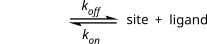
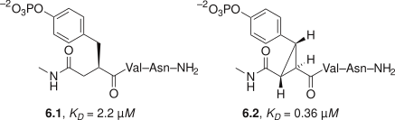
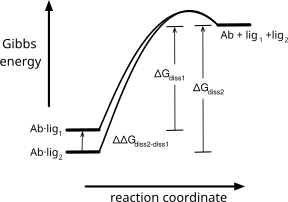

# Engineering Tighter Binding

© 2023-2026 Romas Kazlauskas. All rights reserved. Last revised: March 2026.

**Summary.** Tighter binding of proteins like antibodies to their target can increase the therapeutic effectiveness of biopharmaceuticals and lower the detection limits of diagnostic tests. Engineering a tighter-binding protein involves increasing the complementarity between the protein binding site and target. Both the shapes of the interacting surfaces and non-covalent interactions between them should match.

**Key learning goals**

- The relative stabilities of the bound state, where the protein and ligand interact with each other, and unbound state, where the protein and ligand interact with water, determine the strength of binding. Non-covalent interactions between the binding site and ligand favor the bound state, while solvation of the binding site and ligand favors the unbound state. 
- Equilibrium dissociation constants, $K_d$, which have units of molarity, reveal the binding strength. $K_d$ corresponds to the target concentration where half of the protein is bound to a ligand. Lower dissociation constants indicate tighter binding. Equilibrium dialysis is one technique to measure equilibrium dissociation constants.
- Increasing the affinity of a protein for a ligand requires increasing the shape and interaction complementarity between the two partners. Close contact between the surfaces creates non-covalent interactions including van der Waals interactions, hydrophobic interactions, electrostatic interactions, and hydrogen bonds. The high cost of desolvating polar groups often makes burying them at the binding-site-ligand interface unfavorable even when they make favorable interactions like hydrogen bonds.
- Binding selectivity is the ability of a protein, often an antibody or receptor, to distinguish between two ligands. Binding selectivity depends on the ratio of the equilibrium association constants for the two binding possibilities.

> I am always doing what I can’t do yet in order to learn how to do it. — Vincent van Gogh

## Introduction

Tighter binding of a protein to its ligand is a common goal of protein engineering.[@bantaReplacingAntibodiesEngineering2013] A ligand is any species (usually a small organic molecule, an ion, a protein or an oligonucleotide) that binds selectively, stoichiometrically and reversibly to a protein. Increased binding of a diagnostic antibody to its antigen can lower detection limits (e.g., a pregnancy test could detect pregnancy earlier), while increased binding of a therapeutic antibody can decrease drug dosage or increase drug efficacy. Traditional methods to improve the binding of antibodies rely on the natural processes that generate antibodies. Mice are immunized with the antigen followed by screening for antibodies with higher affinity. These in vivo methods, called affinity maturation, reach a limit where affinity stops increasing due to biological limits of the innate immune system. A common protein engineering goal is improving the affinity of an antibody from good binding to great binding. Figure @fig-define_antibody defines the different parts of an antibody. 

![Antibodies consist of four protein chains: two identical heavy chains ($\sim \! 440$ aa each) and two identical light chains ($\sim \! 220$ aa each). Disulfide bonds connect the two heavy chains to each other and the light chains to their neighboring heavy chain. Antibodies contain two antigen-binding sites, each composed of the tips of the light and heavy chains. One of the two antigen binding sites is circled. Treatment with proteases cleaves both heavy chains as marked into three fragments: two Fab fragments (Fragment antigen-binding) and one Fc portion (Fragment crystallizable). The two protein chains that make up the Fab and Fc fragment remain linked to each other via disulfide cross links.](figures/chapter6/define_antibody.svg){#fig-define_antibody width=150 fig-alt="Y-shaped antibody diagram labeling two heavy chains and two light chains linked by disulfide bonds, with an antigen-binding site at each of the two upper tips. A dashed line marks where proteases cleave the antibody into two Fab fragments and one Fc fragment."}

The strength of binding a ligand to a protein depends on the equilibrium between the bound and unbound states, Figure @fig-binding_equilib. In the bound state the protein and ligand interact with each other, while in the unbound state they interact with solvent. Stronger non-covalent interactions with each other as compared to solvent favors binding. 

{#fig-binding_equilib fig-alt="Reaction scheme showing a site-ligand complex in equilibrium with free site and free ligand, with rate constants k_on and k_off labeling the forward and reverse arrows."}

Two features influence the interactions between protein and ligand. First, the size and shape of the binding site in the protein must match the size and shape of the ligand. This match creates strong van der Waals interactions between them. Second, the chemical properties of regions within the binding site match those of ligand. Hydrophobic regions match and electrostatic interactions in polar regions are favorable. X-ray structures of antibody-antigen complexes reveal that 15-20 amino acids from the complementarity determining region of the antibody contact the antigen. Most of the contacts are hydrophobic and both the antibody and antigen adjust their conformations slightly upon complex formation to maximize the strength of the interactions. In the perfect case, no adjustments would be necessary since the most stable conformations of both protein and antibody match each another exactly.

The two comparison states that determine ligand-protein binding strength are the unbound state where water solvates the independently diffusing ligand and protein and the bound state where the ligand and protein interact with each other, Figure @fig-delG_binding. The solvation of polar and charged atoms at the surface stabilize the unbound state. In addition, the ability of the ligand and protein to diffuse independently in solution favors the unbound state. In contrast, the ordering of water at exposed hydrophobic regions of the protein and ligand destabilizes the unbound state as do unfavorable electrostatic interactions in high net charge regions.

{#fig-delG_binding fig-alt="Gibbs energy diagram showing the Ab·Ag complex at low energy and the dissociated Ab + Ag species at higher energy, separated by a barrier. The energy gap, ΔG°_d, equals −RT ln(K_d/1M); a smaller gap ΔΔG°_d indicates additional stabilization of the bound complex."}

In contrast, the bound state is stabilized by van der Waals attraction between touching atoms of the ligand and protein due to shape complementarity, the release of ordered water from hydrophobic regions of ligand and protein, electrostatic interactions between oppositely-charged atoms, and hydrogen bond formation between protein and ligand.
The bound state is destabilized by desolvation of buried polar and charged atoms, electrostatic interactions between like-charged atoms, and the loss of independent diffusion for ligand.

Increasing binding requires increasing the energy difference between the bound and unbound states by stabilizing the bound state, destabilizing the unbound state or both. For example, one could destabilize the unbound state by adding exposed hydrophobic surface or high net charge regions within ligand-binding region. Ligand binding can alleviate this destabilization by binding a complementary hydrophobic surface or opposite charges. This alleviation of the destabilization when the ligand binds is critical to the success of this approach. If the destabilization persists in the bound state, then both states will have been destabilized and the binding strength will remain unchanged. Thus, the destabilizing changes must influence the ligand-binding region so that binding can alleviate the destabilization. One can stabilize the bound state relative to the unbound state by increasing the shape and charge complementarity between the protein and ligand stabilizes the bound state, while having little effect on the unbound state. 

In all cases one must consider the effect of change to both the bound and unbound states. For example, engineering a hydrogen bond between the ligand and protein comes at the cost of reduced solvation of the polar atoms involved in the hydrogen bond. If the hydrogen bond is solvent accessible, then it remains solvated in the bound state and is often stabilizing. In contrast, buried hydrogen bonds are usually destabilizing because the cost of desolvating the polar atoms exceeds the gain from the hydrogen bond. 

## Measuring binding

**Defining binding strength.** The strength of binding is measured by the equilibrium constant for the reverse reaction, the ligand dissociation equilibrium constant, $K_d$, Figure @fig-binding_equilib and eq. @eq-define_Kd. For tighter binding, the dissociation equilibrium constant should be more unfavorable, so lower values of $K_d$ indicate tighter binding. $K_d$ has the units of molarity. 

$$ K_d = \frac{k_{off}}{k_{on}}=\frac{[site]\cdot [ligand]}{[site\cdot ligand]}$$ {#eq-define_Kd}

The value of $K_d$ corresponds to the free ligand concentration when half of the sites contain a bound ligand and the other half are empty, eq @eq-half_sites. Starting from eq. @eq-define_Kd, when concentration of empty sites, [site], equals the concentration of filled sites, [site·ligand], these two terms cancel in eq. @eq-define_Kd yielding eq. @eq-half_sites. 

$$K_d = [ligand] \text{ when } [site] = [site\cdot ligand]$$ {#eq-half_sites}

Antibody-antigen complexes are common cases of protein-ligand binding. For example, the mouse monoclonal antibody called 26-10 binds digoxin with high affinity. Digoxin, a hydrophobic steroid with an attached carbohydrate, is used to treat congestive heart failure. Anti-digoxin antibodies have been used to measure serum levels of digoxin and also to neutralize digoxin in cases of an overdose. Since antibody 26-10 contains two independently-acting binding sites for digoxin, the concentration of sites is twice the concentration of antibody. Antibody 26-10 binds digoxin very tightly ($K_d = 10^{–10} M$) and is half-saturated with digoxin when the concentration of free digoxin is $10^{–10} M$ (only 100 picomolar).

To convert the equilibrium constant in eq. @eq-define_Kd into a Gibbs energy, one introduces the notion of a reference state. The purpose of the reference state is to cancel out the molarity unit on the equilibrium constant since one can only apply the logarithm function to dimensionless quantities. The standard reference state is 1 _M_ and the value of $K_d$ is divided by this reference yielding a dimensionless quantity, eq. @eq-define_Gibbs_diss. 

$$\Delta G^{o}_{d} = –RT\ln(K_d /1 M)$$ {#eq-define_Gibbs_diss}

The values of $K_d$ for stable protein-ligand binding interactions are always less than 1 M, so the ratio $K_d/1 M$ is always less than one. The logarithm of a value less than one is negative, so the Gibbs energy for dissociation, $\Delta G^{o}_{d}$, eq. @eq-define_Gibbs_diss, is positive indicating that dissociation is unfavorable. The ‘o’ superscript on the $\Delta G^{o}_{d}$ indicates that the $K_d$ is compared to a reference state of 1 _M_. The free energy of dissociation of the digoxin-antibody 26-10 complex, $\Delta G^{o}_{d}$, is +14.2 kcal/mol indicating that dissociation is highly unfavorable.

The Gibbs energy diagram shows that dissociation of an antibody-antigen complex is unfavorable, Figure @fig-delG_binding above. To improve binding one seeks to make dissociation even more unfavorable. This approach is analogous to stabilizing a protein by makeing the unfavorable unfolding reaction even more unfavorable in the previous chapter.

**Measuring $K_d$.** One method to measure the strength of binding between a protein like an antibody, and a ligand (or antigen) is equilibrium dialysis. The antigen equilibrates between two compartments separated by a dialysis membrane, Figure @fig-equilib_dialysis. The small pore diameter of the dialysis membrane allows the antigen to pass through, but not the antibody. At equilibrium, both compartments contain equal amounts of free antigen, but the antibody-containing compartment contains additional antigen as an antibody-antigen complex.

![Measuring ligand (antigen) binding to an antibody by equilibrium dialysis. A dialysis membrane (dotted line) separates two compartments. Top row shows a control experiment without antibody. The ligand (twenty black circles) that is initially added to the right compartment distributes equally between both compartments (ten in each) because it passes freely through the membrane. Bottom row shows an experiment with antibody (Y-shapes) in left compartment. The dialysis membrane retains the antibody in its compartment. At equilibrium, both compartments contain the same concentration of free ligand (eight in each), but the antibody-containing compartment additionally contains antibody-bound ligand (four bound to the Y-shapes). The difference in the number of ligand molecules in the two compartments is the number of ligand molecules bound to antibody.](figures/chapter6/equilib_dialysis.svg){#fig-equilib_dialysis width=500px fig-alt="Six-panel diagram of an equilibrium dialysis experiment. Top row (no antibody): a membrane separates two compartments; ligand added to one side (initial) diffuses freely until both compartments hold equal ligand concentrations (equilibrium), shown as converging concentration-versus-time curves. Bottom row (with antibody): the antibody, confined to one compartment by the membrane, binds some ligand, so at equilibrium free ligand concentration is equal on both sides but the antibody-containing compartment also holds bound ligand; the concentration-time plot shows the two curves converging to different plateaus, with the difference indicating the amount of ligand bound to antibody."}

Measuring the equilibrium dissociation constant involves a series of equilibration experiments with different antigen concentrations. At lower concentrations of Ag, less Ab·Ag complex will form. The molar amount of antigen is always in excess of antibody. Since the equilibrium dissociation constants are very low, these experiments may require detecting very low antigen concentrations. For example, measuring the affinity of antibody 26-10 for digoxin requires measuring digoxin concentrations in the range of 100 picomolar.

Each equilibration experiment yields a ratio, Y, of sites complexed with ligand compared to the total number of sites. The concentration of sites complexed with ligand is the difference in the ligand concentrations between the antibody-containing and the antibody-free compartments, eq @eq-define_Y. The total concentration of sites is known from the amount of antibody added to the experiment. For the example in Figure @fig-equilib_dialysis above, four of the binding sites are occupied by ligand and the total number of sites is eight, so Y = 4/8 = 0.5.

$$Y = \frac{\text{sites complexed with ligand}}{\text{total sites}} = \frac{[site \cdot ligand]}{[site]+[site \cdot ligand]} $$ {#eq-define_Y}

Plotting the measured fraction saturation, Y at different concentrations of ligand as a function of free ligand on the x-axis yields a saturation binding curve, Figure @fig-bind_plot. The sites become saturated with ligand as the concentration of free ligand increases. 

{#fig-bind_plot width=200px fig-alt="Scatter plot of fraction of antibody sites bound (Y) versus free ligand concentration (0–1 mM), following a hyperbolic saturation curve described by Y = [Ag]/(0.075 mM + [Ag]). Y reaches 0.5 at the dissociation constant, Kd = 0.075 mM, and approaches 1 at high ligand concentration."}

Equation @eq-binding_saturation defines the relationship between Y, the free ligand concentration and the equilibrium dissociation constant, $K_d$. At half-saturation, Y = 0.5, the free ligand concentration equals the equilibrium dissociation constant, 0.075 mM for this example.

$$ Y = \frac{[ligand]}{K_d + [ligand]}$$ {#eq-binding_saturation}

This equation is derived by rearranging eq @eq-define_Kd to define the concentration of free sites, eq @eq-rearrange_define_Kd, and substituting it into eq @eq-define_Y above. 

$$ [site] = \frac{K_d \cdot [site \cdot ligand]}{[ligand]}$$ {#eq-rearrange_define_Kd}

Finding $K_d$ from the data in Figure @fig-bind_plot involves adjusting the value of $K_d$ so that the eq @eq-binding_saturation best fits the experimental data.[^fn1]

Another way to measure the binding of a ligand to a protein is fluorescence polarization.[@rossiAnalysisProteinligandInteractions2011] This method requires a fluorescent ligand, but does not require the two-compartment apparatus needed for equilibrium dialysis. The solution of ligand plus protein is irradiated with plane-polarized light to excite the fluorescent ligand. The emitted light (fluorescence) from the ligand is measured both parallel and perpendicular to the plane of the irradiated light. If the ligand does not turn during the few nanoseconds between the absorbtion and emission of light, then most of the light will be emitted parallel to the plane of the irradiated light. However, it the ligand turns during the few nanoseconds between the absorption and emission of light, then less of the light will be emitted parallel to the plane of the irradiating light. A ligand free in solution tumbles rapidly, but a ligand bound to a macromolecule tumbles more slowly. Fluoresence polarization detects whether a ligand is bound or not by measuring how much of the emitted light is parallel to the plane of irradiated light.

One can extend this method to also measure the binding of non-fluorescent ligands by adding the fluorescent ligand and a competing non-fluorescent ligand simultaneously. The non-fluorescent ligand competes with the fluorescent ligand for the protein binding site. Measuring the decrease in binding of the fluorescent ligand a varying concentrations of the non-fluorescent ligand reveals the relative strength of the two ligands. Since the binding strength of the fluorescent ligand is known, the binding strength of the non-fluorescent ligand can be calculated. 

Practical details on binding measurements are available.[@pollardMBOCTechnicalPerspective2010] Other ways to measure binding include surface plasmon resonance and isothermal titration calorimetry. 

Increasing binding strength requires increasing the difference in energy between the bound and unbound states. Engineering the antibody for tighter binding lowers the Gibbs energy of the Ag·Ab complex, raises the Gibbs energy of free Ag and Ab or both. The value of $\Delta G^{o}_{d}$ measures improvement of binding, Figure @fig-delG_binding. This value is the difference in the Gibbs energy change for the two dissociation reactions, eq @eq-improvement.

$$
\begin{split}
\Delta\Delta G^{o}_{d} & = \Delta G^{o}_{d-new} - \Delta G^{o}_{d-original} \\ 
& = - RT\ln \left ( \frac{K_{d-new}}{K_{d-original}} \right ) = –RT\ln(improvement factor)
\end{split}
$$ {#eq-improvement}

Tighter binding corresponds to a larger positive Gibbs energy of dissociation for the improved variant and thus a positive value of $\Delta G^{o}_{d}$. The value of $K_{d-new}$ is a smaller (dissociation less favorable) than $K_{d-original}$, so $\left ( \frac{K_{d-new}}{K_{d-original}} \right )$ is a value less than 1. For example, equilibrium dissociation constant may decrease from $10^{-6} M$ in the original to $10^{-8} M$ in the engineered case. The improvement factor is $10^{–2}$ and $\ln \left ( \frac{K_{d-new}}{K_{d-original}} \right )$ is –4.61. Then $- RT\ln \left ( \frac{K_{d-new}}{K_{d-original}} \right )$ is +2.73 kcal/mol at 298 °K.

## Engineering tighter binding

Engineering tighter binding involves modification of the antibody binding site to increase the complementarity between the antibody and antigen, Table @tbl-strategies_bind. The first requirement of a binding site is that its size and shape must match the size and shape of the target ligand. This matching excludes solvent water by placing ligand atoms near binding-site atoms to create the opportunity for favorable interactions. The second criteria is that the binding site be preorganized for binding, that is, that the lowest energy conformation be the one that binds the ligand. The remaining criteria refer to optimizing different types of non-covalent interactions: hydrophobic interactions, hydrogen bonds and electrostatic interactions.

| Strategy | Reasoning |
|---|---|
| size and shape matching | creates favorable van der Waals interactions<br>minimizes bumping<br>releases bound water<br>allows direct interactions |
| preorganization | binding conformation favored even before binding<br>no rearrangement needed for binding |
| hydrophobic matching | increases hydrophobic effect |
| optimize H bonds | compensates for loss of H bonds to solvent<br>avoids buried H bonds due to poor solvation |
| optimize electrostatics | minimizes interactions with like charges<br>maximizes interactions with unlike charges |

: Strategies to increase non-covalent interactions between protein and ligand. {#tbl-strategies_bind}

**Size and shape matching.** Matching the size and shape of the protein binding site to the target ligand maximizes their contact surface in order to maximize favorable non-covalent interactions, Figure @fig-size_shape_mismatch. Size matching ensures that all of the ligand interacts with the binding site. If the cavity is too large or too small, then part of the ligand remains exposed to solvent and the interaction between ligand and binding site will be less than the maximum possible. Shape matching refers to the surface contours of the ligand and binding site. Surface complementarity means the surfaces touch to create favorable van der Waals interactions. The close contact also makes additional non-covalent interactions between the ligand and binding site possible.

![To maximize interactions with the target ligand (isopropyl side chain) the binding site must be the same size as the ligand and the contours of the binding site must match the shape of the ligand. a) A binding site that is larger or smaller than the ligand leaves part of the ligand exposed to solvent, which misses opportunities for interactions between ligand and binding site. b) Shape mismatches between the target ligand and contours of the binding site create repulsive interactions in regions where the binding site is too small and an inability to make favorable interactions in regions where the binding site is to large to contact the ligand.](figures/chapter6/size_shape_mismatch.svg){#fig-size_shape_mismatch width=400px fig-alt="Two diagrams illustrating binding-site mismatches with an isopropyl-containing ligand. a) Size mismatch: an oversized binding pocket leaves the ligand partly exposed to solvent water instead of fully enclosed. b) Shape mismatch: a binding site whose contours don't match the ligand creates a region of steric repulsion and a gap too far apart to interact favorably."}

The intricate shapes of molecules prevents most of the atoms in two contacting molecules to directly contact one another. The sphere representation of a molecule shows its van der Waals surface. The radius of each sphere is the van der Waals radius for the atom and the overlapping spheres show the van der Waals surface of the molecule, Fig @fig-dig_solvent_contact_surface. This surface is intricate and includes narrow crevices too small to fit a water molecule. A water molecule cannot touch the regions within these crevices and a larger molecule will be excluded from even more regions. The *solvent contact surface* is a hypothetical smoother surface that eliminates crevices that are inaccessible to water. The solvent contact surface is the surface mapped by the edge of sphere with a radius of 1.4 Å as it rolls on the van der Waals surface of a molecule. The radius of 1.4 Å corresponds to the van der Waals radius of a water molecule. This surface shows smooth areas where the water molecule rides over the van der Waals surface as well as regions of protruding atoms where the water can directly touch the molecule.[^fn2] 

![Structure of digoxin (digitalis), a cardiac glycoside.[^fn3] Left: The chemical structure of digoxin consists of a steroid (the aglycone) linked to a trisaccharide. The two sugar moieties in gray are not included in the two structures to the right. Middle: The overlapping van der Waals spheres of each atom create the van der Waals surface of digoxin. It contains numerous crevices that are too small to fit a water molecule. A water molecule would be slightly larger than one of the oxygen atoms shown as red spheres. Right: The solvent contact surface of digoxin is a hypothetical surface that shows the closest approach of a water molecule. Water can directly contact only a small fraction of the van der Waals surface. ](figures/chapter6/dig_solvent_contact_surface.svg){#fig-dig_solvent_contact_surface width=400 fig-alt="Three representations of digoxin. Left: skeletal structure of the steroid (aglycone) with a trisaccharide of three sugar rings attached at O5, plus hydroxyl groups at C12 and C14. Middle: space-filling van der Waals model of the same molecule, colored by atom (gray carbon, red oxygen), with narrow crevices visible between overlapping spheres. Right: the smoothed solvent contact surface of the same molecule, colored red where oxygen atoms are close enough for a water molecule to touch them directly, showing that only a small fraction of the molecule's polar surface is actually solvent-accessible."}

The majority of the surface atoms, even for highly complementary molecules, will not contact one another. The intricacy of molecular structures make complete direct contact geometrically impossible. Good complementary shapes will exclude solvent water from the interface and make many direct contacts. 

An example of high surface complementarity is the interaction between antibody fragment 26-10 complexed with digoxin,[@jeffrey2610FabdigoxinComplex1993] Figure @fig-26-10_digoxin. The structure of 26-10 shows a deep pocket that surrounds the hydrophobic steroid portion. The hydrophilic carbohydrate groups of digoxin remain exposed to solvent and do not contribute to binding. The complementarity between the solvent-accessible surface of the aglycone (compound without the glycoside moiety) of digoxin and 26-10 is imperfect, even in regions that are in contact. The shape complementary is close enough that there are no buried cavities in the complex that are large enough to contain a water molecule. This exclusion of water ensures a strong contribution of the hydrophobic effect to the binding. There are some regions exposed to the bulk water that are large enough to contain water molecules. The conformations of antibody and steroid remain the same in both unbound and bound states indicating that the low energy unbound shapes match each other.

Fragment 26-10 binds digoxin tightly, $K_d = 0.1$ nM. The binding is entirely due to the hydrophobic effect and van der Waals interactions. No hydrogen bonds or salt bridges form between antibody fragment 26-10 and digoxin. One consequence of the lack of interactions with the hydroxyl groups at C12 and C14 is a lack of selectivity for analogs without these hydroxyl groups. For example, 26-10 binds digitoxigenin (which lacks the hydroxyl group at C12) with equal affinity to digoxigenin.[^fn4]

![The binding pocket of antibody fragment 26-10 (mesh surface, backbone shown as a cartoon) binds the steroid digoxin (spheres) by creating a complementary surface. a) The two terminal saccharides extend into solvent and were not resolved in this structure. b) A top view shows close contact between the 26-10 and the aglycone in several parts, but much of the 26-10 surface does not directly contact the aglyclone. The figure was created using PyMOL from the x-ray crystal structure of the complex (pdb id = 1igj [@jeffrey2610FabdigoxinComplex1993]). The surface of the antibody pocket was calculated using the web tool CASTp[@tianCASTpComputedAtlas2018]](figures/chapter6/26-10_digoxin.svg){#fig-26-10_digoxin width=400px fig-alt="Two PyMOL views of antibody fragment 26-10 (cyan cartoon and mesh solvent-accessible surface) bound to digoxin (gray and red spheres). a) Wide view showing digoxin's steroid portion nested in a deep binding pocket formed by the antibody's complementarity-determining loops. b) Close-up showing the digoxin surface making close, complementary contact with the mesh-rendered binding-site surface, illustrating high shape complementarity between ligand and antibody."}

Sculpting a complementary surface will likely require multiple mutations and involve readjustment of the main chain and side chains. The smallest change that one can introduce by amino acid substitutions is the addition or removal of a methyl or hydroxyl group. This is a large change - about the size of a water molecule - and likely too large to precisely sculpt a surface. To make smaller changes one needs to make multiple substitutions including substitutions outside the surface being engineered so that a succession of adjusted positions make more subtle changes to the complementary surface. Precisely predicting the adjustments caused by multiple substitutions is more difficult making such sculpting difficult. 

Substitutions often introduce readjustments of the main chain and side chains. A larger side chain causes readjustments when it bumps into nearby atoms. A smaller side chain may also cause readjustments because enlarging a hydrophobic pocket is unfavorable. Replacing a large buried hydrophobic side chain with a smaller one destabilizes the protein because the smaller hydrophobic surface 1) reduces the contribution of the hydrophobic effect to protein folding and 2) reduces the favorable van der Waals contacts between the side chain and the rest of the protein. Structural readjustments often decrease the size of the created space to minimize these changes. The estimated decrease in stability due to removing one buried CH$_2$ group is 1.1 ± 0.5 kcal/mol.[@paceForcesStabilizingProteins2014] For example, a Leu to Ala substitution removes three carbon atoms from the protein, so this substitution decreases protein stability by an estimated 3.3 ± 1.5 kcal/mol. If the protein structure readjusts, the destabilization will be at the smaller end of the estimate range, while if the structure does not readjust, it will be at the larger end of the estimated range. For example, a Leu to Ala mutation in T4 lysozyme destabilized the protein by 5.0 kcal/mol at position 99, but by only 2.7 kcal/mol at position 46. The x-ray structures revealed that at position 99 the structure did not readjust upon substitution leading to a larger cavity and a larger loss in van der Waals interactions, while at position 46 the structure relaxed leading to a smaller increase in the cavity size and a smaller loss in the van der Waals interactions.[@erikssonResponseProteinStructure1992]

In a few cases, readjustments of the nearby residues reverse the intended change in size. For example, an ancestral hydroxynitrile lyase contains phenylalanines at positions 121 and 178 in the active site, while the corresponding modern enzyme from the rubber tree contains smaller leucines at these positions. One would expect that the substrate-binding site of the rubber tree enzyme would be larger, but the x-ray structures showed the opposite. In the rubber tree enzyme the side chain of Trp128 readjusts into the active site creating a smaller substrate binding site,[@jonesLargerActiveSite2020] which is the opposite of what might be expected from comparison of the sizes of phenylalanine and leucine. 

**Preorganization.** Preorganization of a dynamic protein means creating a global energy minimum conformation where the atoms in the apo protein are already oriented to interact with the partner atoms in the ligand. In the ideal case, this conformation has the correct structure with a minimum of flexibility. It must have the correct structure to avoid the energy cost of moving the protein atoms from their most stable postions into the less stable interacting positions. This energy cost lowers the overall favorability of the binding. Flexibility of the apo protein also creates an energy cost. If protein flexibility decreases in the protein-ligand complex, then there is an entropy cost to binding, which also lowers the favorability of binding. Thus, the preorganized apo protein should be no more flexible than the protein-ligand structure.

Binding sites exist as an equilibrium mixture of non-binding and binding conformations, eqs. @eq-preorg and @eq-preorg_Keq. The equilibrium constant (or the Gibbs energy) between the binding and not-binding conformations measures the propensity of the binding site to be preorganized for binding. It is convenient to express this equilibrium as the probability  that the binding site is in a binding conformation, eq. @eq-preorg_probability, which is a value between 0 and 1. For example, if the equilibrium constant is 10 in favor of the binding conformations, then the probability that the binding site exists in a binding conformation is 10/11 = 91%. This probability is sometimes called the Boltzmann factor or Boltzmann weight. 

$$\text{non-binding conf.} \xrightleftharpoons{K_{eq}} \text{binding conf.}$$ {#eq-preorg}

$$ K_{eq} = \frac{\text{[binding conf.]}}{\text{[non-binding conf.]}}$$ {#eq-preorg_Keq}

$$ \text{probability} = \frac{\text{[binding conf.]}}{\text{[non-binding conf.]} + \text{[binding conf.]}} = \frac{K_{eq}}{1+K_{eq}} $$ {#eq-preorg_probability}

Preorganization excludes stable non-binding conformations of the binding site, Figure @fig-preorg_bind. These conformations hinder binding because they trap the binding site into a non-binding conformation. The binding site must first escape the trap, then bind the ligand, which lowers the binding interaction by the amount needed to escape the trap. The non-binding, low energy conformation stabilizes the unbound state by $\Delta \Delta G_{preorg}$, thereby reducing the Gibbs energy of dissociation for the complex.

![Preorganization excludes stable, non-binding conformations of the protein. a) When a protein is preorganized for binding, the binding site conformation in the ligand-free state has the same conformation as in the ligand-bound state. b) When the protein is not preorganized for binding, the protein exists in lower energy conformations that cannot bind the ligand. Binding requires the protein to first shift to a higher energy binding conformation. The cost of shifting to the binding conformation lowers the overall binding energy by $\Delta \Delta G_{preorg}$.](figures/chapter6/preorg_bind.svg){#fig-preorg_bind width=300 fig-alt="Two Gibbs energy diagrams comparing a preorganized versus a non-preorganized protein binding site. a) Preorganized: the protein's lowest-energy free state already has the binding-competent conformation, so the full energy gap ΔG_d,preorg_case is available for binding. b) Not preorganized: the protein's lowest-energy free state is a non-binding conformation; reaching the binding-competent conformation costs extra energy ΔΔG_preorg, which subtracts from the binding energy, leaving a smaller net ΔG_d,non-preorg_case."}

Constraining a flexible ligand into the three-dimensional shape it adopts when bound to a receptor often strengthens the binding interaction. For example, the phosphotyrosine-containing pseudopeptide **6.1**, Figure @fig-less_flex_ligand, bound tightly to the SH2 domain of a growth receptor binding protein, $K_D = 2.2 \: \mu M$. Introducing a cyclopropyl ring to create compound **6.2** restricted the flexibility of the ligand so that its structure matches the bound conformation. The binding interaction tightened to $K_D = 0.36 \: \mu M$.[@delorbeThermodynamicStructuralEffects2009] Similar improvements are expected by restricting the flexibility of the binding site.

{#fig-less_flex_ligand width=300 fig-alt="Chemical structures of two phosphotyrosine-containing pseudopeptides that bind an SH2 domain. Compound 6.1 has an open-chain linker (KD = 2.2 μM); compound 6.2 has the same backbone constrained by a fused cyclopropane ring (KD = 0.36 μM), showing that restricting ligand flexibility improves binding affinity roughly six-fold."}

The preorganized protein structure for binding refers to both side chain and backbone orientations. The side chains must point in the correct direction to interact with the ligand, while the backbone must position these side chains at the correct distances. Incorrect backbone positions create binding sites that are too large or too small for the ligand. For example, a molecular dynamics simulation of digoxigenin-binding proteins found that favored conformation of the non-binding proteins was too large to interact with the entire digoxigenin surface due to incorrect backbone positions.[@barrosImprovingEfficiencyLigandbinding2019]

**Hydrophobic matching.** Besides matching the shape of the ligand and binding site to maximize van der Waals interactions, matching additional non-covalent interactions further strengthens the interaction. For example, matching hydrophobic regions of the ligand and binding site avoids unsatisfied polar interactions. The structure of antibody fragment bound to methamphetamine showed a bound water molecule facing a hydrophobic region of the methamphetamine antigen.[@thakkarAffinityImprovementTherapeutic2014] Researchers hypothesized that releasing this water molecule would increase the hydrophobic character of the binding pocket and increase binding. Replacement of SerH93, which formed a hydrogen bond to the water molecule, with the slightly larger residue threonine increased the binding affinity 3.1-fold from $K_d$ = 0.79 to 0.25 nM. A crystal structure of the improved variant confirmed that this substitution forced out the water molecule. 

**Optimize hydrogen bonds.** Hydrogen bonds between the binding site and ligand come at the cost losing hydrogen bonds to solvent and desolvation of the hydrogen bonding partners. Buried hydrogen bonds are rarely favorable, but solvent-exposed hydrogen maintain solvation so are more likely to be favorable. Hydrogen bonds often contribute to selectivity of binding.

**Electrostatic interactions.** Electrostatic interactions can contribute to the tighter binding of the protein and ligand in two ways. One way is to directly stabilize the protein-ligand complex; the other way is to speed up the formation of this complex, Figure @fig-electrostatic_steer. 

{#fig-electrostatic_steer width=250px fig-alt="Two diagrams of electrostatic charge patterns at a protein surface and ligand. a) A binding partner with mixed, low net charge sits directly against a complementary charge pattern on the protein. b) A protein surface with net negative charge and a ligand with net positive charge are drawn together by long-range electrostatic attraction (gray arrows) before they make direct contact, illustrating electrostatic steering of the binding approach."}

Direct stabilization of the protein-ligand complex refers to favorable interactions between oppositely charged atoms in the protein-ligand complex after it has formed. For example, improved electrostatic interactions increased the binding of monoclonal antibody hu3F8 (naxitamab) to the surface of cancer cells ~7-fold.[@zhaoAlterationElectrostaticSurface2015] The antibody binds to two negatively charged sialic acid groups on glycolipid ganglioside GD2. An Asp32His substitution replaced a negatively charged amino acid residue with a positively charged one just outside the binding site. Computer modeling predicted ~0.5 kcal/mol improvement in electrostatic interaction with the sialic acid groups in good agreement with the measured increase in binding. In another example, computer modeling predicted five substitutions that could strengthen electrostatic interactions between epidermal growth factor receptor and an antibody targeted to it (cetuximab, Erbitux®). Experiments confirmed that three of the five increased binding affinity. Substitutions Ser26Asp and Thr31Glu replaced polar residues with negatively charged residue, while Asn93Ala replaces a polar residue with an uncharged residue. All substitutions were in the antibody light chain. The combination of all three substitutions increased the binding 10-fold by decreasing $K_d$ decreased from 490 pM to 52 pM.[@lippowComputationalDesignAntibodyaffinity2007] The researchers noted that solvent-exposed electrostatic interactions and hydrogen bonds were more stabilizing than buried ones because they remain solvated. The loss of solvation energy made most buried electrostatic interactions and hydrogen bonds unfavorable.

Electrostatic interactions can also strengthen binding by long-range interactions that occur before binding occurs. Electrostatic steering increases binding strength by increasing the collision frequency between oppositely charged proteins and ligands, Figure {@fig-electrostatic_steer}b above. Binding requires the protein and ligand to bump into one another as they randomly move through the solution. Electrostatic forces alter the collision rates between molecules because they act over long distances, that is, beyond van der Waals contact distances (see Chapter 2). This longer range of electrostatic interactions effectively makes charged molecules larger when they interact with other charged molecules. Nearby oppositely charged molecules can move toward each other to make van der Waals contact, while uncharged molecules must meet within their van der Waals radii. This increase in the number of collisions between oppositely charged molecules increases the rate of association of protein and ligand and thereby strengthens the binding interactions. Increasing the electrostatic interaction between separated partners as compared to the complex by 1 kcal/mol increases the association rate by a factor of 2.8.[@selzerRationalDesignFaster2000] Charges that steer partners toward each other may also contribute to stronger binding after the complex forms. In contrast, partners with low net charge will not be steered even though they form favorable electrostatic interactions after binding.

To engineer such an increase, one increases the charge difference between the protein and ligand. For example, Selzer and coworkers[@selzerRationalDesignFaster2000] increased the affinity between β-lactamase (negative net charged) and its inhibitor (no net charge) 250-fold by giving the inhibitor a positive net charge. Four substitutions increased the positive charge by six units. A web tool predicts the increase in association rate upon mutagenesis: <https://webhome.weizmann.ac.il/home/bcges/PARE.html>.

The components of binding Gibbs energy, ΔH and −TΔS, do not map simply onto specific molecular events, making mechanistic interpretation challenging. Enthalpy (ΔH) reflects the balance of non-covalent interactions formed and broken during binding. Favorable contributions (−ΔH°) arise from hydrogen bonds, van der Waals contacts, and electrostatic interactions between protein and ligand. Unfavorable contributions (+ΔH°) result from desolvation penalties—breaking hydrogen bonds between the ligand and water, and between binding site residues and water. The observed ΔH° is the net sum of these competing effects.

Entropy (-TΔS°) reflects changes in the number of accessible microstates of the system. Unfavorable contributions (−ΔS°) include loss of translational and rotational freedom when the ligand binds, and loss of conformational flexibility in both protein (side chain immobilization, induced fit) and ligand (freezing of rotatable bonds). Favorable contributions (+ΔS°) primarily arise from release of ordered water molecules from the binding site and ligand surface into bulk solvent—the hydrophobic effect. Additionally, protein conformational changes may sometimes increase local disorder.

The observed Gibbs energy of binding represents the net balance of all these opposing entropic and enthalpic terms, complicating direct assignment to specific binding mechanisms.

## Computational design of tighter binding

**Docking models protein-ligand complexes.** Designing improved binding interactions relies on computer modeling of the interactions. An accurate structure of the ligand complexed to the binding protein is the best starting point for computer modeling, but such structures are rarely available. Protein-ligand docking is a molecular modeling technique to create a model of a protein-ligand complex from a structure of the binding protein. SwissDock is a web tool for protein-ligand docking.[@bugnonSwissDock2024Major2024] The most common application of docking is drug design, but it is also useful for protein design. Docking predicts where the ligand binds to the protein, the geometry of the bound ligand and the strength of the binding interaction.

As with all protein modeling, the two challenges are sampling and scoring. Sampling finds possible binding locations, orientations and conformations. Scoring evaluates and ranks these possibilities to identify the best ones. If the sampling does not generate the best-binding structure, then scoring cannot identify it.

For sampling, SwissDock uses an approach called Attracting Cavities.[@zoeteAttractingCavitiesDocking2016] It replaces the complex protein with a simplified set of points that represent attractive interactions with a protein cavity. This simplification eliminates bumping interactions from the protein atoms, which allows more efficient sampling of the conformations to find those that maximize the attractive interactions.

For scoring, SwissDock restores the protein structure and calculates the energies using the CHARMM force field, which is similar to AMBER and intended for modeling biological molecules. Solvation calculations use an implicit solvent model, which lacks individual solvent molecules. The energy contributions to scoring are the ligand-protein interaction energy, the conformational energy of the ligand and protein and the desolvation energy of the protein and ligand. The calculated energies are estimates of the Gibbs energy of binding.

SwissDock accurately reproduced the experimental structures (rmsd ≤2 Å) of 285 protein-ligand complexes in 73% of the cases.[@rohrigAttractingCavities202023] It performs best for ligands with limited numbers of possible conformations (≤10 rotatable bonds), and for binding orientations where most of the ligand surface (≥85%) interacts with protein. The conformations of large solvent-exposed regions of the ligand are difficult to predict accurately.

**Computational design of binding proteins.** Predicting substitutions that improve the affinity of a protein for a target ligand has shown some success, but remains challenging. Computational design using Rosetta predicted seventeen proteins that bind to the steroid portion of digoxin called digoxigenin.[@tinbergComputationalDesignLigandbinding2013] Two of these proteins showed micromolar affinity for the target, which is relatively weak affinity, but the ability to predict such proteins is an impressive accomplishment. Further optimization did not use computation, but directed evolution methods (see Chapters 6 and 7) and yielded proteins with picomolar affinity for digoxigenin. The designed protein included hydrogen bond interactions with the hydroxyl groups of digoxigenin, so it showed selectivity against analogs lacking these hydroxyl groups. 
Other computational design were even less successful. Morin et al.[@morinComputationalDesignEndo14betaxylanase2011] designed twelve possible binding sites in _endo_-1,4-β-xylanase for the antibiotic vancomycin, but none of the designs bound vancomycin. X-ray structure analysis of four designs showed the predicted conformation, but molecular dynamics showed that the designs were highly flexible. The authors suggest that the designed sites spent most of their time in conformations not suitable for binding.

## Selective binding

**Define selectivity.** Selectivity, S, is the ability to distinguish between alternatives. Binding selectivity is the ability of a protein to bind one ligand more tightly than another one, Figure @fig-delG_selective_binding. The selectivity value, S, is the ratio of the affinities of the protein for the preferred and non-preferred ligands. This value depends on comparison molecules, so they should always be included with the number. For many proteins, their ability of proteins to favor binding one ligand in the presence of competing ligands is what makes them valuable. For example, the cardiovascular antibody drug abciximab selectively binds to a receptor involved in platelet aggregation to inhibit formation of blood clots.

{#fig-delG_selective_binding width=300 fig-alt="Gibbs energy diagram comparing an antibody's binding of two competing ligands. Ab·lig2 is lower in energy (more stable) than Ab·lig1, so ligand 2 dissociates less readily (larger ΔG_diss2 versus ΔG_diss1); the difference between the two dissociation energies, ΔΔG_diss2-diss1, quantifies the antibody's binding selectivity for ligand 2 over ligand 1."}

The affinity of a protein for a ligand is given by the equilibrium association constant, $K_{as}$, for the binding reaction, eq @eq-affinity_rxn. It is the inverse of the dissociation constant defined in Figure @fig-binding_equilib above.

$$ \text{Ab + ligand} \rightleftharpoons \text{Ab·ligand} \quad K_{as} = \frac{\text{[Ab·ligand]}}{\text{[Ab]·[ligand]}} $$ {#eq-affinity_rxn}

Binding selectivity, $S_{bind}$, is the ratio of the affinities for the two protein-ligand complexes being compared, eq. @eq-def_bind_sel. By convention, the equilibrium association constant for the tighter-binding ligand, t, is in the numerator and that for the weaker-binding ligand, w, is in the denominator yielding binding selectivity values that are greater than one. The binding selectivity should also mention which ligands are being compared. A selectivity of ten corresponds to ten-fold tighter binding of one ligand as compared to the other ligand. A selectivity of one corresponds to no selectivity; that is, equal affinity for both.

$$S_{bind} = \frac{K_{as-t}}{K_{as-w}} = \frac{\frac{1}{K_{d-t}}}{\frac{1}{K_{d-w}}} = \frac{K_{d-w}}{K_{d-t}}$$ {#eq-def_bind_sel}
 
Binding selectivity can also be expressed in terms of the equilibrium constants for dissociation, which are the inverse of the equilibrium constants for association. The dissociation constant for the weaker-binding ligand is in the numerator while that for the tighter-binding ligand is in the denominator.The selectivity of an protein for two competing ligands can be measured by measuring each binding affinity separately, then dividing the two values. 

The Gibbs energy change associated with binding selectivity, eq. @eq-ddg_sel, is the difference between the Gibbs energy changes of the two association reactions. The Gibbs energy change is negative since association of the tighter-binding ligand is more favorable.

$$\Delta \Delta G_{S_{bind}} = \Delta G_{as-t} - \Delta G_{as-w} -RT \ln\left(\frac{K_{as-t}}{K_{as-w}}\right) = -RT \ln\left( S_{bind} \right) $$ {#eq-ddg_sel}

To engineer a protein for increased selectivity between a preferred and a non-preferred ligand, one can either decrease the affinity of the protein for the non-preferred ligand (negative selection) or increase the affinity of the protein for the preferred ligand (positive selection). The best approach will depend on the details of the application. 

## Glossary {-}

Boltzmann factor or weight
: is the probability that the binding site conformation when unbound is the same as that when it is bound. The Boltzmann factor is a way to measure the preorganization of a binding site for binding.

## References {-}

::: {#chapter-bibliography}
:::

## Supporting Information {-}

**Code Block S4.1.** Python script to fit data for an equilibrium dialysis experiment (Fig @fig-bind_plot)

```python
#! /usr/bin/env python
# coding: utf-8

# also run the command below in terminal
# sudo chmod +x file-name.py

import numpy as np               #import math functions to use arrays
from scipy import optimize       #import non-linear fit function
import matplotlib.pyplot as plt  #import plotting function

# enter your data here
freeAg = np.array([0.02, 0.05, 0.10, 0.2, 0.4, 0.6, 1])
Y = np.array([0.20, 0.37, 0.57, 0.74, 0.84, 0.93, 0.98])
Kd = 0.1 # initial guess for Kd

# define equation to be fit
def satCurve(freeAg, Kd):
	return freeAg/(freeAg + Kd)
	
# fit the data to the equation using non-linear least squares with
# default fit settings
popt, pcov = optimize.curve_fit(satCurve, freeAg, Y, Kd)
print("Kd =", "{0:.3f}".format(popt[0]))

# plot data and best fit curve
plt.scatter(freeAg, Y)
xfit = np.linspace(0,1)
plt.plot(xfit, satCurve(xfit, popt[0]), 'r-')
plt.xlim(0, 1)
plt.xlabel('free antigen concentration')
plt.ylabel('fraction of antibody containing bound antigen')
plt.show()
```

[^fn1]: Non-linear least squares fitting of eq. @eq-binding_saturation to the data starts with an initial guess for the dissociation constrant followed by iteration to find the best value. The supporting information includes a Python function for this fit.

[^fn2]: Another surface, the solvent accessible surface, or Connolly surface, lies 1.4 Å outside the solvent contact surface. This surface represents the center, not the edge, of a water molecule on the surface. The solvent accessible surface is more convenient in some cases because positions on this surface will match the x,y,z coordinates of the rolling water molecule.

[^fn3]: Charles Cullen, a nurse and serial killer convicted in 2003, used digitalis (and other drugs) to kill possibly forty hospital patients. This story and that of Amy Loughren, the ICU nurse who helped convict Cullen, is told in the book _The Good Nurse_ (2013), and a 2022 movie by the same title currently on Netflix.

[^fn4]: The -genin suffix on these two compounds indicates the aglycone only.

## Problems {-}

1. The equilibrium dissociation constant, $K_d$, of an antibody and its ligand (a peptide) is 5 $\mu M$ at pH 5.0 and 25 °C. 

	a) At what concentration of the ligand is half of the protein bound? 

	b) What fraction of the protein is bound at ligand concentration of 1.25 $\mu M$?

	c) When the pH was raised to 6.5, the $K_d$ increased to 20 $\mu M$. Is the binding tighter or weaker at this pH compared to pH 5.0? Explain why. 

	d) What functional groups/residues are most likely responsible for this change in the binding affinity with pH? 


\bigskip
The problems below use the experimental data from a paper reporting the design of a protein (DIG10.3) that tightly binds digoxigenin [@tinbergComputationalDesignLigandbinding2013] to test the ability of docking calculations, SwissDock [^fn5] to predict the affinity of a protein for a ligand. 

2. _Prepare the wt protein and Tyr34Phe variant for docking._ The x-ray structure of DIG10.3 (pdb id = 4J9A) contains 9 monomers in the unit cell. For simplicity, we will delete eight of these leaving only chain A. The structure also contains bound digoxigenin, which we will remove so that SwissDock can predict the binding position. Finally, we will save the modified file. Download this structure from the Protein Data Bank. Open the file with a text editor and read the notes at the beginning. In particular, note whether any amino acids are missing from the structure of chain A. Next, open the file using PyMOL. Enter the following commands on the input line (ignore comments after \#).

```
remove (not chain A) # deletes all chains except chain A
remove (resn DOG) # deletes residue named 'DOG'
save DIG103_A.pdb # saves your modified structure as a pdb file
```

The file is saved in your working directory, usually your home directory; mine is ‘/Users/romas’. Search to find the file, if needed. Next, create the Tyr34Phe variant using the instructions in Homework 1 (Wizard $=>$ Mutagenesis $=>$ Protein ...). Use the suggested default rotamer of the Phe replacement. The following commands may be helpful.

```
show sticks, resi 34 # shows Tyr34 so that you can select it
save DIG103_A_Y34F.pdb # saves file once you have made the substitution.
```

Additional troubleshooting: If SwissDock fails to verify your file of the mutated protein, check that your pdb file contains only the mutated protein. One student's file contained three proteins, not one. Open your file in a text editor. Check to see that a line that reads 'TER' occurs only once in your file and that it is the penultimate line. If you find ‘TER’ more than once, you must delete both the extra 'TER' and the atoms associated with that extra protein. Your file should contain 905 atoms and the last four lines of your file should read: 

ATOM    904  O   ARG A 123       0.634 -10.220   7.065  1.00 48.12           O  

ATOM    905  CB  ARG A 123       3.588  -8.274   5.874  1.00 50.26           C  

TER   

END

\bigskip

3. _Docking with default settings._ Submit the calculation to dock digoxigenin to the wild-type protein and to the Tyr34Phe variant at <https://www.swissdock.ch/>. Leave the default ‘Docking with Attracting Cavities’ selected. In section 1 - Submit a ligand, click on advanced search and enter ‘digoxigenin’, then click on the digoxigenin structure and click apply. This brings you back to the starting page. Click on ‘Prepare ligand’. You should get a green check mark.

In section 2 - Submit a target, click on choose file, then select the DIG103\_A.pdb file that you created above to upload it. This brings you back to the starting page. Click on ‘Prepare target’. You should get a green check mark.

In sections 3 \& 4, no changes are needed. Click on ‘Check parameters’. You should get a green check mark and an estimate of how long the calculation will take, about 10 min. It usually takes a bit longer than this estimate; be patient.

In section 5 - Start docking, enter a docking name like DOG\_DIG103\_A, then click on ‘START DOCKING’.

The result of the docking calculation is a set of ten clusters where each cluster contains a set of similar binding orientations. The tightest binding cluster is cluster 0 and usually contains eight binding orientations. We will compare the best binding orientations (most negative AC score in cluster 0) and assume that it is in kcal/mol.

a) _Predicted $\Delta G_d$, $\Delta \Delta G_d$, and $K_d$._ Compare the AC score for the best binding orientation in cluster 0 of digoxigenin to the wt protein and to the Tyr34Phe variant. Assume the score corresponds the Gibbs energy of binding of the ligand to the target in kcal/mol. Calculate the predicted equilibrium dissociation constants, $K_d$. Calculate the predicted difference in binding affinity of the two proteins. Assume the temperature is 25 $^{\circ}$C. Recall that favorable binding corresponds to a positive dissociation energy. Remember to compare _differences_ in Gibbs energies, but _ratios_ of dissociation constants. SwissDock yields negative numbers, which correspond to association energies. Reverse the sign on these values to convert them to dissociation energies.

b) _Compare predicted values to experimental values._ The experimental inhibition constants for DIG binding to DIG10.3 is 0.65±0.03 nM and to DIG10.3-Tyr34Phe is 59±6 nM (Figure 4, panels b \& d) [@tinbergComputationalDesignLigandbinding2013] The experiments involved displacement of DIG-PEG$_{3}$-Alexa488 from the protein with DIG, so they are called inhibition constants, not binding constants. Assume these inhibition constants are accurate measures of $K_d$. Calculate the same values as in 1a using these experimental values and comment on any differences.

c) Compare the predicted and experimental difference in the affinities of the two proteins for DIG to the expected contribution of one hydrogen bond to the binding. Discuss the lack of agreement between the calculated and experimental values. Suggest two reasons that could contribute to the lack of agreement. 
\bigskip

4. _Docking with increased sampling of conformations._ Repeat the calculation in question 1, but increase the number of random initial conditions (RIC) from the default of 1 to 3.

a) Compare the predicted values here with those in question 1. Rationalize any differences. 

b) Compare the predicted values here with the experimental values. Rationalize any differences. 

c) Discuss whether this docking web tool could be used in place of the Rosetta tool used by Tinberg _et al._ [@tinbergComputationalDesignLigandbinding2013] to design a protein to that binds digoxigenin.

[^fn5]: Bugnon _et al._ (2024) SwissDock 2024: Major enhancements for small-molecule docking with Attracting Cavities and AutoDock Vina. _Nucleic Acids Res._ **52**, W324-W332. <https://doi.org/10.1093/nar/gkae300>

## Answers {-}

```{=html}
<details><summary>Click to show answers</summary>
```

```{=latex}
\begingroup\color{gray}
```

1. a) 5 $\mu M$ b) using equation 6.5, Y = 1.25/6.25 = 20\% c) weaker because the $K_d$ has increased. d) A group with a p$K_a$ in the range of 5-6.5; aspartate, glutamate or histidine side chains are possible. Since the pKa of functional groups changes when embedded into a protein environment, other groups may also be responsible and one could make a better estimate if the structure of the protein were available.

3. a) WT AC scores: -13.96097, -13.91753, -12.76379, -12.47792, -7.96029, -5.14183, 13.89088, 14.30629; AC scores: -20.42112, -16.18831, -14.83161, -14.22944, -14.00921, -13.65794, -13.34280, -12.30052 b) experimental: wt ($K_d = 0.653 * 10^{-9} M$); Tyr34Phe variant $\approx$ 100-fold less tightly ($K_d = 59 * 10^{-9} M$). A factor of 100 corresponds to 2.8 kcal/mol at 298 K. A hydrogen bond is expected to contribute 0-2 kcal/mol to binding (p 25 of text), which corresponds to a factor of 1-30, so a factor of 100 suggests that interactions beyond a hydrogen bond are involved. SwissDock calculations yield _association constants_, that is the inverse a dissociation constant, so use +14 kcal/mol to calculate $K_d = 5 * 10^{-11}M$, which is about 20-fold lower than the experimental value for wt. The value for Tyr34Phe, is $K_d = 10^{-15}M$, which is off by a factor of 50 million. SwissDock using default settings incorrectly predicts that the Tyr34Phe variant binds more 50,000-fold more tightly wt.

c) The lack of agreement may be a sampling failure due to insufficient search of conformations such as those that may require movement of the protein. The lack of agreement could be due to the inability of the force field used by SwissDock to accurately calculate the binding energy (a scoring failure).

4. a) increase the number of random initial conditions (RIC) from the default of 1 to 3
WT AC scores: -20.83291, -16.41948, -16.21564, -14.90450, -14.35758, -14.31006, -14.29569, -14.01725; Y34F AC scores: -16.303044, -14.243850, -14.050263, -13.886717, -13.784884, -13.460208, -12.810371, -12.024448

b) Now the ranking correctly predict that wt binds more tightly than Tyr34Phe, but numbers differ significantly from the experimental values. The SwissDock-predicted  $K_d^{wt} = 5.5*10^{-16}$, which is a million-fold too high; SwissDock $K_d^{Y34F} = 1.1*10^{-12}$, which is 50,000-fold too high. The ratio of $K_d$'s overestimates the experimental ratio by about a factor of 20. This difference could be due to sampling (SwissDock did not find a representative sample of the true binding orientations), perhaps because even more of the protein must move than the 5 Å permitted here or due to a scoring error, where the Gibbs energy of the interaction is not calculated correctly.

c) Rosetta predicted an interaction energy of $\approx$ 15.5 REU for DIG10 and the ligand (Figure 1, panel b). If we assume that REU's (Rosetta energy units) correspond to kcal/mol, then this prediction corresponds to a $K_d$ of $0.004*10^{-9}$, which is 3 million-fold stronger binding than the experimental value of $12,000*10^{-9}$. Thus, neither Rosetta, nor SwissDock accurately predict the binding constant. SwissDock did rank the wt and Tyr34Phe variant correctly; the Tinberg _et al._ paper did not calculate the relative binding strengths, they just measured them. Rosetta calculated two things that SwissDock did not: average H-bonding Boltzmann weight and the protein stability. Both of these are characteristics of the protein: is it preorganized for binding and is it stable. Both of these are important for design and missing from SwissDock. SwissDock assumes that the given structure is correct, while Rosetta predicts the structure. SwissDock cannot be used for protein design, but it may be helpful to predict small modifications.
```{=html}
</details>
```

```{=latex}
\endgroup
```
