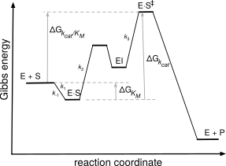
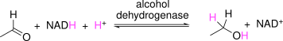
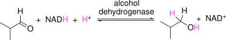
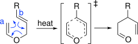
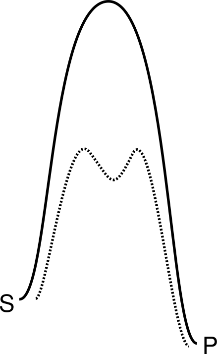

# Engineering Faster Enzymes

© 2023-2026 Romas Kazlauskas. All rights reserved. Last revised: August 2026.

**Summary.** Engineering faster catalysis enables new substrates to react and reduces the amount of enzyme needed. Most enzyme-catalyzed reactions show saturation kinetics where the reaction rate initially increases with increasing substrate concentration, but later levels out and does not increase further. Two kinetic constants define this curve: $V_{max}$, the maximum rate of reaction at high substrate concentration, and $K_M$, the concentration of substrate at half of $V_{max}$. The definition of these constants differs for different reaction mechanisms. The simplest reaction mechanism is the Michaelis-Menten model, which proposes that the substrate first reversibly forms an enzyme-substrate complex, then reacts to form product. In most cases, the physical steps involved in enzyme catalysis are more complex. Engineering faster enzymes requires speeding up the physical steps that limit catalysis. Engineering faster enzymes may involve improving binding of the substrate to the enzyme, reorienting the substrate, adjusting the p$K_a$ of acids and bases, relieving product inhibition or other steps in the reaction mechanism. Distant residues contribute to catalytic activity by positioning active site residues and altering tunnels that control substrate entrance and product release.

**Key learning goals**

- Most enzymes follow saturation kinetics defined by two kinetic constants: $V_{max}$ and $K_M$. The physical steps that contribute to these constants differ when the enzyme reaction mechanisms differ.
- The Michaelis-Menten model for enzyme catalysis involves formation of the enzyme-substrate complex ($E \cdot S$) followed by the chemical step that converts substrate to product. Enzymes speed up this chemical step by stabilizing the transition state for the reaction. 
- Two limiting cases of enzyme-catalyzed reactions are low and high substrate concentration. Here low and high are relative to the $K_M$ of the enzyme-substrate complex. At low substrate concentration, the reaction rate can be improved either by improved binding (lower $K_M$), which increases the fraction of enzyme that contains a bound substrate, or by a faster chemical step ($k_{cat}$). At high substrate concentration all of the enzyme molecules already contain a bound substrate, so only a faster chemical step ($k_{cat}$) can increase the reaction rate.
- Improved binding requires increasing shape and interaction complementarity between substrate and enzyme. Some reaction steps may also contribute to $K_M$.
- Speeding up the conversion of the enzyme-substrate complex to product requires increased stabilization of the transition state. Depending on the reaction mechanism details, this stabilization can involve 1) pre-organizing the geometry of the $E \cdot S$ complex for reaction, 2) ensuring the correct protonation state of any needed acids and bases, 3) stabilizing the charge and shape of the transition state, and 4) breaking up difficult mechanistic steps into several easier ones. When tunnels limit the transport of substrates or products in and out of the active site, then this transport becomes the transition state and engineering must focus there.

## Introduction

Faster enzymes are a common goal in protein engineering since faster enzymes require less protein for the application. Faster may refer to an existing substrate for the enzyme, and it may also refer to expanding the substrate range of an enzyme to new, previously unreactive, substrates.

Chemical reactions are processes that break and make chemical bonds. Catalysts can not change the Gibbs energies of the reactants and products, nor the equilibrium constant between them, @fig-delG_rxn. A catalyzed reaction reaches the same equilibrium state as a non-catalyzed reaction, but reaches this equilibrium more rapidly. Catalysts increase the rates of both the forward and reverse reactions. Enzymes are remarkably efficient catalysts and increase the rates $10^5$ to $10^{15}$-fold over the non-catalyzed reactions.

The highest energy structure along the path from substrate to product is the transition state, @fig-delG_rxn. The energy gap between the substrate and transition state limits the rate of the reaction. The size of this gap, $\Delta G^{\ddagger}$, is the activation energy for the reaction. The transition state is a peak in the energy diagram, so it has a fleeting existence. Only structures that correspond to valleys on the energy diagram can exist for a finite time.

![Gibbs energy changes associated with a chemical reaction. The Gibbs energy change for the transformation of substrate S to product P, $\Delta G_{rxn}$, is negative indicating that the reaction is favorable. The barrier between the starting material and product limits the rate of the reaction. The top of this barrier is the highest energy structure along the bond-making and bond-breaking path of the reaction and is called the transition state. $\Delta G^{\ddagger}_{non}$ and $\Delta G^{\ddagger}_{cat}$ are both positive because the transition states, $S^{\ddagger}_{non}$ and $S^{\ddagger}_{cat}$, are higher in energy than S. The catalyst stabilizes the $S^{\ddagger}_{non}$ transition state by an amount $\Delta \Delta G^{\ddagger}$, which lowers the barrier to product and speeds up the reaction.](figures/chapter7/delG_rxn.svg){#fig-delG_rxn width=300 fig-alt="Gibbs energy diagram with reaction coordinate on the x-axis and Gibbs energy on the y-axis, showing two paths from S to E + P: an uncatalyzed path peaking at a higher transition state S‡_non and a catalyzed path peaking at a lower transition state S‡_cat, with ΔΔG‡ marking the gap between the two peaks and ΔG_rxn marking the overall downhill energy change from S to product."}

Catalysts act by stabilizing the transition state and lowering the activation energy. For example, bond breaking or making in a transition state often creates partial charges. A catalyst can orient the substrate for reaction and provide compensating charges, thereby stabilizing the transition state, lowering the barrier from substrate to product and speeding up the reaction.

Transition state theory connects the rate constant for the reaction, $k$, to the Gibbs energy of the transition state, $\Delta G^{\ddag}$, eq. @eq-delG_rate. Transition state theory assumes a quasi-equilibrium[^quasi-eq] between the substrate and transition state. The constants in eq. @eq-delG_rate account for the fraction of molecules that react once they reach the top of the barrier. The activation Gibbs energy is a positive value because the value of $\frac{k}{\text{constants}}$ is <1, which makes $\ln\left(\frac{k}{\text{constants}}\right)$ a negative value. 

$$\Delta G^{\ddag}=-RT\ln\left( \frac{k}{\text{constants}}\right)$$ {#eq-delG_rate}

A lower activation energy corresponds to a lower barrier and a faster reaction (larger $k$). A faster rate, or larger $k$, decreases the absolute value of $\ln\frac{k}{\text{constants}}$, which leads to a smaller activation energy. For example, the $\ln(0.001)$ is –6.9, while the $\ln(0.1)$ is –2.3. The decrease in activation energy for a catalyzed reaction as compared to a non-catalyzed reaction is proportional to the natural logarithm of the ratio of the rate constants for the catalyzed and non-catalyzed reactions, eq @eq-delG_cat_non.

$$
\begin{split}
\Delta G^{\ddag}_{cat-non} & =-RT\ln\left( \frac{k_{cat}}{\text{constants}}\right)-\left(-RT\ln\left( \frac{k_{non}}{\text{constants}}\right)\right) \\
& =-RT\ln\left( \frac{k_{cat}}{k_{non}}\right)
\end{split}
$$ {#eq-delG_cat_non}

Transition state stabilization accounts for most of the catalytic effect of enzymes. [@garcia-vilocaHowEnzymesWork2004] Experimental evidence that enzymes stabilize transition states includes the finding that transition state analogs are potent enzyme inhibitors and that antibodies to transition state analogs can catalyze reactions, albeit slowly.

## Measuring reaction rates

Consider the rate of a unimolecular chemical reaction, eq. @eq-chem.  

$$[S] \rightarrow [P] $$ {#eq-chem}

The rate of reaction, $V$, is the disappearance of substrate over time, $-d[S]/dt$, and has units of concentration per unit time. Researchers measured the initial rate of the reaction using different concentrations of substrate, [S], and found that the rate increases linearly as [S] increases, @fig-chem_enz. 

![The rate of reaction for a unimolecular chemical reaction (top) and a single substrate enzyme-catalyzed reaction (bottom). In both cases the rate of reaction, $V$, increases with increasing substrate concentration, $[S]$, but this increase flattens for the enzyme-catalyzed reaction. The slope of the line, $k$, describes the speed of a unimolecular chemical reaction, while two constants are needed to describe the speed of the enzyme-catalyzed reaction. The constant $K_M$ in units of concentration is the concentration at which the reaction rate reaches half of the maximum rate. $K_M$ also indicates the substrate concentration at which the curve starts to flatten. The constant $V_{max}$ in units of concentration/time indicates the maximum rate.](figures/chapter7/chem_enz.svg){#fig-chem_enz width=300px fig-alt="Two rate-versus-substrate-concentration plots stacked vertically: the top plot is a straight line through the origin (V = k·[S]) for an uncatalyzed chemical reaction; the bottom plot is a curve that rises then flattens (V = Vmax·[S]/(KM+[S])) for an enzyme-catalyzed reaction, illustrating saturation kinetics."}

The proportionality constant, $k$, for this rate increase is the rate constant and has units of time$^{-1}$, eq. @eq-chem_rate.

$$ V = -\frac{d[S]}{dt}=k \cdot [S] $$ {#eq-chem_rate}

This rate constant reveals the inherent propensity of the substrate to react. If another reaction has a larger rate constant, then it is faster. It will convert more molecules into product over the same time at the same concentration of substrate. 

The rate of an enzyme-catalyzed reaction, eq. @eq-enz, also varies with the concentration of substrate, but the relationship between $V$ and [S] is not linear, but curved, see @fig-chem_enz above.

$$ [S] \xrightarrow{\text{enzyme}} [P]$$ {#eq-enz}

The equation that describes this curve, eq. @eq-enz_VK, contains two constants: $V_{max}$ and $K_M$. These constants reveal the inherent speed of an enzyme-catalyzed reaction.

$$V=\frac{V_{max} \cdot [S]}{K_M + [S]}$$ {#eq-enz_VK}

$V_{max}$ is the reaction rate at high substrate concentration, while $K_M$ is the substrate concentration at which the reaction rate is half of $V_{max}$. For a chemical process, the physical meaning of the constant k is the inherent rate of the spontaneous reaction of the substrate. For the enzymatic process, the physical meanings of the constants $V_{max}$ and ${K_M}$ depend on the mechanism of the enzyme-catalyzed reaction and will be discussed below. At this time, they are simply kinetic constants.

Consider the two limiting cases of low substrate concentration and high substrate concentration. Here low and high are in comparison to $K_M$ for the reaction. At low substrate concentration, [S] is much smaller than $K_M$, so the denominator of eq. @eq-enz_VK simplifies to $K_M$. Equation @eq-enz_VK simplifies to eq. @eq-enz_low.

$$V_{low [S]}=\frac{V_{max}}{K_M} \cdot [S]$$ {#eq-enz_low}

This equation resembles the equation for a chemical reaction, eq. @eq-chem_rate above, where the ratio $V_{max}/K_M$ corresponds to the rate constant for the reaction. Thus, at low substrate concentration, one compares the rates of enzyme-catalyzed reactions by comparing $V_{max}/K_M$. Higher values correspond to faster reactions.

At high substrate concentration, $K_M$ is much smaller than [S], so the denominator of eq. @eq-enz_VK simplifies to [S]. Next, [S] cancels out since it appears as a factor in both the numerator and denominator. Equation @eq-enz_VK simplifies to eq. @eq-enz_high.

$$V_{high [S]}=V_{max}$$ 	{#eq-enz_high}

At high substrate concentration, the reaction rate is independent of substrate concentration. To compare enzymes at high substrate concentrations, one compares $V_{max}$ values. Higher values correspond to faster reactions.

The comparison of reaction rates described in this section is steady-state kinetics. The steady-state refers to constant conditions over the time of the experiment. The temperature, pH and substrate concentration are all constant over the course of the experiment. To keep the substrate concentration constant, researchers measure the initial rates of the reaction only while the first few percent of the substrate react, that is, the initial rate of the reaction. There is a large excess of substrate as compared to enzyme. Each enzyme molecule completes many catalytic cycles over the course of the measurement. The large excess of substrate also ensures that formation of an enzyme-substrate complex does not significantly alter the concentration of free substrate.

To measure the steady-state kinetic parameters for a reaction, $K_M$ and $V_{max}$, one measures the initial rate of the reaction at varying substrate concentrations and find the values of $K_M$ and $V_{max}$ for equation @eq-enz_VK that best fit the data. Huitema & Horsman (2018) provide scripts for this fitting using the statistical program R. The supporting information of this chapter provides a Python script to find the best values of $V_{max}$ and ${K_M}$.[^nonlinear] For a good fit one needs data points that define both the low [S] and high [S] regions of the curve; that is, measurements at substrate concentrations both above and below $K_S$.

### The Michaelis-Menten model

The simplest model of the physical steps within an enzyme-catalyzed reaction is the Michaelis-Menten model, @fig-mm_rxn. The substrate, S, binds reversibly to the enzyme, E, to form an enzyme-substrate complex, $E \cdot S$. The two physical steps are association of enzyme and substrate with rate $k_1$ and dissociation of the enzyme-substrate complex with rate $k_{-1}$. Next, the enzyme substrate complex reacts irreversibly to form and release the product with rate $k_2$. 

{#fig-mm_rxn width=200px fig-alt="Reaction scheme showing free enzyme and substrate (E + S) reversibly forming the complex E·S with rate constants k1 and k-1, which then converts irreversibly to E + P with rate constant k2."}

Starting from this simple model, one can derive an equation with the same form as eq. @eq-enz_VK. This derivation will assign physical meanings to the constants $V_{max}$ and $K_M$. 

In the Michaelis-Menten model, the rate of product formation, $V$, depends on the amount of enzyme-substrate complex, $[E \cdot S]$, and the rate at which it is converted to product, $k_2$, eq. @eq-derive_1.

$$ V = k_2 \cdot [E \cdot S] $$ {#eq-derive_1}

The amount of $[E \cdot S]$ is unknown, so we express $[E \cdot S]$ in terms of known quantities. One known quantity is the amount of added enzyme, $[E]_0$. The total of $[E \cdot S]$ and $[E]$ must be equal to the amount of enzyme added, $[E]_0$.

$$ [E]_0 = [E] + [E \cdot S] $$ {#eq-define_E0}

Second, we assumed that $[E]$ and $[S]$ are in equilibrium with $[E \cdot S]$, so we may write the following equation. 

$$ \frac{k_1}{k_{-1}} = \frac{[E \cdot S]}{[E] \cdot [S]} $$ {#eq-define_ES_equil}

Combining these two equations and solving for $[E \cdot S]$ yields eq. @eq-derive_2, 

$$ [E \cdot S] = \frac{[E]_0 \cdot [S]}{\frac{k_{-1}}{k_1}+[S]} $$ {#eq-derive_2}

Combining eq. @eq-derive_1 and eq. @eq-derive_2 yields the Michaelis-Menten equation, eq. @eq-MMeq_orig where $K_D = \frac{k_{-1}}{k_1}$

$$V=\frac{k_2 \cdot [E]_0 \cdot [S]}{K_D + [S]}$$ 				{#eq-MMeq_orig}

This equation assigns the following physical meaning to $V_{max}$ and ${K_M}$. 

$$ V_{max} = k_2 \cdot [E]_0 $$ {#eq-MM_def_Vmax}

$$ K_M = K_D = \frac{k_{-1}}{k_1} $$ {#eq-MM_def_KM}

$V_{max}$ corresponds to the product of $k_2$, the inherent reactivity of the $[E \cdot S]$ complex, and the amount of added enzyme. ${K_M}$ corresponds to the equilibrium dissociation constant of the $[E \cdot S]$ complex, $K_D$. **Warning:** $K_M$ = $K_D$ only for simple Michaelis-Menten mechanisms where $k_2 << k_{-1}$. For most enzymes, $K_M$ is a complex kinetic parameter, not a binding constant.

We can now draw a physical picture of what occurs at different substrate concentrations in an enzyme-catalyzed reaction, @fig-mm_plot. The Michaelis-Menten model simplifies enzyme-catalyzed reactions to a binding step described by $K_M$ or $K_D$ that forms the enzyme-substrate complex and a reaction step described by $k_2 \cdot [E]_0$ that converts the substrate to product. Improving enzymes catalysis may require improvements to either or both of the two steps. When the substrate does not bind to the enzyme or binds poorly, then improved binding can increase the enzyme-catalyzed reaction rate. When the substrate binds, but reacts slowly, then the  chemical reaction step must be improved by stabilizing the transition state.

![The Michaelis-Menten model adds a physical interpretation to the observed variation in rate of an enzyme-catalyzed reaction with substrate concentration. At low substrate concentration, the rate is slow because only a few enzyme molecule contain bound substrate (black dots). The rate increases as the substrate concentration increases because an increasing fraction of enzyme molecules contain substrate. At high substrate concentration, all the enzyme molecules contain a bound substrate and the enzyme-catalyzed reaction rate reaches a maximum and no longer varies with substrate concentration.](figures/chapter7/mm_plot.svg){#fig-mm_plot width=300px fig-alt="Michaelis-Menten rate curve alongside schematic enzyme populations at low, intermediate, and high substrate concentration, showing the fraction of enzyme molecules (circles) containing a bound black dot (substrate) increasing from few at low [S] to all at high [S], matching the rise and plateau of the rate curve."}

### Which enzyme is faster?

The metric used to identify the faster enzyme depends on the application. At low substrate concentrations, the ratio $k_{cat}/K_M$, often called the catalytic efficiency, is a good metric. It measures the ability of the enzyme to both bind the substrate and to catalyze the chemical step. In vivo applications such as therapeutic enzymes typically act at low substrate concentrations, so catalytic efficiency is a good measure. Typical values of $k_{cat}/K_M$ for enzyme-catalyzed reactions are ${\sim} 10^5 M^{-1}s^{-1}$ and the limit is ${\sim} 10^9 M^{-1}s^{-1}$. This limit comes from the requirement for two species ($E$ and $S$) to combine to make the $E \cdot S$ complex. This rate cannot be faster than diffusion.

In many biocatalysis applications, the users control the substrate concentrations and usually choose high concentrations so the reaction rate is high and the reaction vessel is small. At high substrate concentrations, $k_{cat}$ determines the reaction rate, so the enzyme with the higher $k_{cat}$ value is the faster one. For example, the isomerization of glucose to fructose is a continuous process in glucose syrup as solvent. The glucose concentration (~5 M) is much higher than the $K_M$ of glucose for the isomerase (0.09-0.9 M).[@bhosaleMolecularIndustrialAspects1996] The value of $k_{cat}$ determines the reaction rate.

In chemical manufacturing using batch processes, the substrate concentration decreases while product concentration increases as the reaction proceeds leading to changes in reaction rate. The value of $k_{cat}$ may control the reaction rate initially, but later $k_{cat}/K_M$ controls the reaction. Substrate and product inhibition, not discussed above, may also influence the reaction rate. Fox and Clay[@foxCatalyticEffectivenessMeasure2009] proposed an average velocity metric that compares how long it takes for a reaction to reach completion. An example where this approach may be useful is the manufacture of a pharmaceutical or pharmaceutical intermediate. 

The following sections examine molecular strategies to alter $k_{cat}$ and $K_M$ to speed up enzyme-catalyzed reactions. Identifying whether $k_{cat}$ or $K_M$ or both need improvement is a good first step, but it is not enough. Both binding and the reaction steps may include multiple physical steps for different catalytic mechanisms. Engineering requires identifying which physical steps limit catalysis and then speed up these steps. For example, a substrate may bind poorly to an enzyme, which could indicate a mismatch in the shapes of the substrate and active site. When a substrate reacts slowly, there are many possible causes. The substrate may orient in a non-reactive orientation, the required acids or bases may be in the incorrect protonation state, the charges generated during bond-breaking and bond making may not be stabilized, a required conformational change of a protein loop may be slow as well as other causes.

### Gibbs energy diagrams for enzyme-catalyzed reactions

**Michaelis-Menten model.** Enzymes catalyze reactions by first binding the substrate and then transforming the substrate to product, so a Gibbs energy diagram includes these steps to show how $K_M$ and $k_{cat}$ affect an enzyme-catalyzed reaction,[@bozleeReformulationMichaelisMenten2007] @fig-Gibbs_enz. First, the Gibbs energy of the transition state for the non-catalyzed reaction, $S^{\ddagger}$, is higher than that for the enzyme-catalyzed reaction, $E \cdot S^{\ddagger}$ indicating that the enzyme-catalyzed reaction is faster. The formation of the $E \cdot S$ complex is favorable by an amount $\Delta G_{K_M}$; then transformation of $E \cdot S$ to the transition state $E \cdot S^{\ddagger}$, is uphill by $\Delta G_{k_{cat}}$.

![Gibbs energy diagram for an non-catalyzed and an enzyme-catalyzed reaction at standard state. The non-catalyzed reaction proceeds via transition state $S^{\ddagger}$, which lies $\Delta G_{k_{non}}$ above the energy of $S$. The enzyme-catalyzed reaction is faster because the energy distance from $E + S$ to the transition state, $E \cdot S^{\ddagger}$, $\Delta G_{k_{cat}/K_M}$, is lower by an amount $\Delta \Delta G^{\ddagger}$. The path from from $E + S$ to $E \cdot S^{\ddagger}$ involves binding to form $E \cdot S$ (decrease Gibbs energy by $\Delta G_{K_M}$), then an increase to $E \cdot S^{\ddagger}$ by an amount $\Delta G_{k_{cat}}$.](figures/chapter7/Gibbs_enz.svg){#fig-Gibbs_enz fig-alt="Gibbs energy diagram comparing a catalyzed path (E + S → E·S → E·S‡ → E + P, with downhill ΔG_KM to E·S and uphill ΔG_kcat to E·S‡) against a non-catalyzed reference path (S → S‡ → P), with the catalyzed transition state E·S‡ lower than the non-catalyzed S‡ by ΔΔG‡, and ΔG_rxn marking the overall downhill energy change."}

**More complex reaction mechanisms.** The Gibbs energy diagrams include additional states for more complex reaction mechanisms. For example, a reaction that includes an enzyme intermediate includes a valley that represents that intermediate, @fig-Gibbs_w_EI.

{#fig-Gibbs_w_EI width=300px fig-alt="Gibbs energy diagram like the previous one but with an added valley for a covalent enzyme intermediate (EI) between E·S and E + P, with rate constants k1, k-1, k2, and k3 labeling the successive steps."}

Even if the Gibbs energy profile is complex, the largest barrier (from valley to peak) is the step that determines $k_{cat}$ and the highest point measured from the starting $E + S$ determines $k_{cat}/K_M$.

**Simplification for limiting cases.** Consider two limiting cases of enzyme-catalyzed reactions: high and low substrate concentration, @fig-Gibbs_limit. At high substrate concentration most of the enzyme exists as the $E \cdot S$ complex, while at low substrate concentration most of the enzyme exists as free enzyme. 

![Limiting cases for enzyme-catalyzed reactions. a) At high substrate concentration, most of the enzyme contains bound substrate as indicated by the black dot under that state. The reaction rate under these conditions depends only on $k_{cat}$. b) At low substrate concentration, most of the substrate and enzyme are in the free state as indicated by the black dot under that state. The reaction rate depends on substrate concentration and $k_{cat}/K_M$ at low substrate concentration. The substrate concentration and $K_M$ determine the small fraction of enzyme that forms $E \cdot S$ while $k_{cat}$ determines how fast it is converted to product.](figures/chapter7/Gibbs_limit.svg){#fig-Gibbs_limit fig-alt="Two Gibbs energy diagrams side by side. a) At high substrate concentration the black dot marking the enzyme's starting population sits at E·S, and the barrier to E·S‡ is set by kcat. b) At low substrate concentration the black dot sits at free E + S, and the barrier to E·S‡ is set by kcat/KM."}

At high substrate concentration, most of the enzyme exists as the $E \cdot S$ complex, so the starting state is this complex. The barrier from the starting state to product is determined by $k_{cat}$ and the only way to increase the rate of reaction is to increase $k_{cat}$. Raising the energy of the $E \cdot S$ complex (weakening binding) will increase $k_{cat}$ and speed up the reaction up to a point. Once the binding becomes so weak that the reaction is no longer under ‘high substrate concentration’ conditions and most of the enzyme no longer exists as the $E \cdot S$ complex, it will slow down and the limiting case of high substrate concentration no longer applies. Increasing binding (lowering $K_M$) slows down the reaction when the substrate concentration is high because it increases the distance between the $E \cdot S$ complex and the transition state. Most biocatalysis applications use high substrate concentrations so the rates are limited by $k_{cat}$. 

::: {.callout-note}
## Box 7.1: What Determines $k_{cat}$ vs. $k_{cat}/K_M$ in a Gibbs Energy Diagram

**The barrier that sets $k_{cat}$ starts from the E·S complex or similar.**

- $k_{cat}$ limits the rate at high substrate concentration, so the ground state (stable state populated by the enzyme at steady state) is the E·S complex or another low energy state after the E·S complex. The highest transition state energy relative to this ground state sets $k_{cat}$. The vertical distance from this ground state to the highest transition state is the Gibbs energy that sets $k_{cat}$.
- This highest transition state may be a chemical transformation (bond-making and bond breaking), a product release step, or a conformational change of the protein.
- Example: Peptide hydrolysis catalyzed by serine proteases involves two steps – acyl-enzyme formation followed by acyl-enzyme release. If acyl-enzyme *formation* is rate-limiting, then the enzyme ground state is the E·S complex and the barrier from E·S to the first tetrahedral intermediate determines $k_{cat}$. If the acyl-enzyme *release* is rate-limiting, then the enzyme ground state is the acyl enzyme and barrier from the acyl enzyme to the second tetrahedral intermediate determines $k_{cat}$.
- If two barriers have similar heights, then both contribute to $k_{cat}$.

**The barrier that sets $k_{cat}/K_M$ starts at the free E + S state.**

- The highest transition state energy relative to free E + S sets $k_{cat}/K_M$.
- $[S] \cdot k_{cat}/K_M$ sets the rate when at low substrate concentrations. Low substrate conditions may occur where one cannot control the substrate concentration, such as applications where the substrate is a metabolite in living organisms.
:::

At low substrate concentration, most of the enzyme exists as $E+S$. The distance to the barrier to product is determined by $k_{cat}/K_M$. Selectively stabilizing $E \cdot S^{\ddagger}$ will lower the energy barrier and speed up the reaction as it did in the high substrate concentration case. However, stabilizing $E \cdot S$ (decreasing $K_M$) in the low substrate concentration case also increases the reaction rate by increasing the proportion of enzyme molecules bound to substrate. This approach is limited since once $E \cdot S$ is so stable that all the enzyme is in the $E \cdot S$ state, then the high substrate concentration case applies and only stabilizing $E \cdot S^{\ddagger}$ can increase the reaction rate. For example, the anti-cancer activity of asparaginase[@cantorTherapeuticEnzymeDeimmunization2011] (mentioned in Chapter 1) depends on its ability to reduce the concentration of asparagine in the blood so that it is not available for cancer cells. The blood contains 2-25 $\mu$M asparagine, so lowering the $K_M$ of an asparaginase to this level or slightly below would make the reaction faster, but further decreases in $K_M$ would not.

## More complex models of enzyme-catalyzed reactions

The simple Michaelis-Menten model makes several simplifying assumptions, @tbl-assumptions, but these can be removed either by additional experiments or redefining the meanings of $k_{cat}$ and $K_M$. 

+---------------------------------------------+-----------------------------+
| Assumption                                  | Removing assumption         |
+=============================================+=============================+
| single substrate                            | additional experiments      |
+---------------------------------------------+-----------------------------+
| equilibrium between $E$, $S$ and $E \cdot S$| redefine $K_M$              |
+---------------------------------------------+-----------------------------+
| single step reaction                        | redefine $k_{cat}$ and $K_M$|
+---------------------------------------------+-----------------------------+
| product release is fast                     | additional experiments      |
+---------------------------------------------+-----------------------------+

Table: Assumptions within the Michaelis-Menten model of enzyme catalysis and how they can be removed. {#tbl-assumptions}

The Michaelis-Menten model includes only one substrate, but it can be be extended to two or more substrates by repeating the measurements under different limiting conditions. To extend the model to two-substrate enzyme-catalyzed reactions one first adds a large excess of one substrate. The other substrate now limits the reaction rate according to eq. @eq-enz_VK, so varying its concentration reveals its steady-state kinetic parameters. Next, a second set of experiments with saturating amounts of the other substrate allows measurement of the kinetic parameters of the first substrate.

The Michaelis-Menten model assumed that the free enzyme and substrate are in equilibrium with the enzyme substrate complex in eq. @eq-define_ES_equil above. This assumption was needed in order to define the concentration of $E \cdot S$. The Briggs-Haldane approach replaces this assumption with a more relaxed assumption, that the concentration of $E \cdot S$ is constant. The assumption, known as the steady-state approximation, is less restrictive and leads to a different physical meaning for $K_M$.

The steady state assumption means that the rate of formation of $E \cdot S$ ($k_1$ term in eq. @eq-steady_state) must be equal to the rate of destruction of $E \cdot S$  ($k_{–1} + k_2$ term in eq. @eq-steady_state). 

$$ k_1 \cdot [E] \cdot [S] = (k_{-1} + k_2)[E \cdot S]$$ {#eq-steady_state}

This equation is used in place of eq. @eq-define_E0 above to express $[E \cdot S]$ in terms of known quantities. Combining eq. @eq-steady_state with eq. @eq-define_E0 and solving for $[E \cdot S]$ yields the equation below.

$$ [E \cdot S] = \frac{[E]_0 \cdot [S]}{\frac{k_{-1} + k_2}{k_1}+[S]} $$ {#eq-BH_derive_2}

Combining this equation with eq. @eq-derive_1 above yields eq @eq-BHeq_orig below. 

$$
\begin{split}
V =\frac{k_2 \cdot [E]_0 \cdot [S]}{K_M + [S]} \\
\text{where } K_M = \frac{k_{-1} + k_2}{k_1}
\end{split}
$$ {#eq-BHeq_orig}

The form of the equation and the definition of $V_{max}$ is the same as for the Michaelis-Menten model, but the definition of the constant $K_M$ includes an additional physical step. It is no longer purely a dissociation constant since it contains the rate constant for the chemical step, $k_2$, in the numerator. Nevertheless, it still represents an amount of $[E \cdot S]$ since the rate constants in the numerator are for processes that destroy $[E \cdot S]$, while the rate constant in the denominator is for formation of $[E \cdot S]$. If $k_2$ is slow, the $K_M$ is a true dissociation constant. 

Many enzyme-catalyzed reactions involve multiple steps, not just the single step in the Michaelis-Menten model. For example, many enzyme-catalyzed reaction form an intermediate, EI, @fig-enz_w_intermediate. Subtilisin-catalyzed hydrolysis of esters involves an acyl-enzyme intermediate. Later in this chapter, @fig-canonical_Ser_esterase_mechanism shows a detailed mechanism.

{#fig-enz_w_intermediate width=250px fig-alt="Reaction scheme showing E + S reversibly forming E·S (k1, k-1), which converts to a covalent enzyme intermediate EI (k2), which then releases product to give E + P (k3)."}

The steady-state enzyme kinetics for subtilisin still follow the Michaelis-Menten equation, but both $K_M$ and $k_{cat}$ are combinations of multiple physical steps: 

$$ K_M=\frac{k_3}{k_2 + k_3}\cdot \frac{k_{-1} + k_2}{k_1} $$

$$ k_{cat}=\frac{k_2 \cdot k_3}{k_2 + k_3} $$

Measuring steady state kinetics still yields values for $K_M$ and $k_{cat}$, but their meaning cannot be assigned to a simple step in the catalytic mechanism. In the special case where the deacylation step ($k_3$) is fast as compared to the acylation step ($k_2$), then the equations simplify to those for a single step reaction. In this case, $k_{cat}$ represents the slow step of catalysis, $k_2$, the formation of the acyl-enzyme intermediate.

$$K_M=\frac{k_2 + k_{-1}}{k_1}$$

$$k_{cat}= k_2$$ 

Finally, the Michaelis-Menten model assumes that product release is fast, but in practice product inhibition may slow the rate of enzyme-catalyzed reactions. Additional experiments in the presence of varying amounts of product can identify product inhibition.

In this text, we will use the Michaelis-Menten model to discuss most enzyme-catalyzed reactions. When the mechanisms are more complex, additional physical steps contribute to $K_M$ and $k_{cat}$, and the Gibbs energy diagrams become more complex.

## Challenges in engineering faster enzymes

Speeding up catalysis requires speeding up the rate-limiting step, which poses two challenges: identifying that step, and finding a way to accelerate it. Both of these problems are challenging. 

### Physical, non-chemical steps can limit $k_{cat}$

In the simplest enzymes, $k_{cat}$ reflects the chemical step in which bonds are broken and formed; if this step is slow, it limits the rate, and the methods described in the previous section for stabilizing the transition state can speed it up.

Most enzyme-catalyzed reactions involve multiple steps, both chemical and physical. Serine esterase-catalyzed ester hydrolysis, for example, involves two chemical steps — formation of the acyl-enzyme intermediate and its subsequent hydrolysis — plus several physical steps that involve no bond making or breaking: correct orientation of the substrate before acylation, release of the alcohol product and binding of water after acylation, and release of the acid product after deacylation. Any of these steps, chemical or physical, can limit $k_{cat}$. This is easy to overlook because one tends to picture the simplest case, where $k_{cat}$ is purely chemical; in reality, the measured $k_{cat}$ usually reflects a mixture of chemical and physical rates.

Resolving $k_{cat}$ into its elementary steps requires additional experiments. Chemical steps can be diagnosed with a primary deuterium or ¹³C kinetic isotope effect (KIE): a KIE substantially greater than one indicates that making or breaking the isotope-sensitive bond is at least partially rate-limiting, and a mutation that reduces the KIE toward one indicates that the chemical step has become faster relative to the others.[@clelandUseIsotopeEffects2003] Mutations that sharpen the bell-shaped pH-rate profile, or shift an apparent p$K_a$ toward its optimum, indicate an optimized proton-transfer step.[@wallacecleland22UsePH1982] Linear free-energy relationships—varying substrate electronics systematically—reveal how much the chemical step contributes to the overall rate; for ester hydrolysis, a shallower Brønsted slope indicates that the chemical step no longer dominates.[@cook2007enzyme] Pre-steady-state burst kinetics resolve acylation from deacylation directly, uncoupled from product release, so an increased burst rate confirms an improved acylation step.

Physical rate limitations can be intermolecular or intramolecular. Intermolecular steps—substrate association and product release—couple to bulk solvent diffusion, so $k_{cat}$ and $k_{cat}/K_M$ vary with solvent viscosity; the slope of rate versus relative viscosity quantifies the diffusion-controlled contribution to each parameter.[@brouwerInvestigationDiffusionlimitedRates1982],[@gaddaKineticSolventViscosity2018] Isotope partitioning identifies non-productive binding by measuring the fraction of bound substrate that commits to product rather than dissociating and reassociating.[@rose2IsotopeTrapping1980] Intramolecular steps—tunnel transit, active-site preorganization, and conformational gating—require structural or computational diagnostics: crystal structures and MD ensembles report tunnel geometry and bottleneck radius,[@chovancovaCAVER30Tool2012] and HDX-MS reports changes in conformational dynamics at peptide resolution.[@massonRecommendationsPerformingInterpreting2019] Improvement in a specific step confirms successful engineering even before the overall $k_{cat}$ increases.

The sections below identify ways to speed the various steps of enzyme-catalyzed reactions. 

## Increasing reaction rates by engineering tighter binding 

The optimum binding of the substrate and enzyme will be just strong enough ($K_M$ value just low enough) so that most of the enzyme contains bound substrate under the reaction conditions. Filling most enzyme active sites with substrate creates the opportunity for each enzyme molecule to contribute to catalysis. Because over-stabilizing the $E \cdot S$ complex eventually slows the reaction (see @fig-Gibbs_enz above), further stabilization beyond this point is undesirable.

In many cases, the target substrate is not the natural substrate of the enzyme and the reaction is slow because little $E \cdot S$ forms. Adjusting the complementarity of binding site to match the target substrate improves binding and increases the reaction rate. The engineering approaches are the same as those described in the previous chapter on binding: preorganization, matching the size and shape and the interactions between the substrate and the binding site. A number of research groups have engineered enzymes for higher catalytic activity toward new substrates by improving binding.[@wijmaComputationalDesignGains2013] 

**Matching substrate size.** Substrates that are larger than the natural substrate bind poorly when they cannot fit in the active site. For example, alcoholic fermentation by *Lactococcus lactis*, involves the reduction of acetaldehyde to ethanol by NADH catalyzed by alcohol dehydrogenase, @fig-acetaldehyde_reduction, which shows good catalytic efficiency: $K_M$ = 0.4 mM, $k_{cat}$ = 35 s$^{-1}$, $k_{cat}/K_M$ ~ 90,000 M$^{-1}$ s$^{-1}$.

{#fig-acetaldehyde_reduction width=300 fig-alt="Reaction scheme showing alcohol dehydrogenase reducing acetaldehyde with NADH and H+ to ethanol and NAD+."}
 
As part of a project on biofuels, researchers sought to use this enzyme to reduce isobutyraldehyde to isobutanol, @fig-isobutyraldehyde_reduction, where the larger isobutyraldehyde replaces acetaldehyde. 

{#fig-isobutyraldehyde_reduction width=300 fig-alt="Reaction scheme showing alcohol dehydrogenase reducing the bulkier, branched substrate isobutyraldehyde with NADH and H+ to isobutanol and NAD+."}

The catalytic efficiency of this *Lactococcus* alcohol dehydrogenase is ~30-fold lower toward isobutyraldehyde, mainly due to looser binding of the substrate: $K_M$ = 12 mM, $k_{cat}$ = 30 s$^{-1}$, $k_{cat}/K_M$ ~ 3,000 M$^{-1}$ s$^{-1}$. The researchers identified several improved variants by random mutagenesis and screening.[@bastianEngineeredKetolacidReductoisomerase2011] The structure of one variant showed an expanded binding site caused by substituting Leu264 with valine to remove a methylene group and substituting Tyr50 with phenylalanine to remove an oxygen atom.[@liuStructureguidedEngineeringLactococcus2012] The modified enzyme bound the larger substrate more tightly ($K_M$ = 1.6 mM) and showed a ten-fold higher catalytic efficiency ($k_{cat}/K_M$ ~ 32,000 M$^{-1}$ s$^{-1}$). These substitutions made the substrate-binding site larger by removing two non-hydrogen atoms (a carbon and an oxygen) to match the new substrate, which is larger by two non-hydrogen atoms (two carbons). 

In an industrial example, Savile and coworkers engineered a transaminase to accept a precursor for a diabetes drug by expanding the substrate-binding site with multiple substitutions to fit the larger substrate.[@savileBiocatalyticAsymmetricSynthesis2010]

Although smaller substrates fit in the active site, they may bind poorly because only part of the smaller substrate contacts the surface of the binding site. Decreasing the size of the binding site will increase the contact surface and strengthen the binding interaction. 

**Matching interaction complementarity.** Engineering a suitable binding site often requires adjusting the non-covalent interactions as well as the size. For example, accommodating the new substrate, a glutamine residue, in a site that normally accepts lysine or arginine required adjusting the size, the charge and the hydrogen bonding partners of the binding site. Gluten, a protein found in wheat, rye, and barley, contains a high proportion of proline and glutamine. Digestive proteases do not cleave peptides after a Pro-Gln sequence so oligopeptides enriched in the dipeptide sequence proline-glutamine accumulate upon digestion of gluten. In celiac disease patients, these oligopeptides are believed to trigger an autoimmune response, which causes diarrhea and other gastrointestinal problems. One potential solution is adding a protease that can degrade Pro-Gln containing peptides to the meals of celiac patients. Engineering such a protease started with kumamolisin, which catalyzes hydrolysis after a Pro-Arg/Lys sequence in a peptide.[@gordonComputationalDesignAgliadin2012] The goal was to increase the reaction rate for hydrolysis after a Pro-Gln sequence, @fig-ProGln_tetrapeptide.

{#fig-ProGln_tetrapeptide width=200 fig-alt="Skeletal structure of the tetrapeptide proline-glutamine-leucine-proline labeled P2-P1-P1'-P2' from N- to C-terminus, with a red arrow and wavy line marking the cleavage site between the P1 glutamine and P1' leucine residues."}

The changes involved replacing two negatively-charged Glu residues in the binding site with neutral residues to favor binding of the neutral Gln instead of the positively charged Arg or Lys. In addition, a glycine in the binding site was replaced by serine to decrease the size of the binding site because the side chain of Gln is smaller than the side chain of Arg or Lys. The side chain of the newly-added serine can also make a hydrogen bond with the side chain of Gln. Several other substitutions were also introduced outside the binding site. The rate of hydrolysis ($k_{cat}/K_M$) of a test peptide (R-ProGlnProGln~LeuPro-R') where the '~' marks the cleavage site, increased 120-fold from 4.9 to 570 M$^{-1}$ s$^{-1}$. In this example, creating a complementary binding site required changing the size of the binding site, the electrostatic character of the binding site, and the hydrogen bonding partners in the binding site. A further-engineered variant of this protease is currently undergoing clinical trials.[@pultzGlutenDegradationPharmacokinetics2021]

**Slow binding due to tunnels or flexible loops.** In some cases, the rate of association of substrate and enzyme is slow; this slow rate can limit the rate of reaction. In this case improving binding will speed up the reaction. 

The most likely cause of slow binding is a deeply-buried active site. Reaching the active site may require the substrate to diffuse through a tunnel or require a flexible loop to move out of the way to allow the substrate into the active site. This slower binding hinders formation of the $E \cdot S$ complex and thus raises its energy. Increasing the rate of formation of the $E \cdot S$ complex can increase the amount of complex that forms. For example, to increase the ability of a transaminase to accept larger substrates up to 120-fold, Pavlidis and coworkers[@pavlidisIdentificationSelectiveTransaminases2016] both expanded the active site with two substitutions of Tyr with Phe and increased the flexibility at the opening of the binding site with a Pro to His substitution to allow larger substrates to enter. 

Tunnels and flexible loops can also contribute to the selectivity of enzymes.[@goraGatesEnzymes2013] Tunnels can prevent access to large substrates or to substrates that interact unfavorably with the tunnel (hydrophilic substrate may not pass through a hydrophobic tunnel) or substrates that interact too favorably (hydrophobic substrate may bind strongly to a hydrophobic tunnel leading to non-productive binding). Flexible loops can also exclude solvent from the active site to prevent undesirable side reactions.

## Stabilizing the chemical transition state to speed up reactions

After binding, the enzyme must stabilize the transition state for the reaction. This stabilization promotes the bond-making and bond-breaking steps. Enzymes use different strategies for this stabilization depending on what is required by the reaction, @tbl-stabilize_TS. 

+-------------------------+---------------------------+---------------------------------+
| **catalytic principle** | **rationale**             | **implementation**              |
+:=======================:+:=========================:+:================================+
|                         | $E \cdot S$ complex adopts| -model near attack complex      |
| preorganize $E \cdot S$ | catalytically productive  | -remove non-productive binding  |
|  geometry for reaction  | conformation              |                                 |
+-------------------------+---------------------------+---------------------------------+
|                         | acids & bases usually     | -adjust p$K_a$ of acids & bases |
| optimize acids & bases  | needed for catalysis      |                                 |
+-------------------------+---------------------------+---------------------------------+
|                         | bond rearrangements       | -add complementary charges      |
| stabilize charge & shape| alter charge & shape of   | -adjust shape of active site    |
|  of transition state    | substrate                 |                                 |
+-------------------------+---------------------------+---------------------------------+
| enable new mechanistic  | enzymes can create new    | -chemical reasoning             |
| steps                   | pathways for reaction     | -introduce new functional groups|
+-------------------------+---------------------------+---------------------------------+

Table: Contributions to the stabilization of transition states by enzymes. {#tbl-stabilize_TS}

The first requirement is a reactive orientation of the substrate, which is called preorganization. This preorganization is a binding orientation where the substrate adopts a ready-to-react geometry close to the catalytic residues of the enzyme. In contrast, holding the substrate in a non-reactive orientation slows down the reaction. Preorganization may require the substrate to adopt a conformation different from its low energy conformation in solution. 

Once the substrate is oriented for reaction, additional interactions can stabilize the bond-breaking and bond-making process. Moving the substrate from the polar environment of water (ε = 80), to the non-polar  environment of protein with a 10-fold lower dielectric constant (ε = 4-20) strengthens all electrostatic interactions 10-fold because they vary inversely with dielectric constant.[@richardEnzymeArchitectureImportance2014] If the reaction involves proton transfers, the required acids must be protonated and the bases deprotonated for catalysis. The enzyme can further stabilize the new molecular shapes and charges as electrons reorganize in the transition state. In some cases, enzymes create new mechanisms as compared to the non-catalyzed reaction. These new mechanisms break up a high energy path into several low energy steps.

Individual enzymes vary in the contributions that they use for catalysis because reactions differ in the reasons that they are slow. For example, chorismate mutase stabilizes the transition state mainly by folding the substrate into a reactive conformation (preorganization), while a designed eliminase catalyzes the Kemp elimination reaction by providing a base and stabilizing the charges formed in the transition state. Enzymes must provide whichever catalytic contributions are needed to stabilize the transition state for each reaction. A cooking analogy is that adding salt sometimes improves the taste of a dish, but other times adding something sour or spicy is needed. Each dish differs on what improves it.

To qualitatively predict the transition state for an enzyme-catalyzed reaction, start with an arrow-pushing mechanism to identify the bond-making and bond-breaking steps. Identify the distances and angles that define a catalytically productive conformation. Draw a shape with partial bonds that lies in between the shapes of the substrate and product. Label any partial charges that form in the transition state. Identify any acids and bases required for the mechanism. Quantitative prediction of a transition state requires quantum-chemical modeling. 

To identify how an enzyme accelerates the rate of reaction, compare the enzyme-catalyzed mechanism and transition state to a similar analysis of the non-catalyzed reaction. Does the enzyme preorganize the reacting atoms for the reaction? Does the enzyme supply acids and bases as needed for any proton transfer steps? Does the enzyme stabilize the unique shape of the transition state and any partial chargest that form in the transition state? If the enzyme-catalyzed reaction includes covalent intermediates, then the enzyme also changes the mechanism of the reaction as compared to the non-catalyzed reaction.

### Preorganization of $E \cdot S$ for reaction (binding correctly)

Preorganization is the bringing of atoms into the correct orientation to react. Preorganization lowers the Gibbs energy of the transition state, $E \cdot S^{\ddagger}$. The preorganized state (sometimes called a near-attack complex) involves both the conformation of the substrate and the orientation of substrate relative to the enzyme. This preorganized state is like a turnstile through which the substrate must pass to reach the transition state. Preorganization involves not just binding, but catalytically productive binding. In an efficient enzyme, formation of the $E \cdot S$ complex also organizes the complex for reaction such that binding and preorganization are the same processes. $K_M$ can be improved by any type of binding, but $k_{cat}$ can only be improved by catalytically productive binding. Preorganization may occur within the $E \cdot S$ state or along the path to the transition state, $E \cdot S^{\ddagger}$.

Holding reactive groups close to each other in the correct orientation for the reaction enormously speeds up reactions as compared to freely diffusing molecules containing the same groups. Even when the reacting groups are in the same molecule, reducing flexibility to favor a reactive orientation speeds up the reaction rate tremendously. For example, the intramolecular ring closure reaction in @fig-effective_molarity varies 50,000-fold by varying the number of rotatable bonds between the reacting groups.[@bruiceGroundStateTransition1999] The chemical steps are the same in all cases, but the faster ones orient the substrate better for reaction than the slower ones.

{#fig-effective_molarity width=250 fig-alt="Three intramolecular ring-closure reactions of a carboxylate attacking an aryl ester carbonyl, differing in the number of rotatable bonds between the two reacting groups (4, 3, or 2) and showing relative rate constants krel of 1, 230, and 53,000 respectively as rotational freedom decreases."}

In solution, substrates are usually flexible and adopt many different conformations by rotations along single bonds. Only some conformations orient the reactive groups such that reaction can occur. This reactive conformation might be rare in solution. The changes in structure force the carboxylate and aryl ester groups close to each other in @fig-effective_molarity above. Binding to the enzyme can similarly shift the balance toward a reactive conformation. The balance shifts because the enzyme restricts the available space for the substrate to move and interacts with it using hydrogen bonds, the hydrophobic effect, and electrostatic interactions. 

For example, the enzyme chorismate mutase catalyzes the rearrangement of chorismate by binding it in a conformation that rarely exists in solution. Chorismate mutase catalyzes a Claisen rearrangement, which rearranges bonds within a cyclic transition state, @fig-Claisen_rearrangement. The transition state requires the two carbons that form a bond in the product to be near each other. 

{#fig-Claisen_rearrangement width=170 fig-alt="Skeletal reaction scheme of a Claisen rearrangement showing an allyl vinyl ether heated to its cyclic transition state (marked ‡), in which carbons labeled a and b are drawn close together, rearranging to a carbonyl-containing product."}
 
The favored conformation of chorismate in solution places the two carboxylate groups far from each other, @fig-chorismate_mutase_rxn. This separation of the carboxylates minimizes electrostatic repulsion and allows water to solvate each carboxylate. The Claisen rearrangement forms a bond between carbon 1 and 9 of chorismate, so these carbon atoms must be nearby in the transition state. Chorismate mutase holds chorismate in a folded, reactive conformation using two positively charged arginine side chains to position the carboxylates and two hydrophobic side chains to restrict their motion.[@hurComparisonFormationReactive2003] Molecular dynamics simulations indicate that chorismate adopts the correct preorganized conformation only 0.00007% of the time in solution, but 32% of the time while bound to the enzyme. This preorganization is the primary way by which chorismate mutase stabilizes the transition state and catalyzes this rearrangement.

![Chorismate mutase catalyzes a Claisen rearrangement that converts chorismate to prephenate in the pathway to make aromatic amino acids. In the transition state, the carbon atoms marked 1 and 9 must be nearby, but in solution, these carbon atoms lie far from each other to minimize electrostatic repulsion between the two carboxylate groups and to maximize their solvation. Chorismate mutase stabilizes the transition state for reaction by binding the substrate in a folded conformation that places carbon atoms 1 and 9 nearby for reaction.](figures/chapter7/chorismate_mutase_rxn.svg){#fig-chorismate_mutase_rxn width=300 fig-alt="Structures of chorismate, its folded reactive conformation, its transition state, and the product prephenate, with ring carbons numbered 1, 3, 7, and 9; chorismate's two CO2 groups start far apart but fold together so a new bond can form between carbons 1 and 9 in the transition state."}

Many enzyme-catalyzed reactions involve proton transfers. For these reactions, preorganization involves positioning the donor and acceptor atoms to make a hydrogen bond. Once the hydrogen bond is formed, the hydrogen is ready to transfer from the donor to acceptor atom. 

An example of a reaction involving proton transfers is the Kemp elimination, @fig-Kemp_elimination. Researchers designed many enzymes to catalyze this reaction, but testing revealed that most of them were inactive.[@rothlisbergerKempEliminationCatalysts2008] To model preorganization of the substrate-enzyme complex, researchers calculate the ensemble of conformations adopted by this complex. If the substrate-enzyme complex is preorganized for reaction, then many of the conformations will have the catalytic atoms in the enzyme and the reacting atoms of the substrate site positioned (distances and angles) for reaction. Molecular dynamics simulations are the traditional way to calculate these ensembles. They revealed that most of the active enzymes were preorganized for reaction, while most of the inactive enzymes were not,[@kissEvaluationRankingEnzyme2010] @fig-Kemp_elim_proton_transfer. Preorganization was defined by the presence of a hydrogen bond between the substrate and the catalytic histidine. Researchers suggested that future enzyme designs could include molecular dynamics simulations to more accurately predict preorganization. 

{#fig-Kemp_elimination width=300 fig-alt="Reaction scheme of the Kemp elimination: a base (B) deprotonates a benzisoxazole substrate bearing a nitro group, breaking the ring N–O bond through a transition state with partial positive and negative charges, to give an open-chain product with a nitrile (C≡N) group."}

![Preorganization of the substrate and catalytic histidine for proton transfer correlates with catalytic activity for the Kemp elimination. The reaction involves the catalytic histidine deprotonating the carbon atom indicated. Preorganization involves positioning the donor C–H of the substrate and acceptor N of the catalytic histidine at a suitable distance (x-axis) and angle (y-axis) for a hydrogen bond (boxed region). The angles and distances come from molecular dynamics simulations of the enzyme-substrate complex. The star marks the orientation of donor and acceptor atoms between catalytic groups in the natural enzyme cathepsin.](figures/chapter7/Kemp_elim_proton_transfer.svg){#fig-Kemp_elim_proton_transfer width=300 fig-alt="Scatter plot of hydrogen-bond distance (x-axis) versus angle (y-axis) between the substrate C–H donor and catalytic histidine N acceptor, with a boxed region marking suitable hydrogen-bond geometry; points for active designed enzymes cluster inside the box, points for inactive designs fall outside it, and a star marks the geometry of the natural enzyme cathepsin."}

A newer, faster way to calculate the ensemble of conformations in the enzyme-substrate complex is neural-network-based calculations such as PLACER.[@anishchenkoModelingProteinSmall2025] PLACER is a graph neural network trained on structures of small organic molecules from the Cambridge Structural Database and the Protein Data Bank. PLACER generates conformational ensembles of small organic molecules bound to proteins. Researchers tested PLACER by predicting the improved reactivity of a retro-aldolase. The designed  retro-aldolase (RA95.0) was slow, but an engineered variant was ~$10^5$-fold faster (RA95.5-8F). Previous molecular dynamics simulations showed that the substrate adopted many different conformations in the active site of the original designed enzyme, but in the faster, engineered enzyme the range of conformations narrowed to those where the substrate interacted with the catalytic residues, that is, the enzyme-substrate complex was preorganized for reaction.[@romero-riveraRoleConformationalDynamics2017] The PLACER calculations gave similar results, see Figure 4C of the Anishchenko paper.

When preorganization does not limit the reaction rate, then other features, such as faster product release, need to improve to make the enzyme faster. In such a case, examining an ensemble of conformations of the enzyme-substrate complex from a molecular dynamics or PLACER calculation will not reveal why the rate improved because the calculations look for preorganization and that is not the feature that improved. For example, researchers evolved a variant, KE07 R7-2 (pdb id 6CT3), that was 100-fold faster ($k_{cat}$) than the designed Kemp eliminase mentioned above, KE07 R1 (pdb id 5D2W). A PLACER calculation shows no improvement in preorganization. A Google colab page is available to test this calculation at <https://colab.research.google.com/drive/1Bj-bisGQSlqC5n3YnGox2k9valxdElGN>. Other experiments revealed that the  reason for the faster rate was better substrate binding and product release associated with changes outside the active site.[@zarifiDistalMutationsEnhance2025] 

The opposite of preorganization is non-productive binding where the enzyme binds the substrate in an unreactive mode at the active site, @fig-non-productive. Non-productive binding increases the distance from the $E \cdot S$ complex to the transition state and therefore slows down the reaction. The $E \cdot S$ complex must first reorient into reactive orientation before it can react.

![Non-productive binding slows down catalysis. This hypothetical Gibbs energy diagram for an enzyme-catalyzed reaction shows the $E \cdot S$ complex as an equilibrating mixture of two $E \cdot S$ species. The more stable one is non-productive because it lies earlier along the reaction coordinate. If most of the $E \cdot S$ complex exists in the non-productive form (indicated by the black dot), then the reaction rate is slower ($\Delta G_{k_{cat}}$ increases) than if it existed in the productive form. This case is similar to over stabilization of the $E \cdot S$ complex mentioned previously. b) A hammer is ineffective in the wrong orientation and will not drive nails. An active site that positions the substrate in a nonreactive orientation is also ineffective.](figures/chapter7/non-productive.svg){#fig-non-productive width=300 fig-alt="Two-panel figure. a) Gibbs energy diagram showing two interconverting E·S states, a more stable non-productive form (marked by a black dot as the dominant population) and a less stable productive form that must be reached before reaching E·S‡ and E + P. b) A simple illustration of a hammer being held backward, unable to drive a nail, as an analogy for a substrate bound in the wrong orientation."}

Non-productive binding slows the thermolysin-catalyzed coupling of *N*-benzyloxycar-bonyl-[l]{.smallcaps}-aspartate (Cbz-[l]{.smallcaps}-Asp) with [l]{.smallcaps}-phenylalanine methyl ester ([l]{.smallcaps}-Phe-OMe), @fig-thermolysin. This reaction is a condensation to form an amide link, not the usual hydrolysis of a peptide. Precipitation of the product dipeptide drives this reaction in the otherwise unfavorable direction.[@isowaThermolysincatalyzedCondensationReactions1979] This condensation is a critical step in the manufacture of aspartame ([l]{.smallcaps}-aspartyl-[l]{.smallcaps}-phenylalanine methyl ester), a low-calorie sweetener. 

![Thermolysin-catalyzed coupling yields an aspartame derivative. a) Thermolysin catalyzes the coupling of [l]{.smallcaps}-phenylalanine methyl ester ([l]{.smallcaps}-Phe-OMe) with Cbz-[l]{.smallcaps}-Asp to yield an aspartame derivative. This derivative precipitates from the aqueous reaction mixture by forming a salt with [d]{.smallcaps}-phenylalanine methyl ester. The starting Phe-OMe is racemic. Thermolysin selects the [l]{.smallcaps}-enantiomer for reaction, while the [d]{.smallcaps}-enantiomer is the counter ion for salt formation. b) This coupling is slow because the carboxyl donor, Cbz-[l]{.smallcaps}-Asp, initially binds in the incorrect location. It binds in the amine donor site, thereby blocking access of [l]{.smallcaps}-Phe-OMe. Once the Cbz-[l]{.smallcaps}-Asp rotates and moves out of the way, [l]{.smallcaps}-Phe-OMe can bind and the reaction proceeds. Cbz = benzyloxycarbonyl.](figures/chapter7/thermolysin.svg){#fig-thermolysin width=450 fig-alt="Two-panel figure. a) Reaction scheme showing thermolysin coupling Cbz-L-aspartate with racemic L/D-phenylalanine methyl ester to form an aspartame derivative that precipitates as an insoluble salt with the unreacted D-enantiomer. b) Three active-site cartoons showing Cbz-L-Asp first binding in the wrong location (the amine-binding region, blocking access), then slowly rotating into the correct carboxyl-binding region, after which L-Phe-OMe can bind the now-open amine-binding region to form the productive complex, with a zinc ion shown coordinating the substrate throughout."}

X-ray structures of substrates bound to thermolysin revealed the reason for this slow reaction, @fig-thermolysin.[@birraneSynthesisAspartameThermolysin2014] The active site of thermolysin contains a catalytic zinc ion as well as separate regions to bind the carboxyl and amine donors. The carboxyl donor (Cbz-[l]{.smallcaps}-Asp) binds to the wrong site, the amine donor site, instead of the carboxyl donor site. The rotation of the Cbz-[l]{.smallcaps}-Asp substrate into the correct site is slow, but required before the amine donor substrate ([l]{.smallcaps}-Phe-OMe) can bind to make the catalytically productive complex. Replacement of a histidine residue in the amine binding region with aspartate improved the binding of the amine donor substrate approximately 2.5-fold, likely due to favorable electrostatic interactions, and increased the yield of aspartame derivative approximately 2-fold.[@zhuEnhancementZaspartameSynthesis2018]

Substrates smaller than the natural one often react poorly due to non-productive binding. Although the substrate fits in the binding site, it adopts a non-productive orientation as it adjusts within the larger active site to find favorable non-covalent interactions. The difficulty in protein engineering is that one rarely knows the nature of this non-productive orientation and how to prevent it. For example, expanding the active site with a Ile303Ala substitution expanded the substrate range of a ligase from the native substrate 4-chlorobenzoate to a larger substrate 3,4-chlorobenzoate, @fig-chlorobenzoates. However, a smaller regioisomer, 3-chlorobenzoate, reacted about 110-fold slower. The researchers hypothesized that the smaller 3-chlorobenzoate must fit in the active site, but bind in a non-productive orientation. Additional substitutions to close the space for the 4-chloro substituent (Phe184Trp) and orient 3-chlorobenzoate with a hydrogen bond to the 3-chloro substituent (Val209Thr) improved $k_{cat}/K_M$ about 5-fold. 

![Expanding the substrate range of 4-chlorobenzoate:coenzyme A ligase to a larger substrate (3,4-chlorobenzoate) and to a regioisomer (3-chlorobenzoate). Enlarging the active site improved reaction of the larger substrate, but not of the regioisomer, likely due to non-productive binding. Additional adjustments to match the shape of the regioisomer improved its reactivity 5-fold. The reaction rates with the unnatural substrates were 100-1000-fold lower than the natural substrates even with the engineered variants.](figures/chapter7/chlorobenzoates.svg){#fig-chlorobenzoates width=250 fig-alt="Skeletal structures of three chlorobenzoate substrates: the natural 4-chlorobenzoate (wild type), the larger 3,4-dichlorobenzoate accommodated by the Ile303Ala substitution, and the smaller regioisomer 3-chlorobenzoate whose reactivity was improved by the additional Phe184Trp and Val209Thr substitutions."}

Molecular modeling of preorganization and non-productive binding uses docking and molecular dynamics to model the different orientations of the substrate within the active site. Plots of key distances and angles during the simulation identify the favored geometry and classifying the conformations as productive or non-productive, Box 7.1. Protonation states, discussed in the next section, must also be correct for catalysis to occur. Substitutions that favor formation of the near-attack complexes are expected to increase $k_{cat}$.

::: {.callout-note}
## Box 7.2: Preorganization – Geometry, Conformation, and Protonation

Check substrate geometry and conformation by modeling substrate–enzyme complex using molecular dynamics.

**Geometric criteria**

- **Nucleophilic attack:** Attacking atom 2.5–3.5 Å from electrophile, approach angle 90–120° to leaving group
- **Proton transfer** Donor–acceptor distance 2.4–3.0 Å, D–H···A angle >140°

**Conformation criteria**

- Substrate adopts reactive conformation >10% of the time.
- No low-energy, non-productive binding modes competing with productive mode.

Check p$K_a$ of catalytic residues with PROPKA.

**Protonation criteria**

- Catalytic residues maintain correct protonation >90% of the time.

**Improving preorganization**

- Distance or angle wrong → Resize or reshape binding pocket (may require substitutions outside active site)
- Wrong conformation or non-productive binding → Block incorrect orientation with bulky residues
- Wrong protonation state → Adjust p$K_a$ of catalytic residues.
:::

### Optimize acids & bases

Many reactions involve the transfer of protons, so acids (proton donors) and bases (proton acceptors) must be in the correct protonation state for the reaction to occur. For example, serine esterases require the histidine of the catalytic triad to act as a base in the first chemical step, @fig-deprotonated_His_reqd. Only the neutral form of the histidine side chain can act as a base. The protonated histidine has already accepted a proton (acted as a base) and cannot accept a second proton. At low pH, this histidine is mostly protonated so only the tiny fraction that is neutral can contribute to catalysis, @fig-deprotonated_His_reqd. As the pH increases, the fraction of neutral histidine increases, and the observed rate increases. The inflection point of the increase in activity corresponds to the p$K_a$ of the catalytic histidine. Once the pH increases beyond the p$K_a$ of the histidine, the fraction of neutral histidine approaches 100% and the reaction proceeds at the maximum rate. Thus, the reaction rate varies with pH because the fraction of enzyme in the catalytically active form varies.[@tiptonEffectsPHEnzymes1979]

![The start of the catalytic mechanism of serine esterases requires the deprotonated form of the catalytic histidine. a) The first chemical step of a serine esterase-catalyzed hydrolysis of an ester requires the catalytic histidine to act as a base and to deprotonate the catalytic serine. b) The activity of the esterase varies with pH. The esterase reaches full activity when the histidine is fully deprotonated. The inflection point corresponds to the p$K_a$ of the catalytic histidine. Here the p$K_a$ of the catalytic histidine is 7.2, slightly higher than that for the free histidine due to the environment of the active site.](figures/chapter7/deprotonated_His_reqd.svg){#fig-deprotonated_His_reqd width=300 fig-alt="Two-panel figure. a) Mechanism diagram of the catalytic triad (Ser, His, Asp) showing the neutral, deprotonated histidine acting as a base to deprotonate the catalytic serine, forming a tetrahedral intermediate. b) A sigmoidal plot of relative rate versus pH, rising from near 0% to 100% activity, with the inflection point at pKa 7.2 corresponding to the histidine's deprotonation, alongside a small diagram of the protonated-versus-neutral histidine equilibrium."}
 
β-lactam antibiotics inactivate penicillin-binding proteins by forming a covalent acyl-enzyme intermediate with an active site serine. For effective inhibition, this adduct must be long-lived, which requires slow hydrolysis. Hydrolytic cleavage depends on a general base activating a water molecule to attack the acyl-carbonyl, but Tyr150's p$K_a$ (~10) is too high relative to physiological pH (~7), leaving it predominantly protonated and unable to efficiently deprotonate water. This inefficient base catalysis results in slow hydrolysis, prolonging enzyme inactivation—precisely what makes β-lactams effective antibiotics.[@ghermanMixedQuantumMechanical2004] In contrast, β-lactamase resistance enzymes have evolved efficient catalytic machinery, typically using a glutamate residue (p$K_a$ ~4.2) that is predominantly deprotonated and competent as a general base at physiological pH, enabling rapid hydrolysis of the acyl-intermediate and destroying the antibiotic before it can inhibit its target.
 
A general equation for pH-dependent behavior is

$$k_{obs}=\frac{k_{A^–} \cdot K_a+k_{HA} \cdot [H^+]}{K_a+[H^+]}$$ {#eq-gen_pH}

where $k_{A^–}$ is the rate constant of the deprotonated form, $k_{HA}$ is the rate constant for the protonated form and $K_a$ is the ionization constant of the acid. If the reaction requires the basic form, then one sets $k_{HA}$ to zero and equation @eq-gen_pH simplifies to equation @eq-base_form_reactive below. The observed rate constant, $k_{obs}$, is the rate constant for the deprotonated form, $k_{A^–}$, scaled by the fraction of the molecule in the deprotonated form.[^fn7-1]  

$$k_{obs}=k_{A^–} \cdot \frac{ K_a}{K_a+[H^+]}$$ {#eq-base_form_reactive}

The p$K_a$ of a functional group within a folded protein may differ from that in free solution due to changes in solvation, hydrogen bonding and electrostatic interactions with the protein. For example, the phenolic hydroxyl of tyrosine has a p$K_a$ of ~10 in solution, but Tyr80 in xylanase has a predicted p$K_a$ of ~19. This increase in p$K_a$ corresponds to a billion-fold shift in the equilibrium between phenol and phenoxide toward the phenol, ensuring Tyr80 remains in the neutral, protonated form throughout the physiological pH range. This is functionally essential because the neutral phenol acts as a structural scaffold that positions a catalytic glutamate for optimal activity. If Tyr80 were deprotonated to the negatively charged phenoxide, it would electrostatically repel the glutamate carboxylate and disrupt the precise active site geometry required for catalysis. The folded protein environment achieves this dramatic p$K_a$ elevation by surrounding Tyr80 with hydrophobic residues that severely destabilize the charged phenoxide form through poor solvation, guaranteeing that Tyr80 functions as a neutral hydrogen bond donor/acceptor rather than as an ionizable catalytic residue.[@wakarchukMutationalCrystallographicAnalyses1994]

Besides solvation, hydrogen bonding and electrostatic effects also shift the p$K_a$ of ionizable groups in proteins. When hydrogen bond donors or acceptors interact with ionizable groups and the interaction is unequal for the protonated and deprotonated forms, then their p$K_a$ will shift, @fig-environ_shifts_pKa. The p$K_a$'s also shift when nearby charged groups stabilize or destabilize the charges associated with protonation changes. The key to these changes is that the interactions are unequal – either the protonated or deprotonated state interacts more strongly. 

![The p$K_a$ of a carboxylic acid changes in a folded protein as compared to solution due different in the interactions between the protein and the two protonation states. Placing the carboxylic acid in a hydrophobic pocket destabilizes the charged form more than the neutral form, thereby shifting the equilibrium toward the neutral form. Hydrogen bond donors and acceptors stabilize different protonation forms and shift the p$K_a$ in opposite directions. These hydrogen bond donor and acceptors can also interact with the carboxylic acid/carboxylate in other ways; the interactions shown are those that cause differences in the interactions. Electrostatic effects also shift the p$K_a$ of the carboxylic acid.](figures/chapter7/environ_shifts_pKa.svg){#fig-environ_shifts_pKa width=300 fig-alt="Grid of schematic environments for a carboxylic acid/carboxylate pair — solution reference, a hydrophobic pocket, a nearby hydrogen-bond donor, a nearby hydrogen-bond acceptor, and a nearby added charge — each labeled with whether it stabilizes or destabilizes the charged carboxylate form and whether the pKa increases or decreases as a result."}

**PROPKA predicts shifts in p$K_a$.** PROPKA estimates the p$K_a$ of ionizable groups in a protein (p$K_a^{protein}$) by adjusting the p$K_a$ of the groups in solution (p$K_a^{solution}$) for their different environment in the folded protein.[@olssonProteinElectrostaticsPKa2011] The estimate requires a protein structure and assumes that the structure is static. The program uses empirical equations and parameters to account for desolvation ($\Delta \text{p}K_a^{desolvation}$, disfavors charged form), formation of hydrogen bonds ($\Delta \text{p}K_a^{hydrogen \: bonds}$, H-bond donors favor deprotonated form, H-bond acceptors favor protonated form) and electrostatic effects of nearby charged groups ($\Delta \text{p}K_a^{electrostatic}$, oppositely charged groups favor charged form), eq. @eq-PROPKA. A web interface of PROPKA is available at <https://server.poissonboltzmann.org/pdb2pqr>.[^PROPKA_note]

[^PROPKA_note]: Run the PDB2PQR configuration calculation using default settings, then look in the log file to find the PROPKA calculations.

$$\text{p}K_a^{protein} = \text{p}K_a^{solution} + \Delta \text{p}K_a^{desolvation} + \Delta \text{p}K_a^{hydrogen \: bonds} + \Delta \text{p}K_a^{electrostatic}$$ {#eq-PROPKA}

A more detailed look at the predicted altered p$K_a$ of Tyr80 in the active site of xylanase, @fig-Tyr80_PROPKA, shows that, besides desolvation mentioned above, hydrogen bond differences and Coulombic interactions also contribute. The phenoxide is disfavored because desolvation destabilized the phenoxide as mentioned above, because Glu172 makes a favorable hydrogen bond with the phenol form, and because two nearby negatively-charged glutamates create unfavorable Coulombic interactions with the phenoxide, eq. @eq-Tyr80_shift. PROPKA predictions typically fit experimentally determined values with an rmsd <1 p$K_a$ unit.

$$\text{p}K_a^{Tyr80} = 10 + 3.55 + 0.79 + 4.63 = 18.98$$ {#eq-Tyr80_shift}

![Part of a PROPKA prediction of the p$K_a$’s of ionizable groups in a xylanase from *Bacillus circulans* (pdb id: 1XNB). PROPKA predicts that the p$K_a$ of the phenolic hydroxyl of Tyr80 is 18.98, much higher than the solution value of 10. The side chain is buried disfavoring the charged anion, which raises the p$K_a$ by 3.55 units. This estimate comes from the 632 (under desolvation effects ‘regular’) non-hydrogen protein atoms within 15.5 Å of the phenolic oxygen, which indicates how deeply the group is buried. The desolvation effects ‘re’ is a small correction (zero in this case) to account for the non-hydrogen-bonding electrostatic effects of replacing water with protein atoms. The Tyr80 phenol hydrogen bonds to the anionic Glu172, but the phenoxide loses this hydrogen bond, which raises the p$K_a$ by 0.79 units. Coulombic interactions with five nearby groups raise the p$K_a$ by a total of 4.63 units. Negative charges on two nearby glutamates strongly disfavor formation of the negatively-charged phenoxide. Smaller contributions come from a  more distant positively-charged arginine and partial negative charges on two nearby tyrosines.](figures/chapter7/Tyr80_PROPKA.svg){#fig-Tyr80_PROPKA width=420 fig-alt="Monospaced PROPKA output table listing Tyr80's predicted pKa of 18.98, broken into contributions: +3.55 from desolvation (buried 100%, 632 atoms), +0.79 from loss of a hydrogen bond to Glu172, and Coulombic interactions of −0.27 (Arg112), +0.68 (Tyr65), +0.16 (Tyr166), +2.03 (Glu78), and +2.03 (Glu172)."}

**Shifting an enzyme's pH-rate profile.** When the pH optimum of the enzyme differs from the pH of the application, then engineering a shift in the pH optimum toward the pH of the application will increase the reaction rate. For example, some subtilisins (proteases for laundry applications) reach their maximum activity above pH 10, but some wash applications use pH 8 where the enzyme shows low activity. Phytase, a feed additive enzyme, must be active in digestive tract, which is pH 2-5 for pigs and poultry. Other reasons to shift the pH optimum of an enzyme are to get enzymes with different pH optima to work together in a multi-step pathway, to allow a reaction pH that alters the solubility of substrates or products or partitioning into an organic phase, or to reduce susceptibility of microbial contamination by running the process outside of the neutral range.[@tynan-connollyRedesigningProteinPKa2007]

Since solvation, hydrogen bond networks and electrostatic effects all influence the p$K_a$ of the ionizable groups, researchers can, in principle, use any of these to engineer a shift in the pH optimum. However, since the first two involve changes near the ionizable group, there is a danger of disrupting catalytic activity and researchers avoid these approaches. Most engineering to shift the pH optimum uses remote electrostatic effects. Electrostatic effects decrease proportional to $1/r$, so charges even 10 Å away still affect the p$K_a$ of an ionizable group. Being further away from the group makes it less likely that the changes disrupt orientation of the catalytic residues or the shape of the active site. Shifting the pH optimum of an enzyme usually involves changing the type and number of charges outside the active site.

The strategy to alter the pH optimum by changing electrostatics is as follows, @fig-shift_pH_optimum_full.

+ Add $\oplus$ charge or remove $\ominus$ charge = lower pH optimum
+ Add $\ominus$ charge or remove $\oplus$ charge = raise pH optimum

The example below considers the effect of added charges on the p$K_a$ of histidine. The reader should confirm that the p$K_a$ of a negatively-charged side chain like glutamate also shifts in the same direction.

{#fig-shift_pH_optimum_full width=300 fig-alt="Plot of observed rate constant versus pH showing the sigmoidal activity curve for a base-requiring histidine shifting to lower pH when a nearby positive charge is added and to higher pH when a nearby negative charge is added, illustrated with small diagrams of protonated and neutral histidine paired with a nearby plus or minus charge."}

For example, to increase the activity of a serine hydrolase (subtilisin) at lower pH, the engineering must shift the p$K_a$ of the catalytic histidine to lower pH. Adding positive charges or removing negative charges will destabilize the protonated histidine, so that the inflection point for deprotonation occurs at lower pH. Replacing a distant (~12 Å away) glutamate or a distant aspartate with lysine shifted this inflection point to lower pH by ~0.5 pH units.[@russellRationalModificationEnzyme1987] The effects were approximately additive, so replacing both residues with lysine decreased the pH of the inflection point by ~1.0 pH units. The lysine destabilized the positively charged (inactive) form of catalytic histidine so the shift to the active from occurred at lower pH. Increasing the ionic strength lowers the effect of surface charges due to their association with counterions. These measurements were made a low ionic strength. Immobilization of enzymes on charged surfaces can similarly shift the pH optimum. 

Catalysis often requires several ionizable groups in the correct protonation state. For, example, glycosidases require two acids, one in the acidic form, the other in the basic form, @fig-glycosidase. 

![A glycosidase requires one glutamate in its acid form and another in its basic form. Their catalytic activity peaks in the range where both are in the correct protonation state. The first step of the catalytic mechanism requires Glu167 to act as an acid and Glu356 to act as a nucleophile, which requires the basic form. If the p$K^{Glu356}_a = 5.4$ and p$K^{Glu167}_a = 12.5$, then the glycosidase is the fully catalytic form between pH 7 and 11. At lower pH Glu356 is not deprotonated, while at higher pH Glu167 is not protonated. The curve is drawn from equation @eq-two_ionizable_groups.](figures/chapter7/glycosidase.svg){#fig-glycosidase width=400 fig-alt="Glycosidase reaction mechanism showing Glu356 acting as a deprotonated nucleophile (pKa 5.4) attacking the substrate while Glu167 acts as a protonated general acid (pKa 12.5), forming a covalent glycosyl-enzyme intermediate with Glu356 before hydrolysis releases product."}

Eq. @eq-two_ionizable_groups below predicts the fraction of the enzyme that exists in the catalytically active form at different pH. The $k_{obs}$ is the rate constant at the pH in question, while $k_{best}$ is the rate of the catalytically active form and $K_{a1}$ and $K_{a2}$ are the acid ionization constants of the two ionizable groups. The active form of the enzyme requires the deprotonated form of group 1 and the protonated form of group 2.

$$k_{obs} = k_{best} \cdot \frac{[H^+]K_{a1}}{[H^+]K_{a1}+[H^+]^2+K_{a1}K_{a2}} $$ {#eq-two_ionizable_groups}

If the p$K_a$’s of the two groups are widely separated, e.g., 6.0 and 10.0, then the maximum activity can reach to nearly $k_{best}$, @fig-narrow_pH_range. The optimum at pH 8.0 is broad, halfway between the two p$K_a$’s. If the p$K_a$’s of the two groups closer to each other, e.g., 6.0 and 7.3, then the maximum activity can never reach $k_{best}$. At best 69% of the enzyme molecules are in the correct protonation state. The pH optimum is narrow.

{#fig-narrow_pH_range width=400 fig-alt="Two bell-shaped curves of fraction of maximum activity versus pH. a) With well-separated pKa's of 6.0 and 10.0, the curve is broad, peaking near pH 8.0 at 98% of kbest. b) With closely spaced pKa's of 6.0 and 7.3, the curve is narrow, peaking near pH 6.6 at only 69% of kbest."}

If protein engineering to shift the pH optimum also narrows the gap between the two p$K_a$’s, then the overall activity may decrease. For example, adding an arginine decreased the pH optimum of the glycosidase xylanase from 6.5 to 5, but unfortunately also decreased the catalytic activity 100-fold.[@pokhrelShiftingOptimumPH2013] The added arginine was closer to one of the carboxylic acids and strongly shifted its p$K_a$. The narrowing of the difference between the two p$K_a$’s made the correct protonation state for catalysis rarer thereby slowing the reaction.

**A common confusion** is the notion of regions of high pH or low pH. There are no such regions; the pH is constant throughout the solution since proton transfer is fast. The protonation state of all groups is at equilibrium and reflects its p$K_a$. However, the same groups in different environments may differ in their p$K_a$ and therefore have different protonation states. A carboxyl group in a non-polar environment may be uncharged while one in a polar environment may be charged. The p$K_a$ of those two carboxyl groups is different, but the pH is identical in both places.

Attempts to shift pH optima by introducing charged residues can fail if the new residue doesn't have the expected charge at the target pH. Consider shifting a serine hydrolase pH optimum from 6.5 to 7.5 by adding a negative charge near the catalytic histidine. The strategy is to stabilize protonated histidine (His-H+), raising its p$K_a$. Introducing a glutamate or aspartate should work since their side chain p$K_a$ (~5) means they'll be negatively charged at pH 6.5-7.5. However, if the carboxylate is placed in a hydrophobic, poorly solvated environment, its p$K_a$ can increase from 5 to 9. This creates a problem: at pH 6-7.5 (the target range), the histidine is transitioning from charged to neutral, but the carboxylate is still mostly protonated (neutral COOH) because its elevated p$K_a$ means it doesn't become negatively charged until pH >9. By the time the carboxylate finally becomes charged at pH ~9, the histidine is already fully neutral. Since electrostatic stabilization requires both groups to be charged simultaneously, and they're never both charged at the same pH, the carboxylate cannot stabilize the protonated histidine. The histidine p$K_a$ remains unchanged, and the pH optimum doesn't shift. Introduced charges only shift active site p$K_a$ values if they're actually charged at the relevant pH. The local protein environment can dramatically alter ionization behavior, undermining the design strategy.

In summary, the effect of proteins on a ionizable groups is predictable, but complex, because all charges interact. Engineering to shift the p$K_a$ of catalytic groups can shift the pH optimum of proteins while maintaining high catalytic activity. These shifts are typically ≤1 pH unit. 

### Stabilize shape and charge of transition state

To selectively stabilize the transition state over the enzyme-substrate complex, the enzyme must stabilize features that are unique to the transition state and not present in the enzyme-substrate complex. Those features are likely to be the charge and shape of the transition state. For example, consider the transition state for hydrolysis of an ester catalyzed by a serine hydrolase, @fig-canonical_Ser_esterase_mechanism. Hydrolysis of an ester involves an acyl-enzyme intermediate. After binding the substrate and formation of the first tetrahedral intermediate, the acyl-enzyme intermediate forms, then a second tetrahedral intermediate forms, and finally the product forms and dissociates. The transition state (highest energy species) will be either the acylation or deacylation step. The structure of the transition state is not shown, but it is assumed to be similar to the first or second tetrahedral intermediate, @fig-high_energy_intermediate_resembles_transition_state. 

{#fig-canonical_Ser_esterase_mechanism width=400 fig-alt="Full catalytic cycle diagram of a serine esterase's catalytic triad (Ser, His, Asp) with an oxyanion hole, showing free enzyme binding substrate, forming the first tetrahedral intermediate Td1, collapsing to the acyl-enzyme with release of methanol, binding water, forming the second tetrahedral intermediate Td2, and deacylating to release acetic acid and regenerate free enzyme."}

The charge distribution on the transition state differs from the enzyme-substrate complex. First, positive charge on the imidazole ring increases in the transition state as it is protonated. Second, the negative charge on the substrate carbonyl oxygen increases in the transition state as it form an oxyanion. Serine hydrolases stabilize the positive charge on the imidazole ring with the carboxylate side chain of the catalytic aspartate. Serine hydrolases stabilize the the negative-charge on the oxyanion with two hydrogen bonds from main chain N-H’s. 

{#fig-high_energy_intermediate_resembles_transition_state width=200 fig-alt="Gibbs energy diagram showing substrate and product as low-energy valleys connected by a high-energy intermediate valley adjacent to a transition-state peak, illustrating that intermediates and transition states occupy similar high-energy regions of the reaction coordinate."}

The shape of the transition state also differs from the enzyme-substrate complex. The  transition state is tetrahedral at the carbonyl carbon, while the enzyme-substrate complex is planar at the carbonyl carbon. If the shape of the active site matches the tetrahedral arrangement better than the planar arrangement, then this shape selectively stabilizes the transition state.

### Create new mechanistic steps

The rate-acceleration mechanisms above assume that the transition states for the enzyme-catalyzed and the non-catalyzed reactions are the same; that is, that the mechanisms for the two reactions are the same. However, enzymes often change the mechanism of the non-catalyzed reaction. These changes split the high energy step of the non-catalyzed reaction into multiple lower-energy steps, @fig-2_lower_E_steps. These mechanistic changes may involve covalent enzyme intermediates, the participation of cofactors, such as pyridoxal-5'-phosphate or metal ions, and acid-base catalysis not available to the non-catalyzed reaction. 

{#fig-2_lower_E_steps width=100 fig-alt="Simple Gibbs energy diagram from S to P illustrating a single high-energy barrier being replaced by two smaller sequential barriers."}

One type of new mechanism is the formation of a covalent intermediate with the enzyme. Both glycoside hydrolases, @fig-glycosidase, and serine esterases @fig-canonical_Ser_esterase_mechanism form covalent intermediates: a glycosyl enzyme link to the catalytic glutamate residue and an acyl enzyme link to the catalytic serine residue, respectively. Instead of water directly attacking the substrate, a catalytic residue within the enzyme attacks the substrate and releases part of it while forming a covalent intermediate. In the next step, water attacks this covalent intermediate to release it from the enzyme. In contrast, the acid catalyzed hydrolysis of glycosides and esters involves direct attack of water on the substrate and formation of a high energy intermediate, @fig-acid_catalyzed_glycoside_ester_hydrolysis. This mechanism is higher in energy for two reasons. First, simultaneously positioning the water and substrate for reaction is entropically costly. The enzyme uses a stepwise approach: position the substrate in the first step and the water in the second step. Second, the charged intermediate is much less stable than the neutral covalent intermediates formed in the enzyme-catalyzed reaction.

![Acid-catalyzed hydrolysis of a glycoside (top) or an ester (bottom) involves direct attack of water on the substrate and formation of a high energy charged intermediates, shown in brackets. Enzymes avoid formation of these high energy intermediates by breaking the reaction into two steps where a catalytic residue first attacks the substrate to form a covalent intermediate and then water attacks the covalent intermediate. The neutral covalent intermediate is lower in energy than the charged intermediates shown here. See @fig-glycosidase and @fig-canonical_Ser_esterase_mechanism for the enzyme-catalyzed mechanisms.](figures/chapter7/acid_catalyzed_glycoside_ester_hydrolysis.svg){#fig-acid_catalyzed_glycoside_ester_hydrolysis width=450 fig-alt="Mechanism schemes for acid-catalyzed hydrolysis of a glycoside (top) and an ester (bottom), each showing water directly attacking the substrate through a bracketed, positively-charged high-energy intermediate before collapsing to products."}

A comparison of binding strengths to enzyme rate acceleration shows the importance of these mechanistic changes to enzyme catalysis. If binding the transition state were the only way to stabilize the transition state, then transition state stabilization energies would be similar to binding constants. The maximum strength of binding between receptors and drugs, antibodies and antigens, or enzyme and drugs corresponds to $K_d$ ~10$^{–13}$ M, so the maximum rate acceleration by enzymes would be similar. In contrast to this expectation, the maximum rate acceleration by enzymes corresponds to a binding constant a billion times lower: 10$^{–22}$ M.[@zhangWhyEnzymesAre2005] This additional rate acceleration comes from the ability of enzymes to change the catalytic mechanism.

### Computational Modeling

Most enzyme-catalyzed reactions involve multiple steps. Steady-state kinetics hides this complexity into the kinetic constants, each of which depend on multiple elementary steps. In contrast, computational modeling focuses on one elementary step at a time, e.g., substrate binding, formation of near attack complex, reaction step, or product release. The accuracy needed to design the multiple steps and interactions that stabilize transition states is at the edge of the capabilities of current computational methods.[@linderComputationalEnzymeDesign2012] One approach is using experimental methods to identify the rate limiting step (there may be several), then focus computational methods on fixing those steps. 

## Glossary {-}

Acyl-enzyme intermediate
: covalent intermediate formed between the catalytic serine and the substrate's acyl group during serine hydrolase-catalyzed hydrolysis; hydrolyzed in a second step to release product and regenerate free enzyme.

Activation energy ($\Delta G^{\ddagger}$)
: Gibbs energy difference between a ground state and the transition state; sets the rate constant via transition state theory ($\Delta G^{\ddag}=-RT\ln(k/\text{constants})$). For an uncatalyzed reaction the ground state is S. For an enzyme-catalyzed reaction the relevant ground state depends on the reaction conditions: E·S (or a later low-energy state) sets the barrier for $k_{cat}$, which limits the rate at high substrate concentrations, while free E + S sets the (larger) barrier for $k_{cat}/K_M$, which limits the rate at low substrate concentrations.

Briggs-Haldane (steady-state) approximation
: kinetic treatment that replaces the Michaelis-Menten assumption of rapid equilibrium between E, S, and E·S with the weaker assumption that $[E \cdot S]$ is constant; redefines $K_M$ to include the rate constant of the chemical step ($k_2$), so $K_M$ is no longer purely a dissociation constant.

Desolvation effect
: shift in the p$K_a$ of an ionizable side chain caused by burying it away from water; typically destabilizes the charged form and raises the p$K_a$ of acids.

Effective molarity
: the rate enhancement from holding reactive groups in proximity and correct orientation (as in an intramolecular reaction or an enzyme active site) relative to the same groups reacting intermolecularly; illustrated by the 50,000-fold rate variation with rotatable-bond count in ring-closure reactions.

Kemp elimination
: a base-catalyzed proton transfer/ring-opening model reaction (breaks an N-O bond, forms a C$\equiv$N) with no natural enzyme catalyst; commonly used to benchmark de novo-designed catalysts.

$k_{cat}$
: rate constant that, multiplied by $[E]_0$, gives $V_{max}$; in the simple Michaelis-Menten model equals $k_2$, the rate of the chemical step. Sets the reaction rate at saturating (high) substrate concentration, where the ground state is $E \cdot S$.

$k_{cat}/K_M$ (specificity constant)
: apparent second-order rate constant that sets the reaction rate at low (subsaturating) substrate concentration ($V = k_{cat}/K_M \cdot [S] \cdot [E]$); determined by the highest transition-state energy relative to free E + S.

$K_M$ (Michaelis constant)
: substrate concentration at half $V_{max}$. In the Michaelis-Menten model it equals the dissociation constant $K_D$ of E·S; in more complex mechanisms it is a composite of several rate constants and no longer purely reflects binding affinity.

Lineweaver-Burk plot
: double-reciprocal linearization of the Michaelis-Menten equation ($1/V$ vs. $1/[S]$); mathematically convenient but overweights low-$[S]$ data, giving less accurate $V_{max}$ and $K_M$ estimates than nonlinear regression.

Michaelis-Menten model
: simplest kinetic mechanism for enzyme catalysis: reversible formation of the E·S complex (rates $k_1$, $k_{-1}$) followed by irreversible, rate-limiting conversion of E·S to product (rate $k_2$).

Near-attack complex
: a preorganized conformation of E·S with the reacting atoms positioned at the distance and angle required for reaction; a required orientation to get from E·S to the transition state. A near-attack complex need not be an energy minimum and may be a fleeting conformation along the reaction path.

Non-productive binding
: binding of substrate to the enzyme, at or near the active site, in an orientation that does not lead to reaction; competes with productive binding and lowers $k_{cat}$.

pH optimum (pH-rate profile)
: the pH at the peak in a plot of enzyme activity variation with pH, reflecting the fraction of enzyme molecules with catalytic acid/base residues in the correct protonation state; can be shifted by engineering catalytic-residue p$K_a$'s.

p$K_a$ shift
: change in a side chain's ionization constant caused by the folded-protein environment (desolvation, hydrogen bonding, electrostatics) relative to its value for the free amino acid in solution; can span many p$K_a$ units (e.g., Tyr80 in xylanase, p$K_a$ ~19 vs. ~10 in solution).

Preorganization
: structural arrangement of an enzyme's active site that positions catalytic residues and substrate to favor conversion to product.

Product inhibition
: slowing of the reaction rate by accumulated product; violates the Michaelis-Menten assumption that product release is fast and requires additional experiments (varying product concentration) to characterize.

PROPKA
: empirical program that predicts a protein's p$K_a$ values by adjusting solution p$K_a$'s for desolvation, hydrogen-bonding, and Coulombic contributions from the surrounding structure.

Rate constant ($k$)
: proportionality constant relating reaction rate to substrate concentration for an uncatalyzed unimolecular reaction ($V = k[S]$); units of time$^{-1}$.

Saturation kinetics
: the characteristic leveling-off of reaction rate with increasing substrate concentration shown by most enzyme-catalyzed reactions, in contrast to the linear rate increase of an uncatalyzed reaction.

Specific activity
: an enzyme's reaction rate under a defined set of assay conditions, in U/mg (µmol product/min/mg enzyme); a quick single-assay measure that gives much less information than full steady-state kinetic constants ($k_{cat}$, $K_M$), which require 5-10 assays.

Transition state
: the highest-energy structure along the reaction coordinate from substrate to product; a peak (not a valley) on the Gibbs energy diagram, and therefore has only a fleeting existence.

Transition-state stabilization
: geometric and electronic matching between the enzyme active site and the reaction transition state; achieved through preorganization, acid-base optimization, stabilizing interactions with transition-state charge/shape, and enabling new reaction steps.

$V_{max}$
: the reaction rate at saturating (high) substrate concentration; equals $k_{cat} \cdot [E]_0$.

## References {-}

::: {#chapter-bibliography}
:::

[^quasi-eq]: It is not a true equilibrium because some of the molecules that reach the transition state continue along the reaction coordinate to form product. In a true equilibrium, they would always return to the substrate species. 
[^nonlinear]: An older approach used a rearranged form of equation @eq-enz_VK to fit the experimental data. This rearrangement allowed fitting a line to the data instead of a curve. This Lineweaver-Burke plot was more convenient when computers to fit data to a curve were not available, but has the disadvantage that it overweights data at low substrate concentration, which can lead to small errors. See supporting information for details.
[^fn7-1]: The fraction deprotonated, $\frac{[A^-]}{[A^-]+[HA]}$ at a given pH depends on the pH and the acid dissociation constant, $K_a$. The acid dissociation constant is defined as:
$$K_a = \frac{[H^+] \cdot [A^-]}{[HA]}$$
Solving for $[HA]$ yields: 
$$ [HA]=\frac{[H^+] \cdot [A^–]}{K_a}$$
Substitution into the definition for fraction deprotonated yields:
$$ \text{fraction deprotonated} = \frac{[A^-]}{[A^-]+ \frac{[H^+] \cdot [A^-]}{K_a}}$$
which simplifies to
$$\text{fraction deprotonated} = \frac{K_a}{K_a+[H^+]}$$

## Problems {-}

1. The reaction rate of an enzyme-catalyzed reaction was faster with variant A than with variant B at a low substrate concentration, but was slower at a high substrate concentration. How is this possible? 

2. Predict the p$K_a$ of the catalytic histidine in serine esterase with pdb id 1va4. The catalytic triad consists of Ser94, His251, and Asp222. This structure contains 6 monomers in the unit cell, which exceeds the maximum of 1000 atoms for the PROPKA calculation. Download this structure from the Protein Data Bank and open the file using PyMOL. Delete five of the chains and the bound glycerol and water molecules by entering the following commands on the input line (ignore comments after #).

```python
# optional, changes your default directory to the Desktop; files that you download or save will appear on your Desktop
cd ~/Desktop
# downloads the 'biological assembly' pdb file (only chain A) for structure 1va4 from the protein databank
fetch 1va4, type=pdb1
# deletes residues named 'GOL' (glycerol) and water molecules
remove (resn GOL or resn HOH)
# saves your modified structure as a pdb file
save 1VA4_chainA.pdb
```

Submit this file to the site <https://server.poissonboltzmann.org/pdb2pqr>. Registration is optional; you can use the software without registering. The calculation takes about 10 min. Open the log file, scroll up to find the PROPKA calculation for His 251.

(a) What is the predicted p$K_a$ for His251? How does this value compare to the value for the histidine side chain in an unstructured peptide?

(b) How does burying the histidine in a hydrophobic active site affect the p$K_a$?

(c) How does the third member of the catalytic triad, Asp222, affect the p$K_a$?

If you run into difficulty with the website, you may use the data below to answer the questions.

```
                            DESOLVATION  EFFECTS       SIDECHAIN          BACKBONE        COULOMBIC
 RESIDUE    pKa    BURIED     REGULAR      RE        HYDROGEN BOND     HYDROGEN BOND      INTERACTION
HIS 251 A   5.96   100 %   -3.59  638   0.00    0    1.60 ASP 222 A    0.00 XXX   0 X   -0.58 HIS 218 A
HIS 251 A                                            0.00 XXX   0 X    0.00 XXX   0 X    2.03 ASP 222 A
```

## Answers {-}

```{=html}
<details><summary>Click to show answers</summary>
```

```{=latex}
\begingroup\color{gray}
```

1. At high substrate concentration, the rate of reaction depends only on $k_{cat}$, so variant B has a higher $k_{cat}$. At low substrate concentration, the rate of reaction depends on $\frac{k_{cat}}{K_M} \cdot [S]$. For variant A to react faster, it must have a lower value of $K_M$ so it reaches its maximum rate a low substrate concentration, while variant B is still limited by incomplete saturation of the active sites with substrate.

2. The p$K_a$ is 5.96, which is lower than the normal pKa of 6.51. Desolvation lowers the p$K_a$ of His251 by 3.6 units due to destabilization of the protonated (charged) form. Asp 222 counteracts this shift by 3.57 units by stabilizing the protonated (charged) form by accepting a hydrogen bond (1.6 contribution) and providing a nearby negative charge (2.03 contribution). Finally a nearby positively charged histidine slightly destabilizes the protonated (charged) form of His251 by 0.58 units leading to a net decrease in p$K_a$ of 0.52.

```{=html}
</details>
```

```{=latex}
\endgroup
```

## Supporting Information {-}

**Fitting steady-state kinetic data using Lineweaver-Burke plots (linear fit) yields less accurate estimates of $V_{max}$ and ${K_M}$.**

The text recommends finding  $V_{max}$ and ${K_M}$ by fitting the Michaelis-Menten equation below, eq. @eq-MM, directly to the experimental data (measured rates, $V$, at different substrate concentrations, $[S]$). This equation describes a curve since it has the form $y=\frac{ax}{b+x}$ so fitting this equation to the data requires a non-linear fitting program. Convenient examples include Microsoft Excel,[@kemmerNonlinearLeastsquaresData2010] R scripts, [@huitemaAnalyzingEnzymeKinetic2018] or the Python script given below. Non-linear least squares fitting of eq. @eq-MM to the data starts with initial guesses for $V_{max}$ and ${K_M}$ followed by iteration to find the best values.

$$ V = \frac{V_{max} \cdot [S]}{K_M + [S]} $$ {#eq-MM}

Before the widespread use of computers, fitting a curve to experimental data was difficult, so an alternative was to rearrange the Michaelis-Menten equation to a form that yields a straight line, eq. @eq-LB. 

$$ \frac{1}{v} = \frac{1}{S} \cdot \frac{K_M}{V_{max}} +  \frac{1}{V_{max}}$$	{#eq-LB}				

Plotting 1/v on the y-axis and 1/[S] on the x-axis yields a straight line with a slope of ${K_M}$/$V_{max}$ and y-intercept of 1/$V_{max}$. This plot is known as the Lineweaver-Burke plot. Fitting a line to experimental data is mathematically simpler, so it was often used in the past.  The disadvantage of fitting the Lineweaver-Burke line to the data is that the estimates of $V_{max}$ and ${K_M}$ are less accurate when the data are imperfect.

Both methods would yield the same values of ${K_M}$ and $V_{max}$ if the data were perfect. Typically, errors in measuring reaction rates are approximately constant; for example, one might measure V = 5±1 at low [S] and 50±1 at high [S]. That is, rates measured at low [S] have a higher percentage error (20% for this example) than rates measured at high [S] (2%). When fitting the data to the Michaelis-Menten curve, the deviation of each data point from the curve counts equally. This is the best approach when the data points have equal absolute errors as suggested above.

In contrast, fitting the data to eq. @eq-LB minimizes the deviation of each 1/V data point from the line. In our example, the error for the value at low [S], 1/V = 0.20±0.04, is 10-fold higher than the error for the value at high [S], 0.0200±0.0004. Since deviations from either data point count equally, but the uncertainty is higher for data point at low [S], this approach yields estimates of $V_{max}$ and ${K_M}$ that weight the data points at low [S] too heavily. These data have high errors, but are treated as having the same errors as values at high [S].

For example, fitting the Michaelis-Menten curve and the Lineweaver-Burke line to the imperfect data below yields different estimates for $V_{max}$ and ${K_M}$. These simulated data start with a perfect fit to the Michaelis-Menten equation and add Gaussian random error to simulate experimental error.[@kemmerNonlinearLeastsquaresData2010]
```python
S = (0, 2.5, 5, 10, 15, 20, 30, 40, 50, 60, 70, 80, 90, 100) 
     # units = mM
V = (-2, 153, 231, 342, 396, 438, 467, 505, 523, 523, 539, 
     548, 555, 554) # units = mM/s
```

Fitting the Michaelis-Menten curve, eq. @eq-MM, to the data yields $V_{max} = 598\pm3\:mM/s$, ${K_M} = 7.6\pm0.2\:mM$, while fitting the Lineweaver-Burke line, eq. @eq-LB, to the same data yields $V_{max} = 591\pm7\:mM/s$, ${K_M} = 7.3\pm0.2\:mM$, @fig-MMvsLBfit. The $V_{max}$ differs by 1.2%, while ${K_M}$ differs by 4.5%. The first data point (S = 0, V = -2) was omitted from the linear fit because 1/0 is undefined. The differences are within the estimated errors (standard deviations) for the values.

{#fig-MMvsLBfit width=450px fig-alt="Two plots side by side comparing curve fits to the same simulated kinetic data with error bars: the left panel shows the Michaelis-Menten curve fit (Vmax = 598 ± 3 mM/s, KM = 7.6 ± 0.2 mM); the right panel shows the Lineweaver-Burke double-reciprocal line fit to the same data (Vmax = 591 ± 7 mM/s, KM = 7.3 ± 0.2 mM)."}

The code blocks below generate the plots shown in @fig-MMvsLBfit so that you can experiment with your own data. Another requirement for accurate estimates of  $K_M$ and $V_{max}$ is that the data include data points at substrate concentrations both below and above $K_M$. Otherwise, the shape of the curve is poorly defined and the result will be inaccurate regardless of which equation is fit the data.

**Code Block S5.1** Python script to fit experimental data to the Michaelis-Menten curve. This approach is the preferred method for fitting steady-state kinetic data to extract ${K_M}$ and $V_{max}$.

```python
"""
This script fits the nonlinear Michaelis-Menten curve to the
experimental data by adjusting the initial guesses for Km and
Vmax until the calculated values of V best match the experimen-
tal ones. This script is the preferred one to calculate Vmax and 
Km from experimental data.
"""
# fit to Michaelis-Menten curve
import numpy as np               #import math functions to use arrays
from scipy import optimize       #import non-linear fit function
import matplotlib.pyplot as plt  #import plotting function

# list of data, assumes units of S are millimolar, units of V are millimolar/min
S = np.array([0, 2.5, 5, 10, 15, 20, 30, 40, 50, 60, 70, 80, 90,
100])
V = np.array([-2, 153, 231, 342, 396, 438, 467, 505, 523, 523,
539, 548, 555, 554])
# set a fixed error for all V measurements
Verr = 30
Km = 5.0 # initial guesses for Km and Vmax
Vmax = 550

# define equation for MM curve to be fit
# This function returns calculated values of V for currrent
# values of Vmax and Km. These calculated values should match
# the experimental data for V best for when Vmax and Km are
# correct.
def MM(S, Km, Vmax):
    return S*Vmax/(Km + S)
    
# non-linear fit adjusts Km and Vmax so the calculated values
# of V match the experimental values of V
popt, pcov = optimize.curve_fit(MM, S, V, [Km, Vmax])
perr = np.sqrt(np.diag(pcov))
print("Km =", "{0:.3f}".format(popt[0]),"±", "{0:.3f}".format
(perr[0]), "Vmax =", "{0:.3f}".format(popt[1]),"±", "{0:.3f}".format
(perr[1]))
 
# plot data and best fit curve
plt.scatter(S, V)
xfit = np.linspace(0,100)
plt.errorbar(S, V, yerr=Verr, linestyle = 'None')
plt.plot(xfit, MM(xfit, popt[0], popt[1]), 'r-')
plt.xlim(0, 100)
plt.xlabel('[S], mM')
plt.ylabel('V, mM/min')
plt.show()

# comment line above and uncomment lines below to save plot as
# eps file to Desktop; adjust file path as needed
# changing file extension (e.g., jpg, pdf) changes format of file

# import os
# os.chdir('/Users/romas/Desktop')
# plt.savefig('mm_plot.eps', dpi=600)
```
**Code block S5.2**  Python commands to fit experimental data to the Lineweaver-Burke linear form of the Michaelis-Menten equation. This approach is common in older texts, but is no longer preferred. 

```python
"""
This script fits the Lineweaver-Burke line (a linearized form of
the Michaelis-Menten curve) to the experimental data by adjusting
the initial guesses for Km and Vmax. This approach is less accurate
because it overweights data a low [S].
"""
# fit to LB line
import numpy as np               #import math functions to use arrays
from scipy import optimize       #import non-linear fit function
import matplotlib.pyplot as plt  #import plotting function

# list of data
S = np.array([2.5, 5, 10, 15, 20, 30, 40, 50, 60, 70, 80, 90, 100])
# delete 0 data point to avoid error of 1/0
V = [153, 231, 342, 396, 438, 467, 505, 523, 523, 539, 548, 555, 554]
Verr = 30
# define as list
Vinv = np.array([1/x for x in V]) # y-axis is 1/V for this fit
# calculate error in Vinv
Vinv_err = np.array([(1/(x-Verr))-(1/x) for x in V])

Km = 5.0 # initial guesses for Km and Vmax
Vmax = 550

# define equations for LB line to be fit
def LB(S, Km, Vmax):
 	return (1/S) * (Km/Vmax) + 1/Vmax
 	# result should equal data for Vinv when Vmax and Km are correct

# fit the data to the LB line
popt, pcov = optimize.curve_fit(LB, S, Vinv, [Km, Vmax])
perr = np.sqrt(np.diag(pcov))
print("Km =", "{0:.3f}".format(popt[0]),"±", "{0:.3f}".format
(perr[0]), "Vmax =", "{0:.3f}".format(popt[1]),"±", "{0:.3f}".format
(perr[1]))
# calculate error in Vinv
Vinv_err = np.array([(1/(x-Verr))-(1/x) for x in V])

# plot data and best fit curve
plt.scatter(1/S, Vinv)
xfit = np.linspace(1,100)
plt.errorbar(1/S, Vinv, yerr=Vinv_err, linestyle='None')
plt.plot(1/xfit, LB(xfit, popt[0], popt[1]), 'r-')
plt.xlim(0,0.5)
plt.ylim(0, 0.01)
plt.xlabel('1/[S], $mM^{-1}$')
plt.ylabel('1/V, $s/mM$')
plt.show()

# comment line above and uncomment lines below to save plot as
# eps file adjust file path to your computer, adjust file exten-
# sion as needed
# import os
# os.chdir('/Users/romas/Desktop')
# plt.savefig('lb_plot.eps', dpi=600)
```
