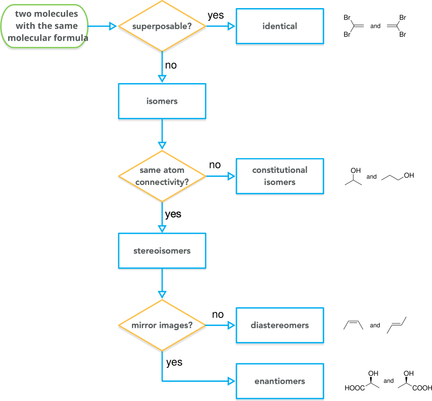
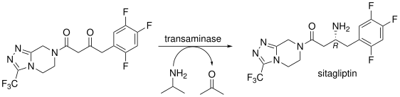
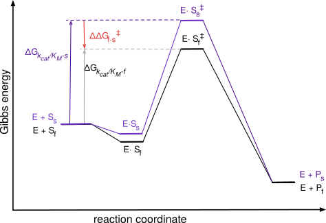

# Engineering enzyme selectivity

© 2023-2026 Romas Kazlauskas. All rights reserved. Last revised: August 2026.

**Summary.** Enzymes are often selective for one stereoisomer over another (stereoselectivity). This selectivity can refer to substrate selectivity, which involves the separation of existing compounds, or to product selectivity, which involves the creation of new compounds. The ability of enzymes to distinguish stereoisomers relies on their ability to position one isomer for reaction better than another by exploiting differences in their shapes.

Two shape rules — Prelog's rule for dehydrogenases and a related rule for esterases and lipases acting on secondary alcohols — predict which enantiomer of a substrate reacts faster, or which enantiomer of a product forms, from the relative sizes of the substituents at the stereocenter. The structural basis of these rules points to where a protein can be engineered to change or improve selectivity: within the binding pockets themselves, in the shell of residues nearby that add hydrogen bonds or electrostatic interactions without contacting the substrate, or, for a buried active site, along the tunnel that sets the substrate's orientation before it arrives. A second, independent strategy, proofreading, raises selectivity further by linking two selective steps in series so that their selectivities reinforce one another; this strategy underlies the fidelity of protein and DNA synthesis and can be adapted to biocatalysis.

**Learning goals**

- Selectivity is the ability of proteins to distinguish between different molecules. The selectivity value, S, is the ratio of the preferred to non-preferred molecule. This value depends on comparison molecules. Selective reactivity may involve discrimination between two substrates or between two products.

- Stereoselectivity is a type of selectivity where the molecules to be distinguished are stereoisomers; enantioselectivity is a type of stereoselectvity where the stereoisomer to be distinguished are enantiomers. Many pharmaceuticals require pure enantiomers and enzyme-catalyzed reactions are a good way to make these pure enantiomers.

- Discrimination between two substrates occurs when one substrate reacts faster than the other. This substrate selectivity depends on the ratio of $k_{cat}/K_M$ for the two substrates. Tighter binding allows a substrate to occupy a larger fraction of active sites, while faster reaction allows the substrate to react faster.

- When there are equal amounts of the two substrates, the initial ratio of substrates that react or products that form corresponds to the selectivity. At higher conversions, the relative amounts of substrate that reacts or product that forms differ from the selectivity because the amounts of the two substrates is no longer equal. 

- Discrimination between two products occurs when a single substrate forms two products. This product selectivity depends only on the relative values of $k_{cat}$ for the two products. The relative amount of the two products is constant throughout the reaction and corresponds to the selectivity.

- Shape rules predict which enantiomer of a substrate reacts faster, or which enantiomer of a product forms, from the relative sizes of two substituents at the stereocenter. Prelog's rule applies to ketone reduction by dehydrogenases; a similar rule applies to hydrolysis or acylation of secondary alcohols by esterases and lipases. Both rules describe an active site built from a large and a medium (or small) pocket, and both predict the sign of the selectivity but not its magnitude.

- Rational protein engineering can change or improve selectivity by targeting residues at three levels: within the binding pockets that a shape rule identifies, in the shell of residues adjacent to those pockets that add a hydrogen bond or shift electrostatics without contacting the substrate directly, or, for a buried active site, along the tunnel that orients the substrate before it arrives.

- Proofreading increases selectivity beyond what a single binding site can achieve by linking two selective steps in series, so their selectivities multiply. Because the second step also destroys some correctly made product along with the errors, proofreading always trades some yield for higher purity. This strategy underlies the fidelity of protein and DNA synthesis and can be engineered into biocatalytic processes using a second enzyme or the same enzyme acting twice.

## Introduction
Selectivity, S, is the ability to distinguish between alternatives. This ability is the key to the value of many proteins. For example, the cardiovascular antibody drug abciximab selectively binds to a receptor involved in platelet aggregation to inhibit formation of blood clots.[@collerNewMurineMonoclonal1985] In another example, a transaminase with high selectivity for the (_S_)-amine yields the required stereoisomer of a cardiovascular drug precursor with high purity.[@novickEngineeringAmineTransaminase2021] 

Binding selectivity is the ability to bind one ligand more tightly than other one and was covered in Chapter 6. This chapter focuses on reaction selectivity.

Reaction selectivity is the ability to react with one substrate more quickly than another (substrate selectivity) or form one molecule more quickly than another (product selectivity). The classification as substrate or product selectivity depends on whether there are multiple possible substrates or multiple possible products.

Reaction selectivity stems from differences in reaction rates, which originate in differences in transition state energies for the competing reactions. The ratio of rates is the selectivity for that pair of molecules, @eq-S_rxn. 

$$ S_{reaction} = \frac{rate_{fast}}{rate_{slow}} $$ {#eq-S_rxn}

The words non-selective (or promiscuous), selective and highly selective describe degrees of selectivity. Avoid using the word specific to mean highly selective because specific has a different meaning in chemistry. The reaction mechanism of a selective reaction favors the formation of a particular isomer, but both isomers can form. For example, epoxidation of norbornene (bicyclo[2.2.1]hept-2-ene) favors formation of the _exo_ diastereomer (oxygen close to the one-carbon bridge) over the _endo_ diastereomer (oxygen close to the two-carbon bridge), (@fig-selective_specific_epoxidation a). The selectivity originates the different steric hindrance between the two sides and varies with the oxidant used. A highly selective reaction may form only one detectable product, but the reaction mechanism could also form the other one. In contrast, specific reactions are those that require formation of a particular isomer for mechanistic reasons. For example, epoxidation of _cis_-2-butene can only form the _cis_-epoxide, (@fig-selective_specific_epoxidation b). Likewise, epoxidation of _trans_-2-butene can only form the _trans_-epoxide. The reaction is a concerted addition of oxygen to the double bond without an intermediate that permits rotation of the carbon-carbon bond. The reactions in this chapter all refer to selectivity. 

{#fig-selective_specific_epoxidation width=200 fig-alt="a) Epoxidation of norbornene (bicyclo[2.2.1]hept-2-ene) with an oxidant gives both the exo and endo epoxide, since the oxidant can add to either face of the double bond. b) Epoxidation of cis-2-butene with an oxidant forms only the cis-epoxide, and epoxidation of trans-2-butene forms only the trans-epoxide, because the mechanism cannot form the other diastereomer."}

## Stereoisomers
Isomers are non-superposable molecules with the same molecular formula. Isomers can differ in their atom connectivity (constitutional isomers) or only in shape (stereoisomers), (@fig-flowchart_isomers). Classifying a person as a father, son, brother or uncle depends on who the person is being compared to. In the same way, isomerism classifies relationships between molecules. A given molecule may be a diastereomer, an enantiomer or a constitutional isomer depending on the comparison molecule. For example, one may recognize that a molecule is chiral, but until one has a comparison molecule, one cannot classify the relationship between the molecules.

{#fig-flowchart_isomers fig-alt="Flowchart for classifying two molecules with the same molecular formula. If they are superposable, they are identical (example: two identical drawings of 1,1-dibromoethylene). If not, they are isomers. Isomers with different atom connectivity are constitutional isomers (example: isopropanol and 1-propanol). Isomers with the same connectivity are stereoisomers; if they are not mirror images they are diastereomers (example: cis- and trans-2-butene), and if they are mirror images they are enantiomers (example: two mirror-image lactic acid structures)."}

The concept of a stereogenic unit is also useful. A stereogenic unit is the part of the molecule that makes stereoisomers possible. Chiral molecules must contain at least one stereogenic unit. For example, the stereogenic unit in $\textsc{l}$-alanine is the $\alpha$-carbon atom containing four different substituents: HOOC-, H$_2$N-, H$_3$C-, and H. Occasionally one may encounter the term regioisomer, which refers to a special type of constitutional isomer. Regioisomers can form when a chemical reaction has different orientations or sites to choose from. For example, electrophilic aromatic substitution of bromobenzene can yield *ortho-*, *meta-*, or *para-*substituted products. These isomeric products are regioisomers. 

Researchers often use the high stereoselectivity of enzymes, especially their high enantioselectivity to prepare pure stereoisomers. Most of the examples in this chapter involve enzymes distinguishing between stereoisomers. 

### Stereoisomeric purity
There are two commonly used measures for stereoisomeric purity: the ratio of stereoisomers and the stereoisomeric excess. The enantiomer ratio, _er_, or diastereromer ratio, _dr_, is simply the relative amounts of the two stereoisomers.

$$ er \text{ or } dr = \frac{major \: stereoisomer}{minor \: stereoisomer} $$

For example, a 9:1 mixture of _cis_- and _trans_-2-butene has a diastereomeric ratio of 9. Analytic methods like HPLC or GC with columns containing a chiral stationary phase reveal the amounts of each enantiomer.  

Another measure of purity is enantiomeric excess, _ee_, usually expressed as a percent instead of a number between 0 and 1. Enantiomeric excess is the excess of the major enantiomer over the minor enantiomer in the sample, @eq-define_ee. For example, a 9:1 mixture of two enantiomers has an 80% ee. Diastereomeric excess, _de_, is defined similarly.

$$ ee \text{ or } de = \frac{major-minor}{major+minor} $$ {#eq-define_ee}

This unusual way to express purity stems from the historic use of optical rotation to measure enantiomeric purity. Enantiomers rotate plane-polarized light in opposite directions. A racemic sample shows no rotation because the opposite rotations of the two enantiomers cancel out. A racemic sample has an ee of 0%. If one enantiomer is present in excess, then the excess amount of that enantiomer causes a rotation. The enantiomeric excess in percent is the size of that rotation as a fraction of the rotation for the pure enantiomer. 

To convert enantiomeric excess to amounts of the individual enantiomers, one can imagine the sample to consist of an excess amount of the major enantiomer, $ee$, plus an amount of racemate $1-ee$. The total amount of major enantiomer is the excess amount plus half of the racemate, @eq-major_amount.

$$ major_{total} = major_{excess} + \frac{racemate}{2} = ee + \frac{1-ee}{2} $$ {#eq-major_amount}

The total amount of the minor enantiomer is half of the amount of the racemate, @eq-minor_amount.  

$$ minor_{total} = \frac{racemate}{2} = \frac{1-ee}{2} $$ {#eq-minor_amount}

For example, a sample with an enantiomeric purity of 80% ee consists of 80% major enantiomer in excess plus 20% racemate. Thus, the sample contains 90% of the major enantiomer and 10% of the minor enantiomer.

## Product selectivity
Product selectivity occurs when an enzyme converts a substrate into several possible products and favors one or more of the possibilities. Product selectivity involves the _creation_ of two possible products from a single substrate. For example, an enantioselective transaminase catalyzes the key step in the synthesis of sitagliptin, a type 2 diabetes drug,[@savileBiocatalyticAsymmetricSynthesis2010] @fig-sitagliptin_synthesis. The reaction is highly selective for one of the two possible enantiomers. Enantioselectivity is a particularly useful type of selectivity since pure enantiomers are difficult to make with traditional chemical methods. Enantiomers can differ in their biological effects, so most chiral drugs are marketed as single enantiomers.
 
{#fig-sitagliptin_synthesis width=300 fig-alt="A transaminase converts an achiral triazolopyrazine diketone (bearing a trifluoromethyl group and a 2,4,5-trifluorophenyl group) into the (R)-amine sitagliptin, using isopropylamine as the amino donor and releasing acetone. Only the (R)-amine product, sitagliptin, is shown; the enantiomeric (S)-amine is not drawn since it forms only in trace amounts."}

Product selectivity depends on the ratio of $k_{cat}$ values for the two products, @eq-product_selectivity. The subscript $f$ refers to the faster-reacting substrate and subscript $s$ refers to the slower reacting substrate. There is no contribution from binding, ${K_M}$, because there is only one substrate, so no competition is possible, @fig-delG_product_selectivity. The Gibbs energy difference between the two transition states is proportional to the natural logarithm of the selectivity, @eq-deldelG_prod_select.

$$ S_{product} = \frac{(k_{cat})_f}{(k_{cat})_s}$$ {#eq-product_selectivity}

$$ \Delta \Delta G_{f-s} = -RTln(S_{product})$$ {#eq-deldelG_prod_select}

{#fig-delG_product_selectivity width=300 fig-alt="Gibbs energy diagram showing one enzyme-substrate complex, E·S, proceeding over two competing transition states, E·S‡_f (lower energy, purple) and E·S‡_s (higher energy, dashed), to two different products, P_f and P_s. The energy difference between the two transition states, ΔΔG‡_(f-s), sets the product selectivity."}

To measure product selectivity one measures the relative amounts of the products formed. The ratio of the products corresponds to the selectivity. This ratio remains constant as the reaction proceeds because the starting material never changes; it just decreases in amount. The two equations in @eq-E_ee_asymm_synth are convenient way to calculate the enantiomeric ratio from a measured enantiomeric excess or to predict an enantiomeric excess from a known enantiomeric ratio.

$$E = \frac{1+ee}{1-ee}\quad \text{and} \quad ee = \frac{E-1}{E+1}$$ {#eq-E_ee_asymm_synth}

## Substrate selectivity
Substrate selectivity occurs when two substrates compete in the same solution. An enzyme encounters similar substrates, but reacts with some of them more rapidly than others. Proteases are a good example of substrate selectivity. Substrate selectivity involves a _separation_; the two substrates already exist and the selective reaction will transform one of them. A peptide contains multiple peptide links each of which is a different potential substrate. Proteases often favor hydrolysis of some of these links over others. For example, trypsin favors hydrolysis of peptide links after lysine or arginine residues, @fig-trypsin_cleavage a. The example peptide contains fifteen amide links (fifteen possible substrates), but trypsin cleaves only two of these due to its substrate selectivity.

![Proteases are often selective in which peptide links they cleave. a) Trypsin cleaves only two of the fifteen amide links in peptide shown. Trypsin is selective for amide links on the C-terminal side of lysine and arginine residue, except when followed by proline. b) The binding sites in the protease are numbered to indicate their distance from the catalytic site. The sites S1, S2, S3, etc. bind the N-terminal part of the peptide, while the sites S1$^\prime$, S2$^\prime$, S3$^\prime$, etc. bind the C-terminal part of the peptide. The peptide residue naming matches the names of the binding sites: P1, P2, P3, etc. in the direction of amino terminus of the peptide and P1$^\prime$, P2$^\prime$, P3$^\prime$, etc. in the direction of the carboxy terminus. The peptide residue naming changes as different amide bonds are positioned at the cleavage site.](figures/chapter8/trypsin_cleavage.svg){#fig-trypsin_cleavage width=300 fig-alt="a) A 15-residue peptide (Asn-Arg-Arg-Pro-Glu-Asn-Phe-Ile-Ala-Lys-Glu-Cys-Glu-Ser-Ala-Trp) is cleaved by trypsin and water at only two of its fourteen peptide bonds, both on the C-terminal side of an arginine or lysine residue (highlighted in green), giving three fragments: Asn-Arg, Arg-Pro-Glu-Asn-Phe-Ile-Ala-Lys, and Glu-Cys-Glu-Ser-Ala-Trp. b) Diagram of protease subsite nomenclature: the peptide backbone is labeled ...-P3-P2-P1-P1'-P2'-P3'-... with cleavage occurring between P1 and P1', and the corresponding enzyme binding subsites are labeled S3-S2-S1-S1'-S2'-S3'."}

Protease nomenclature describes how the peptide orients in the protease when cleavage occurs,[@schechterSizeActiveSite1967] @fig-trypsin_cleavage b. The numbering of the binding sites, S, indicates their distance from the catalytic site where cleavage occurs: ....S3-S2-S1-S1$^\prime$-S2$^\prime$-S3$^\prime$... The sites numbered without primes bind the N-terminal part of the peptide, while the sites numbered with primes bind the C-terminal part of the peptide. The sites bind both the side chains and main chain of the peptide. The catalytic site lies between the S1 and S1$^\prime$ sites and cleaves the peptide bond connecting the two residues bound in those sites. The numbering of the enzyme sites is fixed by the location of the catalytic residues. The numbering of the peptide substrate varies when different amide links are positioned at the cleavage site. The peptide numbering matches the binding sites at which it binds: NH$_2$....P3-P2-P1-P1$^\prime$-P2$^\prime$-P3$^\prime$...COOH. Trypsin is selective for peptide links with lysine or arginine at the P1 position, except when the P1$^\prime$ amino acid is proline. The proline at P1$^\prime$ presumably disrupts catalytically productive binding.

Substrate selectivity originates from both the ability of the enzyme to bind the good substrate and also to catalyze a reaction on the good substrate. The good substrate must succeed at both, while the poor substrate may fail at either step. Poor substrates either do not bind to enzyme or bind in a way that does not lead to reaction. The selectivity between the two depends on both $k_{cat}$ and ${K_M}$, @eq-substrate_selectivity, where subscript f refers to the faster-reacting substrate and subscript s refers to the slower reacting substrate.

$$ S_{substrate} = \frac{(k_{cat}/K_M)_f}{(k_{cat}/K_M)_s}$$ {#eq-substrate_selectivity}

The tighter binding substrate will occupy a larger fraction of the enzyme active sites, while the faster catalytic step will convert more of that substrate to product. The Gibbs energy diagram, @fig-delG_substrate_selectivity, shows these two contributions to substrate selectivity graphically. In this diagram, both $k_{cat}$ and ${K_M}$ favor the faster-reacting substrate, but it is also possible that they favor different substrates, in which case the competing effects lead to a lower net selectivity. 

{#fig-delG_substrate_selectivity width=300 fig-alt="Gibbs energy diagram for two competing substrates, S_f (purple, faster-reacting) and S_s (black, slower-reacting), with free enzyme E. The faster substrate forms E·S_f at lower energy than E·S_s forms, and its transition state E·S‡_f is also lower in energy than E·S‡_s; the overall energy difference, ΔΔG‡_(f-s), combines contributions from both binding and catalysis. Both pathways end at similarly low energy, E+P_f and E+P_s."}

For the trypsin example, the different ${K_M}$'s refer to the binding of different amide bonds in the catalytic site. To estimate $K_M$ for the different amide bonds one could measure $K_M$ using substrate analogs that contain only one type of amide bond.

A common special case of substrate selectivity occurs when the two competing substrates are enantiomers. In this case the reaction is a kinetic resolution. The word resolution refers to a separation of enantiomers, while kinetic specifies that the separation relies on differences in the rates of reaction. For example, the manufacture of diltiazem, a calcium-channel blocker uses a kinetic resolution to make an enantiomerically-pure precursor,[@shibataniEnzymaticResolutionDiltiazem2000] @fig-diltiazem_precursor_resolution. Starting from a racemic mixture, the lipase catalyzes the hydrolysis of the unwanted enantiomer to the carboxylic acid, which spontaneously decarboxylates. 

{#fig-diltiazem_precursor_resolution width=300 fig-alt="A racemic mixture of two enantiomeric methyl esters (each bearing a 4-methoxyphenyl group, an epoxide, and a methyl ester) is treated with a lipase from Serratia marcescens in a toluene-water/sodium bisulfite membrane reactor. The lipase selectively hydrolyzes one ester enantiomer to the carboxylic acid, which decarboxylates and loses methanol as it crosses into the aqueous phase, while the other, unreacted ester enantiomer, (+)-(2R,3S)-MPGM, is recovered unchanged as the desired diltiazem precursor."}

In some cases, reversing the reaction reverses its classification as substrate selective or product selective. Reversing the reaction in @fig-sitagliptin_synthesis by starting with a racemic mixture of amines and converting them to the ketone would create a case of substrate selectivity. The transaminase would convert the favored (_R_)-amine to the ketone leaving the (_S_)-amine unchanged and an example of a kinetic resolution. The disadvantage of a kinetic resolution is that the maximum yield of each enantiomer is 50\%. If the purpose of the reaction is the manufacture of a precursor to make an enantiomerically-pure drug, then only one of the enantiomers will be useful. In contrast, the maximum yield of pure enantiomer in the product selectivity case is 100\%.

### Measuring selectivity in kinetic resolutions
One way to measure reaction selectivity in a substrate selectivity case is to measure the amounts of substrates consumed or products formed at very low conversion (<5\%), eqs. @eq-substr_select_subs_low_conv or @eq-substr_select_prod_low_conv. At low conversion 

$$ S_{substrate} = \frac{\text{(amount of substrate reacted)}_f}{\text{(amount of substrate reacted)}_s} \text{ at low conversion} $$ {#eq-substr_select_subs_low_conv}

$$ S_{substrate} = \frac{\text{(amount of product formed)}_f}{\text{(amount of product formed)}_s} \text{ at low conversion} $$ {#eq-substr_select_prod_low_conv}

The low conversion is required so that the ratio of the two substrates remains constant over the time of the measurement. The equations @eq-substr_select_subs_low_conv and @eq-substr_select_prod_low_conv above also assume equal starting concentrations of the two substrates. 

It is often inconvenient to measure the amounts of substrate consumed or product formed at low conversion. In these cases one must use more complex equations. These equations account for the fact that the composition of the substrate changes as the reaction proceeds. The relative amount of the slow-reacting substrate increases as the reaction depletes the fast-reacting substrate, @fig-perfect_resolution.

![Variation of enantiomeric excess for a perfect kinetic resolution as a function of conversion. As the reaction proceeds from 0\% to 50\% conversion, the remaining starting material is enriched in the slow reacting enantiomer. At 50\% conversion, the product consists of the fast-reacting enantiomer, while the substrate consists of the slow reacting enantiomers. The reaction should be stopped at this point. If the reaction is continued, then the enantiomeric excess of the product will decrease as it becomes contaminated with the slow-reacting enantiomer.](figures/chapter8/perfect_resolution.svg){#fig-perfect_resolution width=300 fig-alt="Graph of enantiomeric excess (%, y-axis) versus conversion (%, x-axis) for a perfect kinetic resolution. A dotted line labeled 'product' stays flat at 100% ee across the whole range. A solid line labeled 'remaining starting material' rises linearly from 0% ee at 0% conversion to 100% ee at 50% conversion, then falls linearly back to 0% ee at 100% conversion."}

The amount of enrichment varies depending on the enantioselectivity of the reaction, @fig-imperfect_kinetic_resolution

![Predicted enantiomeric excess of product ($ee_p$, solid) and remaining substrate ($ee_s$, dashed) as a function of conversion for an enzyme with a moderate enantioselectivity of $E = 9.7$. Equation @eq-E_eep and experimental measurement of $ee_p = 74$% and $c = 34$% (circle) reveals the enantioselectivity of this reaction. The theoretical curves shown are calculated from this enantioselectivity. Product ee is highest at low conversion (~81%) and falls toward 0% as conversion approaches 100%, as the faster-reacting enantiomer is depleted. Substrate ee starts near 0% and rises toward 100% as conversion approaches completion, reflecting progressive enrichment of the remaining substrate pool in the slower-reacting enantiomer.](figures/chapter8/imperfect_kinetic_resolution.svg){#fig-imperfect_kinetic_resolution width=400 fig-alt="Two-panel figure. Left: pig liver esterase-catalyzed hydrolysis of a chiral methyl ester bearing a 2-methylallyl group and two methyl-bearing stereocenters — the major-reacting enantiomer reacts fast to give the acid as the major product, while its enantiomer, the major remaining starting material, reacts slowly. Right: graph of enantiomeric excess (%, y-axis) versus conversion (%, x-axis) for an enzyme with E = 9.7. The product ee (ee_p, solid line) starts near 81% at low conversion and falls toward 0% as conversion approaches 100%. The substrate ee (ee_s, dashed line) starts near 0% and rises toward 100% as conversion approaches 100%. An open circle marks the experimental data point at 34% conversion and 74% product ee."}

The equation below [@chenQuantitativeAnalysesBiochemical1982] predicts the enantioselectivity, _E_, from the conversion (_c_, value between zero and one) and the enantiomeric excess of the product, $ee_p$, @eq-E_eep.

$$E =\frac{\ln[1-c(1+ee_p)]}{\ln[1-c(1-ee_p)]}$$ {#eq-E_eep}

To measure enantioselectivity, one measures two of the three variables: $c, ee_p, ee_s$. Then, use @eq-E_eep to calculate $E$ from $c$ and $ee_p$, @eq-E_ees to calculate $E$ from $c$ and $ee_s$, or @eq-E_eep_ees to calculate $E$ from $ee_p$ and $ee_s$. Note that you can calculate $c$ from $ee_p$ and $ee_s$ using $c = \frac{ee_s}{ee_s + ee_p}$. For example, the data point in @fig-imperfect_kinetic_resolution shows a measurement of _c_ = 34.0% and $ee_p$ = 74.0%, which corresponds to $E = 9.7$ and could be used to calculate the theoretical lines.

$$E =\frac{\ln[(1-c)(1+ee_s)]}{\ln[(1-c)(1-ee_s)]}$$ {#eq-E_ees}

$$E = \frac{ln \left[ \frac{1-ee_s}{1 - (ee_s/ee_p)} \right]}{ln \left[ \frac{1-ee_s}{1 + (ee_s/ee_p)} \right]}$$ {#eq-E_eep_ees}

A web tool that encodes these equations simplifies this calculation: \url{http://biocatalysis.uni-graz.at/biocatalysis-tools/enantio}. Entering any two of the following values $ee_p$, $ee_s$, or $c$, returns the enantioselectivity for the reaction and a graph similar that in @fig-imperfect_kinetic_resolution.

However, if you already know the enantioselectivity and would like to calculate the conversion needed to get a certain enantiomeric excess of the product, then you must use an iterative method to solve the equation because you cannot rearrange @eq-req_iterate to solve for _c_. For example, if your reaction has an enantioselectivity of 35 and you would like the enantiomeric excess of the product to be at least 92% ee, then

$$35 =\frac{\ln[1-c(1.92)]}{\ln[1-c(0.08)]} $$ {#eq-req_iterate}

Solving this equation iteratively using the Python script in the supporting information (Code Block S8.1) yields _c_ = 0.295. (Less elegantly, one can also try different values of $c$ with $ee_p = 92\%$ in the web tool cited above until the calculated enantioselectivity matches 35.) If you try to solve @eq-req_iterate for _c_ when $ee_p$ is a higher value of 95\% ee, you get a negative value for _c_ indicating that is it impossible. An enantioselectivity of 35 is too low to ever yield product with 95% ee.

Equation @eq-E_eep and the discussion above apply to effectively irreversible reactions like the ester hydrolysis examples given. If the resolution reaction is reversible, it will be less efficient and follow another equation[@chenQuantitativeAnalysesBiochemical1987] that takes reversibility and the equilibrium constant into account. An example of such a reversible reaction is the hydrolase-catalyzed ester formation from an acid and alcohol in organic solvents. 

### Dynamic kinetic resolution

A dynamic kinetic resolution combines a kinetic resolution with an _in situ_ racemization of the substrate to overcome the limitation of a maximum of 50\% yield, @fig-dynamic_kinetic_resolution. The enantioselective enzyme converts the fast-reacting enantiomer to product, while the racemization replenishes the fast-reacting enantiomer. At the end of the reaction all of the substrate has been converted to product in up to 100\% yield.

{#fig-dynamic_kinetic_resolution width=300 fig-alt="5-Phenylhydantoin, with its stereocenter labeled L or D, interconverts (racemizes) at pH > 8 through a ring-opened hydrolysis intermediate. A D-selective hydantoinase hydrolyzes only the D-enantiomer of 5-phenylhydantoin to N-carbamoyl-D-phenylglycine, which is a precursor in the manufacture of the antibiotic ampicillin, shown grayed out with the carbamoylphenylglycine portion of its structure in black."}

The requirements for a dynamic kinetic resolution are: (1) the substrate must racemize faster than the subsequent enzymatic reaction, (2) the product must not racemize, and (3) the enzymatic reaction must be highly enantioselective. The equations relating product enantiomeric purity and enzyme enantioselectivity are the same as those for an asymmetric synthesis, @eq-E_ee_asymm_synth above.

A dynamic kinetic resolution shares elements of both a kinetic resolution and an asymmetric synthesis. Like a kinetic resolution, it relies on an existing stereocenter and the substrate selectivity of the enzyme. Like an asymmetric synthesis it yields up to 100\% of one enantiomer. A dynamic kinetic resolution is classified as an asymmetric transformation of the second kind because it is neither a kinetic resolution (only one enantiomer results) nor an asymmetric synthesis (the stereocenter already exists in the substrate).

## Molecular basis of stereoselectivity
### Ketoreductases/alcohol dehydrogenases {#sec-prelog}
Since stereoisomers differ only in shape, the only way to distinguish them is by their shapes. In two cases - reduction of ketones and hydrolysis of secondary alcohol esters - researchers have proposed simple models that predict the favored enantiomer based on the relative sizes of the substituents. These models imply that enzymes also choose the favored enantiomer based on the relative sizes of the substituents and that all such enzymes have similarly-shaped active sites.

Ketoreductases/alcohol dehydrogenases are NAD(P)(H)-dependent enzymes that catalyze the interconversion of alcohols and the corresponding carbonyl compounds. The two enzyme names are synonyms. Ketoreductase refers to the reduction of carbonyl compounds with NAD(P)H, while alcohol dehydrogenase refers to the oxidation of carbonyl compounds with NAD(P)$^+$. The favored direction depends on the substrate and reaction conditions, not the enzyme. Most of the examples below are reductions that form a stereocenter. 

In the 1960's Prelog carried out many yeast-catalyzed reductions of ketones and noticed that the product alcohols usually had a similar shape. He proposed a simple model or rule based on the relative sizes of the ketone substituents.[@prelogSpecificationStereospecificityOxidoreductases1964] The rule states that yeast-catalyzed reductions of ketones yield the alcohol enantiomer shown below where L represents a larger substituent and S represents a smaller substituent, @fig-Prelog_rule a. If the priorities of the substituents are O > L > S, then the alcohol has the (_S_)-configuration. The example reactions in @fig-Prelog_rule b proceed according to Prelog's rule yielding the alcohols shown with high enantiomeric purity. Note that the stereochemical descriptors for the product alcohols differ because the priority of the small substituent (methyl or chloromethyl) changes. Prelog's rule defines the shape of the molecule, not the (_R,S_) naming of the alcohol. 

![Prelog's rule predicts which alcohol enantiomer forms faster during the alcohol-dehydrogenase-catalyzed reduction of ketones. The rule is based on the relative sizes of the ketone substituents. a) Dehydrogenase-catalyzed reduction of ketones favors formation of the enantiomer shown where L is a large substituent and S is a small substituent. b) Yeast alcohol dehydrogenase YMR226c catalyzes the reduction of acetophenone and $\alpha$-chloroacetophenone according to Prelog's rule. The shape of both product alcohols matches the shape predicted by Prelog's rule despite their opposite (_R,S_) designation the chlorine substituent.](figures/chapter8/Prelog_rule.svg){#fig-Prelog_rule width=300 fig-alt="a) General scheme: an alcohol dehydrogenase interconverts a ketone bearing a large substituent L and a small substituent S with the corresponding alcohol, using NAD(P)H/NAD(P)+. b) Yeast alcohol dehydrogenase YMR226c reduces acetophenone (phenyl and methyl substituents) with NADPH to (S)-1-phenylethanol, and reduces the related α-chloroacetophenone (phenyl and chloromethyl substituents) with NADPH to (R)-2-chloro-1-phenylethanol — both products have the same three-dimensional shape despite their opposite R/S labels, because methyl and chloromethyl rank differently relative to phenyl in size versus in CIP priority."}

To test if a reductase reaction fits Prelog's rule one first orients the product alcohol so that 1) C–O bond points upward to the top of the page and 2) C–O bond points out of the plane of the page toward the reader. In this orientation, if the large substituent lies to the left, then the reaction follows Prelog's rule. Prelog's rule is based on the relative sizes of the substituents, not on Cahn–Ingold–Prelog (CIP) ranking of the substituents, which is based on atomic numbers. When the larger substituent has higher CIP ranking than the smaller substituent, then Prelog's rule  predicts formation of the (*S*)-alcohol, but if the smaller substituent has the higher CIP ranking, then Prelog's rule predicts formation of the (*R*)-alcohol. The reliable way to use Prelog's rule is to predict the shape first, then assign the descriptor. A second caution is that the effective size of the substituents is conformationally averaged. A flexible *n*-alkyl chain folds and behaves as smaller than a rigid substituent of similar molecular weight, so *n*-hexyl is "small" relative to phenyl.

The transition state for an alcohol-dehydrogenase-catalyzed reduction of a ketone orients the carbonyl carbon of the ketone near the hydride of the reduced nicotinamide, @fig-ketone_ts. There are two ways, differing by a $180^{\circ}$ rotation along the carbonyl C–O bond, to orient the ketone. These two orientations yield opposite enantiomers and place the large and small substituents in different regions of the enzyme. Prelog's rule implies that most alcohol dehydrogenases have similarly shaped regions that bind the ketone and that the shape more closely matches the top transition state in @fig-ketone_ts

{#fig-ketone_ts width=300 fig-alt="Two alternative transition states for alcohol-dehydrogenase-catalyzed reduction of a ketone bearing large (L) and small (S) substituents, each showing hydride transfer (curved arrow) from the nicotinamide ring's C4-H to the ketone carbonyl carbon and simultaneous protonation of the carbonyl oxygen by an active-site acid, H-B+. The two transition states differ by a 180° rotation of the ketone about its carbonyl C-O bond, so L and S swap sides, and each leads to a different alcohol enantiomer; the top transition state, with L on the left and S on the right, is the one matching Prelog's rule."}

The x-ray crystal structures of alcohol dehydrogenases show that most of them have ketone-binding regions that match Prelog's rule, @fig-Prelog_rule_DH_pockets. These pockets orient the ketone for reaction. In this example, the substrate is not a ketone, but an aldehyde so that both orientations yield an achiral alcohol. Nevertheless, the structure shows the large and small pockets.

![Active site of yeast alcohol dehydrogenase containing bound NAD$^+$ and 1,1,1-trifluoroethanol (pdb id: 5ehv). The nicotinamide ring of NAD$^+$ is at the bottom, while the 1,1,1-trifluoroethanol is coordinated to the catalytic zinc at the top. The side chains of His66, Cys153 and Cys43 (not visible) coordinate the catalytic zinc. Oxidation of 1,1,1-trifluoroethanol involves transfer of a hydride from the alcohol to the nicotinamide C4 along the red dotted line. The distance from nicotinamide C4 carbon and the C2 of 1,1,1-trifluoroethanol is 3.5 Å suggesting a catalytically productive orientation. The yellow surface shows the limits of the active site pocket. The large pocket containing the trifluoromethyl substitutent and the small pocket containing a hydrogen substituent are marked by white dashed curves.](figures/chapter8/Prelog_rule_DH_pockets.svg){#fig-Prelog_rule_DH_pockets width=300 fig-alt="Close-up view of the active site of yeast alcohol dehydrogenase (PDB 5ehv), rendered as a molecular surface (yellow) with bound ligands as sticks. The nicotinamide ring of NAD+ lies at the bottom; 1,1,1-trifluoroethanol is coordinated near the top by the catalytic zinc, with the His66 side chain (and Cys153, not visible) shown coordinating the zinc, labeled 'catalytic zinc.' A red dotted line marks the 3.5 Å hydride-transfer distance between the nicotinamide C4 and the trifluoroethanol carbon. White dashed curves outline a small pocket near His66 (holding the alcohol's hydrogen substituent) and a large pocket (holding the trifluoromethyl group)."}

Three approaches to increase the enantioselectivity of reductases are substrate modification, screening for a more enantioselective enzyme, and engineering a more enantioselective enzyme. Reductases usually show higher enantioselectivity toward ketones with larger size differences between the two substituents. For example many reductases show high enantioselectivity toward acetophenone, which has phenyl and methyl as the ketone substituents. In contrast, most reductases show low enantioselectivity toward 3-hexanone, which has ethyl and _n_-propyl substituents. Thus, choosing a substrate with larger differences in size in the two substituents will often increase the enantioselectivity. 

In some cases, the synthetic goal, say a pharmaceutical precursor, requires reducing a ketone with similarly-sized substituents. In these cases, the choices are screening for more enantioselective reductases or engineering a more enantioselective reductase by modifying the binding pockets. For example, enantioselective reduction of 3-hexanone requires the enzyme to distinguish between an ethyl and an n-propyl substituent. Most alcohol dehydrogenases show low enantioselectivity, presumably because they have difficulty distinguishing between the similarly-sized substituents. Koesoema and coworkers found a yeast enzyme that showed high enantioselectivity (E >200 favoring the (_S_)-enantiomer).[@koesoemaStructuralBasisHighly2019] An x-ray crystal structure of the enzyme suggested that Trp288 limits the size of the small pocket. Docking suggests that the ethyl substituent fit in the small pocket, but fitting the _n_-propyl group in the small pocket places the ketone group too far from the catalytic zinc. The non-productive orientation prevents formation of the (_R_)-enantiomer. 

In an engineering example, the manufacture of an antibiotic required the reduction of tetrahydrothiophene-3-one, where the difference in size stems from a CH$_2$ versus a sulfur, @fig-tetrahydrothiophene-3-one_reduction.[@liangHighlyEnantioselectiveReduction2010] The initial enzyme showed poor enantioselectivity (_E_ = 4.4), but evolution to modify the substrate binding pockets dramatically increased the enantioselectivity to _E_ = 285. 

{#fig-tetrahydrothiophene-3-one_reduction width=200 fig-alt="A ketoreductase reduces tetrahydrothiophen-3-one, a five-membered ring containing a sulfur atom and a ketone, to the corresponding chiral alcohol. The wild-type enzyme shows an enantioselectivity of E = 4.4, while an evolved variant shows a much higher enantioselectivity of E = 285."}

### Esterases and lipases {#sec-kazrule}

Prelog's rule in the previous section and the rule introduced here are both shape rules: each reduces a three-dimensional recognition problem to a comparison of the sizes of two substituents, and each predicts a favored enantiomer. However, they apply to different enzymes and they answer different questions, @tbl-two-rules.

Prelog's rule describes an enantioselective *synthesis*. The substrate is a prochiral ketone without a stereocenter; the dehydrogenase delivers hydride to one face, and the rule predicts which face, and therefore which enantiomer of the alcohol is *created*. The rule below describes a kinetic *resolution*. The stereocenter already exists, the substrate is normally racemic, and the rule predicts which of the two enantiomers reacts faster - which one is consumed, not which one is made.

+------------------------+-----------------------------------+-----------------------------------+
|                        | **Prelog's rule**                 | **Rule for secondary alcohols**   |
+========================+===================================+===================================+
| Enzymes                | Dehydrogenases, ketoreductases    | Esterases, lipases                |
+------------------------+-----------------------------------+-----------------------------------+
| Substrate              | Prochiral ketone; no stereocenter | Chiral alcohol or ester, usually  |
|                        |                                   | racemic                           |
+------------------------+-----------------------------------+-----------------------------------+
| Question answered      | Which face is attacked, hence     | Which of two existing enantiomers |
|                        | which enantiomer forms            | reacts faster                     |
+------------------------+-----------------------------------+-----------------------------------+
| Type of process        | Enantioselective synthesis        | Kinetic resolution                |
+------------------------+-----------------------------------+-----------------------------------+
| Maximum yield of one   | 100%                              | 50%                               |
| enantiomer             |                                   |                                   |
+------------------------+-----------------------------------+-----------------------------------+
| Product *ee* during    | Constant                          | Decreases with conversion         |
| the reaction           |                                   |                                   |
+------------------------+-----------------------------------+-----------------------------------+
| Site of reaction       | At the stereocenter               | Adjacent to the stereocenter      |
+------------------------+-----------------------------------+-----------------------------------+

: Two shape rules that answer different questions. {#tbl-two-rules}

The last row of @tbl-two-rules is the one that matters mechanistically, and we return to it in @sec-kazrule-basis: because the hydrolase reaction occurs *next to* the stereocenter rather than at it, the disfavored enantiomer has ways to bind non-productively that are unavailable in a dehydrogenase reaction.

**Rule for secondary alcohols and their esters**

Draw the substrate with the oxygen—the hydroxyl group in an acylation or the ester oxygen in a hydrolysis—pointing out of the page toward the reader. Extend the C–O bond as a line that divides the molecule in two. The enantiomer with the **larger substituent on the right** is the one that reacts faster, @fig-kazrule.[@kazlauskasRulePredictWhich1991; @weissflochMolecularBasisEmpirical2000] A similar rule applies to primary amines of the type RR'CHNH~2~, which are isosteric with secondary alcohols.

{#fig-kazrule width=350 fig-alt="Rule for secondary alcohols and esters, shown for both reaction directions, each drawn with a medium substituent M and large substituent L around the stereocenter. Top: hydrolysis of a racemic ester by lipases or esterases in water — the enantiomer with L on the right reacts faster, giving the alcohol as the major product plus a carboxylate anion and a proton; its slower-reacting mirror-image ester (M and L swapped) is shown unreacted alongside it. Bottom: acylation of a racemic alcohol by lipases or esterases in an organic solvent, using an isopropenyl ester as acyl donor — again the enantiomer with L on the right reacts faster, giving the ester as the major product plus acetone and a proton."}

Note that the drawing convention is not the one used for Prelog's rule, and the two should not be applied to the same picture. Prelog's rule is set up in the plane of the carbonyl group, looking at a trigonal carbon; this rule is set up along the C–O bond of a tetrahedral stereocenter. Sketching the substrate afresh for whichever rule is in play avoids most errors. Like Prelog's rule, the secondary alcohol rule is based on the relative sizes of the substituents, not on Cahn–Ingold–Prelog ranking.

The rule applies to all lipases and esterases, including cholesterol esterase, *Burkholderia cepacia* lipase, lipases from several *Pseudomonas* species, lipase from *Rhizomucor miehei*, lipase B from *Candida antarctica* (CAL-B), and porcine pancreatic lipase. *Candida rugosa* lipase (CRL) follows it for cyclic secondary alcohols such as menthol, but not reliably for acyclic ones. Because lipases are poor amidases, the extension to primary amines is useful only in the acylation direction. As with Prelog's rule, there are exceptions to the rule.

#### The structural basis of lipase enantioselectivity toward secondary alcohols {#sec-kazrule-basis}

X-ray structures of phosphonate transition-state analogues bound to CRL show why the rule works.[@cyglerStructuralBasisChiral1994] The alcohol-binding site contains one large hydrophobic pocket and one medium pocket that match the sizes of the two substituents, @fig-crl_pockets. The isopropyl-bearing half of the cyclohexyl ring occupies the large pocket; the methyl-bearing half occupies the medium pocket. Thus, the alcohol-binding site of CRL contains pockets to bind medium and large substituents and resembles the shape in the secondary alcohol rule.

![X-ray structure of lipase from *Candida rugosa* showing large- and medium-sized pockets that bind substituents of a secondary alcohol. A) CRL catalyzes the hydrolysis of menthyl esters with high enantioselectivity, favoring (1*R*)-menthyl heptanoate. B) Reaction of CRL with the phosphonyl chloride shown covalently binds a transition-state analog of (1*R*)-menthyl heptanoate hydrolysis in the active site. C) An X-ray structure of the CRL-phosphonate reveals a large hydrophobic pocket created by Phe296, Leu297, Phe344, and Phe345 (green spheres) that binds the large isopropyl substituent. A medium-sized pocket binds the methyl-bearing half of the cyclohexyl ring. The phosphorus (magenta sticks) binds covalently to the catalytic Ser209 (orange spheres) and near the catalytic His449 (blue spheres).](figures/chapter8/crl_pockets.svg){#fig-crl_pockets width=400 fig-alt="Three-panel figure. A) Structure of (1R)-menthyl heptanoate, the fast-reacting enantiomer, showing the cyclohexane ring with isopropyl and methyl substituents and a heptanoate ester. B) Candida rugosa lipase (CRL) reacts with a phosphonyl chloride analog of the same menthol skeleton at catalytic Ser209, forming a covalent phosphonate transition-state-analog adduct and releasing HCl. C) Molecular graphics view of the CRL active site, showing the phosphonate-menthol adduct as cyan sticks bound covalently to Ser209, a large hydrophobic pocket formed by green space-filling residues Phe296, Leu297, Phe344, and Phe345 enclosing the isopropyl substituent, and catalytic His449 shown as blue spheres nearby; a yellow semi-transparent surface outlines the overall active-site cavity."}

The phosphonate inhibitor corresponding to the fast-reacting enantiomer of menthol not only fits in the active site, but also fits in a catalytically productive orientation, @fig-fast_vs_slow_Hbonds. The alcohol oxygen points toward His449 and accepts a hydrogen bond. This hydrogen bond could speed protonation of this oxygen as the alcohol group leaves during CRL-catalyzed hydrolysis. In contrast, the phosphonate inhibitor corresponding to the slow-reacting enantiomer of menthol fits into the active site, but not in a catalytically productive orientation. The large substituent binds in the large pocket and the medium substituent in the medium pocket, but the catalytic hydrogen bond to His449 is missing. The mirror-image shape of the slow-reacting enantiomer points the alcohol oxygen away from His449, instead of toward His449 as in the fast-reacting enantiomer. In addition, the mirror-image shape of the slow-reacting enantiomer points the isopropyl substituent at His449, causing it to turn and further making formation of the catalytic hydrogen bond difficult. Thus, the slow-reacting enantiomer fits, but its enantiomeric shape creates a non-reactive orientation.

![The phosphonate mimicking the fast-reacting enantiomer (left) contains a catalytically essential hydrogen bond (green atoms). This hydrogen bond allows the catalytic histidine to protonate the leaving alcohol oxygen as the alcohol group leaves. This hydrogen bond is missing in the phosphonate for the slow-reacting enantiomer (right) because of its different shape. The C–O bond points toward the histidine in the fast-reacting enantiomer, but away from the histidine in the slow-reacting enantiomer.](figures/chapter8/fast_vs_slow_Hbonds.svg){#fig-fast_vs_slow_Hbonds width=250 fig-alt="Two active-site diagrams comparing phosphonate transition-state analogs for the fast- and slow-reacting menthol enantiomers bound to Candida rugosa lipase. Left (fast, 1R): the phosphonate oxygen points toward the imidazole NH of His449, forming a hydrogen bond (green dashed line) that positions the histidine to protonate the leaving alcohol oxygen. Right (slow, 1S): because of the enantiomer's mirror-image shape, the C–O bond points away from His449, so this hydrogen bond cannot form, and the isopropyl substituent instead points toward the histidine (highlighted by a red curved arrow)."}

The fast enantiomer satisfies three features simultaneously: L in the large pocket, M in the medium pocket, and the oxygen oriented for the hydrogen bond to histidine. The slow enantiomer cannot satisfy all three. It can compromise in four ways, @fig-fit_slow_alc. One is seen in the X-ray structure: the oxygen is not oriented to make the catalytically important hydrogen bond to His449. Another compromise is to place the L substituent in the M pocket and the M substituent in the L pocket. Ensuring the M and L differ significantly in effective size minimizes this possibility. The two rightmost compromises are unlikely because they place the M or L substituent where the hydrogen bond forms in the fast-reacting enantiomer—this region is simply too small to fit an M or L substituent. Consistent with this picture, enantioselectivity in hydrolase reactions usually appears in *k*~cat~ rather than *K*~M~: both enantiomers bind with similar affinity, and selectivity arises from how well the bound complex is positioned to react.

![Productive orientation of the fast-reacting enantiomer of a secondary alcohol in the lipase active site (far left) and four possible ways that the slow-reacting enantiomer could bind. The second diagram from the left represents the orientation seen in the X-ray where the M and L substituents fit into their respective pockets, but the catalytic hydrogen bond is missing because the oxygen points away from His449. The center structure is one way that the slow enantiomer might react by exchanging the locations of the L and M substituents. The two rightmost orientations are unlikely because they place the M or L substituent in the limited space occupied by the hydrogen bond of the fast-reacting enantiomer.](figures/chapter8/fit_slow_alc.svg){#fig-fit_slow_alc width=450 fig-alt="Five schematic diagrams comparing possible binding orientations of a secondary alcohol's medium (M) and large (L) substituents in a lipase active site relative to a catalytic histidine (HisN-H). Far left, labeled 'seen in x-ray,' shows the fast-reacting enantiomer with a hydrogen bond (green dashes) from the histidine to the alcohol oxygen and M/L correctly placed in their pockets. Second from left, labeled 'slow, O too far,' shows the slow enantiomer with M/L correctly placed but the oxygen positioned too far from the histidine for a hydrogen bond (marked in red). Center, labeled 'slow, poor M fit, proposed pathway when slow enantiomer reacts,' shows the hydrogen bond restored but with L and M swapped into the opposite pockets from the fast enantiomer. Two rightmost diagrams, labeled 'unlikely,' show orientations where the M or L substituent would have to occupy the small space where the hydrogen bond normally forms."}

**Consequences for engineering**

The rule is a design tool as much as a predictive one, in three ways.

**It identifies which pocket to change.** Because the two enantiomers differ by which substituent sits in which pocket, altering the *relative* sizes of the pockets is the direct route to altering selectivity. Enlarging the medium pocket of CAL-B with a single Trp104Ala substitution inverts the preference toward 1-phenylethanol, from strongly (*R*)-selective wild type to a modestly (*S*)-selective variant.[@magnussonSselectiveLipaseWas2005] The asymmetry of that result is instructive: removing a wall is easy, whereas building a new one on the opposite side is not, so reversals typically stop at moderate selectivity unless a second, compensating substitution is added.

**It identifies which substrates are worth attempting.** If M and L are similar in size, no amount of pocket engineering will separate them cleanly. Choosing or modifying the substrate so that the two substituents differ substantially—or choosing a different acyl group, which changes how deeply the alcohol seats in the pocket—is often cheaper than engineering the enzyme.

**It predicts sign, not magnitude.** The secondary alcohol rule and Prelog's rule state which enantiomer is favored and suggest that larger differences in substituent size lead to higher enantioselectivity. Predicting the magnitude of enantioselectivity would require comparing the energies of the transition states for the fast- and slow-reacting enantiomers, including entropy, solvation, and the conformational ensemble. A partial step in that direction is to compare the key catalytic distance between HisNε and O~alc~.[@schulzStructuralBasisStereoselectivity2001] Slow enantiomers of well-resolved substrates (E > 100) showed long distances, suggesting that the slow enantiomer reacted poorly, while slow enantiomers of poorly resolved substrates (E < 20) showed distances near the 2.5 Å seen for fast enantiomers, suggesting that the slow enantiomer could react.

### Engineering active sites for selectivity {#sec-near-site-engineering}
A systematic survey of published enzyme-improvement studies found that mutations close to the substrate-binding site improve enantioselectivity more often, and by a larger amount, than mutations placed elsewhere in the protein.[@morleyImprovingEnzymeProperties2005] For example, focusing random mutagenesis on four pocket residues of an esterase from *Pseudomonas fluorescens* (PFE) — Trp28, Val121, Phe198, and Val225 — found beneficial variants far more often than the same amount of screening applied to the whole gene, and reached higher enantioselectivities as well.[@parkFocusingMutationsFluorescens2005] A close mutation can influence the transition state directly; a distant one must propagate its effect through the protein before it reaches the substrate.

"Close" could mean a residue that sits next to a pocket, without lining it, that can add an interaction that a model based on size alone would miss. *Candida rugosa* lipase (CRL) ordinarily follows the secondary alcohol rule (@sec-kazrule-basis), but it reverses to *S* selectivity for *N*-Boc-protected γ-amino alcohols. The reversal traces to Ser450, a residue adjacent to, but not part of, the medium pocket: it forms a hydrogen bond to the carbamate nitrogen of the substrate, and this bond forms only when the substrate is held in the geometry of the *S* enantiomer.[@minHydrogenBondingDriven2015] Modeling the tetrahedral intermediate for each enantiomer, rather than only measuring the two pocket volumes, was what revealed this residue.

A related result comes from CAL-B. A region beside its main alcohol pocket, called the "stereoselectivity pocket," contributes an electrostatic rather than a steric interaction. A single substitution there doubled the enantioselectivity toward 1-halo-2-octanols, and a different single substitution at the same position eliminated it.[@rotticciImprovedEnantioselectivityLipase2001] Because the effect is electrostatic, it would not show up on a model that only checks whether a substituent fits.

This kind of near-site engineering is not limited to hydrolases. In a secondary alcohol dehydrogenase from *Thermoanaerobacter brockii*, a flexible loop runs alongside the two Prelog pockets. Two substitutions in this loop increased its mobility, which enlarged the effective substrate-binding pocket, allowing the enzyme to accept bulky ketones that the wild-type enzyme reduced only poorly.[@liuConformationalDynamicsGuidedLoop2019] A similar strategy reversed or improved the enantioselectivity of a pyridoxal-phosphate-dependent ω-transaminase from *Chromobacterium violaceum* through substitutions near, rather than within, its amine-binding pockets.[@humbleKeyAminoAcid2012]

Some selectivity-determining residues line the tunnel leading to a buried active site. In the Rieske oxygenases SxtT and GxtA, which hydroxylate different carbons of the same substrate, swapping the two active-site residues that differ between them only biases site-selectivity. Three residues near the start of a ~33 Å tunnel connecting each protein's surface to its buried iron center differ between the enzymes. Changing just these three residues in SxtT shifts hydroxylation toward the GxtA-preferred carbon; combined with the active-site and one loop substitution, selectivity fully inverts.[@liuDesignPrinciplesSiteselective2022] Once inside, the substrate fills the active site too tightly to reorient, so its final orientation is set as it passes through the tunnel.

These examples suggest a search order for engineering: after adjusting the residues that define the pockets, look at the next shell out — side chains that point toward the pocket or toward the transition state without forming part of the pocket surface. These residues can add a specific hydrogen bond, change local flexibility, or shift electrostatics, often with a single substitution. When the active site is buried and reached through a tunnel, that search can extend further still: residues lining the access route, far from the substrate itself, are also worth screening, since they can gate which substrates, and in what orientation, reach the active site.

## Proofreading
When two substrates are similar, a single binding site discriminates poorly. For example, isoleucine and valine differ by one CH₂. Excluding the larger isoleucine from a valine site is straightforward, since steric hindrance is a strong interaction, but excluding the smaller valine from an isoleucine site is much harder. Valine fits, only less tightly. Protein and DNA synthesis require higher selectivity than one site can provide, so they link two reactions in series. The first step adds the amino acid or nucleotide; a second step, called proofreading or editing, removes the mistakes. Because the two steps select independently, their selectivities reinforce one another. The gain comes at a cost in yield, since the proofreading step destroys some correctly made product along with the errors. The reinforcement requires the two steps to proceed at comparable rates. If one step is much faster, then the slow step determines the overall selectivity and the selectivity gain of two steps is lost.

### Protein synthesis
Accurate translation of mRNA into protein requires correctly loaded aminoacyl-tRNAs.[@tawfikHowEvolutionShapes2020] Aminoacyl-tRNA synthetases load each amino acid onto its correct tRNA using a double sieve mechanism. In isoleucyl-tRNA synthetase, the first step — loading the amino acid onto the tRNA — uses a binding site that excludes amino acids larger than isoleucine, @fig-Ile_Val_t-RNA_synthetase. The proofreading step occurs at a second, smaller site.[@silvianInsightsEditingIletRNA1999] Aminoacyl-tRNAs mistakenly loaded with the smaller valine fit into this site and are hydrolyzed, preventing their incorporation into proteins.

![Proofreading by the tRNA^Ile^ synthetase increases its selectivity for Ile over valine. The overall selectivity for Ile over Val in proteins is ~3000.[@loftfieldFrequencyErrorsProtein1972]](figures/chapter8/Ile_Val_t-RNA_synthetase.svg){#fig-Ile_Val_t-RNA_synthetase width=400 fig-alt="Two-row reaction scheme for isoleucyl-tRNA synthetase proofreading. Top row: isoleucine is activated with ATP (releasing AMP and pyrophosphate) and loaded onto tRNA-Ile; when this correctly-loaded aminoacyl-tRNA shifts to the proofreading site (highlighted in blue), the isoleucine side chain does not fit, so no hydrolysis occurs and the correct product is retained. Bottom row: valine is likewise activated and mistakenly loaded onto tRNA-Ile; when this mischarged product shifts to the proofreading site (highlighted in blue), it fits and is hydrolyzed away, removing the error."}

### DNA synthesis

DNA polymerases use the same two-step strategy.[@goodmanDNAPolymeraseFidelity1998] Correct base pairing at the polymerase active site provides the first selection, favoring the correct dNTP by roughly 10⁴- to 10⁵-fold. The second selection is a $3'{\rightarrow}5'$ exonuclease in a separate active site, about 30 Å away in *E. coli* DNA polymerase I. The polymerase extends efficiently only from a correctly paired 3$'$ end, so a misincorporated nucleotide stalls synthesis; the stall gives the frayed primer terminus time to melt out of the duplex and slip into the exonuclease site, where it is excised. After every nucleotide added, the enzyme partitions between extending and excising, and fidelity is set by that balance. Proofreading contributes roughly another 100-fold to selectivity, bringing the error rate to about one per 10⁷ bases.

The classic evidence comes from bacteriophage T4.[@muzyczkaStudiesBiochemicalBasis1972] Genetic screens identified polymerase variants that replicate less accurately than wild type ("mutators") and, more surprisingly, variants that replicate more accurately ("antimutators"). The variant differed in the ratio of exonuclease to polymerase activity: mutators had relatively less exonuclease, antimutators relatively more. Shifting the partition toward excision raises fidelity. The antimutators also show the cost, since they hydrolyze more dNTPs per base pair synthesized than wild type — they excise correctly paired termini along with the errors — and antimutator phage grow poorly when nucleotides are scarce.

A third mechanism, mismatch repair, increases the DNA error rate to about one per 10⁹ to 10¹⁰ bases. It differs from proofreading in acting after the polymerase has released the DNA, and by a separate set of proteins. The mismatch itself no longer reveals which of the two bases is the error, since both are ordinary bases; repair must be directed to the newly synthesized strand by a separate, transient marker. In *E. coli* this marker is hemimethylated GATC sites: the parental strand carries the methyl group, the newly synthesized strand does not, and repair is directed to the unmethylated strand.

### Biocatalysis

Proofreading need not be a separate site on a single large protein. The second step can be carried out by a separate enzyme, or even by the same enzyme acting twice on a symmetrical substrate. This is what makes proofreading attractive to an engineer: a proofreading step can be added without engineering the key enzyme itself.

#### Adding a separate enzyme for proofreading

Modular polyketide synthases and non-ribosomal peptide synthetase assembly lines carry substrates as thioesters on a 4$'$-phosphopantetheine arm attached to their carrier domains. The phosphopantetheinyl transferases that attach substrates to this arm are promiscuous, accepting short acyl-CoAs, so carriers become misprimed with acetyl or other short acyl groups. A misprimed carrier cannot be elongated, and the assembly line stalls.

The fix is a separately encoded enzyme, the type II thioesterase (TEII), an α/β-hydrolase with a Ser-Asp-His triad encoded within the biosynthetic gene cluster but not part of the megasynthase itself. TEII hydrolyzes the aberrant acyl group, regenerating a free thiol ready for the correct extender unit. TEII~srf~ (surfactin) and TEII~bac~ (bacitracin)  strongly prefer misprimed acetyl-PCP over aminoacyl- or peptidyl-PCP,[@schwarzerRegenerationMisprimedNonribosomal2002] and the TEII of the phoslactomycin PKS, prefers alkyl-ACPs over (alkyl)malonyl-ACPs by up to three orders of magnitude.[@geyerMultipleFunctionsType2022] This is the same inverted sieve seen in the synthetases: the loading step cannot fully reject acyl-CoAs, and a separate protein with complementary specificity removes what got through. The cost in yield appears here as well. TEII co-expression raises product yields, but strong overexpression lowers titers because promiscuous TEIIs also strip correct intermediates — an editing activity tuned too aggressively destroys product.

Another example is the use of MutS binding to identify errors in synthetic DNA. The error rate in de novo, template independent DNA synthesis is much higher than in DNA replication in vivo and requires a proofreading step. Denaturing and re-annealing the error-containing synthetic DNA creates heteroduplexes where the errors appear as mismatches. The protein MutS binds these mismatches but does not cut them. The error-containing fraction, with MutS bound, is removed by gel shift or on an immobilized column. This approach reduced errors more than 15-fold, to roughly one per 10,000 bp,[@carrProteinmediatedErrorCorrection2004] and raised the fraction of correct eGFP clones from 0.93% to 83%.[@wanErrorRemovalMicrochipsynthesized2014]

#### Using the same enzyme twice on symmetrical substrates

The second selective step need not use a different catalyst at all. A molecule with similar reactive groups can react twice with a single enzyme, so the material passes through two filters instead of one. Two arrangements are possible, and they differ in what becomes of the mistakes.

The first starts from an achiral meso diester.[@wangBifunctionalChiralSynthons1984] Hydrolysis of one of the two enantiotopic ester groups desymmetrizes the molecule, giving enantiomeric monoesters that form at rates differing by E~1~ = 15.6. From this step alone the monoester would have 88% ee, @fig-meso_desymm. The enzyme does not stop at the monoester, but further catalyzes its conversion to the diol. This second hydrolysis also favors the same enantiotopic ester in the monoester (E~2~ = 24.8), so corrects the errors of the first hydrolysis. Removing the minor enantiomer preferentially raises the enantiomeric purity of the surviving monoester as the reaction proceeds.

![Enhancement of stereoselectivity during the desymmetrization of (2*R*,4*S*)-2,4-dimethylpentane-1,5-diyl diacetate catalyzed by porcine pancreatic lipase to form (2*R*,4*S*)-5-hydroxy-2,4-dimethylpentyl acetate (in box). Both steps favor hydrolysis of the acetate underlined and in red text with similar enantioselectivity: E~1~ = 15.6, E~2~ = 24.8. If only step 1 occurred (diacetate to monoacetate), then the overall enantioselectivity would be 15.6 and the product would have 88% ee. At low conversion (<50% yield of monoacetate), the product has ~88% ee. As the reaction continues the second step (monoacetate to diol) selectively converts the minor enantiomer to diol and enhances the enantiomeric purity to 97% ee at 70% yield of monoacetate.](figures/chapter8/meso_desymm.svg){#fig-meso_desymm width=300 fig-alt="Reaction scheme for lipase-catalyzed desymmetrization of the achiral meso diacetate (2R,4S)-2,4-dimethylpentane-1,5-diyl diacetate, with one acetate group underlined in red. Hydrolysis of the underlined acetate (k_cat/K_M = 1, E1 = 15.6) gives the boxed major monoacetate product at the top; a minor, slower pathway (k_cat/K_M = 0.064) gives the other monoacetate regiochemistry. Both monoacetates are further hydrolyzed to the same achiral diol: the major monoacetate slowly (k_cat/K_M = 0.038), the minor monoacetate faster (k_cat/K_M = 0.192, E2 = 24.8), which preferentially removes the minor pathway's product and enriches the enantiomeric purity of the surviving major monoacetate."}

The second example starts from a racemic diester of a C₂-symmetric diol, where both hydrolyses are enantioselective and the two enantioselectivities reinforce one another, giving an overall selectivity of approximately (1 + E~1~E~2~)/2.[@caronOptimizedSequentialKinetic1991] This is the clearest demonstration of the requirement for comparable rates. In the hydrolysis of *trans*-1,2-diacetoxycyclohexane by pig liver esterase, the first step (E~1~ = 41) runs 47 times faster than the second (E~2~ = 2.6), so the monoacetate accumulates and the slow, poorly selective second step dominates; the diol was obtained with only 58% ee at 44 mol%, @fig-sequential_kinetic_resolution. A single-step resolution with an enantioselectivity of 41 would give 90% ee at the same conversion, so the second step was making the resolution worse, not better. Adding a hexane phase, which selectively extracts the more hydrophobic diacetate and thereby slows the first step, raised the enantiomeric purity to 94% ee without any change to the enzyme itself. Screening for an enzyme with a better product of the two selectivities — lipase from *Burkholderia cepacia*, E~1~ > 230, E~2~ = 17 — and again equalizing the rates gave the diol in >99% ee.

![Sequential kinetic resolution of a racemic diacetate with pig liver esterase. In water, the first step proceeds 47 times faster than the second step, which prevents the two steps, both of which favor the (*R*,*R*)-enantiomer, from reinforcing each other. Adding a hexane phase slowed the first step to only 6-fold faster by lowering the concentration of the diacetate in the aqueous phase. The enantiomeric purity of the product diol increased to 94% ee at 34 mol%. K~p~ is the hexane-water partition coefficient.](figures/chapter8/sequential_kinetic_resolution.svg){#fig-sequential_kinetic_resolution width=300 fig-alt="Reaction scheme for the pig liver esterase (PLE)-catalyzed sequential kinetic resolution of racemic trans-cyclohexane-1,2-diyl diacetate. The diacetate partitions between hexane and water phases (Kp = 7.7); PLE in the aqueous phase preferentially hydrolyzes one enantiomer of the diacetate (E1 = 41) to a monoacetate intermediate, which itself partitions between phases (Kp = 0.082) before PLE hydrolyzes it further (E2 = 2.6) to the final (R,R)-diol product."}

The two cases differ in where the mistakes end up. Starting from a meso diester, the desired product is the intermediate monoester and the errors are hydrolyzed away, as in a true proofreading step. Starting from a racemic diester, the desired product is the fully hydrolyzed diol and the errors are left behind in the monoester fraction. In both cases, one enzyme acting twice achieves a selectivity that neither step could reach alone.

## Conclusions
The strategies in this chapter — shape rules, pocket and near-site engineering, tunnel engineering, and proofreading — all rely on knowing, or being able to model, an enzyme's structure and mechanism well enough to predict which residues to change. That knowledge is not always available: many enzymes lack a solved structure, a reliable homology model, or a mechanistic hypothesis linking a specific residue to selectivity, and even a good structure can fail to predict which substitution will work, since selectivity sometimes depends on cooperative effects between residues that no static picture reveals. Directed evolution, covered in the next chapter, requires no such knowledge in advance: it generates a diverse library of gene variants and lets a screen or selection identify which mutations improve selectivity, at the cost of needing a large library and a way to measure the property of interest in each variant. In practice, the two approaches complement each other: the structural insight in this chapter narrows a library to the residues most likely to matter, while directed evolution can find compensating or synergistic mutations that structural reasoning alone would not anticipate.

## Glossary {-}

Absolute configuration (R/S)
: the three-dimensional arrangement of substituents around a stereocenter, assigned using the Cahn–Ingold–Prelog rules.

Asymmetric synthesis
: a reaction that forms one stereisomer preferentially by using a chiral catalyst, reagent, or enzyme to bias the reaction pathway.

Chirality
: a property of a molecule that makes it non-superimposable on its mirror image.

Diastereomer
: a stereoisomer that is not a mirror image of another stereoisomer.

Diastereoselectivity
: a preference of a reaction to convert one diasteromer of a substrate or to form one diastereomer of a product. The diastereoselectivity of a reaction is a unitless number greater than one that corresponds to the relative reactivity of the diastereomers.

Enantiomer
: one of a pair of non-superimposable mirror-image molecules.

Enantiomeric excess (ee)
: quantitative measure of enantiomeric purity of a substance, defined as |%R – %S|.

Enantioselectivity
: a preference of a reaction to convert one enantiomer of a substrate or to form one enantiomer of a product. The enantioselectivity of a reaction is a unitless number greater than one that corresponds to the relative reactivity of the enantiomers.

Kinetic resolution
: an enzymatic or chemical process that selectively converts one enantiomer of a racemic substrate into product faster than the other.

Meso compound
: a molecule that contains multiple stereocenters, but is overall achiral because it possesses an internal plane of symmetry. For example, (1S, 2S)-dihydroxycyclopentane is a chiral molecule, but (1R, 2S)-dihydroxycyclopentane is a meso compound and not chiral.

Optical rotation
: the ability of an enantiomerically enriched sample to rotate plane-polarized light. The measured optical rotation of a sample reveals its enantiomeric purity if the rotation of the pure enantiomer is known.

Proofreading (editing)
: is a second reaction that destroys the incorrect products of a synthetic step, typically by hydrolysis at a site whose selectivity is opposite of the first, so that the two selectivities reinforce one another. One of the costs of proofreading is destruction of some of the correct product.

Prochiral center
: atom that becomes chiral upon replacement of one substituent.

Stereocenter (chiral center):
: an atom at which exchange of two substituents yields a stereoisomer.

Stereospecificity
: Reaction behavior in which different stereoisomeric substrates lead to distinct stereoisomeric products via mechanistic constraint. Stereospecificity is rarely encountered in enzyme-catalyzed reactions.

Stereoselectivity
: unequal formation of stereoisomeric products when multiple are possible, due to differential stabilization of transition states. Enzyme-catalyzed reactions are often stereoselective. Enantioselectivity and diastereoselectivity are sub-classes of stereoselectivity.

## References {-}

::: {#chapter-bibliography}
:::

## Supporting Information {-}

**Code Block S8.1.** Python script to calculate the conversion, _c_, needed to reach a target enantiomeric excess of product, $ee_p$, for a known enantioselectivity, _E_ (@eq-req_iterate). This equation cannot be rearranged to solve for _c_ directly, so the script finds it by bisection. To run it, save the code below as `c_from_E_eep.py` and run `python3 c_from_E_eep.py` in a terminal — as written, this executes the "example" line at the bottom, `c_from_E_eep(35, 92)`, which calls the function with E = 35 and a target $ee_p$ of 92% and prints the result shown below. To try different numbers, edit that line and re-run the script.

```python
#! /usr/bin/env python
# coding: utf-8
"""
This script calculates the conversion, c, needed to reach a target
enantiomeric excess of product, ee_p, for a kinetic resolution with a
known enantioselectivity, E. The equation

    E = ln(1 - c(1+ee_p)) / ln(1 - c(1-ee_p))

cannot be rearranged to solve for c directly, so this script finds c
by bisection: repeatedly halving a search interval known to contain
the answer.
"""
import math  # load math functions needed to calculate logarithms

def ratio(c, eep):
  # E as a function of c, for a fixed target eep
  return math.log(1-c*(1+eep))/math.log(1-c*(1-eep))

def c_from_E_eep(E, percenteep, tol=1e-6):
  eep = percenteep/100.0  # convert percent to a fraction between 0 & 1

  # As c -> 0, the ratio approaches its smallest possible value,
  # (1+eep)/(1-eep). E below this means no conversion ever reaches
  # eep -- there is nothing to bisect for.
  min_E = (1+eep)/(1-eep)
  if E < min_E:
    print('An enantioselectivity of',E,'is too low to ever reach',
          percenteep,'\b% ee (the highest reachable ee needs E of at least',
          round(min_E,1),'\b).')
    return None

  # ratio(c, eep) rises from min_E (near c = 0) to infinity (as c
  # approaches the conversion where 1 - c(1+eep) reaches zero), so
  # bisecting this interval for ratio(c, eep) = E is safe.
  lo, hi = tol, 1/(1+eep)-tol
  while hi-lo > tol:
    mid = (lo+hi)/2
    if ratio(mid,eep) < E:
      lo = mid
    else:
      hi = mid
  c = (lo+hi)/2

  print('To reach',percenteep,'\b% ee with an enantioselectivity of',E,
        '\b, stop the reaction at c =',round(c,3),
        '('+format(100*c,'.1f')+'\b% conversion).')
  return c

# example: change these two numbers to try a different case
c_from_E_eep(35, 92)
```

Running the script as shown prints: "To reach 92% ee with an enantioselectivity of 35, stop the reaction at c = 0.295 (29.5% conversion)." Changing the example line to `c_from_E_eep(35, 95)` and re-running instead prints: "An enantioselectivity of 35 is too low to ever reach 95% ee (the highest reachable ee needs E of at least 39.0)."

## Problems {-}
1\. Draw an achiral molecule and identify its plane of symmetry. Draw two regioisomers that can result from the electrophilic aromatic substitution of toluene with chlorine. Draw a pair of achiral diastereomers and a pair of chiral diastereomers. 

2\. An enantioselective transaminase converts an achiral ketone to a chiral amine using isopropyl amine as the amine donor.

(a) Draw a balanced equation for this reaction. If the enantioselectivity was infinite, what would be the enantiomeric purity of the product at 50\% conversion and the maximum yield product? The enantioselectivity for this reaction was not infinite, it was only 10. What is enantiomeric purity of the product at 50\% conversion?

(b) Draw hypothetical Gibbs energy diagrams for formation of each enantiomer. Label the Gibbs energy difference that is responsible for enantioselectivity. Is this Gibbs energy difference a $\Delta$G, a $\Delta \Delta$G, or a $\Delta \Delta \Delta$G value? Can this difference come from $k_{cat}$, from $K_M$, or from both? Which of these possibilities does your diagram show?

(c) Protein engineering increased the enantioselectivity to 100. To compare the original enantioselectivity, 10, to the new enantioselectivity, 100, do you subtract them or divide them? How large was the change in Gibbs energy for this change? Is this Gibbs energy change a $\Delta$G, a $\Delta \Delta$G, or a $\Delta \Delta \Delta$G value? To compare the Gibbs energy values for the original and the improved enzyme, do you subtract or divide the values? Draw a new Gibbs energy diagram for the reaction catalyzed by the engineered enzyme. 

3\. A researcher reduced 3-octanone using an alcohol dehydrogenase and isolated the product alcohol with 60\% ee. The configuration of the product showed that it followed Prelog's rule.

(a) What was the enantioselectivity of the reaction?

(b) Draw the structure of the favored enantiomer.

(c) To engineer a dehydrogenase with higher enantioselectivity, how could the researcher change the shape of the active site? Explain your reasoning.

(d) Sketch a transition state for the for the dehydrogenase catalyzed reduction of a ketone. How does the enzyme stabilize the transition state of the favored enantiomer as compared to the transition state for the non-favored enantiomer?

4\. A researcher hydrolyzed 3-octyl acetate using a lipase and isolated the product alcohol with 60\% ee at 30\% conversion. The configuration of the product showed that the favored product followed the secondary alcohol rule.

(a) Calculate the enantioselectivity of the reaction using the web tool: \url{http://biocatalysis.uni-graz.at/biocatalysis-tools/enantio}.

(b) Draw the structure of the favored enantiomer.

(c) Even with this low enantioselectivity it is possible to isolate unreacted starting material with $>$ 95\% ee. Explain how this is possible. Estimate the yield of unreacted starting material with $>$ 95\% ee using the graph generated in part a of this question.

## Answers {-}

```{=html}
<details><summary>Click to show answers</summary>
```

```{=latex}
\begingroup\color{gray}
```

1. One example is bromochloromethane. The plane of symmetry passes through the carbon and both hydrogens. The two regioisomers are $o$-chlorotoluene and $p$-chlorotoluene. One example of achiral diasteromers is $cis$- and $trans$-2-butene. One example of chiral diastereomers is D-glucose and D-galactose; they differ in their configuration at C4, but have the same configuration at C2, C3, and C5.

2. a) The reaction is an asymmetric synthesis where an achiral starting material is converted to a chiral product. The ee of the product would be constant throughout the reaction. If the E were infinite, it would be 100\%ee. The maximum yield is 100\%. If the E was 10, then the ee of the product at any percent conversion would be 81.8\%ee.
b) The enantioselectivity stems from differences in $k_{cat}$ for the two reactions. The $K_M$ cannot contribute because there is only one substrate and therefore only one $K_M$. The energy difference between the $E \cdot S$ complex and the transition state is $\Delta G_{k_{cat}}$. The Gibbs energy difference between the two $\Delta G$ values is $\Delta \Delta G$. 
c) To compare enantioselectivities, you take the ratio, so an enantioselectivity of 100 is 10 time better than an enantioselectivity of 10. The increase in enantioselectivity corresponds to a difference between two $\Delta \Delta G$ values, so it is a $\Delta \Delta \Delta G$. The compare the Gibbs energy values, you subtract the two values. The $\Delta \Delta G$ corresponding to an enantioselectivity of 10 is 1.37 kcal/mol at 300 K and the $\Delta \Delta G$ corresponding to an enantioselectivity of 100 is 2.74 kcal/mol, so the difference is 1.37 kcal/mol.

3. a) The product of 60\%ee corresponds to a 80/20 mixture of enantiomers. The E is therefore 4. 
b) The product has the ($S$)-configuration.
c) The minor enantiomer forms when the ketone flips over so that the L and S substituents bind in the S and L pockets, respectively. To prevent this binding mode, one can make amino acid substitutions that decrease the size of the S pocket. 
d) The transition state shows hydride transfer from the nicotinamide to the carbonyl carbon and simultaneous protonation of the carbonyl oxygen. Stabilization comes from preorganization and from stabilization of the negative charge on the carbonyl oxygen. The favored enantiomer orients closer and with a better angle because the substituents fit better into the pockets.

4. a) The enantioselectivity is 5. 
b) The favored enantiomer has the ($R$)-configuration.
c) By carrying out the reaction to >50\% conversion, the enrichment of the remaining starting material in the slow-reacting enantiomer increases. 79\% conversion would yield remaining starting material with 99\%ee.

```{=latex}
\endgroup
```

```{=html}
</details>
```

