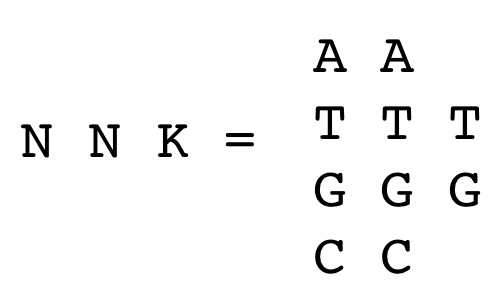

# Introduction to Directed Evolution

© 2023-2026 Romas Kazlauskas. All rights reserved. Last updated July 2026.

**Summary.** Directed evolution improves a protein by making many variants and then identifying the better ones, usually over several rounds. When it is not known which residue to change, error-prone PCR spreads substitutions across the whole protein by copying the gene with a deliberately error-prone polymerase. Its reach is limited: because each codon usually changes by only one nucleotide, error-prone PCR samples an average of only 5.7 of the 19 possible replacement amino acids at a position. The genetic code adds further bias: Trp and Met are encoded by a single codon while Leu, Ser, and Arg have six. The polymerase itself favors changes at A·T sites and favors transitions over transversions. Most substitutions also land far from the active site simply because most of the protein is far from the active site. Too few mutations per gene wastes effort on unchanged clones; too many disable the protein, so an intermediate mutation rate works best. Despite being incomplete, these libraries routinely contain useful changes, which makes error-prone PCR well suited to finding stabilizing substitutions that can occur anywhere. When the useful region is known, site-saturation mutagenesis is preferred: mixed-base (ambiguity) codons, which are codons synthesized as mixtures of bases, let a single position encode some or all twenty amino acids, and the resulting variants are screened. It is the better tool for reshaping the active site to expand substrate range or change selectivity. No method can build every possible variant because the number is astronomically large, so both are strategies for sampling sequence space efficiently.

**Key learning goals**

- Explain how DNA polymerase bias and the single-nucleotide-change limit make error-prone PCR libraries incomplete, and predict which amino acid substitutions are accessible from a given wild-type codon.
- Design a site-saturation mutagenesis experiment at a chosen codon, and explain why testing the nineteen alternative amino acids at a substrate-binding residue is an efficient route to altered substrate range or selectivity.
- Interpret IUPAC ambiguity codon notation (e.g., NNK, NDT) and select an appropriate codon scheme for a target set of amino acids.
- Calculate the oversampling required to screen a saturation library to a stated coverage, and explain why codon redundancy makes the number of clones exceed the number of variants.
- Compare error-prone PCR with saturation mutagenesis, and justify which method suits a given engineering goal.
- Calculate the number of possible variants for a given number of positions, replacement amino acids, and protein length, and use the result to argue why exhaustive sampling is impossible.

## Introduction {#sec-introduction}

Directed evolution is the recursive generation of random variations and identification of improved variants, usually by screening or selection. It mimics natural protein evolution, but differs in that it can improve a protein for abilities that do not occur in nature, such as reactivity toward pharmaceutical precursors or tolerance to organic cosolvents. The idea is simple enough to write as a short program. Over forty years ago, Eigen & Gardiner [@eigenEvolutionaryMolecularEngineering1984] suggested this set of computer instructions:
```
10 PRODUCE A MUTANT SPECTRUM OF SELF-REPRODUCING TEMPLATES
20 SEPARATE AND CLONE INDIVIDUAL MUTANTS
30 AMPLIFY CLONES
40 EXPRESS CLONES
50 TEST FOR OPTIMAL PHENOTYPES
60 IDENTIFY OPTIMAL GENOTYPES
70 RETURN TO 10 WITH A SAMPLE OF OPTIMAL GENOTYPES
```

The instructions are straightforward, but line 70 carries the weight. Without it, the procedure is a single round of mutagenesis and screening; with it, the enriched genotypes become the templates for the next cycle, and small improvements accumulate over successive rounds. Recursion is what makes the process evolution rather than screening.

Eigen & Gardiner wrote these instructions before the methods to carry them out existed. One difficulty in practice is not the logic but line 10: a mutant spectrum is easy to produce and hard to produce well, since the number of possible variants vastly exceeds the number that can be tested. Most of this chapter concerns how to bias that spectrum toward variants worth screening. The next chapter will cover accumulating or combining mutations.

An early example shows the whole scheme in operation. Chen and Arnold set out to make the protease subtilisin E catalytically useful in high concentrations of dimethylformamide (DMF), an environment no natural subtilisin encounters.[@chenTuningActivityEnzyme1993] They began with a variant carrying four substitutions (D60N, D97G, Q103R, N218S) that had been identified separately in earlier screens and combined by site-directed mutagenesis. This variant then served as the parent for three sequential cycles of random mutagenesis by error-prone PCR. Screening was done on plates: secreted subtilisin hydrolyzes casein to give a visible halo, so colonies were lifted onto nitrocellulose, transferred to DMF-containing casein plates, and the clone with the largest halo became the template for the next cycle — line 70 of Eigen and Gardiner's program. After three cycles and roughly 4000 colonies screened, PC3 carried six new substitutions (ten in total). These six directed-evolution substitutions improved catalytic efficiency about 3-fold over the 4M parent in 40% DMF.

## Error-prone PCR

### Error rates of DNA polymerases

DNA polymerases occasionally insert an incorrect nucleotide. The polymerase from *Thermus aquaticus* (Taq) makes about 4 × $10^{-5}$ errors per nucleotide added — one error per 25,000 nucleotides — and this value ranges from (1–20) × $10^{-5}$ depending on reaction conditions.[@mcinerneyErrorRateComparison2014; @eckertDNAPolymeraseFidelity1991] Taq lacks a $3' \to 5'$ exonuclease, so it cannot correct these mistakes. The polymerases from the archaea *Pyrococcus furiosus* and *Thermococcus kodakarensis* do proofread, lowering their error rates by one to two orders of magnitude. High-fidelity polymerases are the right choice for routine cloning, but the wrong choice for mutagenesis.

The polymerase chain reaction (PCR) copies DNA, and the copying introduces errors. Error-prone PCR (epPCR) increases the error rate enough to generate a library of variants from a long stretch of DNA — an entire gene, or several genes at once. The procedure is simple, requires no structural information, and distributes substitutions throughout the target sequence. Screening the resulting library identifies the variants with improved properties.

To increase the error rate, error-prone PCR uses an unbalanced pool of dNTPs, elevated free magnesium, and added manganese to raise the Taq error rate about tenfold. [@cadwellRandomizationGenesPCR1992] These conditions also slow the polymerase and shorten its useful lifetime, so the amplification is inefficient and a fresh aliquot of Taq is often added after the fifteenth cycle. Pushing the conditions further degrades the amplification, making a tenfold increase in error rate a practical ceiling.

### Error rates in the PCR product

The error frequency in the PCR product is higher than the per pass error rate of the polymerase because the errors accumulate in a PCR amplification. Cadwell and Joyce found 6.6 × $10^{-3}$ substitutions per position in the product of such a reaction — 6.6 changes per thousand base pairs, or roughly an order of magnitude above Taq's per-pass error rate under error-prone conditions.[@cadwellRandomizationGenesPCR1992] Each cycle of PCR uses the products of the previous cycle as templates. Once an error is acquired, it is copied faithfully into all descendants of that molecule. The error frequency in the final product therefore depends on how much the DNA was amplified as well as on the polymerase and the buffer.

Amplification is most conveniently expressed as the number of doublings: a reaction that yields a $10^5$-fold increase over the input template has gone through $\log_2(10^5)$ ≈ 17 doublings. A perfect PCR would give one doubling per cycle, but real amplifications — especially under error-prone conditions — are less efficient, so the number of doublings is smaller than the number of cycles. Code Block S9.1 in the supporting information calculates the number of doublings for a given number of cycles when the efficiency is known.

Each doubling gives every position another chance to acquire an error, so substitutions accumulate roughly in proportion to the number of doublings. The mutation frequency per position in the final product is approximately *f* × *d*, where *f* is the per-pass error rate and *d* the number of doublings. Taking *f* ≈ 4 × $10^{-4}$ errors per position for Taq under mutagenic conditions and *d* ≈ 17 gives 7 × $10^{-3}$ substitutions per position, close to the measured value above. For a gene of 1000 bp, this amounts to about seven nucleotide changes per molecule — an average, since the changes are distributed randomly among molecules and individual clones will carry more or fewer. Note that short sections of DNA, e.g., 10 nucleotides, are unlikely to contain substitutions. Error-prone PCR is suitable for gene-length sections of DNA or longer, but not for short sections because the error rate is not high enough.

### Biases that limit the randomness

Four independent factors restrict which amino acid substitutions a random-mutagenesis library can contain (@tbl-biastypes). Two arise from the genetic code (codon accessibility and unequal codon degeneracy), one from the chemistry of the polymerase (preferences for some nucleotide replacements over others), and one from the structure of the protein itself. Codon accessibility makes some amino acid replacements highly unlikely with error prone PCR while the additional biases make some substitutions less common than a random distribution would predict, so finding those substitutions requires more screening.

| Source of bias | Consequence |
|:---|:---|
| Codon accessibility | One nucleotide change reaches only 5.7 of 19 alternative amino acids; the other 13.3 need two changes in one codon, which are ~100-fold rarer. |
| Unequal codon degeneracy | Trp and Met have one codon each, Leu, Ser and Arg have six, so amino acids are not sampled with equal frequency |
| Polymerase chemistry | Taq favors substitutions at A·T over G·C sites and transitions over transversion. |
| Protein architecture | Only a handful of residues line the substrate-binding site, so random substitutions rarely land there. |

: Four independent factors bias the amino acid substitutions produced by error-prone PCR. {#tbl-biastypes}

**Codon accessibility.** Although there are 64 codons, error-prone PCR can only create a subset of them because it changes only one nucleotide in a codon. At a mutation frequency of 0.7% per position, a substitution somewhere in a given codon has probability 3 × 0.7% = 2.1%, while two substitutions in the same codon have probability 3 × (0.7%)² = 0.015%, more than a hundredfold lower. Three substitutions are rarer still. If only one nucleotide changes in a codon, then only nine new codons are accessible, (@fig-codon_bias). In the glycine codon GGA, single nucleotide substitutions encode only four new amino acids. Averaged over all sense codons, 24% of single-nucleotide substitutions are synonymous, 4% create a stop codon, and 71% are missense. Seven nucleotide changes therefore yield about five amino acid substitutions ($7 \times 0.71 = 5$) and at any one position, only 5.7 of the nineteen alternative amino acids are reachable at all.

![Replacement of one nucleotide in the glycine codon GGA yields nine new codons. The three new codons created by replacement of the third nucleotide, A, also code for glycine, so 33% of the single nucleotide substitutions for this codon are synonymous. Five of the nine new codons (56%) are missense codons that introduce a new amino acid. Of these five, arginine occurs twice, so only four new amino acids of the nineteen possible (21%) are encoded. On average, single substitutions in a codon yield missense codons encoding only 5.7 new amino acids.](figures/chapter9/codon_bias.png){#fig-codon_bias width=216 fig-alt="Diagram showing single-nucleotide substitutions of the glycine codon GGA. Mutating the first position gives CGA (Arg), AGA (stop), or TGA (Arg); mutating the second position gives GCA (Ala), GAA (Glu), or GTA (Val); mutating the third position gives GGG, GGC, or GGT, all still encoding Gly. Each row highlights the one substituted base in red alongside the resulting codon and amino acid."}

**Unequal codon degeneracy.** The genetic code does not assign codons evenly. Trp and Met have one codon each, while Leu, Ser, and Arg have six. Even perfectly random nucleotide substitution would therefore not sample the twenty amino acids with equal frequency: amino acids specified by one or two codons are harder to reach than those specified by four or six.

**Polymerase chemistry.** Nucleotide misincorporation is not random. If misincorporation were random, then mutations would occur at AT sites at the same frequency as at GC sites. Sequencing of DNA from an error-prone PCR using Taq DNA polymerase shows that the sites of substitution are non-random,[@shafikhaniGenerationLargeLibraries1997] @tbl-subtypes. Most of the errors (>95%) were substitutions rather than frame shifts. Substitutions at AT sites (40.9 + 7.3 + 23.7 = 71.9%) are 3.9 times as common as substitutions at GC sites (1.4 + 4.5 + 13.6 = 19.5%). Random substitutions would correspond to the GC content of the DNA, equal preference occurs when the GC content is 50%; for this example, the GC content was ~49%.

| substitution | fraction expected for random substitutions, % | fraction observed, *Taq* polymerase, %^a^ | fraction observed, Mutazyme II, %[@agilentGeneMorphII] |
|:---:|:---:|:---:|:---:|
| A→T and T→A | 16.7 | 40.9 | 28.5 |
| A→C and T→G | 16.7 | 7.3 | 4.7 |
| A→G and T→C | 16.7 | 27.6 | 17.5 |
| G→C and C→G | 16.7 | 1.4 | 4.1 |
| G→T and C→A | 16.7 | 4.5 | 14.1 |
| G→A and C→T | 16.7 | 13.6 | 25.5 |
: Fraction of each substitution type expected for random substitutions and observed in error-prone PCR using Taq DNA polymerase or Mutazyme II for DNA sequence encoding _B. lentus_ subtilisin. {#tbl-subtypes}

::: {.tblnote}
^a^ Data from DNA sequencing of 9800 nucleotides, which identified 286 errors ($\varepsilon_{nt} = 2.9\%$).[@shafikhaniGenerationLargeLibraries1997] The sum of the substitution errors is 95.3%. The remaining errors were frame shifts: insertions 0.3%, deletions 4.2%; the missing 0.2% is rounding. This mutation frequency is roughly fourfold higher than the 0.66% discussed earlier in this chapter; these authors used more aggressive conditions to accumulate enough errors for a reliable count of substitution types.
:::

Another measure of randomness is whether the replacement nucleotides are random. Again, the measured values differ from those expected for random replacements. There are two measures for this randomness of replacement. First, transitions, which exchange bases of similar size (purine for purine, pyrimidine for pyrimidine) are more common than transversions, which exchange bases of different size (@fig-transitions_transversions). Four transitions and eight transversions are possible, so random substitution gives a transition/transversion ratio of 0.5. The measured ratio for Taq is higher, 0.76 ((27.6 + 13.6)/(40.9 + 7.3 + 1.4 + 4.5)).

{#fig-transitions_transversions width=186 fig-alt="Diagram of the four DNA bases, with the purines adenine (A) and guanine (G) on top and the pyrimidines cytosine (C) and thymine (T) on bottom. Double-headed arrows connect A to G and C to T, each labeled 'transition'; diagonal dashed double-headed arrows cross-connect the purine and pyrimidine pairs, labeled 'transversions'."}

The second criterion for randomness of the replacement nucleotides is that AT→GC replacements should equal GC→AT replacements, leaving the GC content of the DNA unchanged. The measured AT→GC replacements 34.9 (7.3 + 27.6) 1.9-fold more common than GC→AT replacements 18.1 (4.5 + 13.6), showing that the GC content of the sequence increased during mutagenesis. Other researchers using different reaction conditions reported also reported non-random distributions.[@lin-goerkePCRbasedRandomMutagenesis1997], [@rasilaCriticalEvaluationRandom2009]

Mutazyme II DNA polymerase, a blend of two error-prone polymerases with complementary preferences, reduces some of this bias.[@agilentGeneMorphII] The site preference improves substantially, from 3.9 to 1.2 (50.7/43.7). The GC drift reverses rather than disappears, from 1.9 to 0.56 (22.2/39.6) — the library now loses GC content instead of gaining it. The transition bias increases slightly and remains the largest deviation: 0.84 (43.0/51.4) against a random value of 0.5. No available polymerase makes the substitutions random; the choice is which bias to accept.

**Protein architecture.** The first three restrictions are properties of the method, this last one comes from the target. Random mutagenesis methods target all amino acid positions equally. Counterintuitively, this random process favors mutations far from the active site.[@morleyImprovingEnzymeProperties2005] Only a few residues (<10%) form the substrate-binding site and most lie far away, so most mutations land far from the active site. This inherent preference is known as location bias.

Imagine a spherical enzyme with the active site at the center and the residues arranged in concentric shells around it. Each shell farther out is larger and therefore contains greater numbers of amino acids. The number of amino acids *n* in a 1-Å-thick shell of outer radius *r* is the volume of the shell divided by the average volume occupied by a residue, 141 ų (@fig-location_bias). The prediction fits a typical 30 kDa protein well out to about 15 Å; beyond that, the observed number falls below the prediction because the shells start to extend past the edge of the protein.

{#fig-location_bias width=300 fig-alt="Line and scatter plot of the number of amino acids in 1-Å-thick spherical shells versus the shell's outer radius. The predicted curve (blue line, from n = 4/3π(r³−(r−1)³)/141 ų) rises smoothly from 0 to about 80 amino acids as radius increases from 0 to 35 Å. Observed values for a 30 kDa protein (orange circles) closely track the prediction out to about 15 Å, then fall increasingly below it as the shells begin to extend past the edge of the protein."}

More than half the residues in this protein lie 13–22 Å from the active site and fewer than 10% lie within 10 Å of it. Larger proteins push the edge farther out, so the imbalance grows with size. Because substitutions anywhere in the protein can contribute to stability, the bias toward distant substitutions is no disadvantage when stability is the target. Substitutions near the active site are far more effective at changing substrate specificity and selectivity, however, and for those goals the location bias is a real limitation.

The subtilisin work described earlier may look like a counterexample, since the six effective substitutions in PC3 clustered near the active site. It is not. The library contained substitutions throughout the gene; screening recovered the small minority that happened to fall in useful positions. What a library contains and what screening returns are different things, and the distinction matters whenever one reasons backward from a set of hits to the diversity that produced them.

These limitations and biases mean that no error-prone PCR library approaches completeness. That is not fatal. As the subtilisin work showed, useful substitutions were common enough that a few thousand colonies sufficed. The practical question is not whether the library is complete — it never is — but whether the improvements sought are frequent enough to to be discovered by sampling.

### Optimal mutation rate {#sec-optimumrate}

At a low mutation rate, most of the epPCR library is unmutated wild-type sequence. Screening these wastes effort because they cannot be improved variants. The mutated fraction is dominated by single-substitution variants, and because mutations generated early in the amplification are copied into all their descendants, the same single substitution often turns up in more than one colony. These duplicates likewise waste screening effort: testing a duplicate contributes no new information. For example, a mutation rate, $m$, of 0.3% in a 1000-bp PCR product is estimated to contain ~25% wild-type or single substitutions. Recall that short sections of DNA are not suitable targets for error-prone PCR because the mutation rate is too low and most of the PCR product contains no substitutions.

At higher mutation rates, the accumulation of strongly detrimental substitutions limits the ability to find improved variants. Detrimental or inactivating substitutions are those that so strongly hinder protein performance that it cannot be detected. Destabilizing substitutions that hinder protein folding are an example of detrimental substitutions. An improved variant must contain at least one beneficial mutation and, at the same time, no detrimental ones. Assume that mutations are either beneficial, detrimental, or neutral, with fixed fractions $F_{ben}$, $F_{det}$, and $F_{neu}$ summing to one, and that they act independently. For a single substitution, the chance of avoiding a detrimental mutation is $(1-F_{det})$; over *m* substitutions it is $(1-F_{det})^m$. By the same reasoning, the fraction containing at least one beneficial substitution is $1-(1-F_{ben})^m$. The fraction of improved variants is therefore

$$F_{better} = (1-F_{det})^m \left[1-(1-F_{ben})^m\right]$$ {#eq-Fbetter}

When $F_{ben} \ll 1$, the second term is approximately $m \cdot F_{ben}$, so

$$F_{better} = (1-F_{det})^m \cdot m \cdot F_{ben}$$ {#eq-Fbetter_approx}

The first term decreases exponentially with *m* while the second increases linearly, so $F_{better}$ passes through a maximum. Differentiating @eq-Fbetter_approx locates it at

$$m_{opt} = \frac{-1}{\ln(1-F_{det})}$$ {#eq-mopt}

Note what is absent: $F_{ben}$ does not appear. The optimal number of mutations depends only on how well the starting protein tolerates substitution. The frequency of beneficial mutations sets the *height* of the peak, not its position. This is why a rule of thumb of a few substitutions per gene transfers across systems whose hit rates differ by orders of magnitude. For a protein in which 30% of substitutions are strongly detrimental ($F_{det} = 0.30$), the optimum is at *m* = 2.8, and if 1% of substitutions are beneficial the peak value of $F_{better}$ is 1% (@fig-opt_mut_rate).

{#fig-opt_mut_rate width=212 fig-alt="Plot of the fraction of improved variants, F_better, versus mutation rate m, showing a single peak at m = 2.8 where F_better = 1%. The curve rises from zero at low m, peaks, then declines toward zero at high m, with the equations F_better = (1-F_det)^m × m × F_ben and its evaluated form F_better = (1-0.30)^m × m × 0.01 shown alongside."}

Chodorge and coworkers [@chodorgeRationalStrategiesDirected2005] tested this idea using green fluorescent protein. Their model differs slightly from the one above but yields similar curves. Converting GFP to a blue fluorescent variant requires one specific nucleotide substitution out of the 2151 possible in the 717-bp gene (3 × 717), so $F_{ben} = 0.00046$. They estimated $F_{det} = 0.20$ from the loss of fluorescence in wild type at different mutation rates, which by @eq-mopt predicts an optimum at *m* = 4.5. Testing a range of error-prone PCR conditions, they found the highest fraction of blue fluorescent variants at about 5 nucleotide substitutions per gene — close agreement on the position of the optimum. The observed peak height (1.3%) exceeded the predicted 0.08% by more than an order of magnitude, a reminder that the model captures the shape of the trade-off better than its magnitude. (The predicted peak height of 0.08% comes from evaluating @eq-Fbetter_approx at *m* = 4.48: (0.8)^4.48 × 4.48 × 0.00046. Worth checking against Chodorge's own model, since theirs differs slightly and may predict a different height.)

Quantitative use of @eq-Fbetter_approx is not expected for real problems, since the probability of a beneficial and detrimental mutations is rarely known in advance. The useful result is that an optimum exists, and that its location is set by the mutational tolerance of the starting protein. Indeed several researchers demonstrated that starting with a more stable protein allows discovery of a greater number of beneficial substitutions.[@bloomLightDirectedEvolution2009], [@tokurikiStabilityEffectsMutations2009]

### Mutator strains

Another approach to random mutagenesis uses mutator strains of *E. coli*, which carry defects in DNA repair and proofreading that raise the spontaneous mutation rate. The XL1-Red strain, for example, carries mutations in three genes required for accurate replication (nucleotide sanitization, replication fidelity, and post-replicative repair), raising the mutation rate about 5000-fold over wild type, but ~10-fold lower than error-prone PCR.[@rasilaCriticalEvaluationRandom2009] Random point mutations accumulate as the bacteria replicate. The advantage is that variants are generated *in vivo*, without designing primers or optimizing error-prone PCR conditions. The disadvantage is that mutations are not confined to the gene of interest but occur genome-wide, causing growth defects, changes in expression or copy number, and genetic instability.

To narrow the target, researchers have engineered microorganisms and mammalian cells that replicate plasmid DNA and genomic DNA with separate polymerases.[@campsTargetedGeneEvolution2003; @wangEvolutionNewNonantibody2004; @yiPlasmidHypermutationUsing2021] An error-prone polymerase copies the plasmid while an accurate proofreading polymerase copies the genome. These strains are more stable than the mutator strains above.

These *in vivo* mutagenesis methods generate many variants in a background of many wild type due to the low mutation rate. Screening would be inefficient, so researchers use selection: the experiment is designed so that improved variants survive or grow faster, and the population itself does the sorting. To evolve resistance to an antibiotic, for instance, one grows the organisms in progressively higher concentrations so that only improved variants persist. Sequencing the survivors then reveals the changes responsible.

## Site-saturation mutagenesis

In some cases, researchers know where they want to target mutations, so site-saturation mutagenesis is a better option. Site-saturation mutagenesis is similar to site-directed mutagenesis in that a specific site is targeted, but differs in the use of ambiguity codons. Ambiguity codons are mixtures of codons that code for multiple amino acids, so mutagenesis using ambiguity codons yields a mixture of protein variants. A common application of site-saturation mutagenesis is targeting the substrate-binding site to expand the substrate range or increase the selectivity, @tbl-SSM_examples. Another application is targeting flexible surface residues to create interactions between nearby amino acids to increase protein stability. Increasing reactivity may require reshaping the substrate binding region, but it can also require changes in more distant loops or tunnels. Several examples of targeted site-saturation mutagenesis are below.

| protein | region targeted | improvement |
|:---:|:---:|:---:|
| [d]{.smallcaps}-hydantoinase | substrate-binding site | 11-fold increase in activity toward new substrate |
| nitrilase | all positions^a^ | increase enantioselectivity from ~15 to >100 |
| lysine tRNA synthase | substrate-binding site | 27.6 |
| phenylacetone monooxygenase | hinge region between domains | expand substrate range |
| lipase | flexible surface loops | increase stability temperature by 45 °C |

: Selected examples of site-saturation mutagenesis to create variants. {#tbl-SSM_examples}

::: {.tblnote}
^a^ The researchers did not have a structure of the nitrilase, so they tested all 6,270 single substitutions (19 replacements at 330 positions). Later a model of the nitrilase revealed that the beneficial substitutions were all in the substrate-binding site.
:::

Cheon et al.[@cheonManipulationActiveSite2004] expanded the substrate range of [d]{.smallcaps}-hydantoinase to include hydroxyphenylhydantoin, a precursor for antibiotic synthesis. Site saturation mutagenesis Phe159 in a loop forming the substrate binding pocket followed by screening of variants identified the Phe159Ala variant with ~6-fold enhanced catalytic activity ($k_{cat}$) toward this substrate. Subsequent site saturation mutagenesis at Leu65, located on a loop on the other side of the substrate binding pocket, followed by screening identified the Leu65Phe/Phe159Ala variant with a further ~2-fold increase in catalytic activity for a total of an 11-fold increase over the wild-type enzyme.

To introduce the non-canonical amino acid [l]{.smallcaps}-homoglutamine into proteins, Anderson and coworkers[@andersonExpandedGeneticCode2004] altered the selectivity of a lysine tRNA synthase to favor [l]{.smallcaps}-homoglutamine instead of lysine or any of the other nineteen canonical amino acids. They identified two amino acid residues that interact with the ε-amino group of lysine in the active site of the lysine tRNA synthase and varied these residues using site-saturation mutagenesis (NNK codons). Screening identified the Glu41Ile-Tyr268Ser variant as one with the desired activity and selectivity. Subsequent experiments showed that [l]{.smallcaps}-homoglutamine was incorporated into the target protein.

To expand the substrate range of phenylacetone monooxygenase (PAMO, from _Thermobifida fusca_), Reetz and coworkers[@reetzInducedAllosteryDirected2010] used a different approach - they targeted substitutions at two sites distant from the substrate binding site. Previous research identified open and closed conformations of PAMO and a hinge between the FAD- and NADP-binding domains that allows the domains to move. The researchers hypothesized that substitutions near the hinge could reshape the substrate-binding site through altered domain motion. Structure analysis identified Gln93/Pro94 in a helical segment at the hinge region and those positions were randomized using NDT codons, which encoded twelve amino acids at each site. Screening identified the Gln93Asn/Pro94Asp variant which reacted with a wide range of previously unreactive substrates and with high enantioselectivity for most of them.

DeSantis and coworkers [@desantisCreationProductiveHighly2003] used site-saturation mutagenesis to increase the enantioselectivity of a nitrilase for the synthesis of a cholesterol-lowering drug, atorvastatin (Lipitor®), @fig-nitrilase. The starting nitrilase showed an enantioselectivity of only ~15. Their experiments identified the Ala190His variant, which showed an enantioselectivity of >100. This early application of site-saturation mutagenesis differs from modern ones in that the researchers did not have a structure of the enzyme to guide their choice of locations. Instead they exhaustively applied site-saturation mutagenesis to all 330 positions of the nitrilase (330 × 19 = 6270 possible single-amino-acid substitution variants) to find the Ala190His variant. Indeed, the AlphaFold 3 structure reveals that residue 190 lies in the substrate-binding region, ~10 Å from the catalytic Cys162 Sγ. If this experiment were repeated today, one would likely use the predicted AlphaFold 3 structure to focus site-saturation mutagenesis into the substrate binding region.

![A nitrilase catalyzes the hydrolysis of either nitrile in the dinitrile shown in the center. Hydrolysis of the nitrile on the left yields the (_S_)-enantiomer, while hydrolysis of the nitrile on the right yields the (_R_)-enantiomer. To find variants with higher enantioselectivity for the (_R_)-enantiomer, DeSantis and coworkers [@desantisCreationProductiveHighly2003] used the isotopically labelled dinitrile shown. The two hydrolysis products differed in mass, so mass spectrometry revealed the ratio of the (_R_)- and (_S_)-products.](figures/chapter9/nitrilase.png){#fig-nitrilase width=432 fig-alt="Reaction scheme showing hydrolysis of a prochiral dinitrile bearing one natural-abundance (14N) and one 15N-labeled nitrile group. Hydrolysis of the 14N nitrile (left) yields the (S)-enantiomer (130 g/mol) with the 15N nitrile retained; hydrolysis of the 15N nitrile (right) yields the (R)-enantiomer (129 g/mol, the atorvastatin precursor) with a free carboxylic acid. The mass difference between the two hydrolysis products lets mass spectrometry measure the enantiomeric ratio."}

One advantage of site-saturation mutagenesis is completeness. For example, libraries of single nucleotide substitution variants created by error-prone PCR would likely not include the Ala190His variant. Converting a codon for alanine into a codon for histidine requires two nucleotide substitutions, which makes this substitution unlikely using error-prone PCR.

Targeting site-saturation mutagenesis to several flexible surface loops of a lipase identified stabilizing substitutions increased stability. Combining five stabilizing substitutions raised the temperature that halves the catalytic activity by up to 45 °C. The stabilization was presumed to arise through new interactions with neighboring amino acids (e.g., salt bridges, hydrogen bonds, and hydrophobic contacts).[@reetzIterativeSaturationMutagenesis2006]

### Ambiguity codons

Site-directed mutagenesis is the replacement of one amino acid with another at a particular location. This replacement involves synthesis of new DNA strands, typically with a DNA polymerase to extend mutagenic DNA primers. Details of one site-directed mutagenesis method were in Chapter 1. These mutagenic primers are made by chemical synthesis, usually by a DNA synthesis company. These primers encode the replacement amino acid instead of the original amino acid, @fig-sitesatprimers. Site-saturation mutagenesis makes all nineteen possible amino-acid substitutions at a particular location. One approach is nineteen separate site-directed mutagenesis experiments at each amino acid position. This solution is tedious and rarely used.

{#fig-sitesatprimers width=350 fig-alt="Diagram comparing three DNA sequences at codon 103 of a gene. The wild-type sequence contains the codon CAC (histidine). A site-directed mutagenesis primer replaces this codon with GTG (valine). A site-saturation mutagenesis primer mixture replaces it with the ambiguity codon NNK, representing all 32 possible codons at that position."}

More commonly, researchers use mixtures of primers that encode multiple amino acids. These primers contain ambiguity codons, which are mixtures of codons prepared by DNA synthesis, @tbl-ambiguitycodes. For example, the NNK codon represents a mixture of 32 different codons. N represents any of the four nucleotides (A, T, G, C), while K represents the two nucleotides containing a ketone group (G or T), @fig-define_NNK. This approach saves time because only one site-directed mutagenesis procedure is needed to create plasmids encoding all twenty amino acids.

{#fig-define_NNK width=100 fig-alt="Diagram defining the NNK ambiguity codon: each of the two N positions can be A, T, G, or C, shown as a column of four stacked letters, while the K position is limited to G or T, shown as a column of two letters, illustrating the 4 × 4 × 2 = 32 possible codons in the NNK mixture."}

The disadvantage of site-directed mutagenesis using ambiguity codons is that it creates a mixture of protein variants. Transfer of the mixture of DNA into bacteria yields a mixture of bacteria, each one producing one variation at the targeted location. This approach saves time by requiring only one site-directed mutagenesis experiment, but increases the amount of screening since it yields a mixture of variants.

| one-letter code | nucleotides |
|:---:|:---:|
| N (any) | A, T, G, C |
| B (not A) | T, G, C |
| D (not C) | A, T, G |
| H (not G) | A, T, C |
| V (not T) | A, G, C |
| K (keto) | G, T |
| M (amino) | A, C |
| R (purine) | A, G |
| S (strong) | G, C |
| W (weak) | A, T |
| Y (pyrimidine) | C, T |

: One-letter ambiguity codes indicate mixtures of several nucleotides. {#tbl-ambiguitycodes}

An example nucleotide sequence containing a ambiguity codon is 5'-NNKATG, which contains the ambiguity codon NNK. Chemists make this nucleotide mixture by adding mixtures of nucleotide precursors at the appropriate step. Chemical DNA synthesis starts at the 3'-end. For this example, the chemist adds the phosphoramidite precursor for G, then the precursor for T, then the precursor for A. At the next step, the chemist adds an equimolar mixture of G and T precursors and in the last two steps the chemist adds an equimolar mixture of A, T, G and C. The result is a mixture of 32 DNA sequences which differ at the NNK locations. Besides the twenty codons encoding the twenty amino acids, it also contains eleven redundant codons and one stop codon, @tbl-nnknns in the supporting information. [@zhangLowusageCodonsEscherichia1991] Twelve amino acids are encoded once: Asn, Asp, Cys, Gln, Glu, His, Ile, Lys, Met, Phe, Trp, Tyr; five amino acids are encoded twice: Ala, Gly, Pro, Thr, Val and three amino acids are encoded three times: Arg, Leu, Ser.

An alternative to the NNK ambiguity codon is the NNS ambiguity codon, which also encodes all the amino acids, but changes sixteen of the thirty-two codons. K represents G or T, while S represents G or C. The sixteen codons that contain G in the last position are identical in both choices of ambiguity codon. The remaining sixteen codons are NNT for the NNK ambiguity codon, but are NNC for the NNS ambiguity codon. The NNT codons encode the same amino acids as the NNC codons, but using NNS in place of NNK increases the GC content. Higher GC content increases the melting temperature of the primers and, depending on the rest of sequence, may alter the secondary structure of the primers.

The twelve extra codons in the NNK or NNS ambiguity codons beyond the twenty codons needed to encode the twenty amino acids increase the amount of screening needed, see @sec-oversampling. An alternative to this extra screening is to replace the NNK or NNS mutagenic primer with a mixture of four primers: two with ambiguity codons and two with specific codons, @tbl-codon20. The NDT ambiguity primer encodes twelve amino acids: N, S, I, H, R, L, Y. C, F, D, G, V (N = A, T, C, or G and D = A, T, or G). The VMA ambiguity primer encodes six amino acids: E, A, Q, P, K, T (V = A, C, or G and M = A or C). Finally, the ATG codon encodes M and the TGG codon encodes W. Adding the primers in a 12: 6: 1: 1 ratio encodes all twenty amino acids, with no stop codons, no rare codons, and no synonymous codons.[@tangConstructionSmallintelligentFocused2012]

| codon | nucleotide mixture | encoded amino acid |
|:---:|:---:|:---:|
| NDT | AAT | Asn |
|  | AGT | Ser |
|  | ATT | Ile |
|  | TAT | Tyr |
|  | TGT | Cys |
|  | TTT | Phe |
|  | GAT | Asp |
|  | GGT | Gly |
|  | GTT | Val |
|  | CAT | His |
|  | CGT | Arg |
|  | CTT | Leu |
| VMA | AAA | Lys |
|  | ACA | Thr |
|  | GAA | Glu |
|  | GCA | Ala |
|  | CAA | Gln |
|  | CCA | Pro |
| ATG | ATG | Met |
| TGG | TGG | Trp |

: A 20-codon mixture of two ambiguity codons (NDT encodes twelve amino acids; VMA encodes six amino acids) and two specific codons (ATG and TGG) efficiently randomizes the encoded amino acid. A 12:6:1:1 mixture of primers containing these four codons encodes all 20 amino acids, no stop codons and includes no redundant codons and no rare codon for yeast or E. coli. {#tbl-codon20}

The disadvantage of this approach is the requirement of four mutagenic primers for each location randomized instead of one mutagenic primer for the NNK or NNS approach. For randomization of a single site, the NNK/NNS approach is simpler, but for randomization of multiple sites the time savings of less screening tips the balance toward the four mutagenic primer approach.

### Oversampling {#sec-oversampling}

Site-saturation mutagenesis using ambiguity codons yields a mixture of bacteria, each producing a different protein. Spreading the mixture on an agar plate and allowing them to grow yields individual colonies where each colony is derived from a single bacterium. The bacterial colonies are picked and each tested separately. Randomly picking colonies results in picking some duplicate variants, so one needs to test more colonies than the number of possibilities to have a high probability of testing each possible variant. This section explain how much oversampling is required. The conclusion will be that for saturation mutagenesis of a single position using an NNK codon, sampling 94 colonies ensures that the rarest codon in the mixture has a 95% probability of being included in the sample. Thus, one can expect that an amino acid encoded only once (e.g., Met or Trp) is represented, but not that all 20 amino acids (32-codons) are included. To ensure that at least one of each codon was tested requires sampling 200 colonies for a 95% probability.

**Including the rarest variant, three-fold oversampling.** To derive a general equation, consider the probability to pick a blue ball from an equal and infinite mixture of red, white & blue balls. The probability is 1/3, which is the frequency of the blue balls in the mixture. Lets call this frequency $F_{blue}$. Similarly, the probability to NOT pick a blue ball from this mixture is $1-F_{blue}$ or 1 – 1/3 or 2/3.

If we pick a second ball, the probability to pick a second blue ball is 1/3, the same as for the first ball since it is an infinite mixture. The probability for both balls to be blue is $(1/3)^2$ or 1/9. Similarly, the probability for neither ball to be blue after two picks is $(2/3)^2$ or $(1-1/3)^2 = 0.436$. In the general case, the probability NOT to pick a blue ball after $T$ picks would be $(1-F_{blue})^T$. Therefore, the probability of having a least one blue ball is $1-(1-F_{blue})^T$. The probability of picking a least one blue ball after two picks from an equal mixture of red, white & blue is $1-(1-1/3)^2 = 0.564$. In the general case, the probability of picking object i from an infinite mixture, $P_i$, is $1-(1-F_i)^T$ where $F_i$ is the frequency of object $i$ in the mixture and $T$ is the number of times an object is selected from the mixture.

In the context of protein engineering, the probability $P_i$, that a particular variant, $i$, is among $T$ tested transformants (colonies) is given by:

$$P_i = 1-(1-F_i)^{T_{rarest}}$$ {#eq-Pi_general}

where $F_i$ is the frequency at which sequence $i$ is present in the library. This frequency can be replaced by $1/N$ where $N$ is the number of replacement codons. These equations assume the variants form independently according to a Poisson distribution.

$$P_i = 1-\left[1-\left(\dfrac{1}{N}\right)\right]^{T_{rarest}}$$ {#eq-Pi_N}

A common situation is a site-saturation mutagenesis created using an NNK ambiguity codon. The number of different codons, $N$, is 32, so the frequency $F_i$ is 0.03125. While some amino acids are encoded by two or even three codons in this mixture and their frequency is higher, one is normally concerned about the rarest members, those amino acids encoded by a single codon.

Rearranging @eq-Pi_N yields the number of transformants that needed to be tested.

$$T_{rarest} = \dfrac{\ln(1-P_i)}{\ln\left(1-\dfrac{1}{N}\right)}$$ {#eq-Trarest}

For a 95% probability of including a particular variant in a saturation mutagenesis experiment using an NNK codon, one needs to test 94 colonies, @eq-Trarest_NNK.

$$T_{rarest} = \dfrac{\ln(1-0.95)}{\ln\left(1-\dfrac{1}{32}\right)} = 94$$ {#eq-Trarest_NNK}

Researchers typically screen $3\cdot N$ transformants with the expectation that they have included the rarest member of the library. This guideline comes from @eq-Pi_N above with a probability of 0.95.

$$0.95 = 1-\left[1-\left(\dfrac{1}{N}\right)\right]^{T_{rarest}}$$
$$0.05 = \left[1-\left(\dfrac{1}{N}\right)\right]^{T_{rarest}}$$
$$\ln(0.05) = T_{rarest}\ln\left[1-\left(\dfrac{1}{N}\right)\right]$$

Using the approximation that $\ln(1-x) = -x$ when $x$ is small, yields:

$$\ln(0.05) = T_{rarest}\left(-\dfrac{1}{N}\right)$$
$$T_{rarest} = -N\cdot\ln(0.05) \;\Rightarrow\; T_{rarest} = 3\cdot N$$ {#eq-threefold}

Thus, three-fold oversampling, or testing three times the number of expected variants, gives a 95% probability that any individual variant has been tested. This three-fold oversampling does not mean that the library has a 95% chance of being 100% complete. To ensure with a 95% probability that ALL variants have been tested requires even more oversampling.

**Including all the variants.** What is the probability of picking at least one of each object? If you pick 9 balls, the probability to have at least one blue ball is $1-(2/3)^9$ or $1-(1-1/3)^9 = 0.976$. Similarly the probability to have a least one red ball among the nine is 0.976 and the same for the white ball. The probability of having at least one of each color is $(0.976)^3$ or 0.93. In the general case, the probability of having all possibilities, $P_i = \left[1-\left(1-\dfrac{1}{N}\right)^{T_{all}}\right]^{N}$ where N is the number of objects in the mixture. Rearranging this equation yields @eq-Tall.

$$T_{all} = \dfrac{\ln\left(1-(P_i)^{1/N}\right)}{\ln\left(1-\dfrac{1}{N}\right)}$$ {#eq-Tall}

While @eq-Trarest could be simplified to the three-fold oversampling rule in @eq-threefold, no similar simplification is possible for @eq-Tall. For typical cases, including all variants requires six- to ten-fold oversampling. Code Block S9.2 in the supporting information calculates $T_{rarest}$ and $T_{all}$ using @eq-Trarest and @eq-Tall for different numbers of variants and probabilities.

### Library quality

For this discussion, a library is a collection of DNA or protein sequences. Two features define Q, the quality of this library: completeness, C, and uniqueness, U.[@patrickUserfriendlyAlgorithmsEstimating2003] Completeness ensures that one does not miss a possible beneficial variant, while uniqueness avoids testing the same variant multiple times. Library quality, defined by @eq-libqualityQ, has a maximum value of one for a library that contains all possible variants without any duplicates.

$$Q = C \cdot U$$ {#eq-libqualityQ}

The goal of saturation mutagenesis is to test all possible substitutions at the selected locations. An NNK library is complete ($C = 1$) since it encodes all twenty amino acids, but only 20 of the 32 codons (62.5%) supply this information and the twelve extra codons are duplicates or an unwanted stop codon. The uniqueness is 0.625, so $Q = 0.625$, reflecting the disadvantage that extra screening effort will be needed to find all the amino acids. The quality of an NDT library is similar, $Q = 0.6$. It encodes only twelve amino acids, so $C = 12/20 = 0.60$, but $U = 1$ since all twelve encoded amino acid are unique. The disadvantage is that one will miss eight amino acids. The highest quality library is the 20-codon library from @tbl-codon20, where $Q = 1$ since the library is both unique and complete.

If two locations are targeted for saturation mutagenesis, then the quality of both the NNK and NDT libraries decreases, but the quality of 20-codon library stays a $Q = 1$. The maximum possible number of proteins is $20 \times 20 = 400$ and the 20-codon library encodes all of them with no extras. Saturation mutagenesis using an NNK codon is complete ($C = 1$) since this library encodes all 400 of the possible 400 proteins, but only 39% unique ($U (20 \times 20)/(32 \times 32) = 0.39$), so $Q = 0.39$. Saturation mutagenesis with an NDT codon is only 36% complete ($C = 0.36$) since it encodes only $12 \times 12 = 144$ of the possible 400 proteins, but 100% unique ($U = 1$), so $Q = 0.36%$. As the number of targeted locations increases, the quality of the libraries decreases further. The quality of the NNK library decreases because it contains increasing numbers of duplicates, while the quality of the NDT library decreases because it is increasingly incomplete. The 20-codon library maintains its high quality even when multiple locations are targeted.

## Number of possible substitution variants {#sec-numvariants}

The most common change in a protein is substitution of one amino acid with another. An important question is how many substitutions are possible. The answer depends on 1) the number of substitutions ($k$), the number of replacement amino acids ($n$), and number of amino acids in the chain ($L$). It is useful to break the problem into two parts: how many replacements are possible and how many locations are possible. The number of possible protein variants with $k$ substitutions, $V_k$, depends on the product of the number of location possibilities and the number of replacement possibilities, @eq-Vk_general.

$$V_k = \text{location possibilities} \times \text{replacement possibilities}$$ {#eq-Vk_general}

**Review: permutations and combinations**

Permutations relate to the order of the elements, while combinations refer to selecting elements from a group. Situations where order matters are permutations, while situations where the order does not matter are combinations. A lock sequence such as 5-27-37 is a permutation because the numbers must be entered in that order. (Confusingly, these locks are called combination locks, while permutation locks would be more accurate.) The other thing to consider in the calculating the number of possibilities is whether items can repeat or not. In the lock sequence, the numbers can repeat.[@zotero-item-11839]

**Permutations with repetition.** The lock sequence example is a permutation where repetition is possible. To determine the number of possible lock sequences, there are say, 39 numbers to choose for the first number, then 39 again for the second number and again 39 for the third. The total number of choices is $39 \times 39 \times 39 = 59,319$. In general, for a permutation with repetition, there are $n$ things to choose from and $k$ choices each time so there are $n^k$ possibilities. In protein engineering, the number of possible amino acid replacements at specified locations is a permutation with repetition. For two locations, $x$ and $y$, an alanine at position $x$ is different from an alanine at position y. Since order is important (substitution at x differs from substitution at $y$), it is a permutation. It is further a permutation with repetition since both $x$ and $y$ may contain an alanine.

$$\text{number of possibilities} = n^k$$

For example, number of possible double-substitution variants of a dipeptide is $19^2 = 361$ because there are nineteen possible replacement amino acids and two positions that require a choice.

**Permutations without repetition.** When choices are used up upon being chosen, then repetition is not possible. For example, choosing an order for sixteen billiard balls is an example of a permutation without repetition. The there are 16 choices at first, then 15 remaining balls and so on. There are 16! different orders that these balls could be chosen (16! $\approx 2.1\times10^{12}$). In general, there are $n$ things to choose from the first time, $n-1$ the second time, etc. so there are $n!$ choices in total. In some cases, one may choose fewer than the maximum possible. Then the choices are:

$$\text{number of possibilities} = \dfrac{\text{total number}}{\text{number not used}} = \dfrac{n!}{(n-k)!}$$

where $k$ is the number choices made.

For example, one could choose only three billiard balls from the sixteen possible. In this case, $k = 3$ and $n = 16$, so the number of possibilities is $16!/13! = 16 \times 15 \times 14 = 3,360$.

**Combinations without repetition.** In protein engineering, the number of locations in a protein is a combination without repetition. It does not matter what order they are chosen, but once chosen, they cannot be chosen again. The choice $x$ and $y$ is the same as the choice $y$ and $x$, but the choice $x$ and $x$ is impossible. Here the order does not matter, but choices cannot be repeated. For example, one could choose billiard balls again, but without regard to the order in which they were chosen. We already have the equation above for the case were order does matter, we just need to reduce it by the number of ways the objects could be in ordered. $k$ objects can be ordered in $k!$ ($k$ for the first choice, $k-1$ for the second choice, etc.), So the number of combinations without repetition when choosing $k$ objects from a total of $n$ is:

$$\text{number of possibilities} = \dfrac{\text{total number}}{\text{order does not matter} \times \text{number not used}} = \dfrac{n!}{k!(n-k)!}$$ {#eq-combinations}

We will not consider the fourth possibility, combinations with repetition since it does not occur in the context of protein engineering.

**Replacement possibilities = $n^k$**

The number of replacement possibilities at $k$ locations with $n$ replacements is $n^k$. In the general case, $n$ is the number of objects to choose from (amino acids in this case) and $k$ is the number of choices to be made (positions mutated in this case). For example, replacing the amino acids at positions $x$ and $y$ with new amino acids creates $19^2 = 361$ variants. If you include the original amino acids, then number of possibilities is $20^2 = 400$. This value includes the 361 two-substitution variants, 38 single-substitution variants and one wild-type enzyme. In two more examples, the number of nucleotide sequences of length 6 ($k = 6$) are possible from a set of 4 nucleotides ($n = 4$) is $4^6$ or 4,096 and the number of possible amino acid sequences of length 300 ($k = 300; n = 20$) is $20^{300}$ or $\approx 2\times10^{390}$. These values include single substitution variants, double substitution variants, triple, etc. This simple calculation firmly establishes that you can never make all the variants of a protein. There are only $\approx 10^{70}$ particles in the universe, so $2\times10^{390}$ is an impossibly large number. One will never be able to test all possibilities.

**Location possibilities = $L!/(k!(L-k)!)$**

The number of location possibilities is given by @eq-locationpossibilities, which is the same as @eq-combinations, except $n$ has been replaced by L to indicate sequence length.

$$\text{location possibilities} = \dfrac{L!}{k!(L-k)!} = \dfrac{\text{total number of permutations}}{\text{order not important} \times \text{number of permutations not used}}$$ {#eq-locationpossibilities}

For example, to choose two locations in a 300 amino acid protein, there are 300 places to put the first substitution, but only 299 places to put the second substitution. The total number of permutations is 300 × 299 or 89,700. Since order is not important, we divide by 2! or 2.

$$\dfrac{300!}{2!(300-2)!} = \dfrac{300!}{2!\times298!} = \dfrac{300\times299}{2} = 44{,}850$$

_Hint:_ Large factorials are too large for many calculators. For example, $300! \approx 3\times10^{614}$. Simplify the ratio $L!/(L-k)!$ to $L \times (L-1) \times (L-2) \times ...(L-k-1)$ as shown above to avoid calculating large factorials.

**Number of possible variants**

Combining the expression for the number of replacements possible with the number of locations possible yields an expression for the number of possible protein variants with $k$ substitutions, $V_k$:

$$V_k = \dfrac{L!}{k!(L-k)!}\,19^k$$ {#eq-Vk}

Code Block S9.3 in the supporting information calculates values of $V_k$. For example, for one substitution anywhere in a 300-aa protein: $V_1 = 300\times19 = 5{,}700$. For two substitutions anywhere in a 300-aa protein: $V_2 = 44{,}850\times361 = 16{,}190{,}850$

## Conclusions

No mutagenesis method comes close to making all variants, and none needs to. The practical question is never whether a library is complete but whether the improvements sought are frequent enough to appear in the sample actually screened — as the subtilisin work showed, a few thousand colonies can suffice. The two methods in this chapter answer that question under two different assumptions. If many beneficial substitutions exist and are scattered through the structure — the usual situation for stability — error-prone PCR's broad, biased, incomplete sampling of the whole gene is enough to catch some of them, @tbl-recommended. If the useful substitutions are rare and concentrated near the active site, which is the usual situation for substrate range and selectivity, then site-saturation mutagenesis at chosen positions is the efficient choice. Two ideas underlie both. First, the optimal mutation rate is set by how well the starting protein tolerates substitution, not by how common good substitutions are, which is why "a few substitutions per gene" transfers across systems with very different hit rates. Second, what a library _contains_ and what screening _returns_ are different things: hits recovered near the active site do not mean the diversity was concentrated there.

| goal | approach | rationale |
|:---|:---|:---|
| increase stability | epPCR | many solutions likely distributed throughout the protein |
| expand substrate range | saturation mutagenesis of residues in substrate-binding site | solutions may be rare and most likely within or close to the substrate binding site |
| increase selectivity | saturation mutagenesis of residues in substrate-binding site | solutions may be rare and most likely within or close to the substrate binding site |
| increase reactivity | mixed | after optimizing binding, distant residues may also contribute to catalysis |
: Recommended approaches to make single-substitution variants for different protein engineering goals. {#tbl-recommended}

This chapter treated the single substitution as the unit of improvement. Real directed evolution rarely stops there. Line 70 of Eigen and Gardiner's program, which feeds the best variants back as templates, is what turns screening into evolution, and it raises questions a single round cannot: how substitutions accumulate over successive rounds, whether their individual effects add up when combined, and how to recombine beneficial changes found separately. Those questions, and the interactions between substitutions that complicate them, are the subject of the next chapter.

## Glossary {-}

Ambiguity codon
: is a mixture of codons that encode different amino acids. A ambiguity codon is indicated by one-letter ambiguity codes that denote mixtures of several nucleotides. For example, the codon NAT in a DNA sequence means that the DNA sequence contains a mixture of AAT, TAT, GAT, and CAT at that position.

Codon accessibility
: is the restriction that, because epPCR usually changes only one nucleotide per codon, only ~5.7 of the 19 alternative amino acids are reachable at a given position; the other ~13.3 require two or three changes in one codon and are much rarer.

Directed evolution
: is the recursive generation of random sequence variation followed by identification of improved variants by screening or selection, iterated over several rounds. The recursion (feeding enriched genotypes back as templates) distinguishes it from a single round of screening.

Error-prone PCR
: is PCR performed with a non-proofreading polymerase under conditions (unbalanced dNTPs, added Mn²⁺, elevated Mg²⁺) that raise the misincorporation rate, distributing substitutions throughout a target sequence.

Library quality, $Q = C \times U$
: is the product of completeness ($C$, fraction of intended variants encoded) and uniqueness ($U$, fraction of codons that are non-redundant) and has a maximal value of one for a library encoding all target variants with no duplicates or stop codons.

Location bias
: is the tendency of random mutagenesis to place most substitutions far from the active site, because only a small fraction of residues (<10%) line the substrate-binding site while the bulk of the protein lies in larger, more distant shells.

Mutator strain
: is a strain (e.g. *E. coli* XL1-Red) carrying defects in DNA repair and proofreading that raise the spontaneous mutation rate, generating variants in vivo but genome-wide, causing growth defects and instability.

Oversampling
: is screening more colonies than there are variants to raise the probability that the rarest variant is present. Oversampling is needed because random picking produces duplicates. Three-fold oversampling (3·N) gives ~95% probability that any individual variant is sampled; ensuring all variants requires six- to ten-fold.

Site-saturation mutagenesis
: is the targeted replacement of a chosen residue with some or all twenty amino acids using ambiguity (mixed-base) codons, yielding a mixture of variants; used to reshape the active site for altered substrate range or selectivity.

Transition / transversion
: are the two categories of single-base substitution. A transition exchanges bases of the same size (purine $\leftrightarrow$ purine or pyrimidine $\leftrightarrow$ pyrimidine); a transversion exchanges bases of different size. Four transitions and eight transversions are possible, so random substitution gives a transition/transversion ratio of 0.5, but polymerases favor transitions above this.

## References {-}

::: {#chapter-bibliography}
:::

## Supporting Information {-}

**Code Block S9.1.** Python script to calculate the number of doublings, or 100% efficient cycles, for a known number of inefficient cycles when the efficiency is known.

```python
# Calculates D, the number of doublings
# 2^D = (1+EF)^cycles or D = cycles * log2(1+EF)
# EF = efficiency of PCR (ranges from 0 to 1)
# cycles = number of inefficient PCR cycles

from math import log
EF = 0.7
cycles = 30.0

D = cycles * log(1.0+EF,2)

print(format(cycles,'.0f'),' PCR cycles with an efficiency of ',
      format(100*EF,'.0f'),'% yields ',
      format(D,'.1f'),' doublings.', sep ='')
```

With EF = 0.7 and cycles = 30.0, this prints: "30 PCR cycles with an efficiency of 70% yields 23.0 doublings."

**Code Block S9.2.** Python function to calculate the number of transformants, T, needed to have tested the rarest one in a collection of N variations with a probability of P. T = ln(1-P)/ln(1-(1/N)). In the example, N = 32.0 corresponds to site-saturation mutagenesis of a single site using an NNK or NNS ambiguity codon and P = 0.95 corresponds to a 95% probability. Adjust values for N and P as needed.

```python
from math import log         # log = natural logarithm
def numTransformants(N, P):  # N = number of codon variations
                             # P = probability
	T_rarest = log(1-P)/log(1-(1/N))
	print('Testing',round(T_rarest),'colonies gives a',
	      '{:.0f}'.format(100*P)+'% probability that any individual variant',
	      'in a collection of','{:.0f}'.format(N),'variants has been tested.')
	T_all = log(1-(P**(1/N)))/log(1-(1/N))
	print('Testing',round(T_all),'colonies gives a',
	      '{:.0f}'.format(100*P)+'% probability that every variant',
	      'in a collection of','{:.0f}'.format(N),'variants has been tested.')

# example
numTransformants(32*32, 0.95)
```

Calling `numTransformants(32*32, 0.95)` prints: "Testing 3066 colonies gives a 95% probability that any individual variant in a collection of 1024 variants has been tested." and "Testing 10134 colonies gives a 95% probability that every variant in a collection of 1024 variants has been tested."

**Code Block S9.3.** Python script to calculate $V_k$, the number of variants with k substitutions. $V_k$ = number of location possibilities * number of substitution possibilities. $nlp = L!/[k!*(L-k)!]$ and $nsp = n^k$) where L = length of sequence, k = number of substitutions and n = the number of replacements, usually 19 for proteins and 3 for nucleotides. Adjust these values as needed. The loop runs from i = 0 to i = k-1 and calculates the ratio $= L!/(L-k)! = L*(L-1)*(L-2)*…(L-k-1)$.

```python
from math import factorial
def Vk(L, n, k):             # L = length of sequence
                             # n = 19 for proteins, 3 for nucleotides
                             # k = number of substitutions
    # Loop calculates L!/(L-k)! = L*(L-1)*(L-2)*...(L-k-1)
	ratio = 1
	for i in range(0,k):
		ratio = ratio*(L-i) # runs from i = 0 to i = k-1
	# number of location possibilities = L!/[k!*(L-k)!]
	nlp = ratio/factorial(k)
	# number of substitution possibilities = n^k
	nsp = n**k
	Vk = (nlp*nsp)
	print ('The number of possible variants for',k,
	       'substitutions using',n,
	       'replacements anywhere in a sequence of length',L,
	       'is','{:.3G}'.format(Vk))

# example
Vk(4000, 3, 3)
```

With `Vk(4000, 3, 3)`, this prints: "The number of possible variants for 3 substitutions using 3 replacements anywhere in a sequence of length 4000 is 2.88E+11"

: The mixtures of thirty-two codons represented by NNK or NNS both contain the sixteen NNG codons, but differ in the remaining sixteen. NNK contains the sixteen NNT codons, while NNS contains the sixteen NNC codons. In each case, the thirty-two codons encode the same amino acids, which includes all twenty amino acids, one stop codon and eleven redundant codons. {#tbl-nnknns}

| sequence NNK | sequence NNS | encoded amino acid | comment |
|:---:|:---:|:---:|:---|
|  | AAG | Lys | only codon for this amino acid |
| AAT | AAC | Asn | only codon for this amino acid |
|  | ACG | Thr | rare codon for yeast |
| ACT | ACC | Thr |  |
|  | AGG | Arg | rare codon for *E. coli* & yeast |
| AGT | AGC | Ser |  |
|  | ATG | Met | only codon for this amino acid |
| ATT | ATC | Ile |  |
|  | CAG | Gln | only codon for this amino acid |
| CAT | CAC | His | only codon for this amino acid |
|  | CCG | Pro | rare codon for yeast |
| CCT | CCC | Pro | CCC is a rare codon for *E. coli* |
|  | CGG | Arg | rare codon for *E. coli* & yeast |
| CGT | CGC | Arg |  |
|  | CTG | Leu | only codon for this amino acid |
| CTT | CTC | Leu |  |
|  | GAG | Glu | only codon for this amino acid |
| GAT | GAC | Asp | only codon for this amino acid |
|  | GCG | Ala | rare codon for yeast |
| GCT | GCC | Ala |  |
|  | GGG | Gly |  |
| GGT | GGC | Gly |  |
|  | GTG | Val |  |
| GTT | GTC | Val |  |
|  | TAG | stop |  |
| TAT | TAC | Tyr | only codon for this amino acid |
|  | TCG | Ser |  |
| TCT | TCC | Ser |  |
|  | TGG | Trp | only codon for this amino acid |
| TGT | TGC | Cys | only codon for this amino acid |
|  | TTG | Leu |  |
| TTT | TTC | Phe | only codon for this amino acid |

Rarely-used codons can create protein expression problems, but NNK largely avoids this problem, and NNS avoids it in _E. coli_ but not in yeast. There are eight rare codons in _E. coli_: CGA, CGG, AGA, AGG for Arg; CTA for Leu; ATA for Ile; GGA for Gly; CCC for Pro. [@zhangLowusageCodonsEscherichia1991] The tRNAs that recognize rare codons are also present in low amounts. Normally, this low abundance has no effect, but over expressed proteins may deplete the existing pool of charged tRNAs and cause premature termination or misincorporation of amino acids. Two rare codons occur in the NNK library and both code for Arg. However, the NNK library includes a third codon for Arg (CGT), which is not a rare codon. There are eight rare codons in yeast: AGG, CGA, CGG, CGC for Arg; CCG for Pro, CTC for Leu, GCG for Ala; ACG for Thr.[@zhangLowusageCodonsEscherichia1991] The five rare codons appear in the NNK library, but, like the _E. coli_ case, the NNK library also includes synonymous non-rare codons for each of the amino acids. The same analysis gives a different result for NNS. Because NNS replaces the T of NNK with C in the third position, it loses access to the NNT codons (CGT, CCT, GCT, ACT) that supply the common synonyms above. For _E. coli_ this causes no problem — every amino acid still retains a non-rare codon under NNS. In yeast, however, the only arginine codons available under NNS are CGC, CGG, and AGG, all three of which are rare; NNS therefore provides no common arginine codon in yeast. For this reason NNK is generally preferable to NNS, particularly for expression in yeast.

## Problems {-}

9.1. **PCR cycles, doublings, and mutation frequency.**

a) How many PCR cycles are required for 17 doublings if the amplification
efficiency $E$ is 1.0 (perfect), 0.8 (typical for a well-optimized PCR), or
0.47 (typical for an error-prone PCR)? Amplification efficiency is defined by
$(1+E)^n = A$ for $n$ cycles and $A$-fold amplification. Efficiency also falls
as the reaction approaches plateau, so this is an average over the run rather
than a per-cycle constant.

b) Using $d \approx 17$ doublings and a per-pass error rate $f \approx 4\times10^{-4}$,
estimate the mutation frequency per position in the product. Does running more
cycles at the lower error-prone efficiency raise this frequency? Explain.

9.2. **Oversampling an NNK library.** Show that screening 203 colonies gives a
95% probability that *every* codon of a single-site saturation library made with
an NNK ambiguity codon has been sampled. Section 9.3.2 shows that only 94
colonies are needed for the same 95% probability of sampling any *one* chosen
variant. In one sentence, state what each number guarantees and why they differ.

9.3. **Number of possible dipeptides.**

a) How many possible dipeptides are there?
b) Starting from the dipeptide Asp-Phe, how many single-substitution variants are possible?
c) How many double-substitution variants are possible?
d) Show that the sum of wild-type, single-, and double-substitution variants equals the total.

9.4. **Transitions versus transversions.** Write out all possible base
substitutions to show that random mutagenesis should yield twice as many
transversions as transitions. Taq's measured transition/transversion ratio is
0.76 (Table 9.2). Compared with the random expectation, does Taq favor or
disfavor transitions, and by how much?

9.5. **The impossibility of exhaustive sampling.** Consider a small protein of
50 amino acids. How many variants are possible if all 20 amino acids are allowed
at every position? If the average molecular weight is 5,500 g/mol, what is the
mass, in grams, of a collection containing one molecule of each variant? Compare
this with the mass of the earth, $\approx 6\times10^{27}$ g.

9.6. **Codon accessibility from a wild-type codon.** A position carries
wild-type Phe (codon TTT).

a) List every amino acid reachable by a single nucleotide change.
b) Of the other hydrophobic residues (Leu, Ile, Val, Met, Trp), which are
reachable by one change and which are not?
c) Explain why an error-prone PCR library screening for Phe→Trp or Phe→Met is
likely to fail, and what method you would use instead.

9.7. **Interpreting the NDT ambiguity codon.**

a) How many distinct codons does NDT represent, and which amino acids does it encode?
b) Explain why NDT produces no stop codon and no synonymous duplicates, unlike NNK.
c) Using $Q = C \cdot U$, compare NNK and NDT for a two-site library. Which
requires less screening, and what is the trade-off?

9.8. **Choosing a mutagenesis strategy.** For each goal, state whether
error-prone PCR or site-saturation mutagenesis is the better first approach and
give a one-sentence rationale:

a) raise the melting temperature by 8 °C
b) accept a bulkier substrate at the active site
c) invert enantioselectivity toward the ($R$)-product
d) improve activity when no structure and no homology model is available

## Answers {-}

```{=html}
<details><summary>Click to show answers</summary>
```

```{=latex}
\begingroup\color{gray}
```

9.1.
a) With $(1+E)^n = 2^{17}$, $n = 17/\log_2(1+E)$: at $E=1.0$, $n = 17$ cycles;
at $E=0.8$, $n \approx 20$ cycles; at $E=0.47$, $n \approx 31$ cycles. Lower
efficiency needs more cycles to reach the same amplification.
b) Mutation frequency $\approx f \cdot d = 4\times10^{-4} \times 17 = 6.8\times10^{-3}$,
about 0.7% per position (~7 changes per 1000 bp). It depends on the number of
*doublings*, not the number of cycles: because errors accumulate per doubling, a
low-efficiency reaction that reaches the same fold-amplification gives the same
mutation frequency — it just takes more cycles to get there.

9.2. Using $P_i = [1-(1-1/N)^{T}]^{N}$ with $N=32$:
$$T_{all} = \frac{\ln\!\left(1-(0.95)^{1/32}\right)}{\ln\!\left(1-\tfrac{1}{32}\right)} = \frac{-6.437}{-0.03175} = 203.$$
The 94-colony figure guarantees a 95% chance that *one particular* codon
(e.g., the single codon for Met) appears; the 203-colony figure guarantees a 95%
chance that *all 32* codons appear. Covering every codon is stricter, so it
requires more than twice the sampling.

9.3. a) $20^2 = 400$. b) $2\times19 = 38$. c) $19^2 = 361$.
d) $1 + 38 + 361 = 400 = 20^2$.

9.4. Transitions (4): A→G, G→A, C→T, T→C. Transversions (8): A→C, A→T, G→C, G→T,
C→A, C→G, T→A, T→G. Random substitution therefore gives 8 transversions to 4
transitions, a ratio of 0.5. Taq's measured ratio of 0.76 is $0.76/0.5 = 1.5$
times the random value, so Taq favors transitions about 1.5-fold over a random
polymerase.

9.5. Variants $= 20^{50} \approx 1.1\times10^{65}$. Mass
$= (1.1\times10^{65} \times 5{,}500)/(6.02\times10^{23}) \approx 1\times10^{45}$ g,
which is $\approx 1\times10^{45}/(6\times10^{27}) \approx 2\times10^{17}$ earths.
Exhaustive sampling of even a small protein is physically impossible.

9.6.
a) Single changes to TTT reach nine new codons encoding six new amino acids:
Ile (ATT), Val (GTT), Leu (CTT, TTA, TTG), Tyr (TAT), Cys (TGT), Ser (TCT); TTC
is a synonymous Phe. No stop codon is one change away.
b) Reachable in one change: Leu, Ile, Val. **Not reachable: Met (ATG) and Trp
(TGG)** — each needs two nucleotide changes from TTT.
c) Phe→Trp and Phe→Met each require two simultaneous changes in one codon, which
error-prone PCR produces ~100-fold less often than single changes, so these
substitutions are rarely present in an epPCR library. Use site-saturation
mutagenesis, which installs any target amino acid regardless of codon distance.

9.7.
a) NDT = (A/T/G/C)(A/T/G)(T) = $4\times3\times1 = 12$ codons, encoding twelve
amino acids, one each: Asn, Ser, Ile, Tyr, Cys, Phe, Asp, Gly, Val, His, Arg, Leu.
b) Fixing the third position as T excludes the stop codons TAA, TAG, and TGA
(all end in A or G), and the twelve codons were chosen so that each specifies a
different amino acid — hence no synonymous duplicates.
c) For two sites: NNK is complete ($C=1$) but only $U = 400/1024 = 0.39$ unique,
so $Q = 0.39$; NDT is fully unique ($U=1$) but only $C = 144/400 = 0.36$
complete, so $Q = 0.36$. NDT requires far less screening (12 codons per site
versus 32, and no duplicates or stop codons), at the cost of sampling only 12 of
the 20 amino acids at each position.

9.8.
a) **Error-prone PCR** — stabilizing substitutions are common and distributed
throughout the structure, so whole-gene sampling is efficient.
b) **Site-saturation mutagenesis** of substrate-binding residues — a bulkier
substrate needs reshaping of the pocket, where useful substitutions are rare and
localized.
c) **Site-saturation mutagenesis** of substrate-binding residues — selectivity
changes cluster near the active site (cf. the nitrilase Ala190His and PAMO
examples).
d) **Error-prone PCR** — with no structure or homology model there is no way to
localize the search, so whole-protein sampling is the practical starting point.

```{=html}
</details>
```

```{=latex}
\endgroup
```
