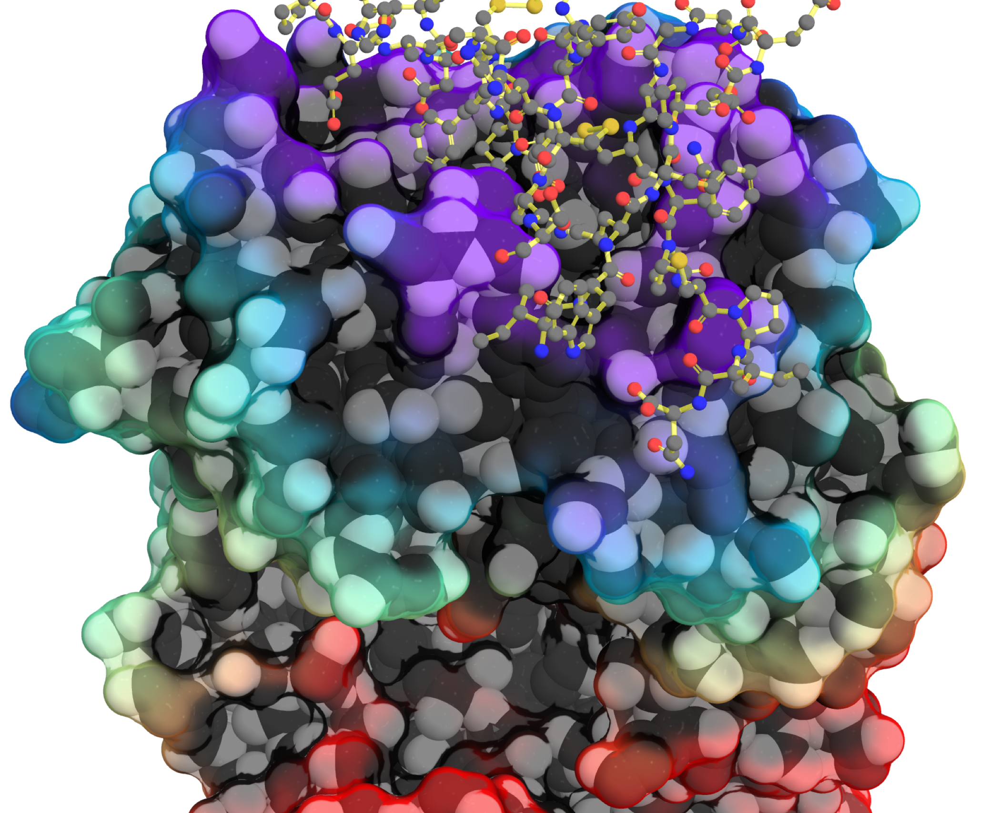

# Preface {.unnumbered}

::: {.text-center}

{width="400" fig-alt="Molecular structure showing part of the antibody drug trastuzumab as a space-filling, rainbow-colored surface, with its target receptor HER2 bound on top shown in a ball-and-stick representation colored by atom."}

::: 

Welcome to protein engineering, the art and science of improving proteins. This text will teach you how to better frame your protein engineering problem and to choose approaches to reach your goal. Both online  and pdf versions of this text are free to view and download here (https://betterenzyme.com). 

The cover image shows part of the antibody drug trastuzumab (Herceptin) in a space-filling representation bound to its target receptor HER2, shown in a ball-and-stick representation. Protein engineering transformed a mouse antibody into a humanized therapeutic while preserving its ability to recognize HER2, making trastuzumab one of the first successful antibody drugs.